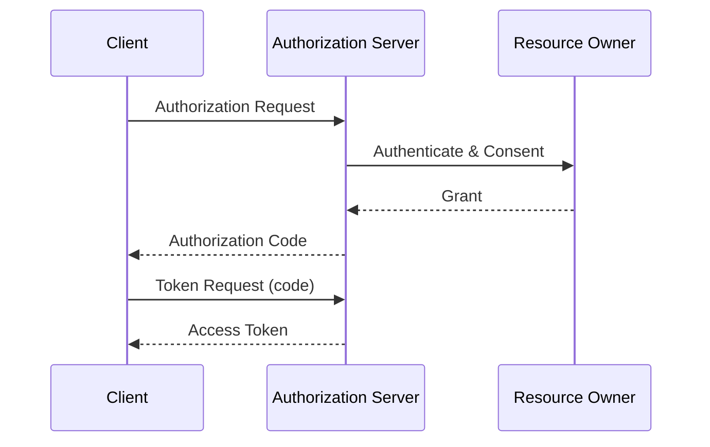

# /spec — Spec 記事を書く

idbok の Specs セクション (`docs/specs/<slug>.md`) に、**1 仕様 = 1 記事** の形式で技術仕様解説を追加するためのワークフロー。

対象は RFC / OpenID 仕様 / W3C 勧告 / FIDO 仕様 などの、公式の Spec ドキュメントです。時事ニュースや横断トピックは `/article` スキルを使ってください。

## ワークフロー

以下のステップを TodoWrite で管理しながら順に進めてください。

### 1. 対象仕様を確定する

- ユーザーが引数で仕様を指定している場合はそれを使う (例: `/spec RFC6749`, `/spec OIDC Core 1.0`)
- 指定が無い場合は AskUserQuestion で確認する
- 既に `docs/specs/` に同じ仕様の記事が無いか必ず確認する (重複を避ける)

### 2. 一次情報を取得する

必ず **公式の一次ソース** を `WebFetch` で取得する。推奨ソース:

- **IETF RFC**: `https://datatracker.ietf.org/doc/html/rfcNNNN` または `https://www.rfc-editor.org/rfc/rfcNNNN`
- **OpenID Foundation**: `https://openid.net/specs/...`
- **W3C**: `https://www.w3.org/TR/...`
- **FIDO Alliance**: `https://fidoalliance.org/specifications/`

必要に応じて複数の解説記事・関連 RFC もクロスチェックして正確性を担保する。不明点があれば記事に書かず、保留するか一次情報を再確認する。

### 3. slug とファイル名を決める

- 小文字ケバブケース
- 例:
  - `rfc6749` (RFC は番号で)
  - `rfc7636-pkce` (補助的な識別子が欲しい場合)
  - `oidc-core-1_0`
  - `fapi-2_0-security-profile`
  - `webauthn-l3`
- 配置先: `docs/specs/<slug>.md`

### 4. Frontmatter を作成する

以下のテンプレートをコピーし、一次情報に基づいて埋める。

```yaml
---
kind: spec
specId: RFC6749
title: The OAuth 2.0 Authorization Framework
org: IETF
status: Standard
published: 2012-10-01
authors: [D. Hardt]
tags: [oauth, authorization]
summary: OAuth 2.0 認可フレームワークの中核仕様。4 つの認可フローと、アクセストークンによる保護リソースへのアクセス方法を定義する。
---
```

**必須フィールド**:
- `kind`: 常に `spec`
- `specId`: 正式な識別子 (例: `RFC6749`, `OIDC-Core-1.0`, `WebAuthn-L3`)。サイドバーの昇順ソートキーになる
- `title`: 仕様の正式タイトル (英語原題のままで OK)
- `org`: 発行組織 (`IETF` / `OIDF` / `W3C` / `FIDO` / `ISO` など)
- `status`: 仕様のステータス (`Standard` / `Proposed Standard` / `Informational` / `Draft` / `Recommendation` など)
- `published`: 最終公開日 (`YYYY-MM-DD` 形式)
- `tags`: 関連技術タグ (小文字、インライン配列)
- `summary`: 1 〜 2 文の日本語サマリ

**Frontmatter の制約** (サイドバー自動生成パーサの都合):
- 値は 1 行に収める
- 配列は **インライン** (`[a, b, c]`) のみ。複数行配列は禁止
- ネストしたオブジェクトは使わない
- 値に `:` や `[`, `]` を含めたい場合はダブルクォートで囲む

### 5. 本文を日本語で書く

**言語ポリシー**: 本文は日本語。ただし以下は英語のままにする。
- 固有名詞 / 仕様名 (OAuth 2.0, Authorization Code Grant など)
- パラメータ名・フィールド名 (`client_id`, `redirect_uri`, `iss`, `aud` など)
- ヘッダ名・メソッド名 (`Authorization`, `POST`, `Bearer` など)

### 6. 記事構造テンプレート

以下のセクション構成を基本とする (仕様の性質に応じて取捨選択可):

```markdown
# {title}

> {summary と同じ内容または発展させたリード文}

## 概要

仕様が何を定義しているか、どんな問題を解決するかを 1 パラグラフで。

## 背景

この仕様が作られた経緯、前身仕様との関係、なぜ必要になったか。

## 主要な概念と用語

- **Role / Entity**: ...
- **Artifact (Token, Assertion, Credential, etc.)**: ...
- **Endpoint**: ...

仕様内で定義されている重要な用語を箇条書きで整理する。

## プロトコルフロー

典型的なフローを順を追って説明する。必要に応じて Mermaid 図やシーケンスを使う。



## 主なパラメータ / フィールド

表形式でまとめると読みやすい。

| パラメータ | 必須 | 説明 |
| --- | --- | --- |
| `client_id` | ✅ | ... |
| `redirect_uri` | 条件付き | ... |

## セキュリティ考慮事項

仕様の Security Considerations 節の要点を日本語で要約する。既知の攻撃と緩和策、運用上の注意点。

## 関連仕様

- [RFC6750 Bearer Token Usage](/specs/rfc6750)
- OAuth 2.1 ドラフト
- ...

## 参考文献

- 一次ソース (必ず載せる): https://datatracker.ietf.org/doc/html/rfc6749
- 補助的な解説リンクがあれば
```

**執筆上の注意**:
- 一次ソースに書かれていないことは憶測で書かない
- 推測や個人的意見は明示する (`著者注:` など)
- コードスニペットや HTTP メッセージ例は、一次情報の例を可能な限り使う
- セクションを無理に埋めない。仕様上存在しない要素は省略して良い

### 7. ビルド検証

記事を保存したら、リポジトリルートで以下を実行:

```bash
npm run docs:build
```

確認事項:
- 警告 (dead link, missing reference) なくビルドが成功する
- `docs/.vitepress/dist/specs/<slug>.html` が生成されている
- サイドバーの自動生成に拾われている (開発サーバーで `/specs/` を開いて確認するのが確実)

エラーが出た場合:
- Frontmatter のインデント / クォート / 配列形式を疑う
- Mermaid 等の拡張構文はコードブロックの言語指定を確認
- 内部リンクは `cleanUrls: true` 前提なので `.md` を付けない

### 8. コミット

完成したら git でコミットする (push はユーザーの明示的な指示があるまで行わない)。

```bash
git add docs/specs/<slug>.md
git commit -m "Add Spec article: <specId> <title>"
```

コミットメッセージのフォーマットは `Add Spec article: RFC6749 The OAuth 2.0 Authorization Framework` のように specId と title を含める。

## 最終報告

ユーザーへの最終メッセージに以下を含める:
- 作成したファイルパス
- 対象仕様 (specId / title / org)
- 参照した一次ソース URL
- ビルド検証結果 (✅ / ‼️)
- 次のアクションの提案 (関連する RFC を続けて書くか等)
