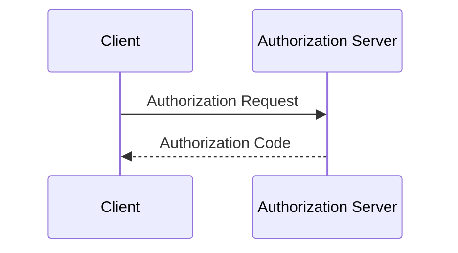

# idbok — Digital Identity Body of Knowledge

このリポジトリは、デジタルアイデンティティ領域の技術仕様やトピックを体系的にまとめた **日本語の Body of Knowledge サイト** です。すべての記事は AI エージェントが `/spec` または `/article` スキル経由で執筆し、`/review` スキル経由でレビューされることを前提としています。

サイトは [VitePress 1.x](https://vitepress.dev/) でビルドされ、`main` への push で GitHub Pages (`idbok.nbifrye.com`) に自動デプロイされます。

## 記事カテゴリ

記事は以下の 2 カテゴリのみです。**必ずどちらかに分類して書いてください。**

| カテゴリ | 配置 | 対象 | 使うスキル |
| --- | --- | --- | --- |
| **Spec** | `docs/specs/<slug>.md` | RFC, OpenID 仕様, W3C 勧告, FIDO 仕様 など。**1 仕様 = 1 記事** | `/spec` |
| **Article** | `docs/articles/<YYYY-MM-DD>-<slug>.md` | 個別トピック解説、時事ニュース、比較、考察 | `/article` |

1 つの RFC や仕様ドキュメントを解説するときは必ず Spec。横断的なトピックやニュースは Article。迷ったら「これは特定の 1 つの Spec ドキュメントそのものか?」を自問してください。

## ディレクトリ構成

```
docs/
├── .vitepress/
│   ├── config.mts       # VitePress 設定。nav, sidebar, 検索, i18n ラベルなど
│   └── sidebar.mts      # ディレクトリ走査 + H1 抽出で sidebar を自動生成
├── index.md             # ホームページ (hero layout)
├── specs/
│   ├── index.md         # Specs セクションのランディングページ
│   └── <slug>.md        # 各 Spec 記事 (AI 生成)
├── articles/
│   ├── index.md         # Articles セクションのランディングページ
│   └── <YYYY-MM-DD>-<slug>.md   # 各 Article (AI 生成)
└── public/
    ├── CNAME            # カスタムドメイン設定 (触らない)
    └── images/          # (任意) 記事に使う画像の置き場
```

## Frontmatter のルール

Spec 記事・Article 記事の frontmatter は **`reviewed` タグのためだけに使います**。それ以外の frontmatter は書かないでください。必要な情報は以下のルールで導出されます。

| 情報 | 取得方法 |
| --- | --- |
| 記事タイトル | ファイル冒頭の 1 つ目の `# H1` |
| Spec ID | ファイル名 (slug) そのもの (例: `rfc6749`) |
| 公開日 (Article) | ファイル名の `YYYY-MM-DD-` プレフィックス |
| 最終更新 | git の最終コミット日 (VitePress の `lastUpdated` 機能) |

ファイルの 1 行目は原則 `# <タイトル>` (H1) で始まります。例外は以下の 2 ケースのみです:

- `reviewed` フロントマターが付いている記事 — 1 行目は `---` になります (`sidebar.mts` の `extractTitle()` がフロントマターを自動スキップするため問題ありません)
- `docs/index.md` のような `layout: home` を使うトップページ

H1 の書き方:

- **Spec** の H1: **一次ソース (RFC / 仕様ドキュメント) のタイトル行と完全に一致** させる。RFC 番号・サブタイトル・注釈を付け足さない
  - ✅ `# The OAuth 2.0 Authorization Framework`
  - ❌ `# The OAuth 2.0 Authorization Framework (RFC 6749)`
  - ❌ `# OAuth 2.0 認可フレームワーク`
- **Article** の H1: **日本語タイトル** (`# 2026年のパスキー普及状況まとめ` のように)

**`reviewed` タグ**: `/review` スキルによるレビューが完了した記事にのみ付与されます。これ以外の frontmatter は書かないでください。

```markdown
---
tags:
  - reviewed
---

# 記事タイトル
```

## ファイル名と slug 規約

小文字ケバブケース (`a-z`, `0-9`, `-`, `_`) を使います。

### Spec

ファイル名 = slug。サイドバーは slug の数値順昇順で並びます (`rfc6749` → `rfc6750`)。

- RFC は番号: `rfc6749.md`、補助識別子を付ける場合は `rfc7636-pkce.md`
- バージョン付き仕様は `_` で: `oidc-core-1_0.md`, `fapi-2_0-security-profile.md`
- 例: `webauthn-l3.md`, `ctap2_1.md`

### Article

ファイル名 = `<YYYY-MM-DD>-<slug>.md`。サイドバーはファイル名降順で並ぶので、新しい日付ほど上に来ます。

- 日付は公開日 (通常は執筆した日)
- slug はトピック中心
- 例:
  - `2026-04-10-what-is-passkey.md`
  - `2026-04-10-eidas-2-wallet-update.md`
  - `2026-04-10-fedcm-vs-webauthn.md`

## サイドバーは自動生成される

`docs/.vitepress/sidebar.mts` の `buildSidebar()` が `docs/specs/` と `docs/articles/` を走査して H1 からサイドバーを構築します。**記事を追加するときに `config.mts` を編集する必要はありません。**

## 言語ポリシー

- 本文は **日本語**
- 以下は英語のまま:
  - 仕様名 / プロダクト名 (OAuth 2.0, OpenID Connect, WebAuthn …)
  - パラメータ・フィールド・ヘッダ名 (`client_id`, `redirect_uri`, `Authorization` …)
  - HTTP メソッド・HTTP ステータス名 (`POST`, `Bearer`, `401 Unauthorized` …)

## 図・ダイアグラム

- **図が必要な場合は Mermaid を使用する。** 画像ファイル (PNG 等) ではなく Mermaid コードブロックで記述すること
- よく使うダイアグラムタイプ:
  - `sequenceDiagram` — プロトコルフロー・認証シーケンス
  - `flowchart` / `graph` — 処理フロー・アーキテクチャ
  - `stateDiagram-v2` — 状態遷移

````markdown

````

- Mermaid でうまく表現できない場合のみ画像ファイルを `docs/public/images/` に配置し `/images/<file>` でリンクする

## 記事作成・レビューは必ずスキル経由で

記事の執筆・レビューは、必ず以下のスキルを使ってください。スキルには調査・構成・配置・検証までのワークフローが含まれています。

| スキル | 用途 | SKILL.md |
| --- | --- | --- |
| `/spec` | Spec 記事の新規作成 | `skills/spec/SKILL.md` |
| `/article` | Article の新規作成 | `skills/article/SKILL.md` |
| `/review` | 既存記事のレビューと `reviewed` タグ付与 | `skills/review/SKILL.md` |
| `/work` | 自動ワークフロー（レビュー → 執筆のサイクル） | `skills/work/SKILL.md` |

> **スキルファイルの構成**: `skills/*/SKILL.md` が各スキルの詳細な手順を持つ実体です。`.claude/skills/*/SKILL.md` は Claude Code ランタイム用の登録スタブで、`skills/` の内容を参照するだけです。スキルを更新する場合は `skills/` 側を編集してください。

> **`reviewed` タグについて**: `reviewed` タグは `/review` スキルのみが付与します。`/spec` や `/article` スキルはセルフレビューを実施しますが、このタグは付与しません。

> **push ポリシー**: `/spec`・`/article`・`/review` スキルはコミットまでを担当し、push は行いません。push は `/work` スキルが最後に行うか、ユーザーが明示的に指示した場合に行います。

> **`/work` の状態判定**: `/work` は SessionStart フックが表示する `NEXT_WORK_ACTION` を heads-up として参照するだけで、実際の判断は毎回 `bash scripts/check-unreviewed.sh` を再実行した結果に基づきます。同一セッションで `/work` を複数回呼んでも常に最新状態で動作します。

## 内部リンクの書き方

`cleanUrls: true` なので、内部リンクには `.md` も `.html` も付けません。

```markdown
[OAuth 2.0](/specs/rfc6749)
[パスキー解説](/articles/2026-04-10-what-is-passkey)
```

## ビルド & プレビュー

```bash
npm install          # 初回のみ
npm run docs:dev     # ローカル開発サーバ (http://localhost:5173)
npm run docs:build   # 本番ビルド → docs/.vitepress/dist
npm run docs:preview # ビルド結果のプレビュー
```

**記事をコミットする前に必ず `npm run docs:build` を通してください。** 警告 (dead link など) があれば解決します。

## フォーマット

記事とドキュメントは [`oxfmt`](https://oxc.rs/docs/guide/usage/formatter) でフォーマットします (Prettier 互換、Markdown をネイティブサポート)。`/spec`、`/article`、`/review` スキルはビルド検証の直前に `npm run fmt` を実行します。

```bash
npm run fmt          # docs/ 配下をフォーマット
npm run fmt:check    # 差分があれば non-zero で終了 (検証用)
```

## デプロイ

- `.github/workflows/deploy.yml` が `main` ブランチへの push をトリガーに自動ビルド & GitHub Pages デプロイを行います
- 独自ドメインは `docs/public/CNAME` で `idbok.nbifrye.com` に固定
- `base: '/'` 設定はカスタムドメイン直下運用のため。変更しないでください
