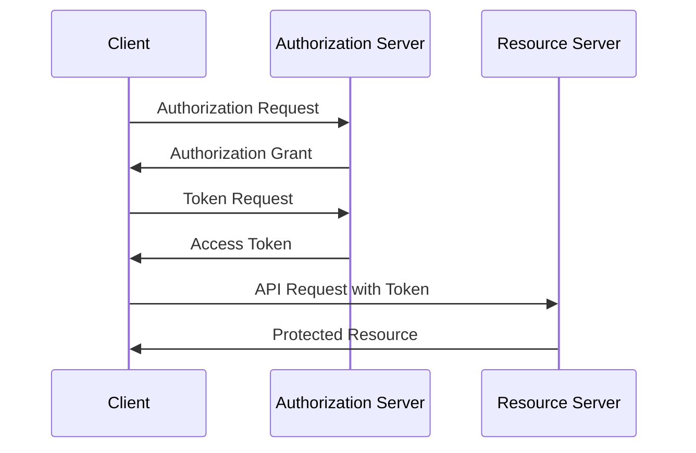

# /spec スキル - 技術仕様解説記事の執筆

RFC等の技術仕様を解説する記事を執筆するスキル。

## 引数

- 仕様識別子（例: `rfc6749`, `openid-connect-core`）

## 手順

1. **仕様の調査**: WebFetchを使い、対象仕様の原文（RFC、公式仕様書等）を取得・確認する
2. **ファイル作成**: `docs/specs/<identifier>.md` に記事を作成する
3. **フロントマター**: `title` のみを記載する。`reviewed` タグは絶対に付与しない
4. **記事の執筆**: 以下の構成で日本語で執筆する
5. **フォーマット**: 執筆後に `npx oxfmt docs/specs/<identifier>.md --write` でフォーマットする（失敗した場合はスキップしてよい）
6. **セルフレビュー**: 記事内容を確認し、技術的な誤りがあれば修正する。ただし `reviewed: true` は設定しない

## フロントマター形式

```yaml
---
title: "RFC XXXX - 仕様のタイトル"
---
```

**重要**: `reviewed: true` を設定してはならない。レビュー済みタグは `/review` スキルのみが付与する。

## 記事構成

以下の構成を基本とする。仕様の性質に応じて柔軟に調整すること。

### 1. 概要
- 仕様の目的と背景を簡潔に説明

### 2. 解決する課題
- この仕様が策定された背景にある技術的課題

### 3. 主要概念・用語
- 仕様で定義される重要な概念や用語を解説

### 4. プロトコルフロー / メカニズム
- mermaidのシーケンス図やフローチャートを使って主要なフローを図示
- 各ステップを解説

### 5. 詳細解説
- 仕様の主要なセクションやコンポーネントの詳細な解説

### 6. セキュリティに関する考慮事項
- 仕様に記載されたセキュリティ上の注意点

### 7. 関連仕様
- この仕様に関連する他のRFC・仕様へのリンクや言及

### 8. 参考文献
- 原文へのリンク等

## mermaidダイアグラム

技術的なフローの説明には積極的にmermaidダイアグラムを使用する。



## 執筆上の注意

- 日本語で執筆する
- 一次情報（RFC原文等）に基づく正確な記述を心がける
- 推測や曖昧な記述を避け、仕様書の記述に忠実であること
- 読者がこの記事だけで仕様の概要を把握できる深さを目指す
- 既存の記事一覧を確認し、重複する記事を作成しないこと
