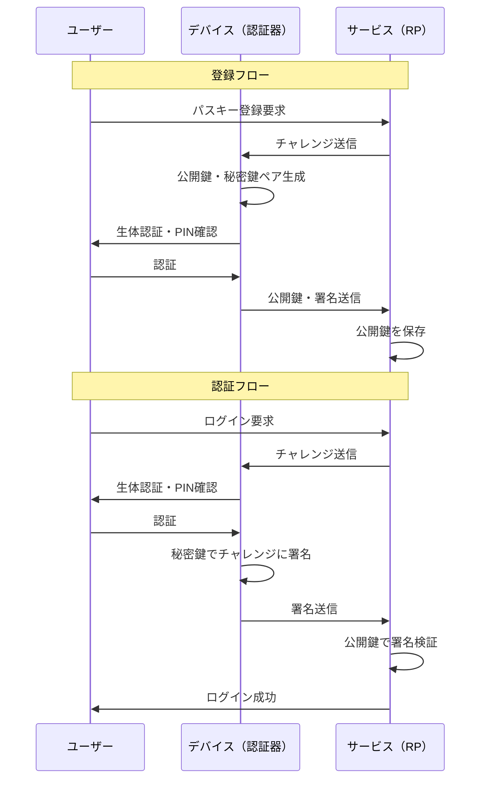

# パスキー（Passkeys）の普及動向

## はじめに

パスキー（Passkeys）は、従来のパスワードに代わる認証技術として急速に普及が進んでいる。FIDO AllianceとW3Cが策定したWebAuthn/FIDO2標準に基づき、Apple・Google・Microsoftの三大プラットフォームが2022年に共同サポートを表明して以来、パスキーはもはや実験的な技術ではなく、主流の認証手段へと成長しつつある。

2025年末時点では10億人以上がパスキーを有効化し、2025年を「パスキーがメインストリームに移行した年」と位置づける声もある。本稿では、パスキーの技術的基盤を整理したうえで、最新の普及状況・課題・今後の展望を解説する。

## 技術的背景

### パスキーの仕組み

パスキーは公開鍵暗号を用いた認証資格情報（クレデンシャル）であり、FIDO2/WebAuthn仕様として標準化されている。

パスキーのセキュリティ上の核心は「共有シークレットが存在しない」点にある。サーバー側には公開鍵のみが保存され、秘密鍵はユーザーのデバイスから外に出ることがない。これにより：

- **フィッシング耐性**: パスキーはオリジン（ドメイン）に紐づいており、偽サイトでは使用できない
- **サーバーサイド漏洩への耐性**: 仮にサーバーのデータベースが漏洩しても、公開鍵しか存在しないため攻撃者はログインできない
- **ブルートフォース・クレデンシャルスタッフィング攻撃への耐性**: パスワードそのものが存在しない

### 同期パスキーとデバイスバウンドパスキー

パスキーには大きく2種類がある：

| 種別                            | 説明                                                   | 用途                                     |
| ------------------------------- | ------------------------------------------------------ | ---------------------------------------- |
| 同期パスキー（Synced Passkeys） | プラットフォームのクラウドを通じて複数デバイス間で同期 | 一般コンシューマー向け                   |
| デバイスバウンドパスキー        | ハードウェアセキュリティキー等に格納され同期しない     | 高セキュリティが求められる企業・政府向け |

同期パスキーは利便性に優れ、Apple（iCloud Keychain）、Google（Googleパスワードマネージャー）、Microsoft（Windows Hello）がそれぞれのエコシステムで管理する。

## プラットフォームサポートの現状

三大プラットフォームはいずれも主要OS・ブラウザにパスキーのネイティブサポートを組み込んでいる。

| プラットフォーム | 対応環境                            | クレデンシャル管理           |
| ---------------- | ----------------------------------- | ---------------------------- |
| Apple            | iOS 16+, macOS Ventura+, Safari 16+ | iCloud Keychain              |
| Google           | Android 9+, Chrome 108+             | Googleパスワードマネージャー |
| Microsoft        | Windows 11, Edge                    | Windows Hello                |
| Mozilla Firefox  | Firefox 122+                        | OS連携                       |

2025年までに、主要サービスのパスキー対応は急速に拡大した。AmazonやGoogle、Microsoft、PayPal、TikTok、Targetなどを含む大手企業のアカウントの93%がパスキーサインインに対応しており、うち36%のユーザーがパスキーを登録済みとなっている。

## 普及状況

### グローバルの統計

FIDO Allianceの報告（2025年）によると：

- **10億人以上**が少なくとも1つのパスキーを有効化
- 2025年末時点で**約70%のユーザー**が1つ以上のパスキーを所持
- **75%**のグローバル消費者がパスキーを認知
- パスキー認証の回数は**年間で2倍以上**に拡大し、月間13億回に達した
- トップ100ウェブサイトの**48%**がパスキーログインを提供（2022年比で倍増）

企業導入においても：

- **87%**の企業がパスキーの導入を完了または展開中
- 導入企業の**49%**が採用率75%超を達成

パスワードレス認証市場は2025年時点で241億ドル規模に達し、2030年には557億ドルへ成長すると予測されている（年平均成長率18.24%）。

### 日本の動向

日本市場においてもパスキーの普及は加速している。

**主要サービスの導入実績：**

- **メルカリ**: 2023年3月の導入開始から2年余りで登録者数が1,000万人を突破（2025年5月）
- **マネーフォワード ID**: 2025年1月時点で約145万個のパスキーが登録済み

**規制面での動き：**

日本証券業協会は2025年7月15日、フィッシング耐性のあるMFA（多要素認証）の実装を要求するガイドラインの改訂案を公表し、2026年夏の義務化を予定している。これにより、証券業界を中心にパスキー採用が一層加速する見込みだ。

FIDO Alliance Japan Working Groupの加盟組織数は2025年12月時点で64団体に成長し、日本国内でも50以上のパスキープロバイダーが稼働またはサービス展開を計画している。

## セキュリティ上の効果

実導入企業の90%がパスキー導入によりセキュリティに「中程度以上のプラス効果」があったと報告している。具体的な効果として：

- **フィッシング攻撃の無効化**: ドメイン拘束により中間者攻撃・フィッシング攻撃を構造的に防止
- **クレデンシャルスタッフィングの防止**: 同一パスワードの使い回しに依存した攻撃が成立しない
- **ユーザーエクスペリエンスの向上**: ログイン成功率がパスワード比で最大30%向上したとする報告もある

また、セキュリティ以外の面でも：

- ヘルプデスクへのパスワードリセット問い合わせが77%減少
- 生産性向上（73%の企業が効果を実感）

## 課題と残存する壁

普及が進む一方で、いくつかの課題も残っている。

### 技術・実装上の課題

- **アカウントリカバリー**: デバイスを紛失した際の復旧フローの設計が難しく、適切なリカバリー手段の提供が必要
- **プラットフォーム間の断絶**: Apple・Google・Microsoftのエコシステムをまたいだパスキー利用には摩擦が生じる場合がある
- **レガシーシステムとの統合**: 既存のID管理システムへのパスキー統合は複雑で開発コストが高い

### 導入検討企業が挙げる障壁

まだ導入を開始していない企業が挙げる課題は以下の通り：

1. **複雑さ**（43%）: 既存のパスワードシステムからの移行に技術的なコストがかかる
2. **コスト**（33%）: 実装・運用コスト
3. **情報不足**（29%）: 何から始めればよいかわからない

### ユーザー認識のギャップ

パスキーを詳しく知っているユーザーの62%は積極的に利用しているが、依然として「パスキーとは何か」の認知・理解の普及に課題がある。パスワードへの慣れ親しみや、新しい認証方式への不安感を払拭するUX設計と教育が求められる。

## 今後の展望

パスキーのエコシステムはさらなる進化を続けている。

**クロスデバイス・クロスプラットフォームの改善**: 1Passwordや Bitwardenなどのサードパーティパスワードマネージャーがパスキーの同期・管理に対応し始めており、特定プラットフォームへの依存を軽減する動きが加速している。

**企業・政府機関での本格採用**: 米国の大統領令14028を起点とするフィッシング耐性MFAの要件、日本証券業協会のガイドライン改訂など、規制面での要求が企業導入を後押ししている。エンタープライズ向けのデバイスバウンドパスキー（FIDO2ハードウェアキー）の需要も拡大が見込まれる。

**パスワードの段階的廃止**: Microsoftはすでに新規アカウントに対してパスワードレスをデフォルト化する取り組みを進めており、パスワードが「過去の遺物」となる世界の実現が近づいている。

2026年以降、パスキーはデジタルアイデンティティの中核をなす認証手段として定着し、フィッシング被害や不正アクセスの大幅な削減が期待されている。

## 参考文献

- [FIDO Alliance - World Passkey Day 2025](https://fidoalliance.org/fido-alliance-champions-widespread-passkey-adoption-and-a-passwordless-future-on-world-passkey-day-2025/)
- [State of Passkeys 2026](https://state-of-passkeys.io)
- [Passwordless authentication in 2025: The year passkeys went mainstream - Authsignal](https://www.authsignal.com/blog/articles/passwordless-authentication-in-2025-the-year-passkeys-went-mainstream)
- [State of passkeys 2025: passkeys move to mainstream - Biometric Update](https://www.biometricupdate.com/202501/state-of-passkeys-2025-passkeys-move-to-mainstream)
- [Goodbye passwords? Enterprises ramping up passkey adoption - Help Net Security](https://www.helpnetsecurity.com/2025/03/12/enterprise-passkey-adoption/)
- [パスキー利用状況レポート @ マネーフォワード ID (vol.7, Jan 2025)](https://moneyforward-dev.jp/entry/2025/01/10/passkey-report-vol7)
- [パスキー登録者数が1,000万人突破 - mercan（メルカン）](https://careers.mercari.com/mercan/articles/52225/)
- [Passkeys Japan: An Overview [2026] - Corbado](https://www.corbado.com/blog/passkeys-japan-overview)
- [2025 FIDO Report: The Passwordless Future - Descope](https://www.descope.com/blog/post/2025-fido-report)
- [Passwordless adoption moves from hype to habit - Help Net Security](https://www.helpnetsecurity.com/2025/10/31/passkey-adoption-trends-2025/)
