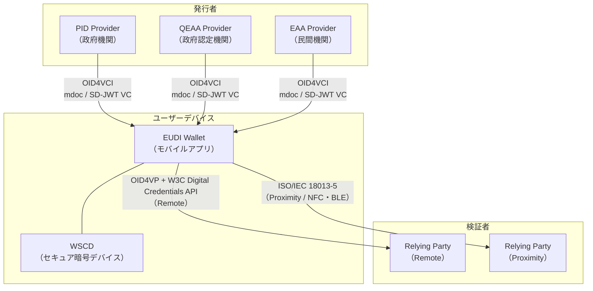

# EU Digital Identity Wallet（EUDI Wallet）— 2026年末の全EU展開に向けた現状と技術詳解

## はじめに

2026年12月31日、EUの27加盟国すべてが自国市民・居住者に対して **EU Digital Identity Wallet（EUDI Wallet）** を提供しなければならない。これは努力目標ではなく、2024年5月に発効した **eIDAS 2.0**（Regulation (EU) 2024/1183）に基づく法的義務だ。

EUDI Walletとは、政府発行のデジタルIDを含む各種証明書をスマートフォンに格納し、国境を越えてシームレスに提示できるモバイルアプリケーションである。運転免許証・パスポート情報・学術資格・職業資格・医療データなどを一元管理し、選択的開示（Selective Disclosure）によってプライバシーを守りながら必要な属性のみを共有できる。

本稿では、EUDI Walletの技術アーキテクチャ、採用される標準規格、2026年4月時点の各国展開状況、そして開発者・事業者への影響を解説する。

## 背景：eIDAS 2.0とデジタルアイデンティティの変革

### eIDAS 1.0の限界

初代eIDAS（2014年）はEU域内での電子認証・電子署名の相互承認を定めたが、実装は加盟国ごとに分断され、国境を越えた利用は困難だった。民間サービスは義務的に対応する必要もなく、利用率は低迷した。

### eIDAS 2.0の核心

eIDAS 2.0は、この課題を根本から解決しようとする。主要な変更点は以下の通りだ。

- **Walletの義務化**: 加盟国は市民に無償でEUDI Walletを提供する義務を負う
- **民間の受入義務**: 月間アクティブユーザー数が多い大規模オンラインサービス（銀行、主要Webサービスなど）はEUDI Walletによる認証を受け入れなければならない
- **PID（Person Identification Data）**: 政府発行の本人確認データの標準形式を規定
- **EAA（Electronic Attestation of Attributes）**: 民間機関も証明書を発行できる仕組み
- **QEAA（Qualified EAA）**: 政府認定機関が発行する高保証レベルの証明書

## 技術アーキテクチャ：ARFの詳解

### Architecture and Reference Framework（ARF）

EUDI Walletの技術仕様の核となるのが **ARF（Architecture and Reference Framework）** だ。欧州委員会が管理するオープンな文書で、Walletエコシステム全体の設計思想・コンポーネント・要件が記述されている。

ARFで定義される主要コンポーネントは以下の通りだ。

| コンポーネント    | 説明                                                                             |
| ----------------- | -------------------------------------------------------------------------------- |
| **Wallet Unit**   | ユーザーのデバイス上で動作するWalletアプリの実体                                 |
| **WSCD**          | Wallet Secure Cryptographic Device。秘密鍵を保護するセキュアエレメント（TEE/SE） |
| **WIA**           | Wallet Instance Attestation。Wallet自体の正当性を証明する                        |
| **WTE**           | Wallet Trust Evidence。Walletの信頼根拠を表す                                    |
| **PID Provider**  | Person Identification Dataを発行する政府機関                                     |
| **Relying Party** | Walletからの証明書を検証するサービス提供者                                       |

### 証明書フォーマット：二重対応の設計

EUDI Walletは **ISO/IEC 18013-5（mdoc）** と **SD-JWT VC** の両フォーマットを義務的にサポートする。これは近接（Proximity）シナリオと遠隔（Remote）シナリオのそれぞれに最適なフォーマットが異なるためだ。

**mdoc（ISO/IEC 18013-5）**

- もともとモバイル運転免許証（mDL）向けに設計
- CBOR（Concise Binary Object Representation）エンコーディング
- NFC・BLEを使った近接呈示に最適化
- デバイス認証（Device Authentication）による改ざん防止

**SD-JWT VC**

- JSON/JWTベースのフォーマット
- Selective Disclosure（選択的開示）をネイティブにサポート
- OAuthエコシステムとの親和性が高く、Web/APIでの利用に適する
- 開発者にとって実装が比較的容易

### 発行プロトコル：OID4VCI

証明書の発行には **OpenID for Verifiable Credential Issuance（OID4VCI）** が使われる。OAuthのAuthorization Code FlowやPre-Authorized Code Flowをベースとし、WalletがIssuerから証明書を受け取る際の標準フローを定める。

2026年2月にはOID4VCIの自己認証（Self-Certification）プログラムが開始され、実装の相互運用性確認が本格化している。

### 呈示プロトコル：OID4VP

遠隔での証明書呈示には **OpenID for Verifiable Presentations（OID4VP）** が使われる。W3C Digital Credentials APIと組み合わせることでブラウザからの証明書呈示が可能となる。近接呈示ではISO/IEC 18013-5（-7）のプロトコルを使う。

## 主要ユースケース

EUDI Walletは多岐にわたるユースケースを想定している。

### 本人確認・年齢確認

最も基本的なユースケース。運転免許証や身分証明書に相当するPIDをWalletに格納し、オンライン・オフラインで呈示する。「18歳以上か」を確認する際に生年月日全体を開示せず、ブール値のみを共有する選択的開示が実現可能だ。

### eKYC（Know Your Customer）

銀行口座開設や金融サービスの契約時に、EUDI WalletによるKYCが可能になる。これにより書類郵送・対面確認のコストを削減し、オンボーディングの摩擦を大幅に低減できる。

### 電子署名・資格証明

EUDI Walletは適格電子署名（QES）もサポートする。学術資格・専門資格・医師免許・弁護士資格といったEAAをWalletに格納し、雇用主や行政機関への証明が容易になる。

### モバイル運転免許証（mDL）

ISO/IEC 18013-5に準拠したmDLは警察による路上検問・レンタカー会社での本人確認・空港での搭乗手続きなどで利用できる。

## 2026年4月時点の各国展開状況

全27加盟国が12月期限を前にしているが、準備状況には大きな差がある。

| 状況                   | 加盟国                                                        |
| ---------------------- | ------------------------------------------------------------- |
| **期限達成が濃厚**     | オーストリア、フランス、ドイツ、ギリシャ、イタリア            |
| **部分的な対応を予定** | マルタ、スウェーデン、アイルランド（2026年4月よりテスト開始） |
| **遅延の可能性**       | オランダ（機能制限での対応を示唆）                            |
| **深刻な懸念**         | ブルガリア、ルーマニア、スロバキア、スロベニア                |

**ドイツ**はアーキテクチャ文書を公開形式でオープンソース開発しており、透明性が高い。**イタリア**はすでにベータ版をテスト中。**アイルランド**は2026年4月にテストアプリの提供を開始した。

一方、ENISAは2026年4月末を締め切りとして、EUDI Wallet認証スキームの草案に対するパブリックコンサルテーションを実施中だ。認証スキームが確定しないと、Walletの適合性評価ができないため、タイムラインへのプレッシャーは高まっている。

## 実践的な影響

### 開発者への影響

EUDI Walletエコシステムに関わる開発者は以下の技術スタックを習得する必要がある。

- **OID4VCI / OID4VP**: IssuerとVerifier実装の核
- **SD-JWT VC**: JSON/JWT系のVC実装
- **mdoc（CBOR）**: 近接呈示対応の場合
- **W3C Digital Credentials API**: ブラウザとWalletの連携
- **HSM/TEE**: Walletのセキュア鍵管理

Keycloakのようなオープンソースのアイデンティティ基盤でもOID4VCIサポートが追加されており（Keycloak 2026年1月リリース）、既存のOAuthエコシステムとの統合が進んでいる。

### 事業者への影響

月間アクティブユーザー数が多い大規模プラットフォームはEUDI Walletによる認証受け入れが義務化される。銀行・保険・通信・行政サービスはEUDI Walletをアイデンティティ基盤の選択肢として真剣に検討する必要がある。

一方、EUDI WalletはAppleやGoogleのデジタルIDとの競合関係にもある。EU市民の期待するUXレベルは高く、政府系ウォレットがそれを満たせるかが普及の鍵となる。

### ユーザーへの影響

調査では「EUDI Walletを利用する」と回答したEU市民は29%にとどまる。政府・EUへの不信感、プライバシー懸念、利便性への疑問が障壁となっている。

しかし、銀行やオンラインサービスが受け入れを開始すれば、毎回のKYCの手間が省けるという実際の利便性から普及が加速する可能性もある。

## 今後の展望

EUDI Walletは**デジタルアイデンティティのグローバルスタンダード争い**における欧州の重要な一手だ。採用するOID4VCI・OID4VP・SD-JWT VCといった標準規格はOpenID Foundationが整備しており、EU外（英国、スイス、ウクライナ、西バルカン諸国など）でも同一技術スタックの採用が進んでいる。

2026年12月に向けた主要な注目点は以下だ。

1. **ENISAの認証スキーム確定**: 2026年前半に確定見込み。Walletの適合性評価が可能になる
2. **Implementing Actsの整備**: 技術仕様を補完する実施細則の完成度が実装品質を左右する
3. **Large Scale Pilots（LSPs）の成果**: 26加盟国・350以上の組織が参加する大規模実証の知見が実装に反映される
4. **相互運用性の確認**: 国境を越えたクロスボーダー証明書交換の実証（ルーマニアでの実証が先行事例）

EUDI Walletは単なるアプリではなく、欧州のデジタル主権とプライバシー中心のアイデンティティ基盤を再定義する試みだ。2026年末の展開がどこまで実現するかは加盟国ごとの実装力に依存するが、標準規格レベルでは世界最先端のデジタルIDエコシステムが形成されつつある。

## 参考文献

- [EU Digital Identity Wallet — 欧州委員会公式](https://commission.europa.eu/topics/digital-economy-and-society/european-digital-identity_en)
- [EUDI Wallet Architecture and Reference Framework (ARF) GitHub](https://github.com/eu-digital-identity-wallet/eudi-doc-architecture-and-reference-framework)
- [OpenID for Verifiable Credential Issuance 1.0](https://openid.net/specs/openid-4-verifiable-credential-issuance-1_0.html)
- [OpenID for Verifiable Credentials — OpenID Foundation](https://openid.net/sg/openid4vc/)
- [EUDI Wallets — Only One Year to Launch (Signicat)](https://www.signicat.com/blog/eudi-wallets-only-one-year-to-launch)
- [eIDAS 2.0 & EU Digital Identity Wallet: KYC Guide 2026 (Zyphe)](https://www.zyphe.com/resources/blog/eidas-2-eu-digital-identity-wallet-kyc-compliance-guide)
- [Ireland Begins Testing EU Digital Identity Wallet App](https://nationaltoday.com/us/ny/new-york/news/2026/04/05/ireland-begins-testing-eu-digital-identity-wallet-app/)
- [ENISA launches consultation on EU digital wallet certification](https://dig.watch/updates/enisa-eu-digital-wallet-certification)
- [OpenID for Verifiable Credential self-certification to launch Feb 2026](https://openid.net/openid-for-verifiable-credential-self-certification-to-launch-feb-2026/)
- [Setting Up Keycloak as a Credential Issuer with OpenID4VCI](https://www.keycloak.org/2026/01/issue-credentials-over-openid4vci)
