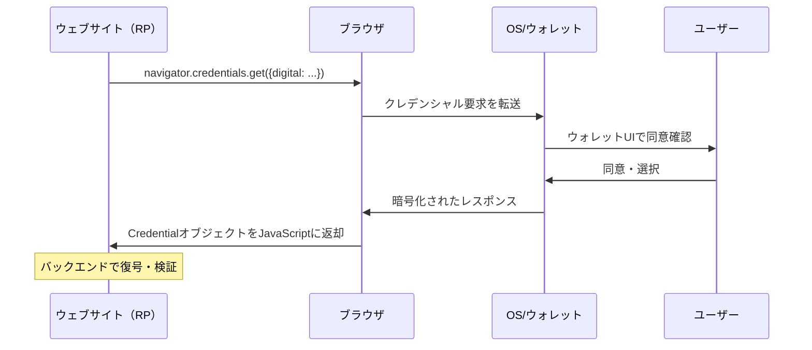

# Digital Credentials API — ブラウザが本人確認の新インフラになる日

## はじめに

2025年秋、Chromeのバージョン141とSafariのバージョン26がそれぞれ安定版として出荷された。この二つのリリースが持つ共通点として見落とされがちなのが、**Digital Credentials API（DC API）** のサポートだ。ブラウザに組み込まれたこの新しいAPIは、ウェブサイトがユーザーのスマートフォン上のウォレットから運転免許証や資格証明書などのデジタルクレデンシャルを直接要求できる仕組みを提供する。

これまで本人確認といえば、パスポートや運転免許証をスキャンしてアップロードするか、あるいは専用の本人確認サービスに誘導するのが一般的だった。DC APIはその常識を覆す可能性を持つ。ウェブアプリが `navigator.credentials.get()` を呼び出すだけで、ブラウザが仲介役となり、ユーザーのウォレットに格納されたクレデンシャルを選択的に提示できるようになる。

本稿では、DC APIの技術的な仕組み、対応するクレデンシャル形式、ブラウザサポートの現状、そして開発者・事業者にとっての実践的な含意を整理する。

## 背景：なぜブラウザがアイデンティティ基盤に関わるのか

### サードパーティCookieの終焉とフェデレーション認証の危機

ウェブのアイデンティティ基盤はかつて、サードパーティCookieに大きく依存していた。Googleログイン・Facebookログインなどの「Sign in with X」フローは、異なるオリジン間でのセッション情報の共有に第三者Cookieを活用していた。しかし、プライバシー保護を目的としたサードパーティCookieの段階的廃止により、こうした仕組みは根底から揺らいだ。

この課題に対してGoogleが提案したのが **FedCM（Federated Credential Management API）** だ。FedCMはIdP（アイデンティティプロバイダ）とRP（リライングパーティ）の間のフェデレーション認証をブラウザが積極的に仲介することで、Cookieに依存せずにログインを実現する。

DC APIはFedCMとは別の問題意識から生まれた。FedCMが「ウェブサービス間のログイン連携」を対象にするのに対し、DC APIは「ウォレットに格納された政府発行IDや資格証明書の提示」を対象にする。この二つは隣接した問題領域だが、設計哲学は対照的に異なる。

### スマートフォンのウォレットに蓄積されるアイデンティティ資産

iOS・Androidプラットフォームはそれぞれ、デジタル運転免許証（mDL）や各種IDドキュメントをウォレットアプリに格納する機能を整備してきた。ISO 18013-5が規定するモバイル運転免許証（mDL）は、NFC・Bluetooth・QRコードを通じた対面提示に対応しており、米国の複数州や欧州各国で実際の運転免許証として法的効力を持つ。

問題は、これらのウォレット資産をウェブのコンテキストで利用するための標準インターフェースが存在しなかったことだ。各サービスがカスタムアプリのディープリンクや独自プロトコルで対応する断片的な状況が続いていた。DC APIはこの空白を埋めるブラウザ標準として登場した。

## DC APIの仕組み

### navigator.credentials.get() の拡張

DC APIは既存の **Credential Management API** を拡張する形で設計されており、`navigator.credentials.get()` の `digital` オプションを通じて呼び出す。

```javascript
const result = await navigator.credentials.get({
  digital: {
    requests: [
      {
        protocol: "openid4vp-v1-unsigned",
        data: {
          response_type: "vp_token",
          nonce: "a1b2c3d4e5f6",
          client_metadata: {
            vp_formats: {
              "dc+sd-jwt": { "sd-jwt_alg_values": ["ES256"] },
            },
          },
          dcql_query: {
            credentials: [
              {
                id: "my_credential",
                format: "dc+sd-jwt",
                claims: [
                  { path: ["given_name"] },
                  { path: ["family_name"] },
                  { path: ["age_over_18"] },
                ],
              },
            ],
          },
        },
      },
    ],
  },
});
```

### ブラウザによる仲介モデル

DC APIの核心は、ブラウザが「ダムパイプ」として機能する点にある。FedCMがユーザー体験の細部まで規定し、ブラウザ自身がアカウント選択UIを提供するのに対し、DC APIはあえて中立を保つ。



重要な特徴として、ブラウザはレスポンスの内容を解釈しない。暗号化されたペイロードはRP（リライングパーティ）のバックエンドに渡され、そこで適切な鍵を使って復号・検証される。ブラウザはセキュアなトランスポートチャンネルの提供に徹し、クレデンシャルの信頼性判断には関与しない。

### クロスデバイスフロー

PCブラウザからモバイルウォレットを利用する場合、ブラウザはQRコードを表示する。ユーザーがスマートフォンでQRコードをスキャンすると、CTAPプロトコル（FIDO2で使われる認証器通信プロトコル）を通じてデスクトップとモバイルの間にエンドツーエンド暗号化されたセキュアチャンネルが確立される。このチャンネル経由でクレデンシャルのやり取りが行われるため、フィッシングに対する耐性が高い。

## 対応するクレデンシャル形式

DC APIはプロトコルに対して意図的に中立な設計を採用しており、複数のクレデンシャル形式をサポートする。

### ISO/IEC 18013-5 mdoc（モバイルIDドキュメント）

政府発行IDに特化したCBORベースのフォーマット。mDL（モバイル運転免許証）はこのフォーマットを使用する。名前空間（namespace）で属性が管理され、イシュアーが個々の属性に署名することで選択的開示を実現する。

Safariは現時点でこのフォーマット（`org-iso-mdoc`）のみをサポートする。

### OpenID for Verifiable Presentations（OID4VP）+ SD-JWT VC

W3C Verifiable CredentialsをJWT形式で表現し、SD-JWT（Selective Disclosure JWT）による選択的開示を組み合わせたフォーマット。ChromeはOpenID4VPプロトコルを通じてこのフォーマットに対応する。

EU域内では `dc+sd-jwt` 形式がEUDI Walletの標準形式として採用されており、OpenID FoundationのOID4VC認定プログラムによるインターオペラビリティ認証も2026年2月より開始された。

### DCQL（Digital Credentials Query Language）

クレデンシャルの要求を記述するクエリ言語で、OID4VPでの利用を主目的として策定された。Presentation Exchangeの後継として位置づけられ、より簡潔な構文で要求するクレームを指定できる。

## ブラウザサポート状況（2026年4月現在）

| ブラウザ | バージョン | 状態                     | 対応プロトコル                 |
| -------- | ---------- | ------------------------ | ------------------------------ |
| Chrome   | 141+       | 安定版                   | OpenID4VP、ISO 18013-7 Annex C |
| Edge     | 141+       | 安定版（Chromiumベース） | Chrome相当                     |
| Safari   | 26.0+      | 安定版                   | `org-iso-mdoc`のみ             |
| Firefox  | 149+       | 開発中                   | 基本実装済み、UX作業中         |

### ChromeとSafariの非対称性が生む実装課題

ChromeはOpenID4VPとmdoc双方に対応する一方、Safariはmdocのみをサポートする。この非対称性は開発者にとって頭痛の種だ。「18歳以上であることの証明」というシンプルなユースケースであっても、レスポンスがmdocで来た場合（mdocのネームスペースベースの属性構造）とSD-JWT VCで来た場合（JSONクレーム構造）ではパース・検証ロジックが異なるため、バックエンドでの二重対応が必要になる。

## EUDIウォレットとの関係

EUDIウォレット（EU Digital Identity Wallet）を規定するアーキテクチャリファレンスフレームワーク（ARF）のTopic Fは、リモートでの本人確認フローにDC APIの使用を条件付きで要求している。つまり、EUDI準拠のリライングパーティはDC APIをサポートしなければならない場合がある。

これはDC APIがEU内で急速に普及する重要な牽引力となっている。EUの27加盟国が2026年末までにEUDI Walletを展開する義務を負っており、その際のウェブ連携がDC APIに依存するとなれば、欧州のウェブサービスにとってDC APIへの対応は事実上必須となる。

## FedCMとの設計上の違い

DC APIとFedCMは、ブラウザ仲介アイデンティティという同じ方向性を持ちながら、設計思想が根本的に異なる。

|                | FedCM                              | DC API                             |
| -------------- | ---------------------------------- | ---------------------------------- |
| 対象           | フェデレーション認証（IdP → RP）   | ウォレットからのクレデンシャル提示 |
| ブラウザの役割 | 能動的仲介（UI提供・ポリシー執行） | パッシブな転送（内容解釈なし）     |
| プロトコル規定 | 強い意見（独自フロー）             | 中立（プロトコルは外部仕様）       |
| ガバナンス     | ブラウザが信頼の一部を担う         | ブラウザは信頼判断に関与しない     |

DC APIの「ダムパイプ」設計は意図的なものだ。クレデンシャルフォーマット・ウォレット実装・信頼フレームワークが乱立する現在の状況で、ブラウザが特定のアーキテクチャに肩入れすることを避けたかったからだ。しかし一方で、この中立性は悪意あるRPが不正なクレデンシャル要求を送信した場合の保護責任を誰が担うのかという問いを宙に浮かせたまま残している。

## 開発者・事業者への影響

### ウェブ本人確認の実装パターンの変化

DC APIが普及すると、ウェブの本人確認フローが大きく変わる可能性がある。

従来の方法：

1. ユーザーがIDドキュメントを撮影
2. 画像をサーバーにアップロード
3. OCRや専用AIで情報を抽出・検証

DC API活用後：

1. `navigator.credentials.get()` でクレデンシャルを要求
2. ユーザーがウォレットで同意
3. バックエンドで署名済みアサーションを検証

後者は画像データを扱わないため、個人情報の取り扱いリスクが低減し、検証の確実性も向上する（イシュア署名による真正性保証）。

### バックエンドの検証インフラ

DC APIのクライアント実装は比較的シンプルだが、バックエンドでの検証は複雑だ。イシュアの公開鍵を取得し、クレデンシャルの有効期限・失効状態を確認し、クレームを正しく解釈するためには、各フォーマット（mdoc/SD-JWT VC）に対応したライブラリと、イシュアへの信頼構成が必要になる。

walt.id・Spruce Systems・Microsoft Entraなどのベンダーがこの検証インフラをAPIとして提供し始めており、独自実装の障壁は下がりつつある。

### 年齢確認への応用

EU・英国・豪州など各国で年齢確認に関する規制強化が続いており、DC APIはこの文脈でも注目される。ユーザーが「18歳以上」という属性だけを開示し、生年月日などは共有しないという選択的開示が技術的に容易になるからだ。

## 今後の展望

Chrome 143でDC APIのクレデンシャル発行側（`navigator.credentials.create()` によるOID4VCI）のオリジントライアルが開始された。これが安定化すれば、クレデンシャルの発行と提示の両方がブラウザAPIで完結するようになる。ただし、ウォレットバインディングの脆弱性が報告されており、政府機関での採用はこの問題の解決が前提となる。

Firefoxが安定サポートを提供する時点で、主要ブラウザの対応が揃う。この段階でDC APIは「一部ブラウザでのみ動く実験的API」から「ウェブ本人確認の標準インターフェース」へと位置づけが変わるだろう。

W3Cのアイデンティティ関連仕様は現在もアクティブな開発が続いており、FedCMとDC APIの接点（同一のブラウザUIでアカウント選択とクレデンシャル選択を提供する試み）についても議論が進んでいる。二つのAPIが統合に向かうのか、独立したまま共存するのかは、今後数年の標準化コミュニティの判断に委ねられている。

## 参考文献

- [Digital Credentials API | W3C Working Draft](https://www.w3.org/TR/digital-credentials/)
- [Digital Credentials API: Secure and private identity on the web | Chrome Developers](https://developer.chrome.com/blog/digital-credentials-api-shipped)
- [Two APIs Walk Into a Browser: FedCM vs. the DC API | Spherical Cow Consulting](https://sphericalcowconsulting.com/2025/12/16/two-apis-walk-into-a-browser/)
- [Digital Credentials API (2026): Chrome, Safari & Firefox | Corbado](https://www.corbado.com/blog/digital-credentials-api)
- [What is the Digital Credentials API? | walt.id](https://docs.walt.id/concepts/data-exchange-protocols/dc-api)
- [OpenID for Verifiable Credential self-certification to launch Feb 2026 | OpenID Foundation](https://openid.net/openid-for-verifiable-credential-self-certification-to-launch-feb-2026/)
- [FIDO Alliance Launches New Digital Credentials Initiative | FIDO Alliance](https://fidoalliance.org/fido-alliance-launches-new-digital-credentials-initiative-to-accelerate-and-secure-an-interoperable-digital-identity-ecosystem/)
