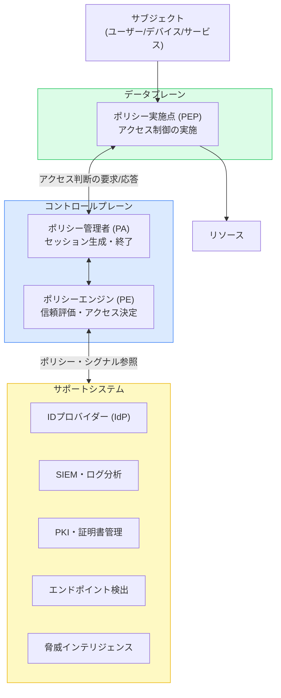
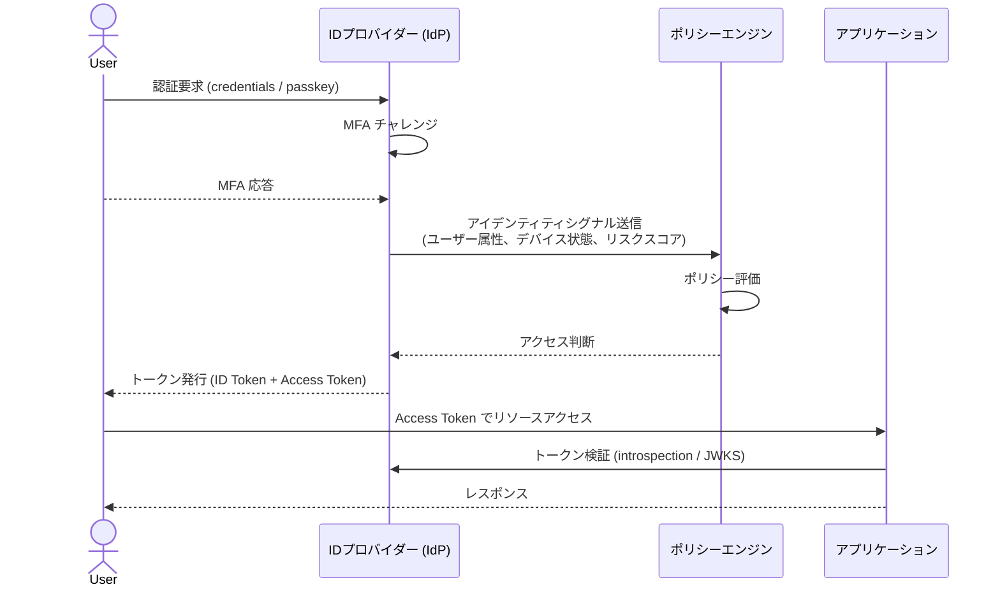

# ゼロトラストとアイデンティティ — 「信頼しない、常に検証する」原則とIDプロバイダーの役割

## はじめに

「ネットワーク内にいるなら信頼できる」——かつてのセキュリティモデルはこの前提に立っていた。VPN で社内ネットワークに接続し、ファイアウォールで外部と内部を分離すれば安全だという考え方だ。しかし、クラウドの普及、リモートワークの常態化、そして内部からの脅威の増加により、この前提はとうに崩れている。

ゼロトラスト（Zero Trust）は、この崩壊した前提に正面から向き合うセキュリティモデルだ。「決して信頼するな、常に検証せよ（Never Trust, Always Verify）」という原則のもと、ネットワーク上の位置ではなく、**アイデンティティ**を信頼の基点に据える。

本記事では、ゼロトラストの基本原則を整理し、アイデンティティプロバイダー（IdP）がなぜその中核に置かれるのか、そして OIDC や OAuth 2.0 といったプロトコルがどう機能するかを解説する。

## 背景：ペリメータ型セキュリティの終焉

### VPN 時代の限界

従来のセキュリティは「城と堀」モデルを採用していた。組織の境界（ペリメータ）にファイアウォールを設置し、内部ネットワークを信頼ゾーンとして扱う。外部からの侵入者を堀で防ぎ、内部に入れば自由に動き回れるという設計だ。

このモデルの問題は、侵入者が内部に入ってしまえば横移動（ラテラルムーブメント）が容易になることだ。また、SaaS アプリケーションやクラウドリソースへのアクセスは「ネットワーク内」から行われるとは限らない。

### BeyondCorp：ゼロトラストの先駆け

2009 年の Operation Aurora（Google を含む大手企業を標的にした国家支援型サイバー攻撃）を機に、Google は全社的なセキュリティモデルの再設計に着手した。その成果として 2011 年に誕生したのが **BeyondCorp** だ。

BeyondCorp の核心は「接続元のネットワークではなく、ユーザーとデバイスの状態によってアクセスを判断する」という発想の転換だ。社内ネットワークも外部ネットワークも同様に「信頼できない」と扱い、すべてのアクセス要求をユーザーの身元とデバイスの健全性に基づいて評価する。この考え方はその後の業界標準に大きな影響を与えた。

### NIST SP 800-207 による標準化

2020 年、米国国立標準技術研究所（NIST）が **SP 800-207「Zero Trust Architecture」** を公開し、ゼロトラストの概念と実装指針を体系化した。同ドキュメントはゼロトラストを次のように定義している。

> ネットワークベースの周辺防御から、ユーザー、資産、リソースへの焦点に防御を移動させるサイバーセキュリティ・パラダイムの進化する集合

この定義が示すとおり、ゼロトラストの本質は「どこにいるか（Where）」から「誰・何であるか（Who/What）」への移行だ。

## ゼロトラストの基本原則

NIST SP 800-207 はゼロトラストの基本テナントとして以下を挙げる。

1. **すべてのリソースは安全でないネットワーク上にあるとみなす**
2. **すべての通信は保護されなければならない**（ネットワーク位置にかかわらず）
3. **リソースへのアクセスはセッション単位で許可される**
4. **リソースへのアクセスはポリシーによって決定される**（ユーザーアイデンティティ、デバイス状態、その他の属性を含む）
5. **すべてのリソースの整合性とセキュリティ状態を監視・測定する**
6. **認証と認可は動的に実行され、アクセスが許可される前に厳格に適用される**
7. **資産・ネットワーク・インフラの現在の状態についての情報を収集し、セキュリティ態勢の改善に活用する**

これらの原則を実現するため、NIST はゼロトラストアーキテクチャ（ZTA）を構成する論理コンポーネントを定義している。

## ゼロトラストアーキテクチャの構造

### コアコンポーネント

NIST SP 800-207 が定義する ZTA の中核は 3 つのコンポーネントから成る。

**ポリシーエンジン（Policy Engine, PE）** はアクセス決定の頭脳だ。ポリシー、アイデンティティシグナル、デバイス状態、脅威インテリジェンスなど多様な情報を統合して「許可・拒否・取り消し」を判断する。

**ポリシー管理者（Policy Administrator, PA）** は PE の決定を具体的なアクションに変換する。セッションの生成、変更、終了を担い、決定を監査可能な形で記録する。

**ポリシー実施点（Policy Enforcement Point, PEP）** はサブジェクトとリソースの間に位置し、PA から受け取った指示を実際のアクセス制御として適用する。

### アイデンティティがコントロールプレーンの要となる理由

上図のサポートシステムに「IdP」が含まれているように、ゼロトラストにおいてアイデンティティプロバイダーはポリシーエンジンに最も重要なシグナルを提供するコンポーネントだ。「誰がアクセスを要求しているのか」を確かめなければ、適切なポリシー判断は成立しない。

Microsoft のゼロトラスト展開ガイドは「ID は Zero Trust 戦略の中心」と明示し、次の 3 ステップを実装の出発点として位置付けている。

1. 強力な認証（MFA）による ID の検証
2. アクセスが準拠していること、かつその ID にとって通常の行動であることの確認
3. 最小権限の原則に従ったアクセス付与

## アイデンティティを軸にしたゼロトラストの実装

### IdP の役割：「認証の単一窓口」

ゼロトラスト環境では、すべてのアプリケーションが共通の IdP を経由してアクセス制御を受ける。これにより次の効果が得られる。

- **シングルサインオン（SSO）**: ユーザーは一度認証すれば複数のアプリにアクセスできる（資格情報の断片化を防ぐ）
- **一元的なシグナル収集**: ログイン試行、地理的な移動、デバイス状態などが IdP に集約される
- **ポリシーの統合管理**: アクセスポリシーをアプリごとではなく IdP レベルで管理できる

### OIDC と OAuth 2.0：ゼロトラストの「言語」

IdP との通信プロトコルとして、現代のゼロトラスト実装では **OpenID Connect（OIDC）** と **OAuth 2.0** が標準的に用いられる。

**OAuth 2.0** はリソースへの委任アクセスを制御するフレームワークだ。ユーザーが直接資格情報を共有することなく、アクセストークンを通じて第三者アプリケーションへ権限を委譲できる。ゼロトラストの文脈では、**短命のアクセストークン**（有効期間を短く設定）と**リフレッシュフロー**の組み合わせが継続的な検証を支える。

**OpenID Connect** は OAuth 2.0 の上に ID レイヤーを追加する。ID トークン（JWT）にユーザーのアイデンティティ情報を埋め込み、ポリシーエンジンが誰のアクセスかを正確に識別できるようにする。

**RFC 7662 トークンイントロスペクション**はアクセストークンの有効性と内容をリアルタイムで照会するエンドポイントを定義する。ゼロトラストが求める「セッション中の継続的な検証」には不可欠な仕組みだ——ログイン時だけでなく、すべてのリクエストでトークンの有効性を確認できる。

### 条件付きアクセスとリスクベース認証

静的なルール（「管理者グループのユーザーはリソース A にアクセスできる」）だけでは、ゼロトラストの「動的検証」を実現できない。現代の実装では、**条件付きアクセス（Conditional Access）** と**リスクベース認証**が組み合わされる。

条件付きアクセスは次のシグナルを評価してアクセスを制御する。

| シグナルの種類           | 例                                         |
| ------------------------ | ------------------------------------------ |
| ユーザーアイデンティティ | ロール、グループメンバーシップ             |
| デバイス状態             | MDM 管理下、パッチ適用状況、ディスク暗号化 |
| 場所                     | IP アドレス、地理的位置                    |
| リアルタイムリスク       | 異常なログインパターン、漏洩した資格情報   |
| アプリケーション         | アクセス対象リソースの機密度               |

リスクスコアが高いとポリシーエンジンが判断した場合、**ステップアップ認証**（再度の MFA 要求）が発動する。リスクが極めて高い場合はセッション自体を終了させる。

### 継続的な認証という考え方

「一度ログインすれば信頼する」はゼロトラストと相容れない。

継続的な認証（Continuous Authentication）は、認証をポイントインタイムのイベントではなくセッション全体に渡る継続的なプロセスとして捉える。具体的には次の仕組みが用いられる。

- **短命トークン**: アクセストークンの有効期間を数分〜数十分に設定し、頻繁な再検証を強制する
- **トークンイントロスペクション**: リソースサーバーがリクエストごとにトークンの有効性を IdP に問い合わせる
- **行動分析**: ユーザーの操作パターン（タイピングリズム、マウス動作、アクセス先の遷移）をリアルタイム分析し、異常を検出する

## 実践的な影響

### 開発者・アーキテクトへの示唆

ゼロトラストへの移行は、アプリケーション開発の設計原則にも影響する。

**トークン検証を適切に実装する**: アクセストークンを受け取るリソースサーバーは、署名検証だけでなく有効期限・発行者（`iss`）・対象（`aud`）クレームを必ず確認する必要がある。イントロスペクションエンドポイントの活用も検討したい。

**最小スコープの原則**: OAuth 2.0 のスコープは必要最小限に絞る。過剰な権限を持つトークンは侵害された際のリスクを拡大させる。

**サービス間通信にも認証を**: マイクロサービス間の通信も「信頼できないもの」として扱い、サービスアカウントや mTLS（相互 TLS）を用いた相互認証を実装する。

### 組織・IT 管理者への示唆

**IdP の一元化**: 複数の IAM ソリューションが混在している環境では、シグナルが分散し「見えない影」にアクターが潜む可能性がある。まず IdP を統合し、すべてのアクセス要求を共通のコントロールプレーンに通すことが出発点だ。

**レガシープロトコルの排除**: NTLM や基本認証（Basic Authentication）はゼロトラストポリシーを適用できない。これらを使用しているシステムを特定し、段階的に OIDC/SAML 対応の仕組みに移行する必要がある。

**パスワードレス認証への移行**: パスキー（FIDO2/WebAuthn）はフィッシング耐性が高く、ゼロトラストの「強力な認証」要件に合致する。特に特権アカウントからの移行が推奨される。

## 今後の展望

### AI によるリスク分析の高度化

2025〜2026 年にかけて、AI を活用したリアルタイムリスク分析がゼロトラスト製品に組み込まれるケースが増えている。ユーザーの行動基準ライン（ベースライン）を機械学習で学習し、逸脱を検知する仕組みだ。これにより、静的ポリシーでは捉えにくいインサイダー脅威や認証情報窃取後の不審行動を検出できるようになる。

### ZTNA と SASE の統合

Zero Trust Network Access（ZTNA）と Secure Access Service Edge（SASE）の融合が進んでいる。ZTNA がアイデンティティとアプリケーションレベルのアクセス制御を担い、SASE がクラウド配信型のネットワークセキュリティ（SWG・CASB・FWaaS）を提供する。2026 年時点では、多くのエンタープライズ展開がこの組み合わせを採用しつつある。

### 分散型アイデンティティとの接続

W3C の Verifiable Credentials（VC）や Decentralized Identifiers（DID）は、中央集権的な IdP に依存しない「自己主権型アイデンティティ（SSI）」のビジョンを描く。これらのモデルとゼロトラストのポリシーエンジンをどう統合するかは、今後の標準化コミュニティの重要な論点だ。

## まとめ

ゼロトラストはネットワーク境界という「外見上の安全」から、アイデンティティという「確認可能な事実」への転換を促すパラダイムだ。その実現において IdP は単なる認証サービスではなく、動的なアクセス判断を支えるシグナル提供者として中心的な役割を担う。

OIDC・OAuth 2.0 といった標準プロトコルは、この仕組みをアプリケーション間で一貫した形で実装するための共通言語として機能する。ゼロトラストへの移行は一夜にしては成らないが、IdP の一元化と条件付きアクセスの導入を起点に、段階的に実現できる。

## 参考文献

- [NIST SP 800-207 Zero Trust Architecture](https://csrc.nist.gov/pubs/sp/800/207/final) — NIST, 2020
- [NIST SP 800-207A Zero Trust Architecture Model for Cloud-Native Applications](https://csrc.nist.gov/pubs/sp/800/207/a/final) — NIST, 2023
- [Zero Trust and BeyondCorp Google Cloud](https://cloud.google.com/blog/topics/developers-practitioners/zero-trust-and-beyondcorp-google-cloud) — Google Cloud Blog
- [Zero Trust セキュリティ アーキテクチャの最初の柱である ID](https://learn.microsoft.com/ja-jp/security/zero-trust/deploy/identity) — Microsoft Learn
- [Zero Trust Architecture Integration with OpenID Connect and OAuth 2.0](https://iotsecurityinstitute.com/iotsec/iot-security-institute-cyber-security-articles/224-zero-trust-architecture-integration-with-openid-connect-and-oauth-2-0) — IoT Security Institute
- [What Is NIST SP 800-207?](https://www.paloaltonetworks.com/cyberpedia/what-is-nist-sp-800-207) — Palo Alto Networks
- [Zero Trust in 2026: Principles, Technologies, and Best Practices](https://www.exabeam.com/explainers/zero-trust/zero-trust-in-2026-principles-technologies-and-best-practices/) — Exabeam
- [IDaaSで実現するゼロトラストの最前線 〜 JAPANSecuritySummit 2025レポート](https://japansecuritysummit.org/2026/02/13760/) — JAPANSecuritySummit Update
