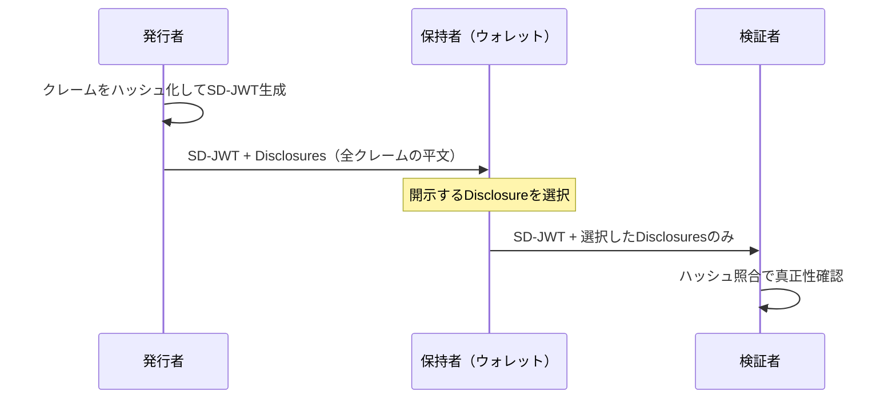
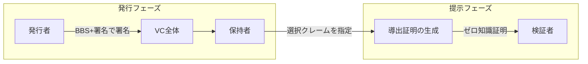
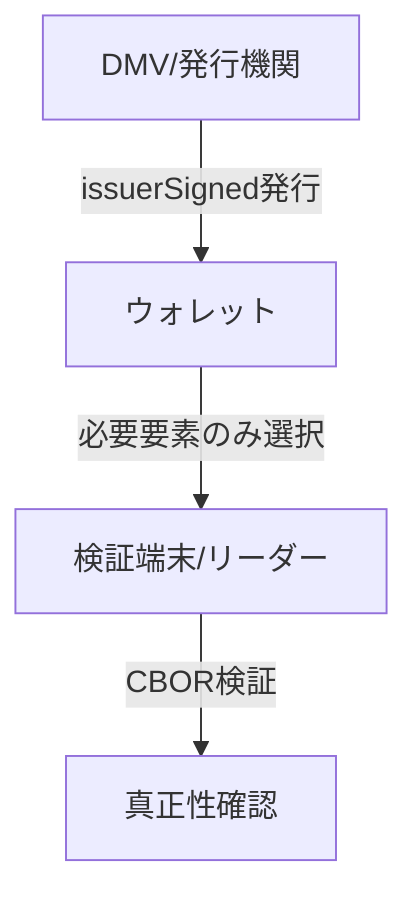

# 選択的開示技術の現状：SD-JWT・BBS+・mDoc が切り拓くプライバシー保護クレデンシャル

デジタルアイデンティティの世界では長らく「全か無か」の情報開示が常態だった。パスポートの画像を提示すれば氏名・生年月日・住所・国籍がすべて相手方に渡る。JWTトークンを提示すれば発行済みのすべてのクレームが露出する。しかし「成年であることだけ証明したい」「メールアドレスは教えたくないが所属組織だけ示したい」といったニーズに応えるのが**選択的開示（Selective Disclosure）**技術だ。

2025〜2026年にかけて、選択的開示をめぐる主要な標準化が相次いで成熟期を迎えている。本稿ではその代表的な三つのアプローチ――**SD-JWT**・**BBS+署名**・**mDoc/mDL（ISO 18013-5）**――の仕組みと採用状況を整理する。

## 背景：なぜ選択的開示が必要か

従来の資格情報モデルにおける問題点は三つある。

**過剰な情報開示（Over-disclosure）**: 提示先が必要としない属性まで渡ってしまう。免許証で年齢確認するだけで住所まで知られるのはその典型例だ。

**相関可能性（Linkability）**: 同じ署名済みトークンを複数のサービスに提示すると、各サービスが結託してユーザーを追跡できる。

**GDPRとの整合**: EU の一般データ保護規則（GDPR）はデータ最小化原則を要求しており、必要以上の個人情報を収集・処理することはコンプライアンス上のリスクとなる。

選択的開示はこれらの課題を暗号技術で解決しようとする試みだ。

## SD-JWT：最もシンプルな実用解

### 概要

**SD-JWT**（Selective Disclosure for JWTs）は 2025年11月に **RFC 9901** として標準化された。JWT を基盤として選択的開示を実現する最もシンプルなアプローチで、既存の JWT エコシステムとの親和性が高い。

### 仕組み

発行者は通常の JWT クレームの代わりに、クレーム値を Salt + クレーム名 + クレーム値のハッシュとして埋め込む。実際のクレーム値は「Disclosure」と呼ばれる別オブジェクトとして保持者に渡される。保持者は提示時に必要な Disclosure だけを選んで提出し、検証者はハッシュ照合で真正性を確認する。

### SD-JWT VC

SD-JWT を検証可能クレデンシャル（VC）フォーマットとして拡張したのが **SD-JWT VC**（draft-ietf-oauth-sd-jwt-vc）だ。2026年2月時点でドラフト版 15 が公開されており、OID4VCI（OpenID for Verifiable Credential Issuance）および OID4VP（OpenID for Verifiable Presentations）と組み合わせることでエンドツーエンドのウォレットエコシステムを構成する。

EU の **eIDAS 2.0** では SD-JWT VC が発行者・検証者・ウォレットに対して必須の標準として規定されており、欧州デジタルアイデンティティウォレット（EUDI ウォレット）の中核を担っている。

### 限界

SD-JWT の選択的開示はクレーム単位でのハッシュ照合であり、**証明のたびに同じ署名値が使われる**。これはサービス間の結託による追跡（Linkability）を防げないという弱点を持つ。また、ゼロ知識証明を内包しないため「18歳以上であることだけを証明する」といった**述語証明**には本来対応していない。

## BBS+署名：プライバシー最強のアプローチ

### 概要

**BBS+**（BBS Signatures）は、マルチメッセージ署名とゼロ知識証明を組み合わせた暗号方式だ。Identity Foundation の BBS Signature 仕様（draft-irtf-cfrg-bbs-signatures）として標準化が進められており、W3C は **Data Integrity BBS Cryptosuites v1.0** として仕様を公開している。

### 仕組みと特長

BBS+ の核心は**導出証明（Derived Proof）**にある。保持者は元の署名を公開せずに「この署名から導出された」証明を生成できる。この導出証明は：

- **Selective Disclosure**: 署名されたクレームの任意のサブセットだけを開示できる
- **Unlinkability（追跡不能性）**: 提示のたびに異なる証明値が生成されるため、複数のバーティカルが結託してもユーザーを追跡できない
- **Proof of Possession**: 秘密鍵の保持を証明できる

SD-JWT と比較して暗号的に強力な匿名性保証を提供する一方、計算コストが高く、既存の JWT インフラとの互換性がない点がトレードオフとなる。

### 採用状況

BBS+ はプライバシー要件の厳しいユースケース（医療、金融、政府ID）での採用が期待されているが、2026年現在は仕様策定フェーズにあり、eIDAS 2.0 のような大規模規制での必須化には至っていない。W3C の VC Data Model 2.0 では BBS 暗号スイートをサポートしており、今後の普及が見込まれる。

## mDoc/mDL（ISO 18013-5）：物理 ID の後継

### 概要

**mDoc**（Mobile Documents）は ISO/IEC 18013-5 として 2021 年に標準化された、モバイル運転免許証（mDL）の国際規格だ。CBOR（Concise Binary Object Representation）フォーマットをベースとする。

### 選択的開示の仕組み

mDoc は名前空間ごとにデータ要素を分離して署名し、提示時に必要な要素だけを選んで渡すことができる。

ISO 18013-5 のプライバシー設計の特徴：

- **ピアツーピア通信**: オンライン・オフライン両方の提示をサポートし、オフライン時はサーバーへのデータ送信が発生しない
- **エンゲージメントレコードなし**: 中央サーバーに提示記録が残らない
- **Annex E**: 追跡防止のための追加ガイダンスを規定

2025〜2026年にかけて ISO 18013-5 の改訂版がコメントドラフト（CD）ステージに入っており、ゼロ知識証明の組み込みも将来の機能として検討されている。

## 三方式の比較

| 観点              | SD-JWT        | BBS+           | mDoc/mDL    |
| ----------------- | ------------- | -------------- | ----------- |
| ベース仕様        | RFC 9901      | IRTF/W3C Draft | ISO 18013-5 |
| フォーマット      | JSON/JWT      | JSON-LD/CBOR   | CBOR        |
| 追跡不能性        | ✗（同一署名） | ✓（導出証明）  | 部分的      |
| 述語証明          | ✗             | ✓              | ✗           |
| 既存JWTとの親和性 | ✓             | ✗              | ✗           |
| 主要採用規制      | eIDAS 2.0     | -              | 各国mDL     |
| 計算コスト        | 低            | 高             | 中          |
| 成熟度            | RFC（標準）   | ドラフト       | ISO標準     |

## 実践的な影響

### 開発者・事業者への影響

**発行者（Issuer）**: eIDAS 2.0 準拠が必要な欧州市場では SD-JWT VC 発行への対応が急務となった。OID4VCI を実装し、クレームのハッシュ化ロジックを組み込む必要がある。

**検証者（Verifier）**: OID4VP を通じた SD-JWT VC 検証実装が求められる。Disclosure の Hash 照合ロジックに加え、Key Binding の検証（提示者がウォレットの鍵を保持していることの確認）も必要だ。

**ウォレット提供者**: 複数のフォーマット（SD-JWT VC、mDoc、将来的に BBS+）への対応が競争力の鍵となる。EUDI ウォレット参照実装（EU 委員会が提供）は三方式すべてを見据えた設計になっている。

### エンドユーザーへの影響

選択的開示が普及すれば、日常の場面でプライバシーが保護される。

- 酒の購入で生年月日の年だけ開示し、住所・姓名は渡さない
- 就職応募で「学士取得者か否か」だけを証明し、卒業校・成績は提出しない
- サービス登録で「18歳以上か否か」をゼロ知識で証明し、実年齢を開示しない

## 今後の展望

2026年以降の注目点は三つある。

**述語証明の実用化**: BBS+ の安定化と、SD-JWT VC への述語証明拡張（範囲証明、ゼロ知識証明の統合）の議論が進んでいる。「30歳代であること」「年収◯◯万円以上であること」といった条件のみを証明できる世界が近づいている。

**追跡不能性への要求高まり**: SD-JWT の Linkability 問題は規制当局からも注目されており、eIDAS 2.0 の技術仕様議論でも話題となっている。BBS+ 的な追跡不能性を SD-JWT エコシステムに組み込む提案も出始めている。

**フォーマット統一への圧力**: SD-JWT VC と mDoc の共存状態は開発コストを増大させる。OID4VP のように両フォーマットを統一的に扱うプロトコル層での抽象化が進むことが期待される。

選択的開示は「プライバシーバイデザイン」の中心技術として、デジタルアイデンティティのアーキテクチャを根本から変えつつある。RFC 9901 の標準化と eIDAS 2.0 の施行圧力は、この変化を不可逆なものにするだろう。

## 参考文献

- [RFC 9901 - Selective Disclosure for JSON Web Tokens (SD-JWT)](https://datatracker.ietf.org/doc/rfc9901/) - IETF、2025年11月
- [draft-ietf-oauth-sd-jwt-vc - SD-JWT-based Verifiable Digital Credentials](https://datatracker.ietf.org/doc/draft-ietf-oauth-sd-jwt-vc/) - IETF OAuth WG
- [Data Integrity BBS Cryptosuites v1.0](https://www.w3.org/TR/vc-di-bbs/) - W3C
- [The BBS Signature Scheme](https://identity.foundation/bbs-signature/draft-irtf-cfrg-bbs-signatures.html) - Identity Foundation / IRTF CFRG
- [SD-JWT VC Explained: A Practical Guide for 2026](https://docs.walt.id/concepts/digital-credentials/sd-jwt-vc) - walt.id
- [mDocs Selective disclosure: Current and future state](https://mattr.global/resources/articles/mdocs-selective-disclosure-current-and-future-state) - MATTR
- [BBS Signatures - a building block for privacy-by-design](https://mattr.global/article/bbs-signatures---a-building-block-for-privacy-by-design) - MATTR
- [On cryptographic mechanisms for the selective disclosure of verifiable credentials](https://arxiv.org/pdf/2401.08196) - arXiv 2024
