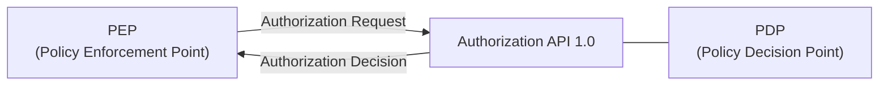

# OpenID Foundation AuthZEN WG 活動レポート (2026 Q1)

> **執筆日**: 2026-04-15  
> この記事は 2026 年 Q1（1 月〜3 月）を対象とした遡及執筆です。

## 概要

AuthZEN Working Group（WG）は、Policy Decision Point（PDP）と Policy Enforcement Point（PEP）間の認可 API を標準化することを目的とした OpenID Foundation の Working Group です。共同議長は Atul Tulshibagwale、Alex Olivier、David Brossard の 3 名が務めています。

2026 年 Q1 は AuthZEN WG にとって歴史的な四半期となりました。長年の成果である **Authorization API 1.0 の Final Specification が正式承認**され、さらに Gartner IAM Summit ロンドンでの存在感が高まるなど、標準としての成熟と市場への浸透が一気に加速した時期です。

---

## 公開された仕様・ドラフト改訂

### Authorization API 1.0 Final Specification 承認（2026 年 1 月 12 日）

2026 年 1 月 12 日、OpenID Foundation の会員投票により **Authorization API 1.0 が OpenID Final Specification として正式承認**されました。

投票の概要は以下の通りです：

| 項目     | 内容                                               |
| -------- | -------------------------------------------------- |
| 投票期間 | 2025 年 12 月 23 日〜2026 年 1 月 6 日（2 週間）   |
| 承認     | 81 票                                              |
| 反対     | 1 票                                               |
| 棄権     | 25 票                                              |
| 合計     | 107 票（全会員 378 名中 28.3%、定足数 20% を超過） |

Final Specification として採択されたことで、本仕様は知的財産の保護が提供され、今後の改訂は行われません。実装者は安定した仕様に基づいて製品開発を進められます。

Authorization API 1.0 は、PEP が PDP に対して認可判定をリクエストするための API を定義するものです。主なエンドポイントは以下の通りです：

- **評価エンドポイント（`/access/v1/evaluation`）**: 単一の認可リクエストに対する判定
- **バッチ評価エンドポイント（`/access/v1/evaluations`）**: 複数リクエストの一括判定
- **サブジェクト・リソース・アクション検索エンドポイント**: 対象データの探索

### 仕様の位置づけ

正式仕様のページは `https://openid.net/specs/authorization-api-1_0.html` で公開されています。GitHub のエディターズドラフト（`https://openid.github.io/authzen/`）は引き続きワーキングドラフトの作業場として機能しています。

---

## 主要な議論・決定事項

### 2026 年の戦略的フォーカス領域

Final Specification の承認を受け、WG は 2026 年の次ステップとして以下の領域に重点を置くことを表明しました：

1. **他標準との統合**: Shared Signals Framework との連携
2. **業界縦断プロファイルの策定**: HL7（医療）、Open Banking（金融）などの垂直業種向けプロファイル
3. **統合シナリオへの対応**: API ゲートウェイ、IdP、MCP ベースの AI アーキテクチャとの統合プロファイル

特に MCP（Model Context Protocol）ベースの AI アーキテクチャへの対応は、NIST ゼロトラストおよび ABAC アーキテクチャと整合するものとして、2026 年の注目領域として挙げられています。

### 相互運用性デモンストレーション

Gartner IAM Summit ロンドン（後述）において、異なる認可エンジンが Authorization API 1.0 の共通プロトコルを通じて相互運用できることをデモンストレーションしました。WG は複数の実装間で同一プロトコルを用いて一貫した認可判定が得られることを示しました。

なお、直近の相互運用イベントに参加した実装ベンダーとして確認されているのは、IdP 側では EmpowerID、Gluu、Curity、Thales、Policy Decision Platform 側では Axiomatics、Cerbos、SGNL、WSO2、Topaz などです（ロンドンでの参加構成の詳細は確認できなかった）。

---

## 会議・イベント

### Gartner Identity & Access Management Summit 2026 ロンドン（3 月 9〜10 日）

2026 年 3 月 9〜10 日、ロンドン（Intercontinental London – The O2）で開催された **Gartner IAM Summit 2026（EMEA 版）** において、AuthZEN WG は大きな存在感を示しました。

#### セッション

AuthZEN WG の共同議長が登壇した主要セッションは以下の通りです：

| セッション                                                           | 登壇者                                                   |
| -------------------------------------------------------------------- | -------------------------------------------------------- |
| "AuthZEN - the 'OpenID Connect' of Authorization"（Executive Story） | Atul Tulshibagwale, Alex Olivier, David Brossard         |
| 認可標準ディスカッションパネル                                       | David Brossard、Homan Farahmand（Gartner）、Alex Olivier |

#### 市場成熟度の転換

2025 年のサミットでは参加者の質問が「AuthZEN とは何か？」という段階であったのに対し、2026 年のロンドンサミットでは**「どのように実装するか？」という実装レベルの質問**へとシフトしていました。これは、組織が本番環境での AuthZEN 導入を真剣に検討し始めていることを示します。

#### Gartner アナリストによる言及

Homan Farahmand、Erik Wahlström、Paul Mezzera の 3 名のアナリストが、それぞれ独立したセッションで**事前の促しなしに AuthZEN に言及**しました。Gartner が Identity Fabric 2.0 の実現に向けてベンダーに AuthZEN の採用を推奨するとともに、「ベンダーロックイン回避のために AuthZEN のような標準を採用すること」を顧客に提言していることが確認されました。

### WG 定例ミーティング

AuthZEN WG は毎週火曜日に定例ミーティングを開催しています。Q1 期間中もミーティングは継続されましたが、公開された議事録の詳細は確認できませんでした。ミーティングノートは HackMD（`https://hackmd.io/@oidf-wg-authzen`）で共有されています。

---

## 今後の予定

2026 年 Q1 完了直後（2026 年 4 月時点）の視点での予定は以下の通りです：

- **2026 年 4 月 27 日**: OpenID Foundation ハイブリッドワークショップ開催（カリフォルニア州サンノゼ、Cisco オフィス、対面＋オンライン）
- 業界縦断プロファイル（HL7、Open Banking）の策定作業の継続
- AI/MCP 統合プロファイルに関する議論の深化
- Shared Signals Framework との連携仕様の検討

---

## 参考情報源

- [Authorization API 1.0 Final Specification Approved - OpenID Foundation](https://openid.net/authorization-api-1-0-final-specification-approved/)
  承認アナウンス（2026 年 1 月 12 日）。投票結果の詳細を含む。
- [Notice of Vote to Approve Proposed Authorization API 1.0 Final Specification](https://openid.net/notice-of-vote-to-approve-proposed-authorization-api-1-final-specification/)
  投票開始時のアナウンス（2025 年 12 月）。
- [AuthZEN: From 'what is this' to 'how do we implement it' - OpenID Foundation](https://openid.net/authzen-from-what-is-this-to-how-do-we-implement-it/)
  Gartner IAM Summit ロンドン参加レポート（2026 年 3 月 24 日）。
- [AuthZEN Working Group - OpenID Foundation](https://openid.net/wg/authzen/)
  WG 公式ページ。ミーティング情報や仕様リンクを掲載。
- [AuthZEN – Specifications - OpenID Foundation](https://openid.net/wg/authzen/specifications/)
  仕様一覧ページ。
- [Authorization API 1.0 (Editor's Draft)](https://openid.github.io/authzen/)
  GitHub 上のエディターズドラフト。
- [GitHub - openid/authzen](https://github.com/openid/authzen)
  WG の GitHub リポジトリ。
- [Authorization Became the Main Character at Gartner IAM London - Cerbos](https://www.cerbos.dev/blog/authorization-main-character-at-gartner-iam-london)
  Gartner IAM London 2026 における AuthZEN の存在感を伝える業界記事（2026 年 3 月 12 日）。
- [Executive Story: AuthZEN - the "OpenID Connect" of Authorization | Gartner IAM Summit 2026](https://www.gartner.com/en/conferences/emea/identity-access-management-uk/sessions/detail/3792722-Executive-Story-AuthZEN-the-OpenID-Connect-of-Authorization)
  Gartner サミットのセッション詳細。
