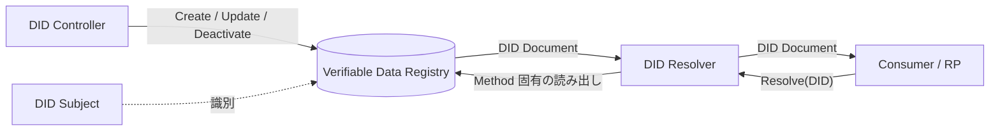
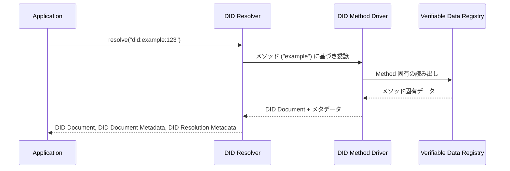

# W3C DID Core 1.0 - Decentralized Identifiers

## 概要

Decentralized Identifiers (DIDs) v1.0 は、W3C が 2022 年 7 月 19 日に勧告 (Recommendation) として発行した分散型識別子の中核仕様である。中央登録機関に依存することなくグローバルに一意かつ永続的な識別子を生成・解決するための共通データモデルと URL 構文を定義する。

DID は Verifiable Credentials (VC) Data Model など W3C の分散型アイデンティティスタックの基盤を成しており、発行者・所持者・検証者を識別する共通のプリミティブとして利用される。本仕様自体は具体的な解決方式は規定せず、DID Method と呼ばれる別仕様群に委ねる枠組みを提供する点が大きな特徴である。

## 解決する課題

従来のグローバル識別子 (URL, メールアドレス, DNS 名, X.509 Subject DN など) には、以下の構造的な課題が存在する。

- 発行・登録に中央機関 (ICANN、CA、各種ディレクトリ) が必要で、停止・剥奪のリスクを Subject が制御できない
- 識別子と公開鍵が分離しており、識別子からそのまま暗号的に制御を証明できない
- 識別子のライフサイクル (回転・失効・更新) を Subject 自身が制御する標準的手段がない

DID はこれらに対し、以下の特徴を持つ新たな URI スキームを提供する。

- 暗号鍵により制御が証明できる
- 解決方式が DID Method としてプラガブルに定義され、ブロックチェーン・分散台帳・Web・ピアツーピア交換など多様な Verifiable Data Registry に対応する
- 識別子に対応する DID Document に検証メソッドやサービスエンドポイントを記述でき、認証や暗号化通信、サービス発見を Subject 主導で構成できる

## 主要概念・用語

| 用語                     | 定義                                                                                 |
| ------------------------ | ------------------------------------------------------------------------------------ |
| DID                      | グローバルに一意で永続的な識別子。`did:` スキームを持つ URI                          |
| DID Subject              | DID によって識別されるエンティティ。人・組織・物・論理的対象など                     |
| DID Controller           | DID Document を変更する権限を持つエンティティ                                        |
| DID Document             | DID に関連付けられた情報の集合。検証メソッドやサービスを含む                         |
| DID Method               | 特定の DID スキームに対する Create / Read / Update / Deactivate の方法を定義する仕様 |
| DID URL                  | DID を基底とし、パス・クエリ・フラグメントを伴う URL                                 |
| Verifiable Data Registry | DID と DID Document を記録・配布する基盤システム                                     |
| DID Resolution           | DID から DID Document を取得するプロセス                                             |
| DID URL Dereferencing    | DID URL から DID Document 内部のリソース、または外部リソースを取得するプロセス       |

## アーキテクチャ

DID を巡る主要アクターとデータの流れは次のとおりである。



DID Subject と DID Controller は同一エンティティの場合も別エンティティの場合もある。Verifiable Data Registry は分散台帳に限らず、HTTPS サーバ (例: `did:web`) や鍵から自己生成される静的データ (例: `did:key`) も含む抽象概念である。

## DID 構文

DID は次の ABNF で定義される。

```
did                = "did:" method-name ":" method-specific-id
method-name        = 1*method-char
method-char        = %x61-7A / DIGIT
method-specific-id = *( *idchar ":" ) 1*idchar
idchar             = ALPHA / DIGIT / "." / "-" / "_" / pct-encoded
```

- スキームは小文字固定の `did:`
- メソッド名は小文字 ASCII と数字のみ。例: `web`, `key`, `ion`, `ethr`
- メソッド固有識別子は `:` で区切ったセグメントを複数含めることが許される

### 例

```
did:example:123456789abcdefghi
did:web:example.com:users:alice
did:key:z6MkpTHR8VNsBxYAAWHut2Geadd9jSwuBV8xRoAnwWsdvktH
```

## DID URL 構文

DID URL は DID にパス・クエリ・フラグメントを付加した URI である。

```
did-url = did path-abempty [ "?" query ] [ "#" fragment ]
```

クエリパラメータには仕様で予約されたものがあり、代表例は以下の通り。

| パラメータ    | 意味                                       |
| ------------- | ------------------------------------------ |
| `service`     | DID Document 内の service id を指定する    |
| `relativeRef` | サービスエンドポイント基底に対する相対参照 |
| `versionId`   | DID Document の特定バージョン ID           |
| `versionTime` | 指定時刻時点の DID Document                |
| `hl`          | リソースのハッシュリンク                   |

フラグメントは DID Document 内のリソース (検証メソッドやサービス) を識別する。例えば `did:example:123#keys-1` は同一ドキュメント内の `id` が `did:example:123#keys-1` の検証メソッドを指す。

## DID Document の構造

DID Document は中核データモデルとして定義され、JSON 表現 (`application/did+json`) と JSON-LD 表現 (`application/did+ld+json`) の双方が用意されている。両表現は決定論的かつ可逆に変換可能である必要がある。

### 主要プロパティ

| プロパティ             | 必須 | 概要                                      |
| ---------------------- | :--: | ----------------------------------------- |
| `id`                   | 必須 | DID Subject を識別する DID                |
| `controller`           | 任意 | この DID Document を制御する DID (の集合) |
| `alsoKnownAs`          | 任意 | 同一 Subject を指す他の識別子             |
| `verificationMethod`   | 任意 | 公開鍵などの検証材料の集合                |
| `authentication`       | 任意 | 認証目的で利用する検証メソッド            |
| `assertionMethod`      | 任意 | アサーション (VC 発行など) 用検証メソッド |
| `keyAgreement`         | 任意 | 鍵共有・暗号化用検証メソッド              |
| `capabilityInvocation` | 任意 | 権限呼び出し用検証メソッド                |
| `capabilityDelegation` | 任意 | 権限委譲用検証メソッド                    |
| `service`              | 任意 | サービスエンドポイントの集合              |

### Verification Method

各検証メソッドは少なくとも以下を含む。

- `id`: DID URL
- `type`: 検証メソッドのタイプ (DID Specification Registries に登録された識別子)
- `controller`: この鍵の制御者を表す DID
- 公開鍵: `publicKeyJwk` (RFC 7517 の JWK) または `publicKeyMultibase` (Multibase 符号化)

`publicKeyJwk` と `publicKeyMultibase` を同一エントリ内で同時に指定することは禁止される。

検証関係 (Verification Relationship) を表す `authentication` などの各プロパティでは、`verificationMethod` 内のエントリを DID URL で参照するか、その場に検証メソッドオブジェクトを埋め込むことができる。これにより「同じ鍵で複数の用途を許可する」ことや「用途ごとに別の鍵を割り当てる」ことが柔軟に表現できる。

### Service

サービスエンドポイントは次の必須プロパティを持つ。

- `id`: URI
- `type`: サービスタイプ (文字列または文字列セット)
- `serviceEndpoint`: 文字列 (URL)、マップ、または集合

複数の URL や複雑な構成 (例: 暗号化メッセージング用の複数中継点) を表現できるよう、`serviceEndpoint` は集合・マップ表現が許容されている。

### DID Document 例 (JSON-LD)

```json
{
  "@context": ["https://www.w3.org/ns/did/v1", "https://w3id.org/security/suites/jws-2020/v1"],
  "id": "did:example:123456789abcdefghi",
  "verificationMethod": [
    {
      "id": "did:example:123456789abcdefghi#keys-1",
      "type": "JsonWebKey2020",
      "controller": "did:example:123456789abcdefghi",
      "publicKeyJwk": {
        "kty": "OKP",
        "crv": "Ed25519",
        "x": "11qYAYKxCrfVS_7TyWQHOg7hcvPapiMlrwIaaPcHURo"
      }
    }
  ],
  "authentication": ["did:example:123456789abcdefghi#keys-1"],
  "assertionMethod": ["did:example:123456789abcdefghi#keys-1"],
  "service": [
    {
      "id": "did:example:123456789abcdefghi#vcs",
      "type": "VerifiableCredentialService",
      "serviceEndpoint": "https://example.com/vc/"
    }
  ]
}
```

## DID Resolution と Dereferencing

DID Core はアーキテクチャ的な抽象インタフェースとして `resolve` と `dereference` を定義する。具体的な解決手順は DID Method 仕様および別仕様の DID Resolution が規定する。



`resolve` は DID Document 全体とメタデータを返すのに対し、`dereference` は DID URL のパス・クエリ・フラグメントを解釈し、ドキュメント内部のリソース (例: 個別の検証メソッド) や外部リソース (例: `service` で示されたエンドポイントの先) を返す点が異なる。

返却値には次の二種類のメタデータが付随する。

- DID Document Metadata: `created`, `updated`, `deactivated`, `versionId` など Subject のライフサイクル情報
- DID Resolution Metadata: `contentType`, `error` など解決処理に関する情報

## DID Method

DID Method 仕様は、特定の `method-name` について以下の操作を定義する責務を負う。

- Create: DID と初期 DID Document を生成する
- Read (Resolution): DID から DID Document を取得する
- Update: DID Document を変更する
- Deactivate: DID を以後利用できない状態にする

代表的な DID Method の例として以下がある (いずれも別仕様)。

- `did:web`: ドメイン名と HTTPS を Verifiable Data Registry とする。`did:web:example.com:alice` の DID Document は概ね `https://example.com/alice/did.json` から取得される
- `did:key`: 公開鍵自体を識別子に符号化することで Registry を持たず自己解決可能
- 分散台帳ベース: `did:ion`, `did:ethr`, `did:indy` など

各 Method は鍵管理、コスト、ガバナンス、プライバシー特性が大きく異なるため、ユースケースに応じた選定が必要である。

## 表現 (Representation) と相互変換

DID Document は中核データモデルとして抽象的に定義され、複数の表現形式を持つ。

| 表現    | Media Type                | 特徴                                  |
| ------- | ------------------------- | ------------------------------------- |
| JSON    | `application/did+json`    | 軽量。`@context` を持たない           |
| JSON-LD | `application/did+ld+json` | `@context` を持ち、意味論的拡張が可能 |
| CBOR    | (登録時)                  | バイナリ表現                          |

Producer (DID Document を生成する側) と Consumer (利用する側) は、表現間で決定論的・可逆・無損失に変換できるよう規格に従う。これにより、JSON-LD で配布されたドキュメントを Plain JSON として処理することも、その逆も可能となる。

## 拡張機構: DID Specification Registries

検証メソッドのタイプ、サービスのタイプ、DID Method 名、DID URL のパラメータなどはすべて DID Specification Registries に登録することが推奨される。これにより、独立した実装間でも識別子の衝突なく相互運用が確保される。

## セキュリティに関する考慮事項

DID Core は以下のセキュリティ上の論点を整理している。

- Resolver の信頼性: 誤った Resolver は誤った DID Document を返しうる。利用者はメソッドごとのセキュリティモデルを理解する必要がある
- 鍵管理: 鍵のローテーション・失効・喪失への備えはメソッドおよびコントローラの責務
- 認証エンドポイント保護: `authentication` 等の検証関係に登録された鍵の保護
- 否認防止: 過去の DID Document バージョン (`versionId`, `versionTime`) を検証可能にすること
- DID 相関リスク: 識別子間の連結により Subject が追跡される可能性

## プライバシーに関する考慮事項

- 個人データの最小化 (DID Document には個人を直接識別する情報を含めないこと)
- DID 相関攻撃の緩和 (用途ごとに別 DID を発行する Pairwise DID パターン)
- サービスエンドポイントのメタデータ漏洩抑制
- Herd Privacy (匿名集合) の活用
- 解決時のリクエストパターンから Subject を特定されないための配慮

## 関連仕様

- [W3C Verifiable Credentials Data Model 1.1 / 2.0](https://www.w3.org/TR/vc-data-model/): DID を発行者・所持者・主体の識別子として利用するクレデンシャル仕様
- [DID Resolution](https://w3c-ccg.github.io/did-resolution/): `resolve` / `dereference` の具体的なインタフェース定義
- [DID Specification Registries](https://www.w3.org/TR/did-spec-registries/): 拡張ポイントの登録レジストリ
- [RFC 7517 JSON Web Key](./rfc7517.md): `publicKeyJwk` 表現の基礎
- 各種 DID Method 仕様 (`did:web`, `did:key`, `did:ion` 等)

## 参考文献

- W3C, "Decentralized Identifiers (DIDs) v1.0", W3C Recommendation, 19 July 2022. <https://www.w3.org/TR/did-core/>
- W3C, "DID Specification Registries", W3C Working Group Note. <https://www.w3.org/TR/did-spec-registries/>
- W3C CCG, "Decentralized Identifier Resolution (DID Resolution) v0.3". <https://w3c-ccg.github.io/did-resolution/>
