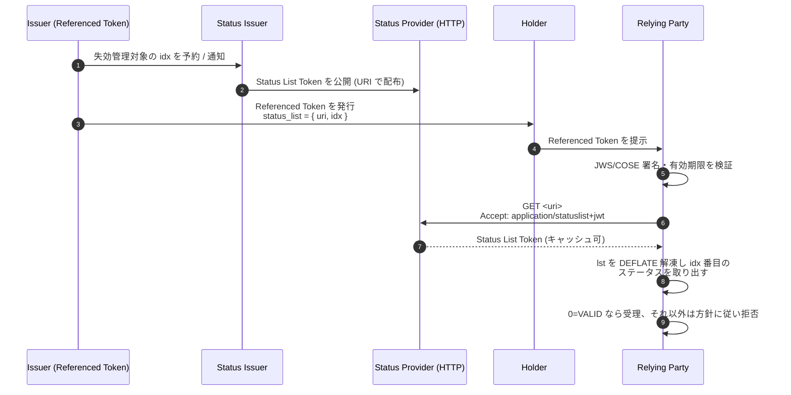
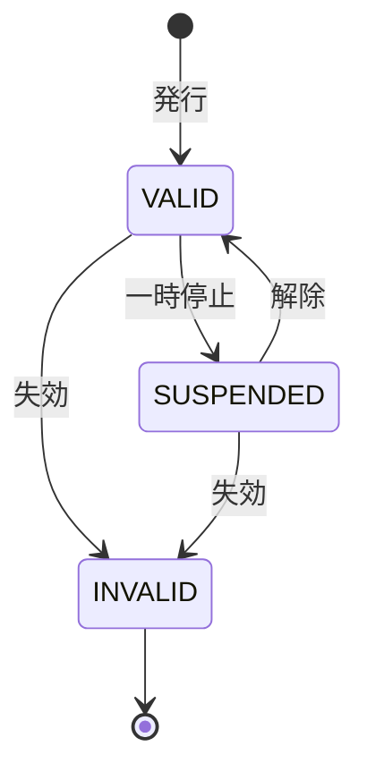
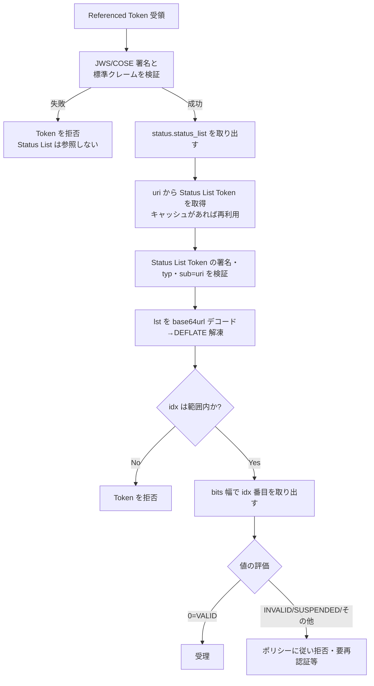

# OAuth Token Status List (draft-ietf-oauth-status-list)

## 1. 概要

OAuth Token Status List (以下 Token Status List, TSL) は、JWT・CWT・SD-JWT・ISO mdoc などの「Referenced Token」と呼ばれる暗号学的に保護されたトークン群について、その有効性 (valid / invalid / suspended など) を集約管理するためのデータ構造と配布メカニズムを定義する IETF OAuth WG の Internet-Draft である。本稿執筆時点 (2026 年 5 月) の最新版は `draft-ietf-oauth-status-list-20` (2026 年 4 月 20 日付) で、IESG 投票 (AD Followup) 段階にあり、Proposed Standard としての RFC 化が間近に控えている。

TSL の中心的な発想は、個々のトークンの状態を Issuer に問い合わせるのではなく、多数のトークンの状態を 1 ビットや 2 ビットといった極めて小さな単位で詰め込んだ「Status List」を圧縮して 1 ファイルとして公開し、Relying Party がこれをまとめて取得してインデックスを引くというものである。これにより、

- OCSP 的な「1 トークンごとの問い合わせ」で発生する Issuer 側からの観測 (どの Relying Party がどのトークンを検証中か) を回避し、
- CRL のように肥大化しがちなリストを高密度ビット表現と DEFLATE 圧縮で抑え、
- HTTP キャッシュとの相性を保ったまま大量の Verifiable Credential を扱う、

ことが可能になる。SD-JWT VC や OpenID for Verifiable Credential Issuance / Presentation のクレデンシャル失効・一時停止メカニズムとして直接参照されており、EUDI Wallet をはじめとするデジタル ID ウォレット領域における事実上の標準失効方式となりつつある。

## 2. 解決する課題

従来のクライアント証明書・ID クレデンシャルの失効方式には次の課題があった。

- **CRL のスケーラビリティ**: 全失効エントリを列挙する CRL は、発行数が増えるほど線形に肥大化し、配布コストが膨らむ。
- **OCSP の Issuer 観測性**: トークン単位で Issuer に問い合わせる OCSP は、Issuer から見て「どのトークンが、どのタイミングで、どの Relying Party から検証されたか」が露見しやすく、利用者プライバシーに関する深刻なリスクを抱える。
- **ウォレット型クレデンシャルとの不整合**: Verifiable Credential はオフライン提示や HTTP キャッシュ前提のユースケースが多く、毎回 Issuer に問い合わせる OCSP 的モデルとは噛み合わない。
- **状態の多値性**: 単純な「失効 / 有効」だけでなく、「一時停止 (suspended)」など複数値を扱いたい運用要件が増えている。

TSL は次の三点でこれらを解く。

- 多数のトークン状態を **ビットパック + DEFLATE 圧縮** した Status List として 1 ファイルにまとめ、Relying Party がまとめてキャッシュする。
- Referenced Token に **`status_list` クレーム (uri + idx)** を埋め込み、Relying Party が「どのリストの何番目」を見ればよいかを直接示す。
- 状態値を **1/2/4/8 ビット** から選べる設計とし、VALID / INVALID / SUSPENDED など多値の状態と将来の拡張余地を確保する。

## 3. 主要概念・用語

| 用語              | 説明                                                                                                                                 |
| ----------------- | ------------------------------------------------------------------------------------------------------------------------------------ |
| Referenced Token  | TSL によって状態管理される、JOSE/COSE で保護されたトークン (JWT・SD-JWT・CWT・ISO mdoc 等)。`status` クレームに `status_list` を含む |
| Status List       | Referenced Token 群の状態を 1/2/4/8 ビット単位で並べたバイト列。DEFLATE (zlib) で圧縮して配布する                                    |
| Status List Token | Status List を `status_list` クレームとして含み、Status Issuer が署名する JWT または CWT                                             |
| Status Issuer     | Status List Token を発行・署名する主体。Referenced Token の Issuer と同一でもよいし、別主体に委任してもよい                          |
| Status Provider   | Status List Token を HTTP で配布する主体。Status Issuer と同一であることが多いが、CDN 等への委譲も想定される                         |
| Relying Party     | Referenced Token を検証し、Status List Token を取得して該当インデックスのビットを評価する側                                          |
| Status Type       | Status List 内の各エントリが取り得る値。0=VALID, 1=INVALID, 2=SUSPENDED, 3 および 0x0C-0x0F = アプリケーション固有                   |

## 4. プロトコルフロー / メカニズム

### 4.1 発行から検証までの全体像



### 4.2 失効・一時停止の状態遷移



INVALID は終端状態として運用されることが多いが、仕様自体は遷移を禁じておらず、運用ポリシーで定義する。

## 5. 詳細解説

### 5.1 Status List のビットパック

Status List は「`8 / bits` 個のステータスが 1 バイトに収まる」というルールでパックされる。`bits` は 1, 2, 4, 8 のいずれか。例えば `bits = 1` の場合、16 トークン分の状態は 2 バイトで表現できる。

ビット順序は **LSB ファースト (右側から)** で、

- index 0 → byte 0 のビット 0
- index 7 → byte 0 のビット 7
- index 8 → byte 1 のビット 0

の順に詰める。`bits = 2` であれば、index 0 は byte 0 の下位 2 ビット、index 1 は byte 0 のビット 2-3、というように、1 バイトに 4 ステータスが収まる。

この生バイト列を DEFLATE (RFC 1951) / ZLIB (RFC 1950) で圧縮し、base64url で符号化したものを `status_list.lst` に格納する。VALID (=0) が支配的なケースで極めて高圧縮が効くため、数百万エントリでも実用的なサイズに収まる。

### 5.2 Status List Token (JWT 形式)

JWT 形式の Status List Token は次の構造を持つ。

```json
{
  "typ": "statuslist+jwt",
  "alg": "ES256",
  "kid": "12"
}
.
{
  "iss": "https://example.com",
  "sub": "https://example.com/statuslists/1",
  "iat": 1716460000,
  "exp": 1716546400,
  "ttl": 43200,
  "status_list": {
    "bits": 1,
    "lst": "eNrbuRgAAhcBXQ"
  }
}
```

- **`typ` ヘッダ** は `statuslist+jwt` でなければならない。これにより JWT の用途取り違え (cross-JWT confusion) を防ぐ。
- **`sub`** は Referenced Token 側の `status_list.uri` と完全一致しなければならない。これにより「別の URI で配布されている Status List Token を流用して同じインデックスを引かせる」攻撃を防ぐ。
- **`iat`** は必須。`exp` と `ttl` は推奨。`ttl` は秒単位のキャッシュ寿命を表し、HTTP の `Cache-Control` ヘッダより優先される。
- **`status_list.bits`** は 1 / 2 / 4 / 8 のいずれか。
- **`status_list.lst`** は DEFLATE 圧縮済みバイト列の base64url。
- **`status_list.aggregation_uri`** は任意。後述の Status List Aggregation エンドポイントを示す。

CWT 形式では COSE_Sign1_Tagged / COSE_Mac0_Tagged を用い、Content Type は `application/statuslist+cwt`。クレームは数値キーで表現し、`sub` = 2, `iat` = 6, `exp` = 4, `ttl` = 65534, `status_list` = 65533 を用いる。

### 5.3 Referenced Token 側の `status` クレーム

Referenced Token は自分の所在を Status List 上に明示するため、次のような `status` クレームを含む。

```json
{
  "iss": "https://issuer.example",
  "sub": "user-1234",
  "iat": 1716459000,
  "exp": 1719051000,
  "status": {
    "status_list": {
      "idx": 1024,
      "uri": "https://example.com/statuslists/1"
    }
  }
}
```

- `idx` は Status List 内のインデックス (0 オリジン)。
- `uri` は Status List Token を取得する HTTP エンドポイント。
- 同じ `status` クレームの中に、将来別方式 (例えば独自の状態指示) を併記する余地が残されている。

### 5.4 HTTP 配布とキャッシュ

Status Provider は `uri` で示された URL に対する HTTP GET に応答する。

```
GET /statuslists/1 HTTP/1.1
Host: example.com
Accept: application/statuslist+jwt
```

レスポンスは `Content-Type: application/statuslist+jwt` (もしくは `+cwt`) で Status List Token そのものを返す。仕様は「Relying Party は HTTP ヘッダより Status List Token 内の `exp` / `ttl` を優先してキャッシュ判断に用いなければならない」と定める。これにより、CDN のヘッダ書き換えに左右されず、Status Issuer が意図したキャッシュ寿命を厳守できる。

### 5.5 Status Types レジストリ

| 値          | 名前                   | 用途                                   |
| ----------- | ---------------------- | -------------------------------------- |
| 0x00        | VALID                  | 有効                                   |
| 0x01        | INVALID                | 失効。終端状態として扱われることが多い |
| 0x02        | SUSPENDED              | 一時停止。後で VALID に戻し得る        |
| 0x03        | (application-specific) | アプリケーション固有                   |
| 0x04 - 0x0B | 予約                   | 将来の IETF 拡張用                     |
| 0x0C - 0x0F | (application-specific) | アプリケーション固有                   |

ビット幅が 1 の場合は事実上 VALID / INVALID の 2 値しか扱えない。SUSPENDED やアプリケーション固有値を使う場合は `bits = 2` 以上を選ぶ必要がある。

### 5.6 Status List Aggregation

Issuer が複数の Status List Token を運用する場合、それらの URI を 1 つの JSON 文書に列挙して公開できる。

```json
{
  "status_lists": ["https://example.com/statuslists/1", "https://example.com/statuslists/2"]
}
```

エンドポイントは `status_list.aggregation_uri` または `.well-known/status-list-aggregation` で発見される。Relying Party はこれを定期取得することで、オフライン検証や事前ウォームアップに用いられる。

### 5.7 検証手順

Relying Party は次の順序で検証を行う。



仕様は「Referenced Token そのものの検証は、Status List の評価より必ず先行しなければならない」と明示する。署名や有効期限が破綻したトークンに対して Status List を引くべきではない。

## 6. セキュリティに関する考慮事項

- **インデックス計算の取り違え**: ビット幅とビット順序 (LSB ファースト) を実装者が誤ると、別トークンの状態を引いてしまう。仕様は「不正な実装は誤ったステータスを返し得る」と警告し、テストベクタによる検証を推奨する。
- **`sub` と `uri` の一致確認**: Status List Token の `sub` が Referenced Token の `uri` と一致しない場合、別リストの該当インデックスを流用される攻撃を許す。Relying Party は必ず一致を検証しなければならない。
- **`typ` ヘッダ強制**: `statuslist+jwt` 以外の JWT を Status List Token として誤って受け入れないようにする (JWT type confusion 対策、RFC 8725 の方針)。
- **鍵の対応関係**: Referenced Token Issuer と Status Issuer が同一なら同じ鍵を再利用してよいが、別主体なら CA 連鎖などで信頼関係を明示する必要がある。
- **インデックス範囲外**: `idx` がリスト長を超える場合、Referenced Token は拒否しなければならない (状態不明として扱ってはならない)。
- **改ざんと再生**: Status List Token は署名されているため改ざんは防げるが、古い Status List Token のリプレイによって「実は失効済みだが古いリストでは VALID」という状態を作り得る。`exp` / `ttl` を短めに設定することが防御策となる。

## 7. プライバシーに関する考慮事項

TSL の最大の特徴は **Herd Privacy (群集匿名性)** である。Status List Token は多数のトークンの状態をひとまとめにして配布するため、Status Provider のアクセスログからは「誰のトークンが検証されているか」を直接特定できない。一方で、次のような形で群集匿名性が破綻する可能性がある。

- **リスト粒度を細かくしすぎる**: 極端な話、トークンごとに別 URI / 別リストを発行すれば OCSP と等価になる。Issuer はリスト規模を一定以上に保つ必要がある。
- **`idx` の連番割当**: 発行順に `idx` を振ると、検証時のアクセスパターンや観測したトークンから他の Holder を推測できる。仕様は **ランダムなインデックス割当** を推奨する。
- **Relying Party 側のプロファイリング**: 同一 (uri, idx) を継続的に参照すれば、Relying Party がユーザを追跡できる。トークンの定期再発行やデコイエントリの利用が緩和策となる。
- **キャッシュの活用**: `ttl` を適切に設定し、Relying Party 側で Status List Token をキャッシュすれば、Status Provider への問い合わせ自体を減らせる。これも観測性低減に寄与する。

## 8. SD-JWT VC / OpenID4VC からの参照

`draft-ietf-oauth-sd-jwt-vc` は `status` クレームを OPTIONAL として定義し、本仕様 (`draft-ietf-oauth-status-list`) を直接参照する。`status` が含まれ、`status_list` メカニズムを用いる場合は **Status List Token は JWT 形式でなければならない** (CWT は不可) と明記される。検証ポリシーとしては「Verifier はステータスを確認すべきである (SHOULD)」とされ、最終的な受理判断は Verifier のポリシーに委ねられている。

OpenID4VCI / OpenID4VP も同様に、`status_list` メカニズムを Verifiable Credential の失効・一時停止の標準オプションとして取り込んでおり、EUDI Wallet 関連の HAIP プロファイル群でも採用が進んでいる。

## 9. 運用上の指針

- **リスト規模**: 群集匿名性のため、1 リストあたり数千〜数百万エントリ程度を目安にする。
- **ビット幅**: 失効のみで足りるなら `bits = 1` が最も圧縮効率が良い。SUSPENDED を扱うなら `bits = 2`。
- **再発行戦略**: 短命トークンを発行して再発行を前提とすれば、失効リストの肥大化と追跡可能性の双方を抑えられる。
- **キャッシュ寿命**: `ttl` を短く取れば失効反映が速くなるが Status Provider への負荷が増す。多くのウォレット運用では数分〜数時間が現実的な選択肢となる。
- **配布インフラ**: CDN との相性が良い (単一ファイル + 強い `ETag` / `Last-Modified` の挙動)。Status Provider を Issuer 本体と分離する構成は耐障害性の観点でも好ましい。

## 10. 関連仕様

- [RFC 9901 (SD-JWT)](./rfc9901.md) — Status List Token もペイロードが JWT であるため JOSE 一族の上に成り立つ。SD-JWT VC は `status` クレームでの参照経路。
- [SD-JWT VC (draft-ietf-oauth-sd-jwt-vc)](./sd-jwt-vc.md) — `status_list` メカニズムを Verifiable Credential 失効の主要手段として組み込んでいる。
- [OpenID for Verifiable Credential Issuance](./openid4vci.md) / [OpenID for Verifiable Presentations](./openid4vp.md) — VC ライフサイクル全体の中で失効/状態確認に TSL を参照する。
- [RFC 8725 (JWT BCP)](./rfc8725.md) — `typ` ヘッダの強制や cross-JWT confusion 回避など、Status List Token JWT の処理にもそのまま適用される指針。
- RFC 1950 (ZLIB) / RFC 1951 (DEFLATE) — Status List の圧縮形式。
- RFC 6960 (OCSP) / RFC 5280 (X.509 CRL) — TSL が代替しようとしている既存方式。プライバシーとスケーラビリティの観点で対比される。

## 11. 参考文献

- IETF OAuth WG, "OAuth Status List", `draft-ietf-oauth-status-list-20`, 2026-04-20. <https://datatracker.ietf.org/doc/html/draft-ietf-oauth-status-list-20>
- IETF Datatracker, "draft-ietf-oauth-status-list" (履歴). <https://datatracker.ietf.org/doc/draft-ietf-oauth-status-list/>
- IETF OAuth WG, "SD-JWT-based Verifiable Credentials", `draft-ietf-oauth-sd-jwt-vc`. <https://datatracker.ietf.org/doc/draft-ietf-oauth-sd-jwt-vc/>
- IANA, "JSON Web Token (JWT) Claims" レジストリ (`status`, `status_list`). <https://www.iana.org/assignments/jwt/>
- IANA, "Media Types" レジストリ (`application/statuslist+jwt`, `application/statuslist+cwt`). <https://www.iana.org/assignments/media-types/>
