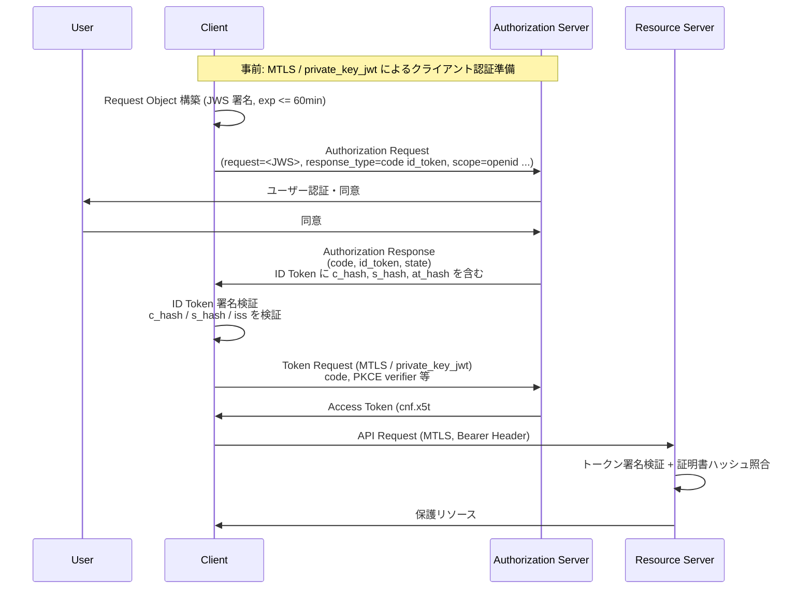
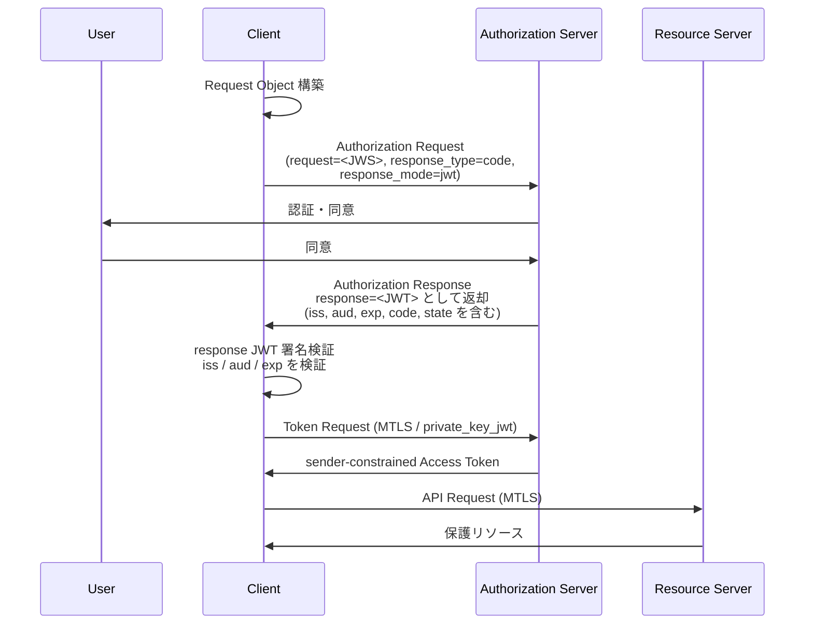

# FAPI 1.0 Part 2: Advanced

## 1. 概要

Financial-grade API Security Profile 1.0 - Part 2: Advanced（以下 FAPI 1.0 Advanced）は、OpenID Foundation の Financial-grade API Working Group が策定した、高リスク API を保護するための OAuth 2.0 / OpenID Connect セキュリティプロファイルである。

本プロファイルは Open Banking、決済、保険、医療といった高保証が要求されるユースケースを主な対象とし、英国 Open Banking、ブラジル Open Finance、オーストラリア Consumer Data Right (CDR) など世界各国の金融オープン API 規制で広く採用されている。Part 1: Baseline が中程度のリスク保護を担うのに対し、Advanced は「認可リクエスト/レスポンスの非否認性」と「送信者制約付きアクセストークン (sender-constrained access token)」を加えることで、より厳格な攻撃耐性を提供する。

FAPI 2.0 Security Profile が後継として登場した現在でも、FAPI 1.0 Advanced は既存の Open Banking エコシステムで現役の標準として位置付けられている。

## 2. 解決する課題

OAuth 2.0 と OpenID Connect の標準的なフローには、汎用の Web アプリケーション向けに策定された経緯から、金融グレードの API で許容できないレベルの残存リスクが存在する。FAPI 1.0 Advanced はこれらに対する具体的な対抗策をプロファイルとして規定する。

- **認可リクエストの改ざん**: クエリパラメータとして平文で渡される `scope`、`redirect_uri`、`client_id` 等が、ブラウザ拡張機能やネットワーク中継者により書き換えられる可能性
- **認可レスポンスの改ざん・コード差し込み (code injection)**: 攻撃者が取得した認可コードを正規ユーザーのブラウザ経由でクライアントに注入し、攻撃者のセッションを被害者にバインドする攻撃
- **state パラメータの注入**: state 値の改ざんによる CSRF 類似の攻撃
- **アクセストークンの窃取と再利用 (token phishing / replay)**: Bearer Token は所有者を問わず使えるため、漏洩した時点でリソースサーバから保護データを引き出せる
- **IdP mix-up 攻撃**: 複数の認可サーバを利用するクライアントに対し、攻撃者が制御する IdP から正規 IdP の認可コードを差し込む攻撃

FAPI 1.0 Advanced はこれらの脅威に対し、署名付き Request Object、Hybrid Flow または JARM、MTLS による Holder of Key、PKCE 等を組み合わせて多層的に対抗する。

## 3. 主要概念・用語

### Sender-Constrained Access Token

アクセストークンを「Bearer (持参人払い)」ではなく、特定の送信者 (クライアント) にバインドする方式。FAPI 1.0 Advanced では RFC 8705 で定義される Mutual TLS Certificate-Bound Access Token を採用し、トークン送出時のクライアント証明書とトークン発行時に紐付いた証明書ハッシュ (`cnf.x5t#S256`) を一致させることでリプレイ攻撃を防ぐ。

### Request Object

OpenID Connect Core Section 6 で定義される、認可リクエストパラメータを JWS で署名された JWT として渡す仕組み。FAPI 1.0 Advanced ではこれが必須となり、すべての認可リクエストパラメータは Request Object 内で送信されなければならない。

### ID Token as Detached Signature

Hybrid Flow (`response_type=code id_token`) で返される ID Token を、認可レスポンスの完全性検証用「分離署名」として利用する FAPI 独自の用法。`s_hash` クレーム (state のハッシュの左半分) を新規に定義し、`c_hash` (code のハッシュ) と組み合わせて authorization response の改ざん検出を行う。

### JARM (JWT Secured Authorization Response Mode)

認可レスポンス全体を署名付き JWT として返却する仕組み。FAPI 1.0 Advanced では Hybrid Flow の代替として `response_type=code` + `response_mode=jwt` の組み合わせで利用できる。

### Holder of Key

トークンの所持者がそのトークンに紐付く秘密鍵 (FAPI 1.0 Advanced では TLS クライアント証明書の秘密鍵) を保持していることを証明できる場合のみ、トークン利用を許可する原則。

## 4. プロトコルフロー

FAPI 1.0 Advanced で許可される認可フローは 2 種類存在する。

### 4.1 Hybrid Flow (`response_type=code id_token`)

Hybrid Flow では ID Token が「分離署名」として機能し、`c_hash` と `s_hash` を通じて認可レスポンス全体の完全性を検証する。クライアントは ID Token の `iss` を検証することで IdP mix-up 攻撃を検出できる。

### 4.2 JARM Flow (`response_type=code` + `response_mode=jwt`)

JARM ではレスポンス全体が JWT として返るため、`openid` スコープを要求しないユースケース (純粋な OAuth 2.0 API アクセス) でも完全性保護が可能となる。また、フロントチャネルにエンドユーザクレームを露出させないというプライバシー上の利点もある。

## 5. 詳細解説

### 5.1 Client への要件

- **Request Object 必須**: OpenID Connect Section 6 で定義される `request` パラメータ (または `request_uri`) で署名済み JWT を渡すこと。全パラメータを Request Object 内に含める
- **`exp` クレーム**: 60 分以内の有効期限を設定
- **`nbf` クレーム**: 必須。過去 60 分以内の値であること
- **`aud` クレーム**: 認可サーバの Issuer Identifier URL を設定
- **PAR 利用時の PKCE**: Pushed Authorization Requests を使用する場合は PKCE (`S256`) が必須
- **MTLS サポート**: クライアント認証および sender-constrained access token のために必須
- **ID Token 検証**: Hybrid Flow 時は `c_hash`、`s_hash`、`iss`、`at_hash` を必ず検証

### 5.2 Authorization Server への要件

- **許可される response_type**:
  - `code id_token` (Hybrid Flow)
  - `code` + `response_mode=jwt` (JARM)
- **Bearer Token 発行禁止**: sender-constrained access token のみ発行する
- **MTLS サポート必須**
- **許可されるクライアント認証方式**:
  - `tls_client_auth` (RFC 8705)
  - `self_signed_tls_client_auth` (RFC 8705)
  - `private_key_jwt`
- **機密クライアントのみサポート**: 公開クライアントは Advanced では非対応
- **Request Object 必須化**: 受信した認可リクエストは JWS 署名付き JWT で渡されたものに限り受理

### 5.3 Resource Server への要件

- Part 1 Baseline の要件をすべて満たすこと
- Bearer Token の受け入れ禁止
- sender-constrained access token のみ受け入れる
- MTLS の検証 (アクセストークンの `cnf.x5t#S256` と TLS クライアント証明書ハッシュの照合) を必須化

### 5.4 暗号アルゴリズム要件

| 種別           | 要件                                                      |
| -------------- | --------------------------------------------------------- |
| JWS 署名       | `PS256` または `ES256` 必須。`RS256` は非推奨             |
| JWS `alg=none` | 禁止                                                      |
| JWE            | `RSA1_5` 禁止                                             |
| RSA 鍵長       | 2048 ビット以上                                           |
| TLS バージョン | 1.2 以上。1.2 では指定された 4 種の cipher suite のみ許容 |
| DHE_RSA        | 最小 2048 ビット鍵長                                      |

### 5.5 `s_hash` クレーム

FAPI 1.0 Advanced が新規に定義した ID Token クレーム。`state` パラメータをハッシュ (ID Token 署名アルゴリズムに対応するハッシュ関数) し、その左半分を base64url エンコードした値を格納する。これにより、Hybrid Flow の認可レスポンスにおいて state の改ざんも検出可能となる。

### 5.6 Part 1 Baseline との比較

| 項目                     | Part 1 Baseline                            | Part 2 Advanced                                                           |
| ------------------------ | ------------------------------------------ | ------------------------------------------------------------------------- |
| 主な用途                 | 読み取り系 API (中リスク)                  | 書き込み系 API、決済等 (高リスク)                                         |
| Bearer Token             | 許容                                       | 禁止 (sender-constrained のみ)                                            |
| Request Object           | 任意                                       | 必須                                                                      |
| 認可レスポンス保護       | なし                                       | ID Token 分離署名 または JARM                                             |
| 認可サーバ認証           | OIDC Discovery 経由                        | 同左 + Request Object の `aud` で Issuer 検証                             |
| クライアント認証         | MTLS / private_key_jwt / client_secret_jwt | MTLS / private_key_jwt (client_secret_jwt 不可)                           |
| 許可される response_type | `code` 等                                  | `code id_token` または `code` + `response_mode=jwt`                       |
| 公開クライアント         | 許容 (推奨)                                | 非対応                                                                    |
| PKCE                     | S256 必須                                  | PAR 利用時は S256 必須 (基本フローでも非否認性は Request Object でカバー) |

## 6. セキュリティに関する考慮事項

仕様書では具体的な脅威と対抗措置がマッピングされている。

| 脅威                                    | FAPI 1.0 Advanced の対抗措置                                                  |
| --------------------------------------- | ----------------------------------------------------------------------------- |
| IdP mix-up 攻撃                         | Hybrid Flow の ID Token `iss` クレーム検証、または JARM の `iss` クレーム検証 |
| Authorization code phishing / injection | ID Token の `c_hash` 検証、MTLS による code-to-token binding                  |
| Access token phishing / replay          | Sender-constrained access token (MTLS Holder of Key)                          |
| Request パラメータ改ざん                | 署名済み JWT Request Object 必須化                                            |
| Response パラメータ改ざん               | ID Token 分離署名 (`c_hash`、`s_hash`) または JARM                            |
| state 注入                              | `s_hash` による state の完全性保護                                            |
| Session fixation                        | 認可プロセス中の特権操作禁止                                                  |

### TLS と鍵管理

- JWKS URI は TLS 経由でのみ配信されること
- 同一 `kid` で複数の鍵を持つことは非推奨
- 複数クライアント間での鍵共有は避けるべき
- `exp` の最長 60 分制限は鍵漏洩時の被害範囲を限定する目的

### 既知の限界

FAPI 1.0 Advanced は策定当時の脅威モデルに基づいており、後継の FAPI 2.0 Security Profile では PAR を必須化し、PKCE を全フローで必須化し、ID Token の分離署名や Hybrid Flow を廃止して `code` + PAR + PKCE + DPoP/MTLS というシンプルな構成に整理された。Advanced は複雑性が高く、実装ミスによる脆弱性が報告された事例もあるため、新規導入では FAPI 2.0 の利用が推奨される。

## 7. 関連仕様

- **FAPI 1.0 Part 1: Baseline**: 本プロファイルの前提となる基本セキュリティ要件
- **[FAPI 2.0 Security Profile](/specs/fapi-2_0-security-profile)**: 後継仕様。PAR と DPoP/MTLS を中心としたシンプルな構成
- **[FAPI 2.0 Attacker Model](/specs/fapi-2_0-attacker-model)**: FAPI 2.0 の脅威モデル分析
- **[RFC 6749](/specs/rfc6749)**: OAuth 2.0 Authorization Framework
- **[RFC 7636](/specs/rfc7636)**: Proof Key for Code Exchange (PKCE)
- **[RFC 8705](/specs/rfc8705)**: OAuth 2.0 Mutual-TLS Client Authentication and Certificate-Bound Access Tokens
- **[RFC 9101](/specs/rfc9101)**: JWT-Secured Authorization Request (JAR)
- **[RFC 9126](/specs/rfc9126)**: Pushed Authorization Requests (PAR)
- **[OpenID Connect Core](/specs/openid-connect-core)**: Hybrid Flow および Request Object の定義
- **JARM (JWT Secured Authorization Response Mode for OAuth 2.0)**: 認可レスポンスの JWT 化仕様

## 8. 参考文献

- [Financial-grade API Security Profile 1.0 - Part 2: Advanced](https://openid.net/specs/openid-financial-api-part-2-1_0.html)
- [Financial-grade API Security Profile 1.0 - Part 1: Baseline](https://openid.net/specs/openid-financial-api-part-1-1_0.html)
- [JWT Secured Authorization Response Mode for OAuth 2.0 (JARM)](https://openid.net/specs/oauth-v2-jarm.html)
- [OpenID Foundation - Financial-grade API Working Group](https://openid.net/wg/fapi/)
