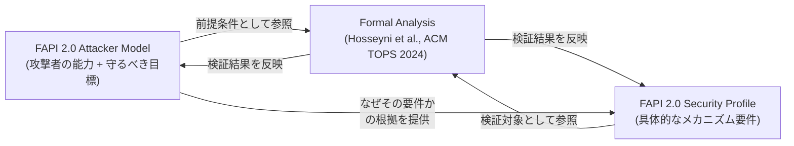
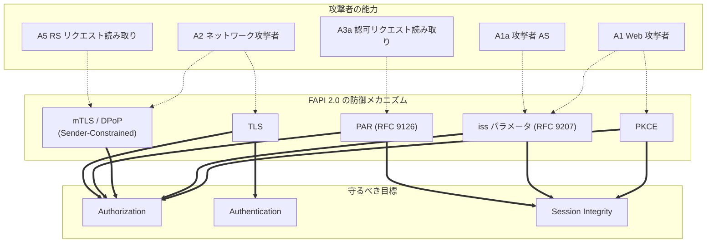
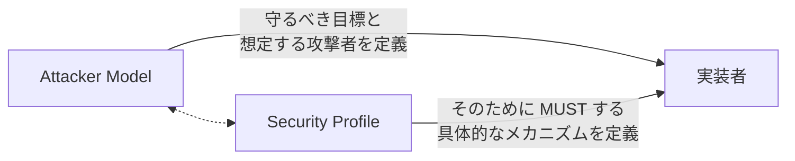

# FAPI 2.0 Attacker Model

## 概要

FAPI 2.0 Attacker Model は、OpenID Foundation の Financial-grade API (FAPI) Working Group が策定した、FAPI 2.0 系プロファイルの設計判断を支える脅威モデルおよび攻撃者モデル仕様である。2025 年 2 月 19 日に FAPI 2.0 Security Profile と同日付で Final として承認された (賛成 82 / 反対 0 / 棄権 14)。

Attacker Model は FAPI 2.0 Security Profile と表裏一体の関係にある。Security Profile が「実装者が従うべき規範」を定めるのに対し、Attacker Model は「なぜその規範が必要なのか」という根拠を、攻撃者の能力 (capabilities) とセキュリティ目標 (security goals) という二つの軸で形式化する。FAPI 2.0 ファミリーの大きな特徴は、この攻撃者モデルとプロファイルを組み合わせて形式手法による検証 (formal analysis) が行われており、定義された攻撃者に対してセキュリティ目標が達成されることが数学的に証明されている点である。

## 解決する課題

OAuth 2.0 / OpenID Connect の各仕様は、多くの場合「想定される脅威」と「その緩和策」を Security Considerations にテキストで列挙してきた (RFC 6819, RFC 8725, RFC 9700 など)。これらは個別の攻撃シナリオに対する経験則の集合であり、以下の課題があった。

- 攻撃者にどこまでの能力を仮定しているのかが暗黙的で、プロファイル間の前提が一致しない
- ある防御策が「どの攻撃者」「どの目標」のために必要なのかが追跡しにくい
- 新しい攻撃が発見されるたびに対症療法的な対策が積み重なり、全体像の把握が困難になる
- 形式検証を行う際の前提条件が標準化されていない

FAPI 2.0 Attacker Model は、攻撃者の能力をラベル付き (A1, A1a, A2, A3a, A4, A5) で明確に分類し、セキュリティ目標を Authorization / Authentication / Session Integrity の三つに整理することで、これらの課題に正面から取り組む。これにより、Security Profile に登場する各メカニズム (PAR, PKCE, mTLS, DPoP, `iss` レスポンスパラメータなど) が「どの攻撃者を想定し」「どの目標を守るために」要求されているかが明示的に対応付けられる。

## 主要概念・用語

### Security Goals（守るべきもの）

Attacker Model は守るべき性質を三つに分けて定義する。いずれも「攻撃者が ～できない」という否定形で表現される。

| 目標                               | 定義 (要旨)                                                                                      |
| ---------------------------------- | ------------------------------------------------------------------------------------------------ |
| Authorization                      | 攻撃者は、自身が正当に許可されたリソース以外のアクセストークンを取得・利用できない               |
| Authentication                     | 攻撃者は、他のユーザの ID Token を取得し、そのユーザになりすましてクライアントにログインできない |
| Session Integrity (Authentication) | 攻撃者は、ユーザを攻撃者のアイデンティティでログインさせることができない                         |
| Session Integrity (Authorization)  | 攻撃者は、ユーザに攻撃者のリソース (例: 攻撃者の銀行口座) を利用させることができない             |

Session Integrity は「セッションのすり替え」を捉える概念である。攻撃者がユーザのトークンを奪うのではなく、逆にユーザに攻撃者の文脈を押し付けるタイプの攻撃を扱う。

### Attacker Capabilities（攻撃者の能力）

Attacker Model はラベル付きの攻撃者を定義し、各能力をビルディングブロックのように積み上げていく。各攻撃者は前段の能力を継承する。

| ラベル | 概要                                                                                                                                                                                                                                                                             |
| ------ | -------------------------------------------------------------------------------------------------------------------------------------------------------------------------------------------------------------------------------------------------------------------------------- |
| A1     | Web 攻撃者。通常のインターネット利用者と同様にメッセージを送受信でき、プロトコルフローに参加でき、リンクを誰かに送りつけることができる。自身のエンドポイントの開発者ツールやプロキシは自由に使えるが、他者間の通信を傍受・改ざんすることはできず、知らない鍵による暗号は破れない |
| A1a    | A1 に加え、認可サーバ (Authorization Server) として正規にエコシステムに参加できる Web 攻撃者                                                                                                                                                                                     |
| A2     | ネットワーク攻撃者。ローグ Wi-Fi アクセスポイントのように、ネットワーク全体を制御し、メッセージの傍受・遮断・改ざんが可能。ただし鍵を持たない限り暗号は破れない                                                                                                                  |
| A3a    | A1 に加え、フロントチャネルの認可リクエストを読み取れる攻撃者。モバイル OS におけるカスタム URL スキームの登録、ブラウザ履歴経由の漏洩、認可サーバ上の XSS などを想定                                                                                                            |
| A4     | トークンエンドポイントへのリクエスト/レスポンスを読み取り改ざんできる攻撃者。FAPI 2.0 では結果として該当する攻撃が成立しないことが示されており、Security Profile 上は実質的に取り扱われない                                                                                      |
| A5     | A1 に加え、リソースサーバへのリクエストを読み取れる攻撃者 (能力は限定的)                                                                                                                                                                                                         |

### 形式検証 (Formal Analysis) との関係

Attacker Model は学術論文 [analysis.FAPI2] (Hosseyni, Küsters, Würtele らによる ACM TOPS 掲載の形式分析) を反映して定義されている。論文中の攻撃者番号と仕様中の番号は対応関係にあり (例: 論文の A5 → 仕様の A4、論文の A7 → 仕様の A5)、論文の A3b および A8 は「FAPI 2.0 のセキュリティ目標と整合しない」として削除されている。これにより、Attacker Model に書かれた攻撃者像と論文中の検証対象とが一致し、形式検証結果がそのまま Final 仕様にも適用できる。

## 全体像

Attacker Model は単独で使うものではなく、Security Profile と形式検証論文の三者で初めて意味を成す。Attacker Model が攻撃者の能力と守るべき目標を定義し、Security Profile がその達成手段を規定し、形式検証が両者の整合性を保証する、という構造である。

## 攻撃者の能力とプロファイル要件の対応

Attacker Model 自体は具体的な攻撃シナリオを列挙する仕様ではないが、各攻撃者から導かれる典型的な攻撃と、Security Profile がそれを封じるメカニズムには明確な対応がある。以下は代表的な対応関係を Attacker Model と Security Profile の記述から整理したものである。

| 攻撃者                                    | 想定される攻撃の例                                                        | Security Profile での主要対策                                                                |
| ----------------------------------------- | ------------------------------------------------------------------------- | -------------------------------------------------------------------------------------------- |
| A1 (Web 攻撃者)                           | 認可コード横取り、攻撃者クライアントへのコード注入、CSRF                  | PKCE による code 結合、`iss` レスポンスパラメータ (RFC 9207) によるミックスアップ防御        |
| A1a (悪意ある AS)                         | ミックスアップ攻撃 (複数 AS が混在する環境で攻撃者 AS の関与に気付かない) | `iss` レスポンスパラメータの必須化、PAR による request URI 化                                |
| A2 (ネットワーク攻撃者)                   | TLS は前提として崩れないが、平文通信は完全に支配される                    | TLS の必須化、Sender-Constrained Access Token (mTLS / DPoP) によるトークン窃取の無効化       |
| A3a (認可リクエスト読み取り)              | カスタムスキームでのリクエスト傍受、ブラウザ履歴・XSS 経由の漏洩          | PAR による認可リクエストのバックチャネル送付、リクエストオブジェクトの認可サーバへの先行登録 |
| A5 (リソースサーバ向けリクエスト読み取り) | リソースサーバに送られたアクセストークンの再利用                          | Sender-Constrained Access Token により、トークン単体では使えない構造に                       |

A4 (トークンエンドポイントの読み取り・改ざん) は、Sender-Constrained Access Token と TLS により実質的に有意な攻撃が成立しないとされ、Security Profile では明示的な対策の対象には含まれない。

## 詳細解説

### Web 攻撃者と Network 攻撃者の違い

A1 と A2 の区別は重要である。A1 はあくまで正規の通信参加者として振る舞う攻撃者であり、たとえばユーザに悪意あるリンクを踏ませる、自分自身が攻撃者クライアントとして登録する、自分が制御する RP に他人のコードを注入させようとする、といった行為を想定する。これに対し A2 はネットワーク経路上に位置し、他者間の通信を直接傍受・改ざんできる。

このため、A1 だけを想定するプロファイルでは TLS 終端後の内部通信や正規の HTTPS 経路は信頼してよいが、A2 まで想定する場合は経路上の任意のホップが敵対的になり得る前提で設計する必要がある。FAPI 2.0 は A2 をスコープに含むため、TLS は不可欠であり、かつ TLS が破られない (出スコープ) という仮定の上に成立する。

### A1a の含意 — Mix-up 攻撃

A1a は「攻撃者自身が認可サーバとしてエコシステムに参加する」能力を持つ攻撃者である。複数の認可サーバを切り替えて利用するクライアント (例: 銀行 A の AS と銀行 B の AS の両方をサポートする家計簿アプリ) において、ユーザが攻撃者 AS で認可を開始し、得られたコードを正規 AS のトークンエンドポイントに送られるよう仕向けるミックスアップ攻撃が代表的な脅威である。

FAPI 2.0 Security Profile はこれに対して、認可レスポンスに `iss` パラメータ (RFC 9207) を必須で含めることを要求し、クライアントが受け取ったレスポンスがどの AS から来たものかを検証できるようにすることで対処している。

### A3a の含意 — 認可リクエストの漏洩

A3a は「フロントチャネル経由の認可リクエストを読み取れる」攻撃者である。これはとくにモバイル環境で重要で、カスタム URL スキームをアプリ間で取り合うような状況、ブラウザ履歴に残ったクエリ文字列、認可サーバ側に存在する XSS などを通じて、認可リクエストの内容が漏れるシナリオを指す。

認可リクエストには `client_id`, `scope`, `redirect_uri`, `state`, `code_challenge` などの情報が含まれ、これらが漏洩すると認可リクエストの差し替えや、後続レスポンスの解釈における攻撃の起点となり得る。FAPI 2.0 はこれに対して PAR (Pushed Authorization Requests, RFC 9126) を必須化し、認可リクエストをバックチャネルで AS に事前登録した上で、フロントチャネルには短命な `request_uri` のみを流す構造を採用する。

### A5 の含意 — リソースサーバでのトークン露出

A5 は「リソースサーバへ送られたリクエストを読み取れる」攻撃者を表す。Bearer Token のみを使う伝統的な OAuth では、リクエストに含まれるアクセストークンを盗まれた瞬間に攻撃者が任意のリソースアクセスを行えてしまう。

FAPI 2.0 は Sender-Constrained Access Token (mTLS Client Certificate-Bound Token もしくは DPoP) を必須にすることで、たとえトークン文字列を奪われても、対応する鍵を持たない攻撃者は利用できない構造に変えている。これにより A5 の能力を持つ攻撃者を実質的に無力化している。

## 攻撃者と防御メカニズムの関係図

実線矢印は「メカニズムが目標達成に寄与する」、点線矢印は「攻撃者の能力を無力化する」関係を示す。

## Out of Scope（スコープ外）

Attacker Model は明示的にスコープ外を定義しており、これらは「形式分析の前提条件として正しく機能している」とみなされる。実装者はこれらを別途確保しなければ、FAPI 2.0 全体のセキュリティ保証は成立しない。

- **TLS の機密性・完全性**: TLS 接続が破られないことを前提とする。証明書検証の失敗や TLS バージョンのダウングレードはスコープ外
- **JWKS の運用**: 非侵害な当事者の鍵配布が正しく機能することを前提とする
- **エンドユーザ端末**: ブラウザやモバイル端末そのものが侵害されていないことを前提とする
- **ユーザ認証・本人確認**: ユーザ認証手段の強度、IdP におけるアイデンティティプルーフィング、クライアント側のセッション管理などはスコープ外

これらの前提は意図的なものであり、FAPI 2.0 はあくまで「OAuth プロトコル層」の堅牢性に責務を限定する。たとえばユーザ認証強度は OIDC IDA や WebAuthn など別仕様の責務であり、Attacker Model はそれらが正しく機能している前提に立つ。

## Security Profile との関係

Attacker Model と Security Profile は次のような分業関係にある。

Security Profile を読むだけでも実装は可能だが、「なぜ PKCE が MUST なのか」「なぜ Bearer Token ではなく Sender-Constrained が必要なのか」を理解するには Attacker Model が不可欠である。新たに拡張プロファイル (例: Grant Management, Message Signing) を策定する際にも、Attacker Model に立ち返って「どの攻撃者から守るのか」「どの目標を新たに追加するのか」を議論することで、プロファイルの一貫性が保たれる。

## セキュリティに関する考慮事項

Attacker Model 自体はメカニズムを規定するものではないが、利用上の注意点として以下が挙げられる。

- **スコープ外項目の重要性**: TLS や端末の安全性が崩れた瞬間に FAPI 2.0 全体の保証が失われる。デプロイメントレビューでは「Attacker Model がスコープ外と仮定する項目」を必ず別途検証する必要がある
- **新たな攻撃者の出現**: 想定外の能力を持つ攻撃者 (例: 量子計算機、サイドチャネル) が現れた場合、Attacker Model の更新と再形式検証が必要となる
- **能力の合成**: 実世界の攻撃者は A1 と A2 と A3a を同時に保有しうる。Attacker Model のラベルは「最小限の能力分解」であり、これらを合成した攻撃者に対しても Security Profile が堅牢であることを形式分析が示している
- **拡張プロファイルへの注意**: Grant Management API などの拡張プロファイルは追加の攻撃面を持ちうる。利用時には拡張仕様独自の Attacker Model 議論を確認すべきである

## 関連仕様

- [FAPI 2.0 Security Profile](./fapi-2_0-security-profile.md) — 本 Attacker Model が想定する攻撃者に対する具体的な防御要件を定める Final 仕様
- [RFC 6749 - The OAuth 2.0 Authorization Framework](./rfc6749.md) — 全ての出発点となる OAuth 2.0 のコア仕様
- [RFC 9126 - OAuth 2.0 Pushed Authorization Requests](./rfc9126.md) — A3a への対策として FAPI 2.0 が必須化する PAR
- [RFC 9207 - OAuth 2.0 Authorization Server Issuer Identification](./rfc9207.md) — A1a (Mix-up) への対策として必須化される `iss` レスポンスパラメータ
- [RFC 8705 - OAuth 2.0 Mutual-TLS Client Authentication and Certificate-Bound Access Tokens](./rfc8705.md) — Sender-Constrained Access Token の一実装
- [RFC 9449 - OAuth 2.0 Demonstrating Proof of Possession (DPoP)](./rfc9449.md) — Sender-Constrained Access Token のもう一つの実装
- [RFC 7636 - Proof Key for Code Exchange](./rfc7636.md) — A1 によるコード注入攻撃への対策
- [RFC 6819 - OAuth 2.0 Threat Model and Security Considerations](./rfc6819.md) — OAuth 2.0 全般の脅威モデル (テキストベース)
- [RFC 9700 - Best Current Practice for OAuth 2.0 Security](./rfc9700.md) — OAuth 2.0 のセキュリティベストプラクティス

## 参考文献

- [FAPI 2.0 Attacker Model (Final, 2025-02-19)](https://openid.net/specs/fapi-attacker-model-2_0-final.html)
- [FAPI 2.0 Security Profile (Final, 2025-02)](https://openid.net/specs/fapi-security-profile-2_0-final.html)
- [OpenID Foundation: FAPI 2.0 Security Profile and Attacker Model Final Specifications Approved](https://openid.net/fapi-2-security-profile-attacker-model-final-specifications-approved/)
- [Hosseyni, Küsters, Würtele: Formal Security Analysis of the OpenID FAPI 2.0 Family of Protocols (ACM TOPS, 2024)](https://dl.acm.org/doi/10.1145/3699716)
- [OpenID Foundation FAPI Working Group](https://openid.net/wg/fapi/)
