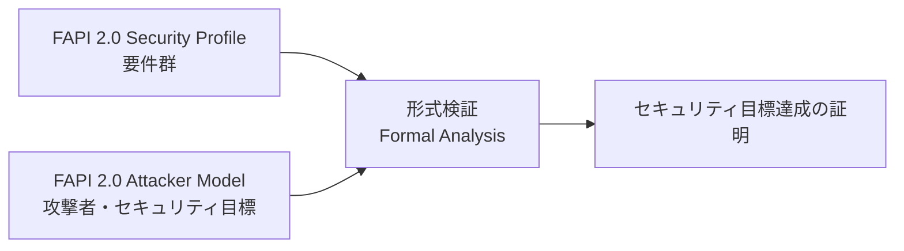

# FAPI 2.0 Security Profile

## 概要

FAPI 2.0 Security Profile は、OpenID Foundation の Financial-grade API (FAPI) Working Group が策定する、高保証が要求される API を OAuth 2.0 で保護するためのセキュリティプロファイルである。2025 年 2 月 22 日に Final として公開された。

FAPI は元々オープンバンキング (金融機関の API 公開) における高セキュリティ要件を満たす目的で生まれたプロファイルであるが、FAPI 2.0 では金融分野に限らず、保険、ヘルスケア、電子政府、ID ウォレットなど、強力な保証レベルが必要なあらゆる領域での適用が想定されている。

FAPI 2.0 は単独で意味を成すものではなく、Attacker Model (脅威モデル) と組み合わせて形式検証 (formal analysis) によりセキュリティ目標の充足を証明している点が大きな特徴である。

## 解決する課題

OAuth 2.0 Authorization Framework (RFC 6749) は柔軟性が高いがゆえに、選択肢の組み合わせによっては実装が脆弱になりやすい。特に金融 API のような高リスク領域では以下の課題があった。

- アクセストークンが Bearer Token であり、窃取されると誰でも利用できてしまう
- mix-up 攻撃、認可リクエストの改ざん、認可コードインジェクション等の既知の攻撃に対し、デフォルトで防御策が組み込まれていない
- 認可リクエストの完全性と機密性が保護されておらず、URL 長の制約や情報漏洩の懸念がある
- 多数の OAuth 拡張仕様 (PKCE, PAR, mTLS, DPoP 等) のうち、どの組み合わせを採用すべきか実装者が判断しにくい

FAPI 1.0 (Baseline / Advanced) はこれらに JAR / JARM / `code id_token` レスポンスタイプ等の組み合わせで対処したが、複雑であり、相互運用性や実装難易度に課題を残していた。FAPI 2.0 はシンプルで分析可能な単一プロファイルとして再設計された。

## 主要概念・用語

### Sender-Constrained Access Token

アクセストークンを「特定の送信者 (クライアント) のみが利用できる」よう暗号学的に紐付けたトークン。FAPI 2.0 では Bearer Token は禁止され、mTLS (RFC 8705) または DPoP (RFC 9449) による sender-constraining が必須となる。

### Pushed Authorization Request (PAR, RFC 9126)

クライアントが認可リクエストのパラメータを事前にバックチャネル経由で認可サーバーへ POST し、返却された `request_uri` を用いてフロントチャネルで認可エンドポイントへリダイレクトする方式。FAPI 2.0 では PAR の利用が必須化される。

### `iss` パラメータ (RFC 9207)

認可レスポンスに認可サーバーの発行者識別子 (`iss`) を含めることで、複数の認可サーバーを利用するクライアントが mix-up 攻撃で別の認可サーバーへ応答を送り込まれることを防ぐ仕組み。FAPI 2.0 では認可サーバーが必ず付与し、クライアントが必ず検証する。

### PKCE (RFC 7636) with S256

認可コードインターセプション攻撃を防ぐためのコードチャレンジ機構。FAPI 2.0 では `plain` メソッドは禁止され、`S256` のみ許可される。

### Attacker Model

FAPI 2.0 Security Profile と対をなす文書 `FAPI 2.0 Attacker Model` に定義された脅威モデル。プロファイルが想定する攻撃者の能力とセキュリティ目標を明示的に列挙し、プロファイルがこれらの目標を達成することを形式的に証明する基盤となる。

## プロトコルフロー

FAPI 2.0 における典型的な認可コードフローを以下に示す。

```mermaid
sequenceDiagram
    actor U as User (Browser)
    participant C as Client
    participant AS as Authorization Server
    participant RS as Resource Server

    Note over C,AS: 1. Pushed Authorization Request (PAR)
    C->>AS: POST /par (client_auth, code_challenge=S256, scope, redirect_uri, ...)
    AS-->>C: 201 Created { request_uri, expires_in }

    Note over U,AS: 2. 認可リクエスト (フロントチャネル)
    C->>U: 302 Redirect to /authorize?client_id=...&request_uri=...
    U->>AS: GET /authorize?client_id=...&request_uri=...
    AS->>U: ユーザー認証・同意画面
    U->>AS: 同意

    Note over U,C: 3. 認可レスポンス
    AS->>U: 302 Redirect to redirect_uri?code=...&iss=...
    U->>C: GET redirect_uri?code=...&iss=...
    C->>C: iss 検証 (mix-up 防御)

    Note over C,AS: 4. トークンリクエスト (Sender-Constrained)
    C->>AS: POST /token (code, code_verifier, client_auth, [mTLS / DPoP proof])
    AS-->>C: { access_token (mTLS or DPoP bound), ... }

    Note over C,RS: 5. リソースアクセス
    C->>RS: GET /resource (Authorization: ...; mTLS cert or DPoP proof)
    RS->>RS: トークン検証 + 送信者拘束検証
    RS-->>C: Protected Resource
```

## 詳細解説

### 認可サーバー要件 (5.3.2)

認可サーバーは以下を遵守しなければならない。

- `response_type` は `code` のみ許可する。`code id_token` などのハイブリッドフローは禁止
- 認可リクエストは必ず PAR 経由で受け付け、PAR を経由しないリクエストは拒否する
- PKCE を必須とし、`code_challenge_method` は `S256` のみ許可する
- 認可コードの最大有効期限は 60 秒
- 認可レスポンスに必ず `iss` パラメータを含める (RFC 9207)
- アクセストークンは必ず sender-constrained であり、mTLS (RFC 8705) または DPoP (RFC 9449) のいずれかで発行する
- リフレッシュトークンは通常の運用ではローテーションさせない (移行などの例外時のみ)
- クライアント認証は mTLS または `private_key_jwt` (RFC 7523) のみ許可する
- `private_key_jwt` の `aud` クレームには認可サーバーの issuer identifier を用いる
- 認可レスポンスを暗号化されていない接続で送信してはならない
- 認可サーバーメタデータ (RFC 8414) を公開し、TLS で配布する

### クライアント要件 (5.3.3)

クライアントは以下を遵守しなければならない。

- 認可リクエストは必ず PAR で送信する
- 認可エンドポイントへのリダイレクトには `client_id` と `request_uri` のみを含める (他のパラメータは PAR の本体に格納)
- 認可レスポンスの `iss` パラメータを必ず検証する
- PKCE の `code_verifier` を必ず送信する
- アクセストークンは sender-constrained 化する (mTLS クライアント証明書または DPoP 鍵を保持)
- 認可サーバーメタデータはディスカバリ文書から取得した値のみを利用する
- 必要最小限の `scope` のみを要求する (最小権限の原則)

### リソースサーバー要件 (5.3.4)

リソースサーバーは以下を遵守しなければならない。

- アクセストークンは HTTP の `Authorization` ヘッダ経由でのみ受け取る (クエリパラメータやボディは禁止)
- アクセストークンの有効性、完全性、有効期限、失効状態を検証する
- sender-constrained トークンの送信者拘束を必ず検証する (mTLS の場合は提示された TLS 証明書の thumbprint、DPoP の場合は DPoP proof の検証)

### 暗号要件 (5.4)

JWT を扱う場合は以下の制約を満たす。

- 署名アルゴリズムは `PS256`, `ES256`, `EdDSA` (Ed25519) のいずれかのみ
- `none` アルゴリズムの使用は禁止
- RSA 鍵は最低 2048 ビット
- 楕円曲線鍵は最低 224 ビット
- アクセストークン等の認証情報は最低 128 ビットのエントロピーを持って生成する

### FAPI 1.0 からの主な変更点 (5.5)

FAPI 2.0 は FAPI 1.0 Advanced を簡素化・強化したものであり、主な変更点は以下のとおり。

| 項目               | FAPI 1.0 Advanced          | FAPI 2.0                 | 変更の意図                                        |
| ------------------ | -------------------------- | ------------------------ | ------------------------------------------------- |
| 認可リクエスト保護 | JAR (RFC 9101)             | PAR (RFC 9126)           | 完全性保護に加え URL 長制限の解消と相互運用性向上 |
| 認可レスポンス     | JARM                       | コードのみ               | フロントチャネルでの情報露出を削減                |
| `response_type`    | `code id_token`            | `code`                   | フロントチャネルに ID トークンを流さない          |
| state 保護         | `s_hash` クレーム          | PKCE                     | PKCE に役割を統合                                 |
| 送信者拘束         | mTLS のみ                  | mTLS または DPoP         | クライアント証明書を持てない環境を許容            |
| 認可リクエスト構築 | リクエストオブジェクト署名 | PAR でバックチャネル送信 | 署名の管理コスト削減                              |

## Attacker Model との関係

FAPI 2.0 Security Profile は単独では完結せず、付随する `FAPI 2.0 Attacker Model` 文書と組で評価される。Attacker Model は以下の攻撃者カテゴリを定義する。

- **A1 Web 攻撃者**: インターネット上の任意のエンドポイントを制御し、ユーザーのブラウザから任意のリクエストを発生させる
- **A1a 認可サーバー攻撃者**: A1 に加え、エコシステム内の認可サーバーとして参加する
- **A2 ネットワーク攻撃者**: ネットワーク全体を制御 (不正 Wi-Fi など)、メッセージの傍受・改ざんが可能
- **A3a 認可エンドポイント攻撃者**: ブラウザから認可サーバーへのリクエストを読み取る
- **A5 リソースサーバー攻撃者**: 不正なリソースサーバーへのリクエストを読み取る

これに対し、FAPI 2.0 は次の 4 つのセキュリティ目標を満たす。

1. **認可**: 攻撃者は自分以外の保護リソースへアクセスできない
2. **認証**: 攻撃者は他ユーザーの身元でクライアントへログインできない
3. **セッション完全性 (認証)**: ユーザーは無自覚に攻撃者の身元でログインさせられない
4. **セッション完全性 (認可)**: ユーザーは無自覚に攻撃者のリソースを操作させられない

これらは形式検証ツールにより、上記攻撃者モデルの下で達成されることが証明されている。



## セキュリティに関する考慮事項

### sender-constraining の徹底

FAPI 2.0 の最大の特徴は Bearer Token を排し、すべてのアクセストークンを送信者拘束にする点である。リソースサーバーで送信者拘束の検証を怠ると、FAPI 2.0 の主要なセキュリティ保証が失われる。mTLS の場合は TLS 終端を行うリバースプロキシから証明書 thumbprint をどうリソースサーバーへ伝搬するか、DPoP の場合は DPoP proof の nonce 管理とリプレイ防止に注意が必要である。

### PAR と redirect_uri の取り扱い

FAPI 2.0 では `redirect_uri` を PAR の本体で送信する。これによりフロントチャネルから `redirect_uri` が消えるため、認可サーバー側で事前登録された URI セットとの照合は引き続き必須となる。HTTP スキームは禁止 (ネイティブクライアントのループバックは例外) であり、TLS の利用が前提である。

### リフレッシュトークン

FAPI 2.0 ではリフレッシュトークンのローテーション (発行のたびに古いトークンを失効) を「通常運用では行わない」と定めている点が独特である。これは並列リクエストや断続的なネットワーク状況下での競合を避けるためであり、代わりにリフレッシュトークン自身を sender-constrained にすることでセキュリティを担保している。

### 形式検証の前提

FAPI 2.0 のセキュリティ保証は Attacker Model に定義された範囲に限定される。例えば「デバイスやブラウザが侵害されていないこと」「TLS が破られていないこと」「エンドユーザー認証 (パスワード盗難等) が安全であること」は前提条件であり、これらが崩れた場合の保護は対象外である。実装者は別途これらの前提を維持するための施策 (フィッシング耐性認証、デバイス管理など) を講じる必要がある。

## 関連仕様

- **RFC 6749** OAuth 2.0 Authorization Framework — ベースとなる枠組み
- **RFC 7636** PKCE — `S256` を必須化
- **RFC 9126** OAuth 2.0 Pushed Authorization Requests — 認可リクエストの保護に必須化
- **RFC 9207** OAuth 2.0 Authorization Server Issuer Identification — `iss` パラメータの源流
- **RFC 8705** OAuth 2.0 Mutual-TLS Client Authentication and Certificate-Bound Access Tokens — sender-constraining の一方式
- **RFC 9449** OAuth 2.0 Demonstrating Proof of Possession (DPoP) — sender-constraining のもう一方式
- **RFC 7523** JSON Web Token (JWT) Profile for OAuth 2.0 Client Authentication — `private_key_jwt` の基盤
- **RFC 8414** OAuth 2.0 Authorization Server Metadata — メタデータディスカバリ
- **RFC 9700** OAuth 2.0 Security Best Current Practice — FAPI 2.0 と整合する一般的なベストプラクティス
- **FAPI 2.0 Attacker Model** — 本プロファイルと対になる脅威モデル
- **FAPI 2.0 Message Signing** — 認可リクエスト・レスポンス、トークンレスポンス等にエンドツーエンドの署名を追加する追加プロファイル

## 参考文献

- [FAPI 2.0 Security Profile (Final, 2025-02-22)](https://openid.net/specs/fapi-security-profile-2_0-final.html)
- [FAPI 2.0 Attacker Model (Final)](https://openid.net/specs/fapi-attacker-model-2_0-final.html)
- [OpenID Foundation FAPI Working Group](https://openid.net/wg/fapi/)
- [RFC 9126: OAuth 2.0 Pushed Authorization Requests](https://www.rfc-editor.org/rfc/rfc9126)
- [RFC 9207: OAuth 2.0 Authorization Server Issuer Identification](https://www.rfc-editor.org/rfc/rfc9207)
- [RFC 8705: OAuth 2.0 Mutual-TLS Client Authentication and Certificate-Bound Access Tokens](https://www.rfc-editor.org/rfc/rfc8705)
- [RFC 9449: OAuth 2.0 Demonstrating Proof of Possession (DPoP)](https://www.rfc-editor.org/rfc/rfc9449)
