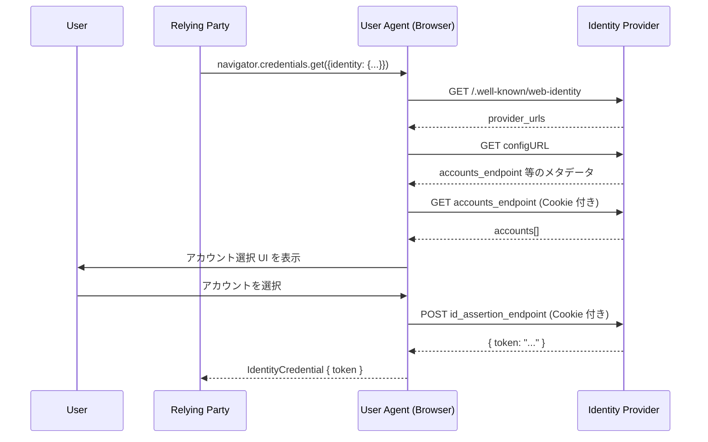

# W3C FedCM - Federated Credential Management API

## 1. 概要

FedCM (Federated Credential Management API) は、ブラウザがフェデレーション ID プロバイダ (IdP) と Relying Party (RP) の間を **仲介** することで、サードパーティ Cookie に依存せずに連合ログインを実現するための Web Platform API である。W3C の Federated Identity Working Group (FedID WG) が策定しており、現在は First Public Working Draft (FPWD, 2024 年 8 月 20 日公開) として標準化が進められている。

従来 OpenID Connect や SAML を用いた SSO は、IdP の Cookie をサードパーティコンテキストで利用することで成り立ってきた。しかし主要ブラウザがトラッキング保護のためサードパーティ Cookie を制限・廃止する方向に進んだ結果、暗黙的に IdP セッションを参照する仕組みが破綻しつつある。FedCM はこの問題に対し、ブラウザを「IdP と RP の仲介者」として明示的に位置付け、ユーザーの同意とプライバシーを保ちながら連合ログイン UX を再構築することを目的とする。

FedCM は ID トークンそのもののフォーマットを定義しない。既存の OpenID Connect ID Token や独自トークンを「不透明な文字列」として運ぶ薄いトランスポート層であり、既存のフェデレーション仕様 (OIDC, SAML 等) と組み合わせて使うことが想定されている。

## 2. 解決する課題

FedCM が解決を試みる主な課題は以下の通りである。

- **サードパーティ Cookie 廃止後の連合ログイン**: OIDC のフロントチャネル経由のフロー (例: implicit/redirect やセッション同期) はサードパーティ Cookie に依存することが多い。Cookie 制限環境では `prompt=none` による silent re-auth、ログアウト同期、アカウント選択画面のシームレスな表示などが機能しなくなる
- **IdP によるトラッキング防止**: 任意の RP に対して IdP がリクエストを送ることでユーザーを追跡できる従来モデルを、ブラウザ仲介によりユーザー同意ベースに置き換える
- **RP ↔ IdP 間の直接通信制限**: RP の JavaScript から IdP のレスポンスを直接観測させず、ブラウザが UI を通じてユーザー承認を得た上でのみトークンを RP に渡すことで、リダイレクトレスかつ最小限の情報開示を実現する
- **UX の統一**: ブラウザネイティブな同意 UI を提供することで、フィッシング耐性のあるフェデレーション ID 体験を提供する

## 3. 主要概念・用語

| 用語                    | 説明                                                                                              |
| ----------------------- | ------------------------------------------------------------------------------------------------- |
| RP (Relying Party)      | ユーザーをログインさせたい Web サイト                                                             |
| IdP (Identity Provider) | ユーザーのアカウントを保持する事業者 (例: Google, Microsoft, 自社 IdP)                            |
| User Agent              | API を実装し、IdP と RP の間を仲介するブラウザ                                                    |
| Config URL              | IdP の設定ファイル (JSON) を指す URL。RP は `configURL` でこれを指定する                          |
| Well-Known File         | `/.well-known/web-identity`。Config URL の正当性を検証するために IdP のオリジン直下に配置される   |
| Account                 | IdP に保持されたユーザーのアカウント。`id`, `name`, `email` 等のフィールドを持つ                  |
| ID Assertion            | IdP が発行する署名済みトークン。FedCM 自体はフォーマットを規定しない                              |
| Login Status            | IdP におけるユーザーのログイン状態を表すブラウザ側の状態 (`unknown` / `logged-in` / `logged-out`) |
| Passive Mode            | RP のページ読み込み等のタイミングで暗黙的に呼び出されるモード (旧 Widget Mode)                    |
| Active Mode             | ユーザー操作 (ボタンクリック等) を契機に呼び出されるモード (旧 Button Mode)                       |

## 4. プロトコルフロー

### 4.1 全体像

FedCM はブラウザが IdP の各種エンドポイントを呼び出し、ユーザーの同意を経てトークンを RP に返却するモデルである。



ポイントは以下の通り。

- 各 IdP 呼び出しは **ブラウザ自身** が行い、RP の JavaScript は HTTP リクエスト/レスポンスを直接観測できない
- アカウントエンドポイントへのリクエストには IdP オリジンの Cookie が同梱されるが、結果は RP ではなくブラウザの UI にのみ反映される
- RP が最終的に得るのは IdP が発行した不透明な `token` 文字列のみ

### 4.2 RP 側の API 呼び出し

```javascript
const credential = await navigator.credentials.get({
  identity: {
    providers: [
      {
        configURL: "https://idp.example/fedcm.json",
        clientId: "rp-client-id-123",
        nonce: "n-0S6_WzA2Mj",
        loginHint: "alice@example.com",
      },
    ],
  },
});

// credential は IdentityCredential
// credential.token に IdP が発行したトークン (例: OIDC ID Token) が入る
```

`IdentityProviderConfig` の主要フィールド:

| フィールド   | 必須 | 説明                                                      |
| ------------ | ---- | --------------------------------------------------------- |
| `configURL`  | 必須 | IdP 設定ファイルの URL                                    |
| `clientId`   | 必須 | IdP から RP に out-of-band で発行されたクライアント識別子 |
| `nonce`      | 任意 | リプレイ防止のため ID トークンに含めるノンス              |
| `loginHint`  | 任意 | 既知のログイン識別子。該当アカウントに UI をフィルタする  |
| `domainHint` | 任意 | ドメインヒント。`"any"` を指定すると複数ドメインを許容    |
| `fields`     | 任意 | 取得したいプロファイル属性の指定                          |
| `params`     | 任意 | id assertion エンドポイントに転送される追加パラメータ     |

### 4.3 IdP 側のエンドポイント

IdP は以下のエンドポイントを実装する必要がある。

```mermaid
graph TB
    A[/.well-known/web-identity] --> B[Config File]
    B --> C[accounts_endpoint]
    B --> D[id_assertion_endpoint]
    B --> E[client_metadata_endpoint]
    B --> F[login_url]
    B --> G[disconnect_endpoint]
```

#### Well-Known ファイル

IdP オリジン直下の `/.well-known/web-identity` に配置する。

```json
{
  "provider_urls": ["https://idp.example/fedcm.json"]
}
```

ここに列挙された URL のみが `configURL` として有効とみなされる。これにより、攻撃者が任意のパスに偽の config を置いて IdP を装うことを防ぐ。

#### Config ファイル

`configURL` で示される JSON ファイル。

```json
{
  "accounts_endpoint": "/fedcm/accounts",
  "client_metadata_endpoint": "/fedcm/client_metadata",
  "id_assertion_endpoint": "/fedcm/assertion",
  "login_url": "/fedcm/login",
  "disconnect_endpoint": "/fedcm/disconnect",
  "branding": {
    "background_color": "#0033cc",
    "color": "#ffffff",
    "icons": [{ "url": "https://idp.example/icon.png", "size": 32 }],
    "name": "Example ID"
  }
}
```

#### Accounts エンドポイント

IdP の Cookie 付き GET リクエストに対し、現在ログインしているユーザーのアカウント一覧を返す。

```json
{
  "accounts": [
    {
      "id": "1234",
      "name": "Alice Example",
      "email": "alice@example.com",
      "picture": "https://idp.example/alice.png",
      "approved_clients": ["rp-client-id-123"],
      "login_hints": ["alice@example.com"],
      "domain_hints": ["example.com"]
    }
  ]
}
```

各アカウントには少なくとも `email`, `name`, `tel`, `username` のいずれかが含まれる必要がある。`approved_clients` に RP の `clientId` が含まれていれば「再認証 (returning user)」として扱われ、UI が簡略化される。

#### ID Assertion エンドポイント

ユーザーがアカウントを選択した後、ブラウザがこのエンドポイントに対して POST する。

```
POST /fedcm/assertion
Content-Type: application/x-www-form-urlencoded
Sec-Fetch-Dest: webidentity
Origin: https://rp.example
Cookie: <IdP のセッション Cookie>

client_id=rp-client-id-123&nonce=n-0S6_WzA2Mj&account_id=1234&disclosure_text_shown=true&is_auto_selected=false
```

IdP は以下のような JSON を返す。

```json
{ "token": "eyJhbGciOi..." }
```

`token` の中身は IdP の裁量で、OpenID Connect の ID Token や独自フォーマットでもよい。ブラウザは中身を解釈せず、不透明文字列として RP に渡す。

#### Client Metadata エンドポイント

新規ユーザー向け同意 UI で表示する、RP のプライバシーポリシーや利用規約 URL を返す。

```json
{
  "privacy_policy_url": "https://rp.example/privacy",
  "terms_of_service_url": "https://rp.example/tos"
}
```

#### Login URL / Disconnect エンドポイント

- `login_url`: ユーザーが現在 IdP にログインしていない (または「他のアカウントでログイン」を選んだ) 場合に開かれるポップアップの URL
- `disconnect_endpoint`: `IdentityCredential.disconnect()` 呼び出しにより、RP-IdP-account の連携を解除する際に呼ばれる

## 5. 詳細解説

### 5.1 IdP Sign-In Status API

FedCM のプライバシー設計の中核として、ブラウザは IdP ごとに **Login Status** を保持する。状態は次の三つ。

- `unknown`: 不明 (初期状態)
- `logged-in`: ログイン中
- `logged-out`: ログアウト済み

`logged-out` の IdP に対しては、ブラウザは accounts エンドポイントを叩かない。これにより、ユーザーがログインしていない IdP にトラッキング目的でリクエストを送らせる経路を遮断する。

IdP は次のいずれかで状態を更新する。

- HTTP レスポンスヘッダ:
  ```
  Set-Login: logged-in
  Set-Login: logged-out
  ```
- JavaScript API (IdP オリジン上で実行):
  ```javascript
  navigator.login.setStatus("logged-in");
  ```

ユーザーが Cookie/サイトデータを削除した場合、Login Status もリセットされる。

### 5.2 Passive Mode と Active Mode

| 観点               | Passive Mode                                      | Active Mode                                                    |
| ------------------ | ------------------------------------------------- | -------------------------------------------------------------- |
| 別名               | Widget Mode                                       | Button Mode                                                    |
| 起動契機           | RP の任意のタイミング (ページ読み込み直後等)      | ユーザーのジェスチャ (ボタンクリック)                          |
| user activation    | 不要                                              | 必須 (`navigator.userActivation` の transient activation)      |
| 複数 IdP           | 許容                                              | 1 つのみ                                                       |
| UI 強度            | 控えめ (返ってきたユーザーには auto re-auth も可) | 強め (アカウント選択を明示)                                    |
| 未ログイン時の挙動 | UI なしで失敗することがある                       | ログインを促す UI を表示し、`login_url` をポップアップで開ける |

Active Mode は「Sign in with Example」ボタンのようなユーザー駆動の連合サインインに、Passive Mode は OIDC で言う silent re-auth に近い用途に対応する。

### 5.3 Continue On (多段フロー)

ID Assertion エンドポイントは、即座にトークンを返す代わりに、追加の同意・MFA・スコープ選択などのために IdP 側ページへの誘導を要求できる。

```json
{
  "continue_on": "/fedcm/consent?account_id=1234&client_id=rp-client-id-123"
}
```

ブラウザはこの URL をポップアップで開き、IdP 側ページが `IdentityProvider.resolve(token)` を呼ぶことでフローを完結させる。これにより、認可 (Authorization) のような複雑な合意プロセスを FedCM の枠内に取り込める。

### 5.4 Authorization 拡張 (fields / params)

連合「認証」だけでなく「認可」のように追加属性やスコープを要求するため、`fields` と `params` が用意されている。

```javascript
navigator.credentials.get({
  identity: {
    providers: [
      {
        configURL: "https://idp.example/fedcm.json",
        clientId: "rp-client-id-123",
        nonce: "n-0S6_WzA2Mj",
        fields: ["name", "email", "picture"],
        params: {
          scope: "openid profile email https://idp.example/scopes/calendar.read",
        },
      },
    ],
  },
});
```

`fields` で要求されない属性はブラウザの UI から除外され、RP に渡るトークンに含まれる範囲もユーザーの理解できる粒度に制御される。`params` は id assertion エンドポイントに転送され、IdP は scope に応じたトークン (例: OAuth アクセストークン) を返せる。

### 5.5 リクエストヘッダと CORS

FedCM フェッチには次のヘッダ要件がある。

- すべての FedCM 由来リクエストに `Sec-Fetch-Dest: webidentity` が付与される。IdP は CSRF/フィッシング対策としてこのヘッダを必ず検証する
- well-known / config / accounts エンドポイント: `no-cors`、`Origin` は隠蔽されオパーク
- ID assertion / disconnect エンドポイント: `cors` モード、`Origin: https://rp.example` が送られる
- いずれも IdP の `SameSite=None` Cookie が同梱される (サードパーティ Cookie の制限を受けない FedCM 専用経路)

### 5.6 IdentityCredential インターフェース

```webidl
[Exposed=Window, SecureContext]
interface IdentityCredential : Credential {
  readonly attribute USVString token;
  readonly attribute boolean isAutoSelected;
  static Promise<undefined> disconnect(IdentityCredentialDisconnectOptions options);
};
```

- `token`: IdP が返した不透明な文字列
- `isAutoSelected`: ユーザー操作なしに auto re-auth で返却されたかどうか
- `disconnect()`: RP から IdP との連携 (connected accounts set) を解除する

## 6. セキュリティ・プライバシーに関する考慮事項

- **ブラウザ仲介**: RP の JS は IdP との HTTP やり取りを観測できず、ユーザーが UI で承認した結果としての token のみを得る
- **IdP トラッキング防止**: `logged-out` 状態の IdP には accounts リクエストが送られない。ユーザーが visit していない IdP が任意の RP から呼び出されることを抑止する
- **タイミング攻撃緩和**: ログイン状態の推測を許さないよう、IdP からのレスポンスに対しブラウザは意図的な遅延・等時間化を行う
- **Well-Known による偽装防止**: `provider_urls` に明示された URL のみが config として有効
- **Sec-Fetch-Dest 強制**: IdP 側で `Sec-Fetch-Dest: webidentity` を検証することで、通常の `` や `fetch` 経由で endpoint を叩く攻撃を排除
- **Connected Accounts Set**: (RP origin, IdP origin, accountId) の三つ組でブラウザがクライアント側に保持する。ユーザーは disconnect で消去できる
- **Disclosure Text**: 新規連携時に "name, email, profile picture を共有します" などをブラウザネイティブ UI で明示

## 7. 関連仕様

- **W3C Credential Management Level 1**: `Credential` インターフェースおよび `navigator.credentials.get()` の基盤
- **W3C Digital Credentials API**: モバイル mDL/SD-JWT VC 等のウォレットクレデンシャル提示を扱う別 API。FedCM が OIDC/SAML 由来のフェデレーション ID を扱うのに対し、Digital Credentials API は ISO 18013-5/7、OID4VP 等の検証可能クレデンシャルを扱う
- **OpenID Connect Core 1.0**: FedCM が運ぶ `token` の典型的なフォーマット (ID Token) を定義
- **FedCM Login Status (FedID WG)**: Login Status とブラウザ状態管理を切り出した補助仕様
- **Storage Access API**: FedCM での認証完了が Storage Access API の "trust signal" として利用される
- **CHIPS / Partitioned Cookies**: FedCM と並ぶサードパーティ Cookie 廃止後のフェデレーション基盤の選択肢

## 8. 参考文献

- [Federated Credential Management API (W3C First Public Working Draft, 2024-08-20)](https://www.w3.org/TR/fedcm/)
- [Federated Credential Management API - Editor's Draft (W3C FedID WG)](https://w3c-fedid.github.io/FedCM/)
- [W3C Federated Identity Working Group](https://www.w3.org/groups/wg/fedid/)
- [FedCM - Chrome for Developers](https://developer.chrome.com/docs/identity/fedcm/overview)
- [Privacy Sandbox: FedCM](https://privacysandbox.google.com/cookies/fedcm)
- [Credential Management Level 1 (W3C)](https://www.w3.org/TR/credential-management-1/)
