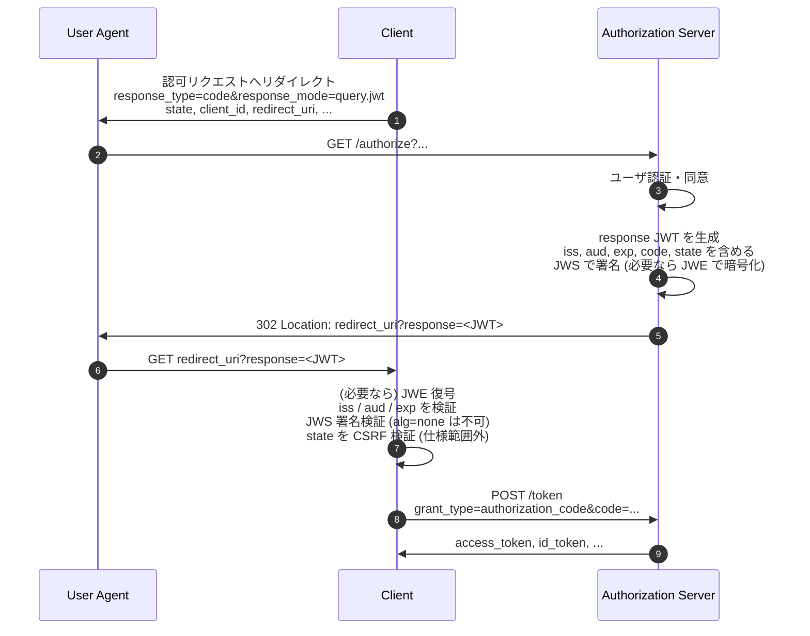

# JARM - JWT Secured Authorization Response Mode for OAuth 2.0

## 概要

JARM (JWT Secured Authorization Response Mode for OAuth 2.0) は、OAuth 2.0 の認可レスポンスを JWT (JSON Web Token) でエンコードして返却する新たな response mode を定義する仕様である。OpenID Foundation の FAPI Working Group により策定され、2025 年 8 月に Errata Set 1 を取り込んだ最終版が公開されている。

従来の OAuth 2.0 では認可レスポンスのパラメータ (`code`, `state`, `access_token` 等) はクエリ文字列・フラグメント・HTML フォームとして直接トランスポートされるため、署名・暗号化・発行者識別といった保護を持たない。JARM はこれらのパラメータを単一の JWT (`response` パラメータ) に詰め直し、署名 (JWS) と任意の暗号化 (JWE) を施した上でクライアントへリダイレクトすることにより、認可レスポンスに対して完全性・送信元真正性・機密性を付与する。

JARM は FAPI 1.0 Advanced で参照されており、高保証プロファイルにおける認可レスポンス保護の標準的な選択肢となっている。

## 解決する課題

OAuth 2.0 Core (RFC 6749) で定義されている認可レスポンスには、以下のような構造的な弱点がある。

### 1. Mix-up 攻撃

複数の認可サーバを扱うクライアントが、ある AS の認可エンドポイントから受け取った `code` を別の AS のトークンエンドポイントに送ってしまう攻撃 (Mix-up 攻撃) に対し、素の認可レスポンスにはレスポンスがどの AS から発行されたかを示す機構がない。JARM では認可レスポンス JWT に `iss` クレームを含めることでクライアント側から発行元を検証可能とし、Mix-up 攻撃を構造的に防ぐ。これは RFC 9207 (Authorization Server Issuer Identification) と同じ動機に基づくが、JWT に組み込んで完全性保護まで一括で提供する点が特徴である。

### 2. 認可レスポンスパラメータの改ざん検知の欠如

クエリ文字列・フラグメントとして送られるパラメータには署名がないため、`state` の差し替えや `code` の付け替え等の検知手段が標準では存在しない。JARM は JWS による署名を必須化し、`response` JWT 全体に対する完全性保護を提供する。

### 3. URL を介した認可コード・トークン漏洩

クエリ文字列に乗った `code` はブラウザ履歴・Referer・サーバアクセスログ等に残存しうる。JARM は `response` JWT を JWE で暗号化することにより、HTTP リダイレクト経路上に平文の認可コードやアクセストークンが露出することを防止できる。

### 4. レスポンス受信者の検証

素の認可レスポンスには宛先クライアントを示すフィールドがない。JARM は `aud` クレームを必須としており、クライアントは自身の `client_id` と一致するレスポンスのみを受理するよう実装できる。

## 主要概念

### Response Mode

OAuth 2.0 における response mode は、認可レスポンスのパラメータをクライアントへどう伝送するかを決定するメカニズムであり、OAuth 2.0 Multiple Response Type Encoding Practices および OAuth 2.0 Form Post Response Mode (`form_post`) で `query`, `fragment`, `form_post` の 3 種類が定義されている。JARM はこれらに対応する JWT 版を追加する。

### Response JWT

JARM では認可レスポンスのパラメータ群を JWT のクレームとしてまとめたものを、リダイレクト URI に `response` という単一のパラメータとして付加する。元の `code`, `state`, `access_token` といったパラメータは JWT 内部に配置され、URL 上には現れない。

### 署名と暗号化

`response` JWT は JWS による署名が必須であり、`alg=none` は禁止される。任意で JWE による暗号化が可能で、署名と暗号化を併用する場合は「署名 → 暗号化」の順 (Nested JWT) で適用する。

## 新規 response_mode

JARM は以下の 4 つの response mode を定義する。

| response_mode   | 伝送方式                                                   | 用途                                                                                                       |
| --------------- | ---------------------------------------------------------- | ---------------------------------------------------------------------------------------------------------- |
| `query.jwt`     | リダイレクト URI のクエリ文字列に `response=<JWT>`         | `response_type=code` 用。`token`/`id_token` を含むレスポンス型と組み合わせて暗号化なしで使用してはならない |
| `fragment.jwt`  | リダイレクト URI のフラグメントに `response=<JWT>`         | フロントチャネルでトークンを返すレスポンス型 (Implicit/Hybrid) のデフォルト                                |
| `form_post.jwt` | 自動 POST 送信される HTML フォームの `response` フィールド | 全レスポンス型で利用可能。ブラウザ履歴に乗らない最も堅牢な選択肢                                           |
| `jwt`           | レスポンス型に応じて上記から AS が自動選択                 | クライアントが伝送方式を AS に委ねるショートカット                                                         |

## プロトコルフロー

JARM を用いた Authorization Code Flow の概略を以下に示す。



クライアントは JWT の検証がすべて成功するまで、grant_type 固有のレスポンスパラメータ (例: `code` を用いたトークンリクエスト) を処理してはならない。

## Response JWT のクレーム

### 全レスポンス共通

- `iss` (必須): 認可サーバの issuer URL。OpenID Connect Discovery で発行されている値と一致しなければならない。
- `aud` (必須): クライアント識別子 (`client_id`)。
- `exp` (必須): JWT の有効期限。仕様では短い有効期限 (おおむね 10 分以下) が推奨される。

### `response_type=code` の場合

成功時:

- `code`: 認可コード
- `state`: クライアントから送られた `state` 値 (送信されていた場合)

エラー時:

- `error`: エラーコード (RFC 6749 と同じ)
- `error_description` (任意)
- `error_uri` (任意)
- `state` (送信されていた場合)

### `token`, `id_token` を含むレスポンス型の場合

`access_token`, `token_type`, `expires_in`, `scope`, `id_token` 等、対応するレスポンスタイプに応じたパラメータを JWT クレームとして格納する。

エラー応答も成功応答と同じ署名・暗号化・`iss`/`aud`/`exp` 検証の対象となる点が重要である。これにより、攻撃者が偽のエラーを差し込んでクライアントの状態を混乱させることが困難になる。

## メタデータ

### Authorization Server Metadata (RFC 8414 拡張)

- `authorization_signing_alg_values_supported`: `response` JWT 署名でサポートするアルゴリズム
- `authorization_encryption_alg_values_supported`: JWE の鍵管理アルゴリズム
- `authorization_encryption_enc_values_supported`: JWE のコンテンツ暗号化アルゴリズム
- `response_modes_supported` には `query.jwt`, `fragment.jwt`, `form_post.jwt`, `jwt` を追加する

### Client Metadata (RFC 7591 拡張)

- `authorization_signed_response_alg`: クライアントが期待する `response` JWT の署名アルゴリズム。指定しない場合のデフォルトは `RS256`
- `authorization_encrypted_response_alg`: クライアントが期待する JWE 鍵管理アルゴリズム。指定されると `response` JWT は暗号化される
- `authorization_encrypted_response_enc`: JWE のコンテンツ暗号化アルゴリズム。指定されない場合のデフォルトは `A128CBC-HS256`
- 暗号化を使用する場合、クライアントは公開鍵を `jwks_uri` または `jwks` で AS に登録する必要がある

## response_type と response_mode の組み合わせ

JARM は OAuth 2.0 のレスポンス型と直交に組み合わせ可能だが、以下の制約がある。

- `query.jwt` は `token` または `id_token` を含むレスポンス型と組み合わせて、暗号化なしで使用してはならない。クエリ文字列上にトークンを露出させないためである。
- `fragment.jwt` と `form_post.jwt` は全レスポンス型で利用可能。
- 暗号化を併用すれば、`query.jwt` でも実質的に内容が露出しないが、URL 長やリファラ漏洩のリスクは残るため、トークンを含むレスポンス型では `fragment.jwt` か `form_post.jwt` が推奨される。

## 認可リクエストの例

`response_mode` パラメータでクライアントが JARM の利用を指定する。

```http
GET /authorize?
  response_type=code
  &response_mode=query.jwt
  &client_id=s6BhdRkqt3
  &redirect_uri=https%3A%2F%2Fclient.example.org%2Fcb
  &scope=openid%20profile
  &state=af0ifjsldkj
  &nonce=n-0S6_WzA2Mj
HTTP/1.1
Host: server.example.com
```

## 認可レスポンスの例 (query.jwt)

```http
HTTP/1.1 302 Found
Location: https://client.example.org/cb?
  response=eyJhbGciOiJSUzI1NiIsImtpZCI6IjEyMzQ1Njc4In0...
```

`response` JWT を復号 (必要なら) し署名検証した後のペイロードは概ね以下のようになる。

```json
{
  "iss": "https://server.example.com",
  "aud": "s6BhdRkqt3",
  "exp": 1311281970,
  "code": "PuVz4MZWvWX1bMnSK3...",
  "state": "af0ifjsldkj"
}
```

## クライアントの処理ルール

JARM 仕様 (Section 2.4) はクライアントに対し、以下の順序で `response` JWT を検証することを要求する。

1. `response` JWT の取得 (リダイレクトのクエリ・フラグメント・POST から該当 response mode に応じて抽出)
2. JWE で暗号化されている場合は復号 (任意ステップ)
3. `iss` クレームを取り出し、想定する認可サーバ (AS) の issuer と一致することを検証
4. `aud` クレームが自身の `client_id` と一致することを検証
5. `exp` クレームが現在時刻より未来であることを検証
6. JWS 署名を RFC 7515 に従って検証する。`alg=none` は受理してはならない
7. 上記すべてが成功した後にのみ、`code` 等のレスポンス固有パラメータを処理する

いずれかのチェックが失敗した場合、クライアントは処理を中断しレスポンスを拒否しなければならない (MUST)。

なお `state` を用いた CSRF 検証や RFC 9700 (OAuth 2.0 Security Best Current Practice) で求められる追加チェックは JARM 仕様の対象範囲外として明示されており、別途実施することが想定されている。実装上は `state` を使い捨てのトークンとして扱い、検証後は無効化することが推奨される。

## セキュリティに関する考慮事項

### Mix-up 攻撃の防止

`iss` を必ず検証することで、攻撃者が別の AS から得たレスポンスを正規の AS からのものと偽装することを防ぐ。これは RFC 9207 で別途定義された Issuer Identification と同等の効果を、JWT 内で提供する。

### `alg=none` の禁止

`response` JWT の署名アルゴリズムとして `none` を許容してはならない。これは RFC 8725 (JWT BCP) の指針とも整合する。

### 公開鍵取得時の DoS

JWS 検証用の AS の公開鍵は事前に取得・キャッシュしておくべきである。レスポンスごとに `jku` 等で示された URL を盲目的に取得すると、悪意ある URL を埋め込まれて DoS や SSRF の踏み台にされる可能性がある。

### PKCE との併用

JARM は認可レスポンス側の保護に特化しており、認可コード横取りに対する完全な防御には RFC 7636 (PKCE) の併用が推奨される。FAPI 1.0 Advanced 等のプロファイルでは両者の併用が必須化されている。

### 認可リクエスト側の保護

JARM はレスポンス側のみを保護するため、リクエスト側のなりすまし・改ざんを防ぐには RFC 9101 (JAR; JWT-Secured Authorization Request) や RFC 9126 (PAR; Pushed Authorization Requests) との組み合わせが望ましい。

### Replay 攻撃

短い `exp` と `state` の一回限り使用により、レスポンスのリプレイを抑止する。

## FAPI および他プロファイルとの関係

- **FAPI 1.0 Advanced**: 認可レスポンスの保護方式として、`response_mode=jwt` (JARM) または ID Token を detached signature として使う Hybrid Flow のいずれかを必須とする。FAPI 2.0 Security Profile では PAR + PKCE を基本とし、認可レスポンスについては JARM の利用がオプションとして許容される。
- **RFC 9207 (AS Issuer Identification)**: JARM の `iss` クレームと同様に Mix-up 攻撃対策となる。素の OAuth 2.0 に対して軽量に `iss` を返したい場合は RFC 9207、より強固な完全性保護を望む場合は JARM が選択肢となる。
- **OpenID Connect Hybrid Flow の `id_token`**: ID Token を認可レスポンスに含めることで実質的に JARM 同様の保護が得られるが、認可コードのみを返したいケースでは JARM の方が直接的である。

## 関連仕様

- [RFC 6749 - The OAuth 2.0 Authorization Framework](./rfc6749.md)
- [RFC 7515 - JSON Web Signature (JWS)](./rfc7515.md)
- [RFC 7516 - JSON Web Encryption (JWE)](./rfc7516.md)
- [RFC 7519 - JSON Web Token (JWT)](./rfc7519.md)
- [RFC 7636 - Proof Key for Code Exchange (PKCE)](./rfc7636.md)
- [RFC 8414 - OAuth 2.0 Authorization Server Metadata](./rfc8414.md)
- [RFC 8725 - JSON Web Token Best Current Practices](./rfc8725.md)
- [RFC 9101 - JWT-Secured Authorization Request (JAR)](./rfc9101.md)
- [RFC 9126 - OAuth 2.0 Pushed Authorization Requests (PAR)](./rfc9126.md)
- [RFC 9207 - OAuth 2.0 Authorization Server Issuer Identification](./rfc9207.md)
- [FAPI 1.0 Advanced](./fapi-1_0-advanced.md)
- [FAPI 2.0 Security Profile](./fapi-2_0-security-profile.md)

## 参考文献

- [JWT Secured Authorization Response Mode for OAuth 2.0 (JARM), incorporating errata set 1 (OpenID Foundation, 2025-08-17)](https://openid.net/specs/oauth-v2-jarm.html)
- [OAuth 2.0 Multiple Response Type Encoding Practices](https://openid.net/specs/oauth-v2-multiple-response-types-1_0.html)
- [OAuth 2.0 Form Post Response Mode](https://openid.net/specs/oauth-v2-form-post-response-mode-1_0.html)
