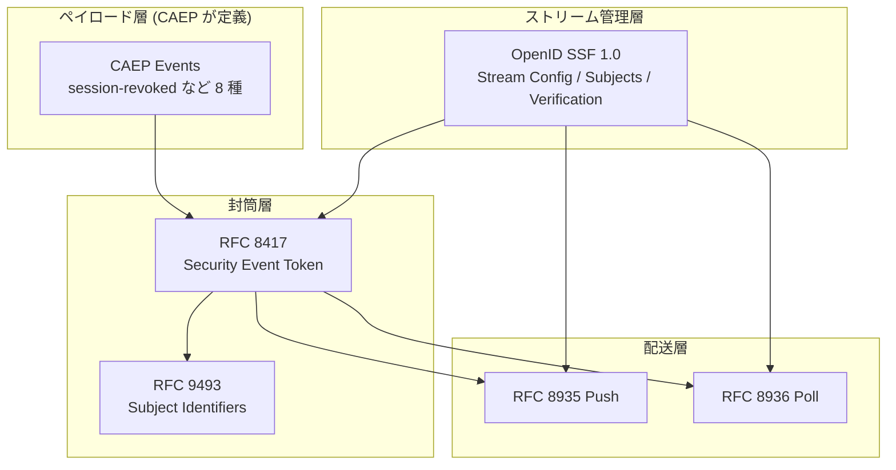
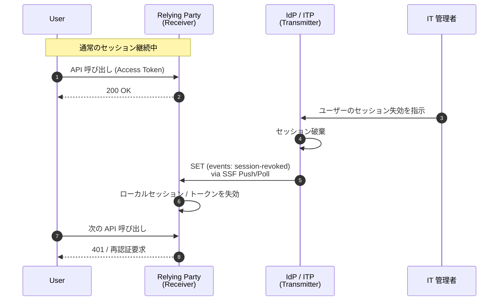
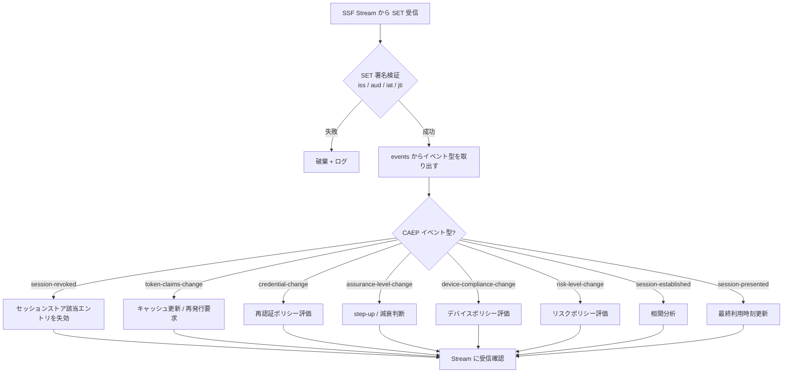

# OpenID Continuous Access Evaluation Profile (CAEP) 1.0

## 1. 概要

**OpenID Continuous Access Evaluation Profile 1.0 (CAEP)** は、OpenID Foundation の Shared Signals Working Group が策定し 2025 年 8 月 29 日に Final 化されたプロファイル仕様である。協調する Transmitter と Receiver の間で、ユーザー / デバイス / セッション / アプリケーションに対する **アクセスの継続的な減衰 (access attenuation)** を可能にする 8 種のイベント型を定義する。

CAEP は単独で動作するプロトコルではなく、**OpenID Shared Signals Framework (SSF) 上のプロファイル** として位置づけられる。SSF が「どうやってイベントを購読し、配送し、ストリーム状態を管理するか」を定めるのに対し、CAEP は「どのようなセマンティクスを持つイベントを送受信するか」を定める。

SSF / RFC 8417 (SET) / RFC 8935 (Push) / RFC 8936 (Poll) / RFC 9493 (Subject Identifiers for SETs) が **配送と封筒の標準** であるのに対し、CAEP は **封筒の中身 (ペイロード)** を Zero Trust 文脈で具体化する仕様だといえる。

## 2. 解決する課題

OAuth 2.0 / OpenID Connect が発行するアクセストークンや ID トークンは「発行時点」のユーザーの状態を反映するスナップショットでしかない。発行後、トークンの有効期限が切れるまでの間に以下のような変化が起きても、Resource Server / Relying Party は標準的な方法で検知できない。

- ユーザーがパスワードを変更した / FIDO2 認証器を登録・削除した
- IT 管理者が当該セッションを失効させた
- デバイスがコンプライアンスを満たさなくなった (root 化検知、MDM 解除など)
- ユーザーの認証保証レベル (AAL) が変化した
- リスクスコアが上昇した (異常ログイン、不審な振る舞い)
- トークンに埋め込まれた属性 (ロール、グループ、テナント) が変わった

従来この種の変化はトークン短命化 + Token Introspection (RFC 7662) で頻繁にポーリングするか、独自の Webhook で個別連携するしかなかった。CAEP はこれらの「アクセス制御に影響する変化」を **共通のイベント語彙** として標準化し、SSF のストリームを通じて Zero Trust アーキテクチャに必要な「**継続的アクセス評価 (Continuous Access Evaluation, CAE)**」を相互運用可能な形で実現することを目的とする。

## 3. 主要概念・用語

- **Transmitter**: イベントを発行する側 (典型的には IdP、ITP、CASB、デバイス管理基盤)
- **Receiver**: イベントを受信する側 (典型的には Relying Party、Resource Server、Policy Enforcement Point)
- **Event Type**: CAEP が定義する 8 種のイベント。すべて `https://schemas.openid.net/secevent/caep/event-type/<name>` の URI で識別される
- **Subject Identifier (`sub_id`)**: RFC 9493 で定義される複合的なサブジェクト識別子。単一の `iss_sub`/`email`/`opaque` から、`session` + `user` + `device` + `tenant` を組み合わせた **Complex Subject** まで表現できる
- **Initiating Entity (`initiating_entity`)**: イベント発火の主体。`admin` / `user` / `policy` / `system` のいずれか
- **Event Timestamp (`event_timestamp`)**: イベントが実際に発生した時刻 (Unix 時刻、ミリ秒)。SET の `iat` (発行時刻) とは別概念で、生成と発信の時間差を表現できる
- **Reason (`reason_admin` / `reason_user`)**: BCP 47 言語タグをキーとした多言語メッセージ。前者は管理者向けログ用、後者はエンドユーザー向け表示用

## 4. アーキテクチャと位置づけ

CAEP がプロトコルスタックのどこに位置するかをまず整理する。



CAEP のイベントは必ず SET (RFC 8417) の `events` クレーム配下に格納され、SSF が確立した Stream を通じて Push / Poll で配送される。CAEP 単体での運用は想定されておらず、仕様自身が「SSF 非準拠での交換はセキュリティリスクを伴う」と明記している。

## 5. プロトコルフロー

CAEP の代表的なフローを `session-revoked` の例で示す。前提として Receiver は SSF を通じて Stream を開設済みで、関心のあるサブジェクトを購読しているものとする。



ポイントは、IdP 側のセッション失効が **トークン有効期限を待たずに** Receiver 側のアクセス決定に反映されるところにある。これが「Continuous Access Evaluation」の本質である。

## 6. 共通クレーム

CAEP の全イベントは SSF 経由で配送されるため、SET レベルで以下の必須クレームを持つ。

| クレーム | 説明                                |
| -------- | ----------------------------------- |
| `iss`    | 発行者 (Transmitter) の識別子       |
| `aud`    | 受信者 (Receiver)                   |
| `iat`    | SET の発行時刻                      |
| `jti`    | SET の一意な識別子                  |
| `sub_id` | RFC 9493 に従ったサブジェクト識別子 |
| `events` | イベント本体を格納するオブジェクト  |

`events` オブジェクト内 (個々のイベント) では、CAEP は以下の共通オプションクレームを定義する。

| クレーム            | 型     | 説明                                                    |
| ------------------- | ------ | ------------------------------------------------------- |
| `event_timestamp`   | number | イベントが発生した時刻 (Unix 時刻、ミリ秒)              |
| `initiating_entity` | string | `admin` / `user` / `policy` / `system`                  |
| `reason_admin`      | object | BCP 47 言語タグをキーとする管理者向けメッセージ         |
| `reason_user`       | object | BCP 47 言語タグをキーとするエンドユーザー向けメッセージ |

`reason_*` を多言語マップとした設計は、グローバルに展開される SaaS において Receiver 側でユーザーのロケールに応じたメッセージを再生できるようにするための配慮である。

## 7. 8 つのイベント型

CAEP 1.0 が定義するイベント型を、すべて `https://schemas.openid.net/secevent/caep/event-type/` を基底 URI として一覧する。

### 7.1 session-revoked

セッションが Transmitter 側で取り消されたことを通知する。Receiver はローカルセッションや、当該セッションに紐づくトークンを破棄すべきである。クレームは共通クレームのみで十分。最もシンプルかつ最も需要の高いイベント型。

### 7.2 token-claims-change

トークンに埋め込まれた特定クレームの値が変化したことを通知する。`claims` (object) に、変化したクレーム名と新しい値の組を格納する。Receiver はキャッシュしているクレーム (ロール、グループ、テナント等) を更新するか、トークン再発行を要求する。

### 7.3 credential-change

ユーザーの認証クレデンシャルが追加・更新・削除されたことを通知する。

- `credential_type`: `password`, `pin`, `x509`, `fido2-platform`, `fido2-roaming`, `fido-u2f`, `verifiable-credential`, `phone-voice`, `phone-sms`, `app` 等
- `change_type`: `create` / `revoke` / `update` / `delete`
- 追加情報: `friendly_name`, `x509_issuer`, `x509_serial`, `fido2_aaguid` 等

「FIDO2 鍵が削除された」「パスワードがリセットされた」といったクレデンシャル変化を細粒度で共有でき、他サービスでの追加認証要求やセッション再評価の根拠となる。

### 7.4 assurance-level-change

認証保証レベル (AAL) の変化を通知する。

- `namespace`: `nist-800-63-3` (NIST AAL1/2/3) や `https://refeds.org/assurance` 等、保証レベル体系を識別する URI
- `current_level`: 現在のレベル文字列 (`nist-aal1` 等)
- `previous_level`: 直前のレベル (任意)
- `change_direction`: `increase` / `decrease` / `unchanged` (任意)

RFC 8176 (Authentication Method Reference) や RFC 9470 (OAuth Step-up Authentication Challenge) と組み合わせると、Receiver 側でステップアップ認証や減衰判断のトリガーになる。

### 7.5 device-compliance-change

デバイスのコンプライアンス状態の変化を通知する。

- `current_status`: `compliant` / `not-compliant`
- `previous_status`: 直前の状態 (任意)

MDM / EDR / UEM が Transmitter となり、root 化検知、暗号化解除、必要なエージェント停止等を契機に発火することが想定される。Receiver はデバイス単位でアクセス制御を強化できる。

### 7.6 session-established

新規セッションが確立されたことを通知する。同一ユーザーが別デバイスや別場所からログインした事実を他サービスへ通知し、相関分析や異常検知に用いられる。`fp_ua`, `acr`, `amr`, `ips` 等の文脈情報を付加できる。

### 7.7 session-presented

既存セッションが現在もアクティブに利用されていることを通知する (heartbeat 的な用途)。長寿命セッションを許容しつつ、利用実態をベースに失効判断を行うパターンで使われる。

### 7.8 risk-level-change

ユーザー / デバイス / セッションのリスク評価が変化したことを通知する。

- `principal`: `USER` / `DEVICE` / `SESSION` / `TENANT` 等、リスクの対象種別
- `current_level`: `LOW` / `MEDIUM` / `HIGH`
- `previous_level`: 直前のリスクレベル (任意)
- `risk_reason`: リスク評価の根拠 (推奨)

ITDR / UEBA / 不正検知基盤が Transmitter となり、計算したリスクスコアの遷移を共有する。Receiver は high になった瞬間にセッション再認証やトークン縮退を実行できる。

## 8. SET ペイロード例

`session-revoked` を Complex Subject で表現した SET の JSON ペイロード例を示す。

```json
{
  "iss": "https://idp.example.com/",
  "aud": "https://rp.example.com/",
  "iat": 1715000000,
  "jti": "01J9X8YH6V8E1Z4MR8K9Q3KJYT",
  "sub_id": {
    "format": "complex",
    "session": {
      "format": "opaque",
      "id": "session-1234abcd"
    },
    "user": {
      "format": "iss_sub",
      "iss": "https://idp.example.com/",
      "sub": "user-42"
    },
    "device": {
      "format": "iss_sub",
      "iss": "https://idp.example.com/",
      "sub": "device-9b1c"
    }
  },
  "events": {
    "https://schemas.openid.net/secevent/caep/event-type/session-revoked": {
      "event_timestamp": 1715000000123,
      "initiating_entity": "admin",
      "reason_admin": {
        "en": "Administrator revoked session after termination",
        "ja": "解雇に伴い管理者がセッションを失効させました"
      },
      "reason_user": {
        "en": "Your session was ended by your administrator.",
        "ja": "管理者によりセッションが終了されました。"
      }
    }
  }
}
```

`sub_id.format` に `complex` を指定し、`session` / `user` / `device` を組み合わせることで「あの端末上のあのユーザーのあのセッションのみを失効する」を一意に表現できる。これは RFC 9493 の Complex Subject の典型的な活用例である。

## 9. 受信側の実装観点

Receiver 実装の典型処理は次のようになる。



イベント型ごとに idempotent な反映処理を用意し、`jti` で重複排除を行うのが基本である。Push (RFC 8935) と Poll (RFC 8936) のどちらでも同一の処理パイプラインに流せるように、配送と意味解釈を分離する設計が望ましい。

## 10. セキュリティに関する考慮事項

- **SSF 必須**: CAEP は単独運用を想定しておらず、必ず SSF が定める Stream 管理・配送・検証の上で交換する
- **SET の署名検証**: RFC 8417 に従い、JWS 署名 (推奨アルゴリズム: ES256 等) と `iss` / `aud` / `iat` / `jti` の検証を厳密に行う
- **多重発火 / 順序逆転**: ネットワーク遅延や再送により同じイベントが複数到達したり、時系列が逆転して到着する可能性がある。`event_timestamp` を用いた順序整合と `jti` による重複排除が必須
- **プライバシー**: `reason_user` / `reason_admin` などのフリーテキスト、Complex Subject に含まれるデバイス識別子等は個人情報やセキュリティ機密を含み得る。Stream の TLS 必須、Receiver の認可境界を厳密に設定する
- **発火しない攻撃**: Transmitter が侵害されている場合、攻撃者は意図的に session-revoked を送らないことで失効を遅延させられる。Receiver 側はトークン短命化やフォールバックのポーリングを併用する
- **過剰発火攻撃 (DoS)**: 攻撃者が Receiver を疲弊させる目的で大量のイベントを発火する可能性がある。Stream あたりのレート制御と、優先度の高いイベント型 (session-revoked 等) を識別する設計が望まれる

## 11. 関連仕様

- [OpenID Shared Signals Framework 1.0](./openid-shared-signals-framework.md) — CAEP の上位フレームワーク
- [RFC 8417 - Security Event Token (SET)](./rfc8417.md) — イベントの封筒
- [RFC 8935 - Push-Based SET Delivery](./rfc8935.md) — Push 配送
- [RFC 8936 - Poll-Based SET Delivery](./rfc8936.md) — Poll 配送
- RFC 9493 — Subject Identifiers for SETs
- [RFC 7662 - OAuth 2.0 Token Introspection](./rfc7662.md) — 受動的な状態確認手段との対比
- OpenID RISC Profile — SSF 上のもう一つの主要プロファイル (アカウント乗っ取り対応)

## 12. 参考文献

- OpenID Foundation, "OpenID Continuous Access Evaluation Profile 1.0 — final", 29 August 2025, <https://openid.net/specs/openid-caep-1_0.html>
- OpenID Foundation, "Shared Signals Working Group", <https://openid.net/wg/sharedsignals/>
- OpenID Foundation, "Three Shared Signals Final Specifications Approved", 2 September 2025
- RFC 8417, "Security Event Token (SET)"
- RFC 8935, "Push-Based Security Event Token (SET) Delivery Using HTTP"
- RFC 8936, "Poll-Based Security Event Token (SET) Delivery Using HTTP"
- RFC 9493, "Subject Identifiers for Security Event Tokens"
