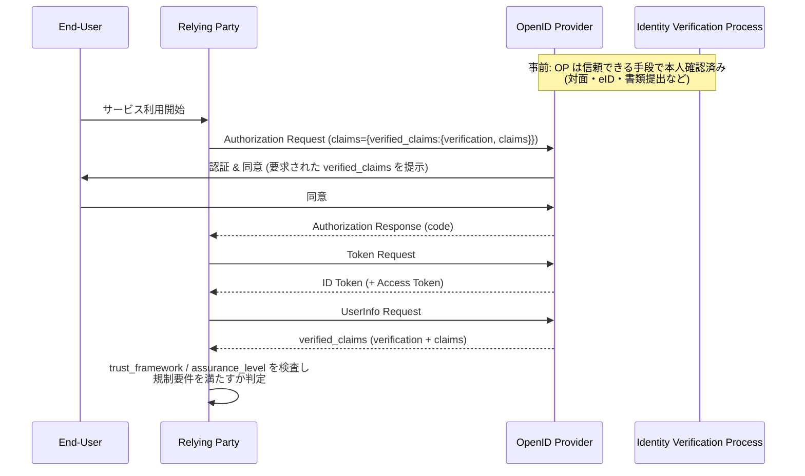
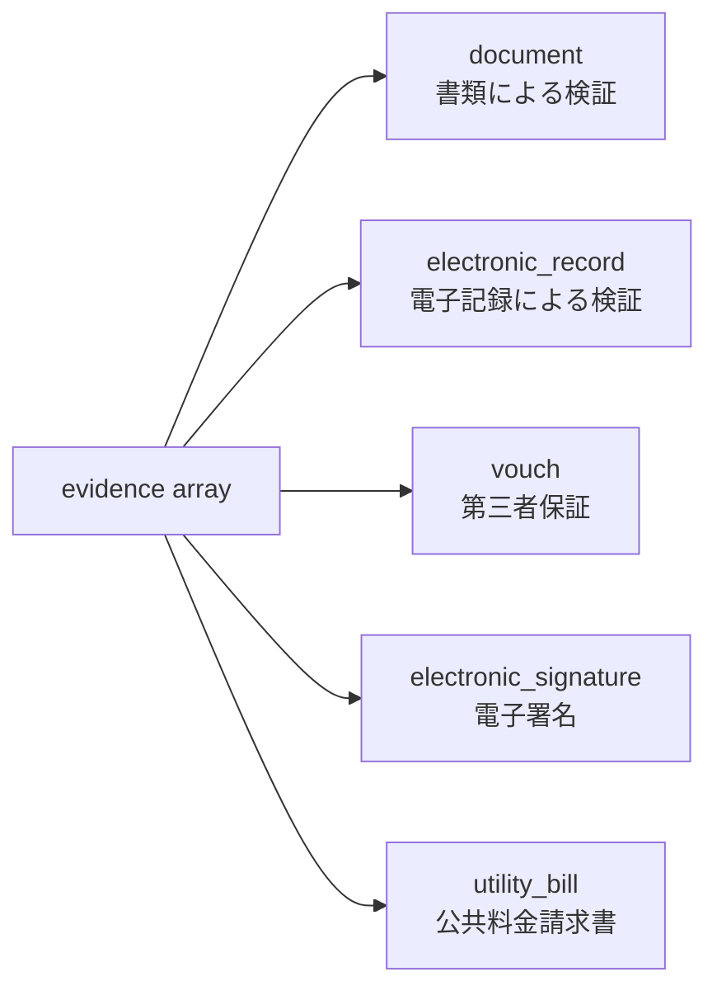

# OpenID Connect for Identity Assurance 1.0 - 検証済みアイデンティティの伝達仕様

## 1. 概要

OpenID Connect for Identity Assurance 1.0 (以下 OIDC IDA) は、OpenID Connect Core 1.0 の `claims` 機構を拡張し、OpenID Provider (OP) が Relying Party (RP) に対して「どのような枠組み・手段・証拠に基づいて検証 (verify) されたエンドユーザー属性なのか」をメタデータ付きで伝達するための仕様である。OpenID Foundation の eKYC and Identity Assurance Working Group (eKYC-IDA WG) が策定し、2024 年 10 月 1 日に Final 化された。

通常の OpenID Connect では、`given_name` や `address` といったクレームは「OP が知っている値」として返されるだけで、それが本人確認 (Identity Proofing) 済みのものか自己申告かを区別できない。OIDC IDA は `verified_claims` という入れ子コンテナを導入し、その内部の `verification` 要素に検証時刻・適用された Trust Framework・保証レベル (Assurance Level)・利用された証拠 (Evidence) 等を載せることで、RP が法令遵守 (AML/KYC, eIDAS, NIST SP 800-63A 等) や不正対策の観点から十分な根拠を確認できるようにする。

## 2. 解決する課題

### 2.1 「未検証クレーム」と「検証済みクレーム」の混在問題

OpenID Connect Core の標準クレームは、OP が値を保持しているかどうかしか示せない。例えば AML 規制下の金融機関がユーザー本人確認に OP の結果を流用しようとしても、Core の枠組みでは「この `family_name` が公的書類で確認された姓なのか、ユーザーが自己申告した姓なのか」を判定できない。OIDC IDA は「未検証クレームと検証済みクレームを RP が誤って同一視できないこと」を主要設計原則の一つに掲げ、検証済み属性を別コンテナに隔離する。

### 2.2 規制・準拠フレームワークの多様性

EU の eIDAS、米国の NIST SP 800-63A、ドイツの AML 関連枠組み、日本の犯収法等、本人確認の根拠となる枠組みは地域・業界ごとに異なる。OIDC IDA は単一の枠組みを押し付けるのではなく、`trust_framework` という拡張可能な識別子で多様な枠組みを並立させ、`assurance_level` で枠組み内の保証ランク (例: eIDAS の `substantial`/`high`、NIST の `ial2`) を表現できる構造を採る。

### 2.3 検証根拠の機械可読化

「いつ・どの書類で・どの方法で確認したか」までを構造化データとして RP に渡せれば、RP 側で監査ログを残したり、社内コンプライアンスに合わせて再評価したりできる。OIDC IDA は `evidence` 配列でこの種の根拠を機械可読に表現する。

## 3. 主要概念・用語

| 用語                          | 説明                                                                                   |
| ----------------------------- | -------------------------------------------------------------------------------------- |
| Verified Claims               | `verification` メタデータと `claims` 値をひとまとめにしたコンテナ                      |
| Verification                  | 検証行為そのもののメタデータ (枠組み、時刻、保証レベル、証拠、プロセス)                |
| Trust Framework               | 検証を支配する規制・運用枠組みを識別する文字列 (例: `eidas`, `de_aml`, `nist_800_63A`) |
| Assurance Level               | Trust Framework が定義する保証ランク                                                   |
| Assurance Process             | 適用したポリシー・手続き・チェック内訳の詳細                                           |
| Evidence                      | 検証に用いた具体的な証拠 (書類・電子記録・第三者保証・電子署名・公共料金請求書)        |
| Aggregated/Distributed Claims | 検証済みクレームを別主体が署名した JWT で間接的に提供する仕組み                        |

## 4. プロトコルフロー

OIDC IDA は新しいエンドポイントを定義せず、OpenID Connect Core のフローに乗る。RP が `claims` パラメータで `verified_claims` を要求し、OP が ID Token もしくは UserInfo Endpoint で返却する。



## 5. 詳細解説

### 5.1 verified_claims コンテナ

`verified_claims` は `verification` と `claims` を必ず両方持つ。`verification` の必須フィールドは `trust_framework` のみで、それ以外は枠組みや実装の要求に応じて追加する。

```json
{
  "verified_claims": {
    "verification": {
      "trust_framework": "eidas",
      "assurance_level": "substantial",
      "time": "2026-04-22T11:30Z",
      "verification_process": "f24c6f-6d3f-4ec5-973e-b0d8506f3bc7",
      "evidence": [
        {
          "type": "document",
          "method": "pipp",
          "time": "2026-04-22T11:25Z",
          "document_details": {
            "type": "idcard",
            "issuer": {
              "name": "Stadt Augsburg",
              "country": "DE"
            },
            "document_number": "53554554",
            "date_of_issuance": "2020-03-23",
            "date_of_expiry": "2030-03-22"
          }
        }
      ]
    },
    "claims": {
      "given_name": "Max",
      "family_name": "Meier",
      "birthdate": "1956-01-28",
      "place_of_birth": {
        "country": "DE",
        "locality": "Musterstadt"
      },
      "nationalities": ["DE"],
      "address": {
        "locality": "Maxstadt",
        "postal_code": "12344",
        "country": "DE",
        "street_address": "Vissingstraße 51"
      }
    }
  }
}
```

### 5.2 verification 要素のフィールド

| フィールド             | 必須 | 内容                                 |
| ---------------------- | ---- | ------------------------------------ |
| `trust_framework`      | 必須 | 検証を律する枠組みの識別子           |
| `assurance_level`      | 任意 | Trust Framework 内の保証ランク       |
| `assurance_process`    | 任意 | ポリシー・手続き・詳細チェックの内訳 |
| `time`                 | 任意 | 検証完了時刻 (ISO 8601)              |
| `verification_process` | 任意 | OP 内部の検証トランザクション識別子  |
| `evidence`             | 任意 | 利用した証拠オブジェクトの配列       |

`assurance_process` には、適用したポリシー (`policy`)、手続き (`procedure`)、各種詳細チェック (`assurance_details`) を入れ子で記述できる。複数の保証ステップを束ねた高度なフローを表現するために用いる。

### 5.3 Evidence の種類

`evidence` 配列に入るオブジェクトは `type` で種類を区別する。



#### document

旅券・身分証・運転免許等の物理/電子書類による検証。`method` は確認方法 (例: `pipp` = Physical In-Person Proofing、`vri` = Video Remote Inspection、`vpip` = Verified Physical In-Person)、`document_details` は書類種別・発行者・番号・発行/失効日、`check_details` は実施した個別検査 (例: `vpiruv` = Visual Passport Inspection、`pvp` = Physical Verification of Presence)、`verifier` は検証主体の情報を保持する。

#### electronic_record

住民登録、銀行口座、住宅ローン口座など、信頼できる電子記録への参照による検証。`record` フィールドで `population_register` 等のレコード種別を示し、`source` で記録の発行元組織を、`check_details` で検査内容を表す。

#### vouch

組織や個人による「この人物である」という第三者保証。`attestation` に保証の詳細を、`attester` に保証主体を持つ。

#### electronic_signature と utility_bill

電子署名による検証 (`electronic_signature`)、および公共料金請求書のような補助証拠 (`utility_bill`) も列挙されている。

### 5.4 verified_claims の要求方法

RP は OpenID Connect Core の `claims` パラメータ内に `verified_claims` を入れ子で記述する。`verification` 側で枠組みや保証レベルの最低要件を指定でき、`claims` 側で取得したい属性を列挙する。

```json
{
  "userinfo": {
    "verified_claims": {
      "verification": {
        "trust_framework": {
          "values": ["eidas", "nist_800_63A"]
        },
        "assurance_level": {
          "value": "substantial"
        }
      },
      "claims": {
        "given_name": null,
        "family_name": null,
        "birthdate": null
      }
    }
  }
}
```

各値は `null` (任意の値を要求) のほか、`value` (完全一致)、`values` (列挙のいずれか)、`max_age` (検証からの最大経過秒数) といった制約構造を取れる。同一 RP が複数の検証パターンを許容したい場合は、`verified_claims` を配列にして列挙する。

### 5.5 応答チャネル

検証済みクレームは以下のいずれかで返却される。

- ID Token に直接埋め込み
- UserInfo Endpoint レスポンス
- Aggregated Claims (OP が JWT を埋め込む)
- Distributed Claims (RP が別エンドポイントから取得)

Aggregated/Distributed Claims では、検証情報を保持する別主体 (Claims Provider) が `verified_claims` を含む JWT を発行する。この JWT の `typ` ヘッダは `provided-claims+jwt` で、必須クレームは `iss`、`sub`、`verified_claims`、一方 `exp` と `aud` の使用は禁止される。RP は JWT 署名を検証し、外部エンドポイントが HTTPS であることを確認する。

### 5.6 Discovery メタデータ

OP は自身が扱える検証範囲を Discovery で広告する。代表的なメタデータは以下のとおり。

| メタデータ                            | 用途                                                     |
| ------------------------------------- | -------------------------------------------------------- |
| `verified_claims_supported`           | 検証済みクレームの提供可否                               |
| `trust_frameworks_supported`          | 対応 Trust Framework の配列 (必須)                       |
| `claims_in_verified_claims_supported` | `verified_claims.claims` で要求可能なクレーム一覧 (必須) |
| `evidence_supported`                  | 提供できる Evidence の種類                               |
| `documents_supported`                 | `document` evidence で扱える書類種別                     |
| `documents_methods_supported`         | `document` evidence の検証方法                           |
| `electronic_records_supported`        | `electronic_record` evidence で扱える記録種別            |
| `claims_parameter_supported`          | `claims` パラメータ全般のサポート (Core 仕様由来)        |

RP はこれらを参照して、必要な枠組みを提供できる OP を選択する。

## 6. セキュリティに関する考慮事項

- **未検証クレームとの混在禁止**: 通常の `given_name` 等と `verified_claims.claims.given_name` は別物として扱う。RP は両者を取り違えないよう実装する必要がある。
- **データ最小化**: RP は本当に必要な検証情報のみを要求するべきで、`evidence` 全体を機械的に要求するのは避ける。Evidence にはユーザーの旅券番号など機微情報が含まれる。
- **Trust Framework の妥当性確認**: RP は受領した `trust_framework` が自社の規制要件を満たすか判定する責任を持つ。OP が広告したからといって自動的に十分とは限らない。
- **時刻の鮮度**: 本人確認の有効期限は規制で定められることが多い。RP は `verification.time` や `evidence.*.time`、`max_age` 制約を活用して鮮度を保証する。
- **Aggregated/Distributed Claims の検証**: Claims Provider の鍵管理、エンドポイントの HTTPS、`typ` ヘッダ確認を怠ると、検証済みを装った任意のクレームを差し込まれる恐れがある。
- **同意とプライバシー**: 検証メタデータは本人確認書類の番号や発行国など、プロファイリング可能な情報を含むため、ユーザー同意と必要最小限の伝達を徹底する。

## 7. 関連仕様

- **[OpenID Connect Core 1.0](./openid-connect-core.md)**: 本仕様は Core の `claims` パラメータと UserInfo/ID Token 機構を拡張する。
- **[OpenID Connect Discovery 1.0](./openid-connect-discovery.md)**: `trust_frameworks_supported` 等のメタデータを広告する基盤。
- **OpenID Identity Assurance Claims Registration**: `place_of_birth`、`nationalities`、`birth_family_name` など IDA 特有のクレームを登録する別仕様。
- **OpenID Identity Assurance Schema Definition**: Evidence と verification の JSON Schema を提供する別仕様。
- **[OpenID4VCI](./openid4vci.md) / [OpenID4VP](./openid4vp.md)**: 検証済みアイデンティティを Verifiable Credential として発行・提示する代替アプローチ。IDA は OP がクレーム提供を継続する伝統的モデル、OID4VC はユーザーがウォレットで保管して提示するモデルという棲み分けが進んでいる。
- **eIDAS 規則 / NIST SP 800-63A / FATF 勧告**: 本仕様の `trust_framework` および `assurance_level` の値はこれら外部規制を参照する。

## 8. 参考文献

- OpenID Foundation, [OpenID Connect for Identity Assurance 1.0 - Final](https://openid.net/specs/openid-connect-4-identity-assurance-1_0.html) (2024 年 10 月 1 日)
- OpenID Foundation eKYC and Identity Assurance Working Group, [Working Group ホーム](https://openid.net/wg/ekyc-ida/)
- OpenID Foundation, [OpenID Identity Assurance Claims Registration 1.0](https://openid.net/specs/openid-ida-claims-1_0.html)
- OpenID Foundation, [OpenID Identity Assurance Schema Definition 1.0](https://openid.net/specs/openid-ida-verified-claims-1_0.html)
