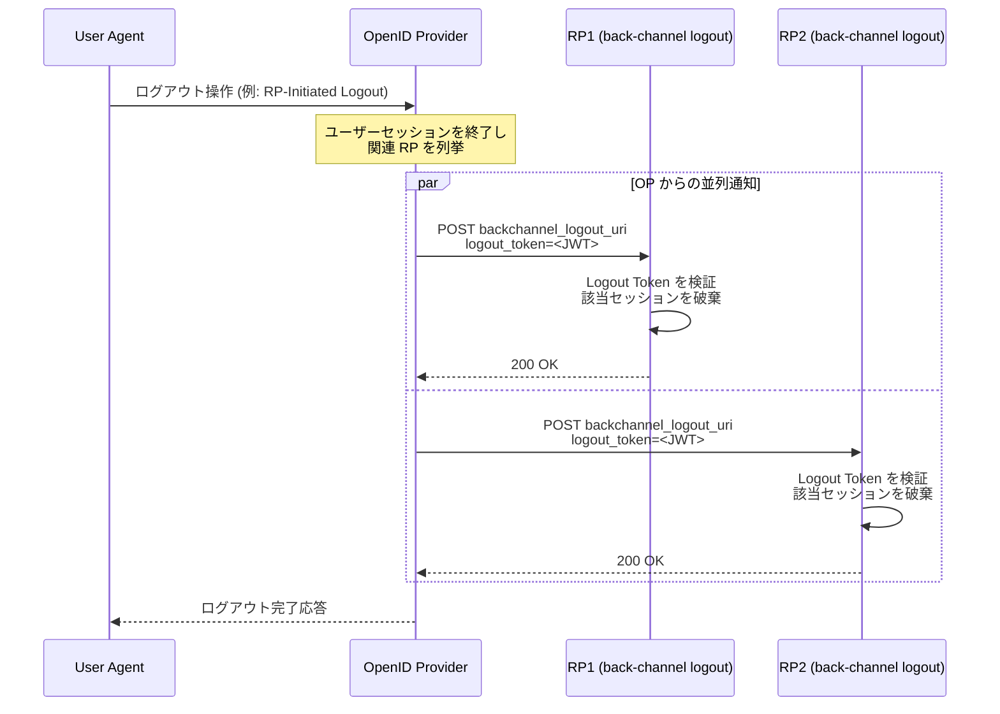
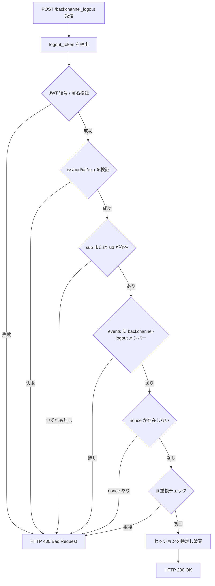

# OpenID Connect Back-Channel Logout 1.0

## 1. 概要

OpenID Connect Back-Channel Logout 1.0 は、OpenID Provider (OP) からリライングパーティ (Relying Party, RP) に対してエンドユーザーのセッション終了を通知するための、サーバー間 (バックチャネル) 通信ベースのログアウトメカニズムを定義する仕様である。2022 年 9 月 12 日に Final として発行され、編集者は M. Jones (Microsoft)、J. Bradley (Yubico)、N. Agarwal (Microsoft) である。

本仕様は、Front-Channel Logout 1.0 や Session Management 1.0 がブラウザのユーザーエージェント経由でログアウト通知を伝搬するのに対し、ユーザーエージェントを介在させずに OP が各 RP のバックチャネルログアウトエンドポイントへ直接 HTTP POST を送信することで、より信頼性の高いシングルログアウトを実現する。OP は Logout Token と呼ばれる新しい JWT を通知ペイロードとして用いる。

RP-Initiated Logout 1.0 とは補完関係にあり、RP-Initiated Logout が「RP からの要求によって OP セッションを終了するフロー」を規定するのに対し、Back-Channel Logout は「OP がセッション終了をすべての関連 RP に伝搬するフロー」を規定する。両者を組み合わせることで、ブラウザ環境に依存しないシングルログアウトを構成できる。

## 2. 解決する課題

OpenID Connect のシングルサインオン環境では、ユーザーが OP もしくはいずれかの RP でログアウトしたとき、その OP に紐づく他のすべての RP セッションも一貫して終了させる必要がある。これを実現する仕組みとして、当初は Session Management 1.0 と Front-Channel Logout 1.0 が定義されたが、いずれもブラウザ機能に依存するという制約がある。

- Session Management 1.0 は third-party cookie と iframe の `postMessage` に依存しており、近年の主要ブラウザによる third-party cookie ブロックの影響を強く受ける
- Front-Channel Logout 1.0 は OP のログアウトページに RP のログアウト URI を埋め込んだ iframe を並べて読み込ませる方式であり、ブラウザがそのページを開いている間しか機能しない。ユーザーがすぐにタブを閉じた場合や、third-party cookie がブロックされた状況ではログアウト通知が届かない、あるいは RP のセッション cookie が iframe から参照できない問題が起こる
- ネイティブアプリやデバイスフロー、CIBA など、ユーザーエージェントが必ずしも介在しないクライアントには、ブラウザ依存のログアウト機構はそもそも適合しない

Back-Channel Logout は、OP から RP の登録済みエンドポイントへ直接 HTTPS POST を送信し、ペイロードに署名済み Logout Token を含めることで、ブラウザの状態に左右されずに RP 側へログアウトを通知する。一方で、OP から RP のエンドポイントへ到達可能なネットワーク構成が必要であること、RP は cookie やセッションストレージへバックチャネル経由ではアクセスできないこと (したがってセッション状態を Logout Token のクレームから明示的に解決する必要があること) という制約と引き換えになっている。

## 3. 主要概念・用語

- Logout Token: 本仕様で新たに定義される JWT。ID Token と類似した形式を持つが、ログアウト通知専用に用途を限定したクレームセットを持つ
- Back-Channel Logout Endpoint: RP が登録するログアウト通知の受信エンドポイント。OP はこのエンドポイントへ Logout Token を POST する
- `events` クレーム: Security Event Token (SET、RFC 8417) の枠組みに従い、本トークンがどのイベントを表現するかを示す JSON オブジェクト。バックチャネルログアウトの場合は `http://schemas.openid.net/event/backchannel-logout` をメンバーとして含める
- `sid` クレーム: OP におけるエンドユーザーの認証セッション識別子。ID Token の `sid` と対応する。RP は `sub` と `sid` の組み合わせで個別セッションを特定する
- `typ` ヘッダ値 `logout+jwt`: Logout Token を ID Token など他の JWT と取り違えないことを目的とした明示的な型指定 (RFC 8725 に基づく Cross-JWT Confusion 対策)

## 4. プロトコルフロー / メカニズム

Back-Channel Logout の典型的なフローは次のとおりである。エンドユーザーが OP もしくはある RP でログアウトをトリガーすると、OP は当該エンドユーザーのセッションに紐づくすべての RP に対して Logout Token を POST する。



このフローのポイントは次の三点である。

- OP は各 RP のセッションを把握しており、ログアウト対象のすべての RP に並列に通知できる
- 各 RP への通知はサーバー間通信であり、エンドユーザーのブラウザがログアウトページに留まっている必要はない
- RP はバックチャネル受信時に cookie 等のブラウザ状態にアクセスできないため、Logout Token のクレーム (`iss` と `sub`、あるいは `sid`) のみを根拠に対象セッションを特定する

## 5. 詳細解説

### 5.1 プロバイダ/クライアントメタデータ

Back-Channel Logout は次のメタデータを通じて OP と RP が機能と受信エンドポイントを宣言する。

OP の Discovery メタデータ:

- `backchannel_logout_supported` (Boolean): OP がバックチャネルログアウトをサポートするかどうかを示す。デフォルトは `false`
- `backchannel_logout_session_supported` (Boolean): OP が Logout Token に `sid` クレームを含められるかを示す。デフォルトは `false`

RP の Client メタデータ (Dynamic Client Registration 等で登録):

- `backchannel_logout_uri` (URI): OP がログアウト通知を POST する RP のエンドポイント。絶対 URI であり、HTTPS が強く推奨される。機密クライアントであれば HTTP も許容される
- `backchannel_logout_session_required` (Boolean): RP が Logout Token に `sid` クレームを必須とするかを示す。デフォルトは `false`

### 5.2 Logout Token

Logout Token は ID Token に類似した署名付き JWT であり、用途をログアウト通知に限定するための制約が課されている。

必須クレーム:

- `iss`: 発行者識別子。ID Token と同じ値
- `aud`: オーディエンス。通知先 RP のクライアント ID
- `iat`: 発行時刻
- `jti`: トークン一意識別子。リプレイ検出に用いられる
- `events`: メンバーとして `http://schemas.openid.net/event/backchannel-logout` を含む JSON オブジェクト。当該メンバーの値は空オブジェクト `{}` が推奨される

条件付き必須:

- `sub` または `sid` のいずれか、もしくは両方。`sub` のみであれば「当該ユーザーの当該 RP におけるすべてのセッションを終了」、`sid` を含む場合は「特定のセッションのみを終了」を意味する

任意クレーム:

- `exp`: 有効期限。リプレイ対策として短い有効期限 (推奨では数分以内) を設定すべき

禁止クレーム:

- `nonce`: ID Token との取り違え (Cross-JWT Confusion) を防ぐため、Logout Token には含めてはならない

ヘッダ:

- `alg`: 署名アルゴリズム。`none` は禁止
- `typ`: `logout+jwt` の使用が推奨される。これにより RP は明示的に Logout Token を他の JWT と区別できる

Logout Token の JSON 例を以下に示す (署名前のクレーム部)。

```json
{
  "iss": "https://server.example.com",
  "sub": "248289761001",
  "aud": "s6BhdRkqt3",
  "iat": 1706000000,
  "jti": "bWJq",
  "sid": "08a5019c-17e1-4977-8f42-65a12843ea02",
  "events": {
    "http://schemas.openid.net/event/backchannel-logout": {}
  }
}
```

### 5.3 Back-Channel Logout Request

OP は RP の `backchannel_logout_uri` に対して次のように POST を送信する。

- HTTP メソッド: POST
- Content-Type: `application/x-www-form-urlencoded`
- ボディ: `logout_token` パラメータに Logout Token (シリアライズされた JWT) を含める

リクエストの例:

```http
POST /backchannel_logout HTTP/1.1
Host: rp.example.org
Content-Type: application/x-www-form-urlencoded

logout_token=eyJhbGciOiJSUzI1NiIsInR5cCI6ImxvZ291dCtqd3QiLCJraWQiOiIuLi4ifQ...
```

RP が処理を正常に受理した場合は HTTP 200 を返す。Logout Token の検証に失敗した場合は HTTP 400 Bad Request を返す。応答ボディは推奨で `Cache-Control: no-store` ヘッダを伴うべきである。OP は復旧可能なネットワーク障害が疑われる場合に限り再送信してよく、それ以外で繰り返し送信してはならない。

### 5.4 Logout Token の検証

RP は受信した Logout Token に対して、おおむね次の手順で検証を行う。仕様本文には ID Token と類似した検証手順が列挙されている。

1. Logout Token が暗号化されている場合は復号する
2. 署名を ID Token と同様の手順で検証する (`iss` から鍵を解決し `alg` に基づいて検証)
3. `alg` ヘッダ値が登録された値と一致し、かつ `none` でないことを確認する
4. `iss`、`aud`、`iat`、`exp` (存在する場合) を ID Token と同様に検証する
5. `sub` または `sid` の少なくとも一方が存在することを確認する
6. `events` クレームに `http://schemas.openid.net/event/backchannel-logout` メンバーが存在することを確認する
7. `nonce` クレームが存在しないことを確認する
8. (任意) 同じ `jti` を持つ Logout Token をすでに処理していないか確認しリプレイを防止する
9. (任意) `iss` がこのセッションに対応する ID Token の `iss` と一致するか確認する
10. (任意) `sub` が当該セッションの ID Token の `sub` と一致するか確認する
11. (任意) `sid` が当該セッションの ID Token の `sid` と一致するか確認する

検証手順を可視化すると次のとおりである。



### 5.5 RP におけるログアウト処理

検証に成功した RP は、`iss` と `sub` の組、あるいは `sid` をキーに該当するエンドユーザーセッションを特定し、そのセッション状態をクリアする。具体的には次のような処理が想定される。

- 当該セッションに紐づくサーバーサイドセッションレコードの破棄
- そのセッションで発行されたリフレッシュトークンの失効。ただし `offline_access` 同意のもとで発行されたリフレッシュトークンは通常は失効させないことが望ましい
- RP 自身が下流の RP に対する OP として振る舞っている場合は、下流の RP に対しても適切なログアウト通知を伝搬すること

なお、RP のバックチャネルログアウトエンドポイントはユーザーエージェントからアクセスされるエンドポイントではないため、ここで cookie を破棄しても効果はない。実際のブラウザセッションの無効化はサーバーサイドセッション状態の削除を通じて実現する必要がある。

## 6. セキュリティに関する考慮事項

仕様はいくつかのセキュリティ上の考慮事項を明示している。

- 署名による発行元確認: Logout Token は必ず署名され、RP は ID Token と同じ手順で署名を検証する。これにより、不正なログアウト要求による DoS (任意のユーザーをログアウトさせる攻撃) を防ぐ
- リプレイ対策: OP は短い有効期限 (推奨では 2 分以内) を設定し、`jti` を一意にする。RP は `jti` の重複受信を検出して廃棄することが推奨される
- Cross-JWT Confusion 対策: Logout Token に `nonce` を含めない、`events` クレームでログアウトイベントを明示する、`typ` を `logout+jwt` とするなど、他種別の JWT (特に ID Token) との取り違えを防止する仕組みが組み込まれている
- アクセス可能性: `backchannel_logout_uri` は OP からアクセス可能な HTTPS エンドポイントである必要がある。プライベートネットワーク内に RP がある場合、OP との到達性をどう確保するかが運用上の論点になる
- 部分故障時の挙動: ある RP への通知が失敗した場合、OP は復旧可能なエラーに限り再送してよい。ベストエフォートでの伝搬であることを踏まえ、RP 側もセッションタイムアウト等の独立した失効手段を併用することが望ましい
- ネイティブアプリへの適用: 仕様自体はネイティブアプリ RP を排除しないが、OP から到達可能なエンドポイントを持たないネイティブアプリには本仕様は適用しにくく、実装者は対象とする RP 種別 (Web か Native か) を明確にすべきである

## 7. 関連仕様

- OpenID Connect Core 1.0: ID Token と認証フローの基礎仕様。Logout Token の検証手順は ID Token の検証手順を踏襲する
- OpenID Connect Discovery 1.0: `backchannel_logout_supported` と `backchannel_logout_session_supported` を OP メタデータとして公開する
- OpenID Connect Dynamic Client Registration 1.0: `backchannel_logout_uri` と `backchannel_logout_session_required` を RP の登録メタデータとして扱う
- OpenID Connect RP-Initiated Logout 1.0: RP からのログアウト要求を OP に伝えるためのフロントチャネル仕様。Back-Channel Logout と組み合わせることでシングルログアウトを構成できる
- OpenID Connect Front-Channel Logout 1.0: ユーザーエージェント経由で OP から RP にログアウトを伝搬する代替手段。ブラウザ依存の制約があるため Back-Channel Logout が補完する
- OpenID Connect Session Management 1.0: third-party cookie に依存するセッション監視仕様。現代のブラウザ環境では Back-Channel Logout への移行が進んでいる
- RFC 8417 (Security Event Token): `events` クレームの設計が依拠する SET の枠組み
- RFC 8725 (JWT Best Current Practices): Cross-JWT Confusion 対策と明示的型指定 (`typ`) の根拠

## 8. 参考文献

- OpenID Connect Back-Channel Logout 1.0 — Final (https://openid.net/specs/openid-connect-backchannel-1_0.html)
- OpenID Connect Core 1.0 (https://openid.net/specs/openid-connect-core-1_0.html)
- OpenID Connect RP-Initiated Logout 1.0 (https://openid.net/specs/openid-connect-rpinitiated-1_0.html)
- OpenID Connect Front-Channel Logout 1.0 (https://openid.net/specs/openid-connect-frontchannel-1_0.html)
- RFC 8417 — Security Event Token (SET)
- RFC 8725 — JSON Web Token Best Current Practices
