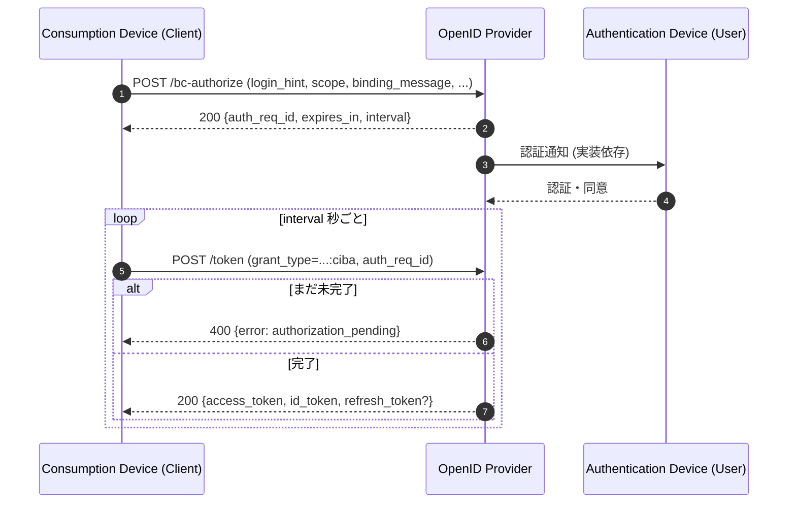
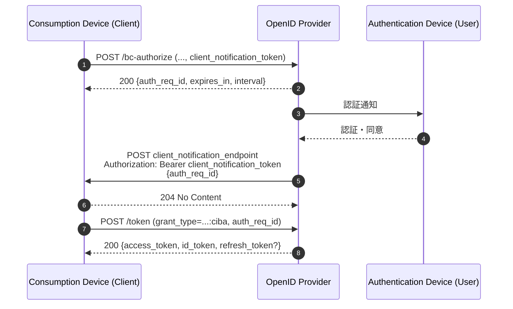
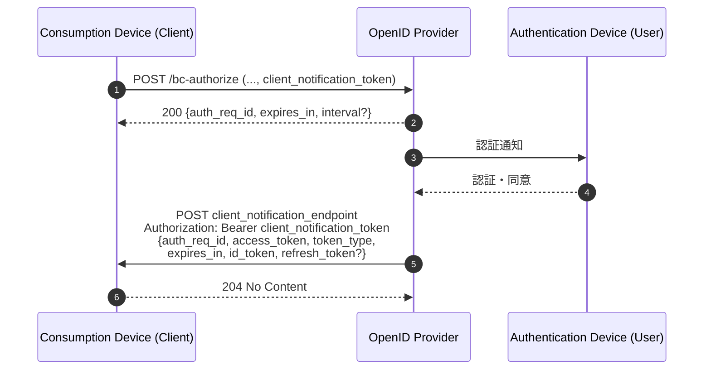

# OpenID Connect Client-Initiated Backchannel Authentication (CIBA) Core 1.0

## 1. 概要

OpenID Connect Client-Initiated Backchannel Authentication (CIBA) Core 1.0 は、Client (Relying Party) が End-User のブラウザ・リダイレクトを介さずに、Authentication Device (AD) 上のユーザーに対する認証・認可を OpenID Provider (OP) に要求できる認証フローを定義する仕様である。

通常の OpenID Connect Authorization Code Flow が「ユーザーが利用中のブラウザを OP にリダイレクトして認証を受け、その結果を Client に返す」ものであるのに対し、CIBA では Client が直接 OP のバックチャネル認証エンドポイントを呼び出し、OP が別のチャネル (典型的にはユーザーのスマートフォン上のアプリ) を通じてユーザーに認証・同意を求める。

このため CIBA は、コールセンターオペレーターによる本人確認、POS 端末での決済承認、スマートスピーカーや IoT デバイスからの認可など、Consumption Device (CD) と Authentication Device (AD) が物理的に異なる「分離フロー (Decoupled Flow)」のユースケースで広く利用される。FAPI 系プロファイル (FAPI-CIBA) や CAMARA / 通信事業者連携、金融機関のオープンバンキング API 等で参照されることが多い。

## 2. 解決する課題

リダイレクトベースのフローには、以下のような制約がある。

- Consumption Device がブラウザを持たない、あるいはユーザーインタラクション能力が限定的な場合 (CLI、POS、IVR、スマートスピーカー等) に適用しづらい
- CD と AD が物理的に別である場合、CD 側で QR コード等を表示してユーザーに AD に移ってもらうハイブリッド方式が必要となり、UX が複雑になる
- 操作主体が End-User ではなく、コールセンターのオペレーターのような第三者である場合、ユーザー認証の開始を CD 側 (オペレーターの画面) ではなく OP から AD に直接プッシュする方が自然である

CIBA はこれらを解決するため、以下を提供する。

- Client から OP への「認証開始要求 (Backchannel Authentication Request)」のための専用エンドポイント
- OP から AD への認証通知、AD でのユーザー操作、結果の OP への返却 (この部分は仕様の対象外で実装依存)
- 認証結果を Client が受け取るための 3 種類の Token Delivery Mode (Poll / Ping / Push)
- 認証要求を特定の人間に紐づけるための `login_hint`, `login_hint_token`, `id_token_hint` パラメータ
- CD 上に表示した文字列を AD 上でも確認させる `binding_message`、AD 上での誤承認を防ぐ `user_code` といったセキュリティ機構

## 3. 主要概念・用語

- **Authentication Device (AD)**: End-User が認証・同意を行うデバイス。通常はスマートフォン上のアプリ等。
- **Consumption Device (CD)**: Client が動作するデバイス、または Client を介して保護リソースを利用するデバイス。CD 上に End-User がいる必要はない。
- **Client / Relying Party (RP)**: バックチャネル認証要求を発行する主体。
- **Backchannel Authentication Endpoint**: OP 上のエンドポイント。Client はここに POST して認証フローを開始する。
- **`auth_req_id`**: バックチャネル認証要求を一意に識別するハンドル。OP がレスポンスとして返し、Client は以降この値で要求を参照する。
- **Token Delivery Mode**: 認証結果を Client が受け取る方式。`poll`, `ping`, `push` の 3 種類。Client メタデータ `backchannel_token_delivery_mode` で事前登録される。
- **`client_notification_token`**: Ping / Push モードで Client が発行する Bearer Token。OP からのコールバックを Client が認証するために用いる。
- **`binding_message`**: CD と AD の両方に表示することで、ユーザーが「自分が CD 上で開始した要求と AD に届いた要求は同一」であることを確認できる、人間可読な短い文字列。
- **`user_code`**: AD 側で要求の処理を許可するためにユーザーが入力するシークレットコード。CD/AD 分離下でのなりすまし攻撃を緩和する。

## 4. プロトコルフロー

### 4.1 Poll モード



### 4.2 Ping モード



### 4.3 Push モード



Push モードでは Client は Token エンドポイントを呼ばない。代わりに OP が認証結果と共にトークンそのものを通知エンドポイントへ送り込む。

## 5. 詳細解説

### 5.1 Backchannel Authentication Request

Client は OP の Backchannel Authentication Endpoint に `application/x-www-form-urlencoded` で POST する。主なパラメータは以下のとおり。

| パラメータ                  | 必須性            | 概要                                                         |
| --------------------------- | ----------------- | ------------------------------------------------------------ |
| `scope`                     | 必須              | アクセス要求のスコープ。`openid` を含めなければならない      |
| `client_notification_token` | Ping/Push で必須  | OP からのコールバックを Client が認証するための Bearer Token |
| `acr_values`                | 任意              | Authentication Context Class Reference の値 (空白区切り)     |
| `login_hint_token`          | いずれか 1 つ必須 | End-User を識別する情報を含むトークン (通常 JWT)             |
| `id_token_hint`             | 同上              | 当該 Client に過去に発行された ID Token                      |
| `login_hint`                | 同上              | End-User へのヒント (電話番号、メールアドレス等)             |
| `binding_message`           | 任意              | CD/AD 双方に表示する人間可読な短い文字列                     |
| `user_code`                 | OP メタデータ次第 | ユーザーが事前に設定したシークレットコード                   |
| `requested_expiry`          | 任意              | `auth_req_id` の希望有効期間 (秒)                            |

`login_hint_token` / `id_token_hint` / `login_hint` はいずれか 1 つだけを送る。`id_token_hint` については、ID Token の `exp` が過ぎていても OP は妥当な期間内であればヒントとして受け入れることが推奨されている (Section 14):

> An expired ID Token therefore could still be considered valid as an id_token_hint so an OP should, for some reasonable period, accept id_token_hints with an expiration time that has passed.

#### Signed Authentication Request (Section 7.1.1)

機密性・完全性が必要な場合、認証要求のすべてのパラメータを JWT のクレームとしてエンコードし、`request` パラメータに格納して送信できる。

> A signed authentication request is made by encoding all of the authentication request parameters as claims of a signed JWT with each parameter name as the claim name and its value as a JSON string.

この JWT には `aud` (OP の Issuer Identifier)、`iss` (`client_id`)、`exp`, `iat`, `nbf`, `jti` を含める必要があり、非対称鍵で署名しなければならない。

> The JWT MUST be secured with an asymmetric signature and follow the guidance from Section 10.1 of [OpenID.Core] regarding asymmetric signatures.

FAPI-CIBA など高保証プロファイルではこの Signed Request 形式が事実上必須となる。

### 5.2 Backchannel Authentication Response

成功時、OP は HTTP 200 で以下の JSON を返す。

```json
{
  "auth_req_id": "1c266114-a1be-4252-8ad1-04986c5b9ac1",
  "expires_in": 120,
  "interval": 2
}
```

- `auth_req_id`: 認証要求の識別子 (必須)
- `expires_in`: `auth_req_id` の有効期間 (秒、必須)
- `interval`: Poll/Ping の場合の最小ポーリング間隔 (秒、推奨)

### 5.3 Token Request (Poll / Ping)

```
POST /token HTTP/1.1
Host: op.example.com
Authorization: Basic ...
Content-Type: application/x-www-form-urlencoded

grant_type=urn%3Aopenid%3Aparams%3Agrant-type%3Aciba
&auth_req_id=1c266114-a1be-4252-8ad1-04986c5b9ac1
```

`grant_type` には CIBA 専用の `urn:openid:params:grant-type:ciba` を指定する。レスポンスは通常の Token Endpoint と同じく `access_token` / `id_token` / `refresh_token` 等を含む JSON である。

### 5.4 Ping / Push Notification

Ping モードでは OP は Client の `backchannel_client_notification_endpoint` に対して以下のような POST を行う。

```
POST /ciba-callback HTTP/1.1
Host: client.example.com
Authorization: Bearer <client_notification_token>
Content-Type: application/json

{ "auth_req_id": "1c266114-a1be-4252-8ad1-04986c5b9ac1" }
```

Push モードでは同じエンドポイントに対し、本文に `access_token`, `token_type`, `expires_in`, `id_token`, 必要に応じて `refresh_token` を含めて通知する。Client は受領した時点で HTTP 200 番台で応答する。

### 5.5 ID Token の追加クレーム

Push モードで発行される ID Token は、ID Token・Access Token・Refresh Token・`auth_req_id` を互いに結びつけるため、以下のクレームを含む必要がある (Section 10.3.1)。

- `at_hash`: Access Token のハッシュ
- `urn:openid:params:jwt:claim:rt_hash`: Refresh Token のハッシュ
- `urn:openid:params:jwt:claim:auth_req_id`: 対応する `auth_req_id`

これにより Client は、受け取ったトークン群が改ざんされておらず、自身が開始した特定の認証要求の結果であることを検証できる。

### 5.6 エラーレスポンス

#### Backchannel Authentication Endpoint

| HTTP | error                      | 概要                                   |
| ---- | -------------------------- | -------------------------------------- |
| 400  | `invalid_request`          | 必須パラメータ欠落・不正値             |
| 400  | `invalid_scope`            | スコープが不正                         |
| 400  | `expired_login_hint_token` | `login_hint_token` が期限切れ          |
| 400  | `unknown_user_id`          | OP がユーザーを特定できない            |
| 400  | `unauthorized_client`      | このフローでの認可が Client に無い     |
| 400  | `missing_user_code`        | `user_code` が必要なのに未指定         |
| 400  | `invalid_user_code`        | `user_code` が不正                     |
| 400  | `invalid_binding_message`  | `binding_message` が不正・受け入れ不可 |
| 401  | `invalid_client`           | クライアント認証失敗                   |
| 403  | `access_denied`            | リソースオーナーまたは OP が拒否       |

#### Token Endpoint (CIBA 固有)

| error                   | 意味                                                                             |
| ----------------------- | -------------------------------------------------------------------------------- |
| `authorization_pending` | 認可要求は処理中。Client は `interval` を維持してポーリング継続                  |
| `slow_down`             | `authorization_pending` の派生。`interval` を 5 秒以上引き上げてポーリングを継続 |
| `expired_token`         | `auth_req_id` が期限切れ。新規に認証要求を作り直す必要がある                     |
| `access_denied`         | エンドユーザーが拒否した                                                         |
| `invalid_grant`         | `auth_req_id` が無効、または他の Client に発行されたもの                         |
| `unauthorized_client`   | Client が Push モードで構成されているため Token Endpoint からの取得ができない    |

### 5.7 クライアント認証

> The Client MUST authenticate to the Backchannel Authentication Endpoint using the authentication method registered for its client_id.

CIBA は Confidential Client 限定で、Backchannel Authentication Endpoint・Token Endpoint の双方で、登録済みのクライアント認証方式 (`client_secret_basic`, `client_secret_jwt`, `private_key_jwt`, `tls_client_auth` 等) を用いて認証しなければならない。JWT ベースの client assertion を用いる場合、`audience` には OP の Issuer Identifier を用いることが推奨される。

### 5.8 Discovery / Registration メタデータ

OP の Discovery メタデータ:

- `backchannel_token_delivery_modes_supported` (必須): サポートする Delivery Mode の配列 (`poll`, `ping`, `push`)
- `backchannel_authentication_endpoint` (必須): バックチャネル認証エンドポイントの URL
- `backchannel_authentication_request_signing_alg_values_supported` (任意): Signed Request で許容する署名アルゴリズム
- `backchannel_user_code_parameter_supported` (任意): `user_code` をサポートするか

Client メタデータ:

- `backchannel_token_delivery_mode` (必須): Client がどのモードを使うか
- `backchannel_client_notification_endpoint` (Ping/Push で必須): 通知受信エンドポイント
- `backchannel_authentication_request_signing_alg` (任意): Signed Request で利用する署名アルゴリズム
- `backchannel_user_code_parameter` (任意): `user_code` を利用するか

## 6. セキュリティに関する考慮事項

CIBA はリダイレクトを行わないため、Client / OP / AD / End-User 間の信頼確立の責任配分が通常の OpenID Connect と異なる点に注意が必要である。仕様 Section 13・14 で挙げられている主要な観点を以下に整理する。

- **`login_hint_token` の保護**: 発行者によるデジタル署名が推奨される。"The login_hint_token SHOULD be digitally signed by the issuer." とされており、偽造された hint による認証要求注入を防ぐ。
- **CD と End-User の分離**: CD 側に正規ユーザーがいるとは限らない (例: コールセンターオペレーター)。`binding_message` で AD 上に CD で開始した文脈を表示させ、ユーザーが「いま自分が開始した要求である」ことを確認できるようにする。`binding_message` は人間可読かつ短い必要がある。
- **`user_code`**: 攻撃者が被害者の電話番号等を `login_hint` として送り込み、被害者の AD に承認画面を出して反射的にタップさせるような攻撃を緩和する。`user_code` の入力を要求する場合、それは AD 側でも検証可能である必要がある。
- **`client_notification_endpoint` の所有確認**: "The OP SHOULD ensure that the 'backchannel_client_notification_endpoint' configured at registration time is in the administrative authority of the Client." 登録時に管理権限を確認することで、通知の宛先が攻撃者にすり替えられた Client なりすましを防ぐ。
- **`client_notification_token`**: Ping/Push コールバックの Bearer Token として Client が生成する。OP は受領した通知をこのトークンで検証する。十分なエントロピーを持たせる必要がある。
- **Push モードのトークン束縛**: Push モードでは OP がトークンそのものを送り込むため、ID Token に `at_hash` / `rt_hash` / `auth_req_id` を含めることで「受け取ったトークン群が改ざんされていないこと」「自身が開始した認証要求の結果であること」を Client が検証できるようにする。
- **Sender-Constrained Tokens**: Push モードでは通知経路の途中でトークンが傍受されるリスクがあるため、mTLS (RFC 8705) や DPoP (RFC 9449) による sender-constrained access token の発行が推奨される。"Implementers using push tokens should also consider issuing sender-constrained access tokens to mitigate the risk of the tokens being intercepted."
- **Polling 攻撃の抑制**: `interval` および `slow_down` レスポンスを尊重しない Client は OP に過剰な負荷を与えうる。OP は `interval` 未満の Token Request に対して `slow_down` を返し、Client に指数的バックオフを促す。
- **`auth_req_id` の取り扱い**: `auth_req_id` は事実上の認可コードに相当する一時クレデンシャルであり、ログ等に平文で残さない、推測困難な値を用いる等の配慮が必要である。

## 7. 関連仕様

- [OpenID Connect Core 1.0](./openid-connect-core.md): CIBA のクレーム・ID Token の基本構造を定義する。
- [OpenID Connect Discovery 1.0](./openid-connect-discovery.md): `backchannel_*` メタデータの公開先となる。
- [OpenID Connect Dynamic Client Registration 1.0](./openid-connect-registration.md): Client メタデータ (`backchannel_token_delivery_mode` 等) の登録に用いる。
- [RFC 8705 - OAuth 2.0 Mutual-TLS Client Authentication and Certificate-Bound Access Tokens](./rfc8705.md): Push モードでの sender-constrained token に利用される。
- [RFC 9449 - OAuth 2.0 Demonstrating Proof of Possession (DPoP)](./rfc9449.md): 同上。
- **FAPI-CIBA Profile (OpenID Foundation FAPI WG)**: 金融業界向けに CIBA の利用方法を制約・強化したプロファイル。`private_key_jwt`、Signed Request、mTLS / DPoP 等を組み合わせて利用する。
- **CAMARA Project**: 通信事業者の API 標準化を行うプロジェクト。CIBA を通信回線情報を `login_hint` とする番号認証フロー等で利用する。

## 8. 参考文献

- [OpenID Connect Client-Initiated Backchannel Authentication Flow - Core 1.0 (openid.net)](https://openid.net/specs/openid-client-initiated-backchannel-authentication-core-1_0.html)
- [OpenID Foundation MODRNA Working Group](https://openid.net/wg/mobile/)
- [FAPI 2.0 / FAPI-CIBA - OpenID Foundation FAPI WG](https://openid.net/wg/fapi/)
