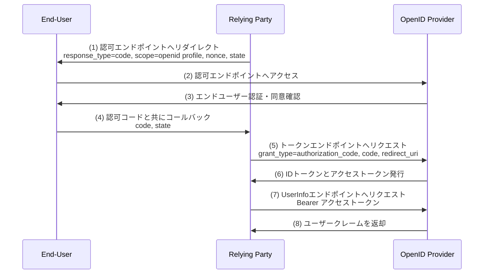
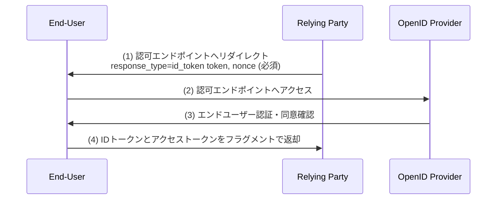

# OpenID Connect Core 1.0

## 概要

OpenID Connect Core 1.0 は、OAuth 2.0（RFC 6749）の上にシンプルなアイデンティティレイヤーを追加した認証プロトコルである。2014年2月にOpenID Foundationによって公開された。

OAuth 2.0 が「リソースへのアクセス認可」を提供するのに対し、OpenID Connect は「エンドユーザーの認証」という役割を担う。クライアントは認可サーバーによる認証を検証し、エンドユーザーのプロフィール情報をRESTful APIで取得できる。

## 解決する課題

OAuth 2.0 はリソースへのアクセス認可を提供するが、「誰がアクセスしているか」を証明するアイデンティティ情報の仕組みは含まない。これにより以下の課題が生じていた。

- **認証と認可の混同**: 多くのサービスがOAuth 2.0を認証に流用していたが、これは本来の用途ではなく安全でない
- **ユーザー情報取得の標準化不足**: サービスごとに独自のユーザー情報エンドポイントを実装しており、互換性がなかった
- **ID情報の改ざん防止**: アクセストークンだけでは、ユーザーを識別するクレームの完全性を保証できなかった

OpenID Connect はIDトークン（JWT形式）とUserInfoエンドポイントを標準化することで、これらの課題を解決する。

## 主要概念・用語

### ロール

OpenID Connect は OAuth 2.0 のロールを継承しつつ、以下の名称・概念を使用する。

| ロール                                 | 説明                                                                |
| -------------------------------------- | ------------------------------------------------------------------- |
| **エンドユーザー (End-User)**          | 認証対象の人間のユーザー                                            |
| **RPクライアント (Relying Party, RP)** | OpenID Providerに認証を依頼するクライアントアプリケーション         |
| **OPサーバー (OpenID Provider, OP)**   | エンドユーザーの認証を行い、クレームを提供するOAuth 2.0認可サーバー |

### IDトークン (ID Token)

OpenID Connect の中心的な概念。OAuth 2.0 のアクセストークンに加えて発行されるJWT形式のセキュリティトークンであり、認証情報を表現する。

必須クレーム:

| クレーム | 説明                                                           |
| -------- | -------------------------------------------------------------- |
| `iss`    | IDトークンの発行者識別子（URL形式）                            |
| `sub`    | サブジェクト識別子（エンドユーザーの識別子、最大255文字）      |
| `aud`    | このIDトークンを対象とするクライアントID（audienceとして含む） |
| `exp`    | 有効期限（UNIX時間）                                           |
| `iat`    | IDトークン発行時刻（UNIX時間）                                 |

主な任意クレーム:

| クレーム    | 説明                                                             |
| ----------- | ---------------------------------------------------------------- |
| `auth_time` | エンドユーザーが認証された時刻                                   |
| `nonce`     | リプレイ攻撃防止用のランダム値（RPがリクエストに含めた値を返す） |
| `acr`       | 認証コンテキストクラス参照（認証強度のレベル）                   |
| `amr`       | 認証方式参照（使用された認証方式のリスト）                       |
| `azp`       | 認可されたパーティ（`aud`が複数の場合に使用）                    |

### クレームとスコープ

OpenID Connect は標準クレーム（Standard Claims）を定義し、スコープによってクレームをグループ化する。

| スコープ  | 取得できる主なクレーム                                      |
| --------- | ----------------------------------------------------------- |
| `openid`  | (必須) `sub` クレームを含むIDトークンの発行を要求           |
| `profile` | `name`, `given_name`, `family_name`, `picture`, `locale` 等 |
| `email`   | `email`, `email_verified`                                   |
| `phone`   | `phone_number`, `phone_number_verified`                     |
| `address` | `address`（構造化されたアドレスオブジェクト）               |

`openid` スコープは必須であり、これを含めることでOpenID Connectのリクエストとなる。

### UserInfoエンドポイント

エンドユーザーに関するクレームを返すOPが提供するRESTfulエンドポイント。アクセストークンを Bearer トークンとして提示することでクレームを取得できる。

- **URL**: HTTPSを使用（HTTP不可）
- **方法**: GETまたはPOST
- **レスポンス形式**: JSON（または署名・暗号化されたJWT）

## 認証フロー

OpenID Connect は3つの認証フローを定義する。`response_type` パラメータで使用するフローを指定する。

| フロー                  | response_type                      | トークン取得元                                   |
| ----------------------- | ---------------------------------- | ------------------------------------------------ |
| Authorization Code Flow | `code`                             | トークンエンドポイント                           |
| Implicit Flow           | `id_token` または `id_token token` | 認可エンドポイント                               |
| Hybrid Flow             | `code id_token` 等                 | 認可エンドポイントとトークンエンドポイントの両方 |

### Authorization Code Flow（認可コードフロー）

最も推奨されるフロー。RPはまず認可コードを取得し、それをIDトークンとアクセストークンに交換する。



**特徴:**

- IDトークンがフロントチャネル（ブラウザ）を経由しないため、漏洩リスクが低い
- RPはクライアント認証によりIDトークンの正当な受取人であることを証明できる
- PKCE（RFC 7636）と組み合わせることでさらに安全性が高まる

### Implicit Flow（インプリシットフロー）

IDトークンが認可エンドポイントから直接返される。現在は多くのケースで非推奨とされている。



**特徴:**

- `nonce` クレームが必須（リプレイ攻撃防止）
- `at_hash` クレームによりIDトークンとアクセストークンの紐付けを検証できる
- トークンがURLフラグメントに含まれるためブラウザ履歴や参照元に漏洩するリスクがある

### Hybrid Flow（ハイブリッドフロー）

認可エンドポイントとトークンエンドポイントの両方からトークンを取得する。一部のトークンを即座に取得しつつ、他のトークンをセキュアなバックチャネルで取得できる。

`response_type` の指定例:

| response_type         | 認可エンドポイント             | トークンエンドポイント  |
| --------------------- | ------------------------------ | ----------------------- |
| `code id_token`       | code + id_token                | id_token + access_token |
| `code token`          | code + access_token            | id_token + access_token |
| `code id_token token` | code + id_token + access_token | id_token + access_token |

## 詳細解説

### IDトークンの検証

RPはIDトークンを受け取った後、以下の検証を行う必要がある。

1. **署名の検証**: OPの公開鍵でJWSシグネチャを検証する
2. **`iss` の検証**: `iss` クレームがOPの識別子と一致することを確認する
3. **`aud` の検証**: `aud` クレームにRP自身のクライアントIDが含まれることを確認する
4. **`azp` の検証**: `aud` に複数の値がある場合、`azp` クレームがクライアントIDと一致することを確認する
5. **`exp` の検証**: トークンが有効期限内であることを確認する（時計ずれの許容範囲に注意）
6. **`iat` の検証**: 発行時刻が妥当な範囲内であることを確認する
7. **`nonce` の検証**: リクエスト時に `nonce` を送った場合、IDトークンの `nonce` クレームと一致することを確認する

### ハッシュクレームによるトークン検証

Hybrid Flow や Implicit Flow では、IDトークンに以下のハッシュクレームが含まれ、トークン改ざんを検知できる。

| クレーム  | 対象トークン     | 説明                                                           |
| --------- | ---------------- | -------------------------------------------------------------- |
| `at_hash` | アクセストークン | アクセストークンのASCIIオクテットの左半分をBase64urlエンコード |
| `c_hash`  | 認可コード       | 認可コードのASCIIオクテットの左半分をBase64urlエンコード       |

ハッシュ計算方法: IDトークンの `alg` ヘッダーに対応するハッシュアルゴリズム（例: RS256 → SHA-256）でトークンをハッシュし、先頭の半分のバイト列をBase64urlエンコードする。

### 認証リクエストパラメータ

OpenID Connect では OAuth 2.0 のパラメータに加えて以下を定義する。

| パラメータ      | 必須/任意 | 説明                                                                                                                   |
| --------------- | --------- | ---------------------------------------------------------------------------------------------------------------------- |
| `scope`         | 必須      | `openid` を含む必要がある                                                                                              |
| `response_type` | 必須      | 使用するフローを指定                                                                                                   |
| `client_id`     | 必須      | RPのクライアントID                                                                                                     |
| `redirect_uri`  | 必須      | レスポンスの送信先URI                                                                                                  |
| `nonce`         | 推奨      | リプレイ攻撃防止用のランダム値（Implicit Flow、および Hybrid Flow の `code id_token`・`code id_token token` では必須） |
| `display`       | 任意      | 認証・同意UIの表示方法（`page`, `popup`, `touch`, `wap`）                                                              |
| `prompt`        | 任意      | OPの動作指示（`none`, `login`, `consent`, `select_account`）                                                           |
| `max_age`       | 任意      | 許容される最大認証経過時間（秒）。この秒数以上前に認証されていた場合は再認証を要求する                                 |
| `ui_locales`    | 任意      | UIに使用する言語の優先順位リスト（BCP 47形式）                                                                         |
| `id_token_hint` | 任意      | 以前に発行されたIDトークン（OPへのヒントとして使用）                                                                   |
| `login_hint`    | 任意      | エンドユーザーのログイン識別子のヒント（メールアドレス等）                                                             |
| `acr_values`    | 任意      | 要求する認証コンテキストクラス参照値のリスト                                                                           |
| `claims`        | 任意      | 特定のクレームをリクエストするためのJSONオブジェクト                                                                   |
| `request`       | 任意      | リクエストパラメータを含むJWT（Request Object）                                                                        |
| `request_uri`   | 任意      | Request ObjectのURI                                                                                                    |

### `prompt` パラメータ

`prompt` パラメータでOPの認証・同意UIの挙動を制御できる。

| 値               | 説明                                                                       |
| ---------------- | -------------------------------------------------------------------------- |
| `none`           | UIを表示しない。セッションが存在しない場合や同意が必要な場合はエラーを返す |
| `login`          | エンドユーザーに再認証を要求する                                           |
| `consent`        | エンドユーザーに同意を要求する（同意済みの場合でも再表示）                 |
| `select_account` | エンドユーザーにアカウント選択を求める                                     |

### クレームのリクエスト

`claims` リクエストパラメータを使用して、特定のクレームをIDトークンまたはUserInfoレスポンスで取得するよう要求できる。

```json
{
  "userinfo": {
    "given_name": { "essential": true },
    "nickname": null,
    "email": { "essential": true },
    "email_verified": { "essential": true }
  },
  "id_token": {
    "auth_time": { "essential": true },
    "acr": { "values": ["urn:mace:incommon:iap:silver"] }
  }
}
```

`essential: true` はそのクレームが認可処理に必須であることを示す（ただし、OPへの要求であり必ず返される保証はない）。

### サブジェクト識別子

OPは以下の2種類のサブジェクト識別子タイプを提供できる。

| タイプ     | 説明                                                                          |
| ---------- | ----------------------------------------------------------------------------- |
| `public`   | 全RPに対して同一の `sub` 値を提供する。複数RPをまたぐ連携が可能               |
| `pairwise` | RPごとに異なる `sub` 値を提供する。RPをまたいだユーザートラッキングを防止する |

### セッション管理とログアウト

OpenID Connect Core 自体はセッション管理を規定しないが、関連仕様で定義されている。

- **Front-Channel Logout**: ログイン中のRPにHTTP GETリクエストでログアウトを通知
- **Back-Channel Logout**: バックエンドのHTTPリクエストでRPにログアウトを通知
- **RP-Initiated Logout**: RPがOPのend_session_endpointにリダイレクトして全セッションを終了

## セキュリティに関する考慮事項

### TLSの必須化

全エンドポイント（認可エンドポイント、トークンエンドポイント、UserInfoエンドポイント）でHTTPSが必須。

### IDトークンの署名と暗号化

- IDトークンへの署名は必須（デフォルトはRS256）
- 必要に応じてIDトークンを暗号化できる（JWE形式）
- `none` アルゴリズム（署名なし）の使用は限定的な状況にのみ許容される

### Nonceによるリプレイ攻撃防止

RPはリクエスト時に推測困難なランダム値を `nonce` パラメータに設定し、受け取ったIDトークンの `nonce` クレームと照合する必要がある。Implicit Flow では `nonce` の使用が必須。

### トークンバインディングとリダイレクトURIの検証

- OPは `redirect_uri` を事前登録済みの値と完全一致で検証する
- `state` パラメータによるCSRF攻撃防止はOAuth 2.0 と同様

### `prompt=none` の安全な利用

`prompt=none` はサイレント認証に使用されるが、意図しないセッション情報の漏洩に注意が必要。応答に含まれる `sub` クレームが既知のユーザーと一致するかを検証すること。

### pairwise サブジェクト識別子

プライバシーが重要なユースケースでは pairwise サブジェクト識別子を使用し、複数RPをまたいだユーザートラッキングを防止することが推奨される。

## 関連仕様

| 仕様                                    | 概要                                                    |
| --------------------------------------- | ------------------------------------------------------- |
| RFC 6749                                | OAuth 2.0 認可フレームワーク（OpenID Connectの基盤）    |
| RFC 7519                                | JSON Web Token (JWT)（IDトークンのフォーマット）        |
| RFC 7515                                | JSON Web Signature (JWS)（IDトークンの署名）            |
| RFC 7516                                | JSON Web Encryption (JWE)（IDトークンの暗号化）         |
| RFC 7517                                | JSON Web Key (JWK)（OPの公開鍵の表現形式）              |
| RFC 7636                                | PKCE（Authorization Code Flowとの組み合わせで推奨）     |
| OpenID Connect Discovery 1.0            | OPのメタデータ（エンドポイントURL等）の自動取得         |
| OpenID Connect Dynamic Registration 1.0 | RPの動的なクライアント登録                              |
| OpenID Connect Session Management 1.0   | セッション管理とログアウト                              |
| FAPI 2.0                                | 金融APIのための高セキュリティOpenID Connectプロファイル |

## 参考文献

- [OpenID Connect Core 1.0 原文](https://openid.net/specs/openid-connect-core-1_0.html)
- [RFC 6749 - The OAuth 2.0 Authorization Framework](https://www.rfc-editor.org/rfc/rfc6749)
- [RFC 7519 - JSON Web Token (JWT)](https://www.rfc-editor.org/rfc/rfc7519)
- [OpenID Connect 仕様一覧 (OpenID Foundation)](https://openid.net/developers/specs/)
