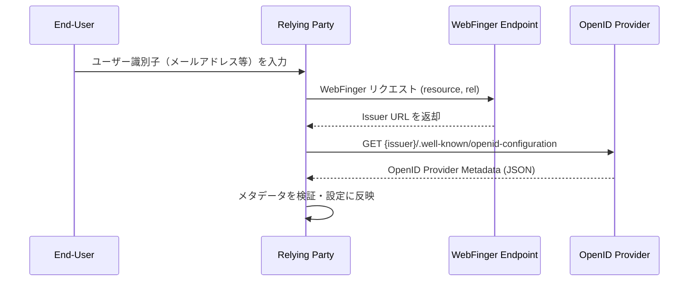

# OpenID Connect Discovery 1.0

## 概要

OpenID Connect Discovery 1.0 は、Relying Party（RP）が OpenID Provider（OP）を動的に発見し、その設定情報を自動取得するための仕様である。OpenID Foundation によって OpenID Connect コアスペックと同時に2014年2月に公開された。

この仕様により、RP は OP のエンドポイントURLや対応アルゴリズム、サポートするスコープといった設定情報を手動で事前設定することなく、標準化された手順で取得できる。

## 解決する課題

OpenID Connect Core 1.0 は認証プロトコルを定義するが、RP が OP の各種エンドポイント（認可エンドポイント、トークンエンドポイント等）を知る手段は規定しない。これにより以下の課題があった。

- **手動設定の煩雑さ**: RP は OP ごとにエンドポイントURLや対応アルゴリズムを個別に調査・設定する必要があった
- **設定の陳腐化**: OP がエンドポイントを変更した際、RP 側の設定を手動で更新しなければならなかった
- **エコシステムの拡張困難**: 不特定多数の OP と連携するサービス（フェデレーションハブ等）では、静的設定では対応しきれなかった

OpenID Connect Discovery は WebFinger プロトコルによるプロバイダ発見と、標準化されたメタデータエンドポイントによる設定取得の2段階でこの課題を解決する。

## 主要概念・用語

| 用語                         | 説明                                                                              |
| ---------------------------- | --------------------------------------------------------------------------------- |
| **Issuer**                   | OPの識別子。スキームが `https`、クエリ・フラグメントなしのURLで表される           |
| **OpenID Provider Metadata** | OPのエンドポイントやサポート機能を記述するJSONドキュメント                        |
| **WebFinger**                | ユーザー識別子からOPのIssuerを解決するプロトコル（RFC 7033）                      |
| **Discovery Endpoint**       | OPのメタデータを公開する標準エンドポイント（`/.well-known/openid-configuration`） |

## ディスカバリーフロー

OpenID Connect Discovery は以下の2段階で構成される。ただし、Issuerが既知の場合は WebFinger を省略し、直接メタデータエンドポイントへアクセスすることもできる。

### 全体フロー



### ステップ1: 識別子の正規化

ユーザーが入力する識別子はさまざまな形式を取りうる。RP はこれを以下のルールで正規化する。

- メール形式（`joe@example.com`）→ `acct:joe@example.com`
- スキームなしホスト名（`example.com`）→ `https://example.com`
- 明示的なスキームはそのまま保持

### ステップ2: WebFinger によるプロバイダ発見

RP はユーザーのドメインにある WebFinger エンドポイントへ問い合わせる。

**リクエスト例:**

```
GET /.well-known/webfinger
  ?resource=acct%3Ajoe%40example.com
  &rel=http%3A%2F%2Fopenid.net%2Fspecs%2Fconnect%2F1.0%2Fissuer
Host: example.com
```

`rel` パラメータには必ず `http://openid.net/specs/connect/1.0/issuer` を指定する。

**レスポンス例:**

```json
{
  "subject": "acct:joe@example.com",
  "links": [
    {
      "rel": "http://openid.net/specs/connect/1.0/issuer",
      "href": "https://server.example.com"
    }
  ]
}
```

`href` の値が OP の Issuer URL となる。

### ステップ3: プロバイダメタデータの取得

RP は取得した Issuer URL に `/.well-known/openid-configuration` を付加してGETリクエストを送る。

```
GET /.well-known/openid-configuration
Host: server.example.com
```

OP は JSON 形式のメタデータを返す。

## OpenID Provider Metadata

### 必須フィールド

| フィールド                              | 説明                                                          |
| --------------------------------------- | ------------------------------------------------------------- |
| `issuer`                                | OPの識別子（HTTPS URL、クエリ・フラグメントなし）             |
| `authorization_endpoint`                | OAuth 2.0 認可エンドポイントのURL                             |
| `jwks_uri`                              | OP の公開鍵（JWK Set）を公開するURL                           |
| `response_types_supported`              | サポートするレスポンスタイプの配列                            |
| `subject_types_supported`               | サポートするサブジェクト識別子タイプ（`public` / `pairwise`） |
| `id_token_signing_alg_values_supported` | IDトークン署名に使用するJWSアルゴリズム（`RS256` は必須）     |

### 条件付き必須フィールド

| フィールド       | 条件                                             |
| ---------------- | ------------------------------------------------ |
| `token_endpoint` | Implicit Flow のみをサポートする場合を除いて必須 |

### 推奨フィールド

| フィールド              | 説明                                            |
| ----------------------- | ----------------------------------------------- |
| `userinfo_endpoint`     | UserInfo エンドポイントのURL                    |
| `registration_endpoint` | Dynamic Client Registration エンドポイントのURL |
| `scopes_supported`      | サポートするOAuth 2.0スコープの配列             |
| `claims_supported`      | 提供可能なクレームの配列                        |

### 主な任意フィールド

| フィールド                                    | 説明                                                               |
| --------------------------------------------- | ------------------------------------------------------------------ |
| `response_modes_supported`                    | サポートするレスポンスモード（`query`, `fragment`, `form_post`等） |
| `grant_types_supported`                       | サポートするグラントタイプ                                         |
| `acr_values_supported`                        | サポートする認証コンテキストクラス参照値                           |
| `id_token_encryption_alg_values_supported`    | IDトークン暗号化に使用するJWEアルゴリズム                          |
| `userinfo_signing_alg_values_supported`       | UserInfo レスポンスの署名アルゴリズム                              |
| `request_object_signing_alg_values_supported` | リクエストオブジェクトの署名アルゴリズム                           |
| `token_endpoint_auth_methods_supported`       | トークンエンドポイントのクライアント認証方式                       |
| `claims_parameter_supported`                  | `claims` パラメータのサポート有無                                  |
| `request_parameter_supported`                 | `request` パラメータ（JAR）のサポート有無                          |
| `request_uri_parameter_supported`             | `request_uri` パラメータのサポート有無                             |
| `require_request_uri_registration`            | `request_uri` の事前登録要否                                       |
| `service_documentation`                       | 開発者向けドキュメントのURL                                        |
| `op_policy_uri`                               | OPのプライバシーポリシーURL                                        |
| `op_tos_uri`                                  | OPの利用規約URL                                                    |

### メタデータレスポンス例

```json
{
  "issuer": "https://server.example.com",
  "authorization_endpoint": "https://server.example.com/connect/authorize",
  "token_endpoint": "https://server.example.com/connect/token",
  "userinfo_endpoint": "https://server.example.com/connect/userinfo",
  "jwks_uri": "https://server.example.com/jwks.json",
  "registration_endpoint": "https://server.example.com/connect/register",
  "scopes_supported": ["openid", "profile", "email"],
  "response_types_supported": ["code", "token", "id_token", "code token"],
  "subject_types_supported": ["public", "pairwise"],
  "id_token_signing_alg_values_supported": ["RS256", "ES256"],
  "token_endpoint_auth_methods_supported": ["client_secret_basic", "private_key_jwt"],
  "claims_supported": ["sub", "iss", "name", "email", "email_verified"]
}
```

## Issuer の検証

仕様は Issuer 識別子の厳格な検証を要求する。

```mermaid
flowchart TD
    A[WebFinger レスポンスから href 取得] --> B{href が\nhttps://? }
    B -- No --> E[エラー: TLS必須]
    B -- Yes --> C[GET {href}/.well-known/openid-configuration]
    C --> D{レスポンスの issuer が\nhref と一致?}
    D -- No --> F[エラー: Issuer 不一致]
    D -- Yes --> G[メタデータ使用可能]
```

RP は以下をすべて確認しなければならない。

1. WebFinger レスポンスの `href` フィールドが HTTPS URL である
2. メタデータドキュメントの `issuer` が `href` と完全に一致する
3. IDトークンの `iss` クレームがこの `issuer` と一致する

## セキュリティに関する考慮事項

### TLS の必須化

すべての通信（WebFinger、メタデータ取得）は TLS で保護しなければならない。RFC 6125 に従ったサーバー証明書検証が必須である。

### なりすまし（Impersonation）の防止

WebFinger でユーザーが入力した識別子のドメインにリクエストを送っても、返却される Issuer は別ドメインである可能性がある（例: `joe@gmail.com` を入力しても Issuer は `https://accounts.google.com` となる）。この挙動自体は仕様で許容されているが、RP はユーザー入力の識別子と Issuer の間に信頼関係を仮定してはならない。

重要なのは、WebFinger レスポンスの `href` とメタデータの `issuer` が一致していることを必ず検証することである。

### CSRF 防止

WebFinger など Web 入力フォームを使用する場合は、CSRF 対策を必ず実施しなければならない。

### メタデータの完全性

メタデータの検証に失敗した場合、その情報を必要とするすべての操作を中断しなければならない。

## 関連仕様

| 仕様                                             | 関係                                                                         |
| ------------------------------------------------ | ---------------------------------------------------------------------------- |
| [OpenID Connect Core 1.0](./openid-connect-core) | ディスカバリで取得した設定情報を利用する認証プロトコル                       |
| RFC 7033 (WebFinger)                             | ユーザー識別子からIssuerを解決するプロトコル                                 |
| RFC 5785                                         | `/.well-known/` URIパターンを定義                                            |
| [RFC 6749](./rfc6749)                            | 基盤となるOAuth 2.0フレームワーク                                            |
| [RFC 7517](./rfc7517)                            | `jwks_uri` で公開される JWK Set のフォーマット                               |
| RFC 7591 (Dynamic Client Registration)           | `registration_endpoint` で実行されるクライアント登録プロトコル               |
| [RFC 8414](./rfc8414)                            | OAuth 2.0 Authorization Server Metadata（類似のメカニズムをOAuth 2.0に拡張） |

## 参考文献

- [OpenID Connect Discovery 1.0 incorporating errata set 2](https://openid.net/specs/openid-connect-discovery-1_0.html)
- [RFC 7033 - WebFinger](https://www.rfc-editor.org/rfc/rfc7033)
- [RFC 5785 - Defining Well-Known Uniform Resource Identifiers (URIs)](https://www.rfc-editor.org/rfc/rfc5785)
