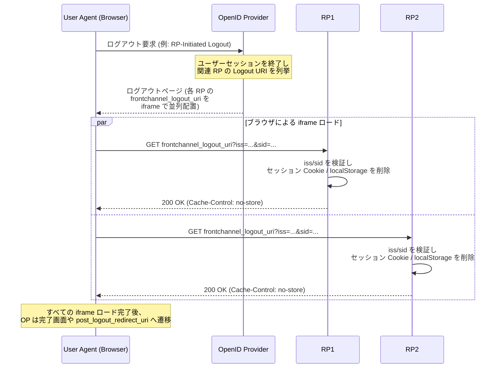

# OpenID Connect Front-Channel Logout 1.0

## 1. 概要

OpenID Connect Front-Channel Logout 1.0 は、OpenID Provider (OP) からリライングパーティ (Relying Party, RP) に対してエンドユーザーのセッション終了を通知するための、ユーザーエージェント (ブラウザ) を経由したフロントチャネル方式のログアウトメカニズムを定義する仕様である。2022 年 9 月 12 日に Final として発行され、編集者は M. Jones (Self-Issued Consulting、当時 Microsoft) である。

本仕様は、OP が動的に構築したログアウトページ上に各 RP の `frontchannel_logout_uri` を `src` 属性に持つ `iframe` 要素を並べて埋め込み、ブラウザが各 iframe を読み込む過程で RP 側のセッション (Cookie や HTML5 ローカルストレージ等) をクリアさせるという仕組みを採る。OP が自身のページに RP の iframe を埋め込む点が特徴であり、Session Management 1.0 のように RP のページに OP の iframe を埋め込んで `postMessage` でセッション状態を継続的にポーリングする方式とは方向が逆である。

OpenID Connect のシングルログアウトに関する仕様群は以下のように整理できる。

- RP-Initiated Logout 1.0: RP からの要求によって OP のエンドセッションエンドポイントを呼び出し、OP のセッションを終了させるフロー
- Front-Channel Logout 1.0 (本仕様): OP のログアウト処理ページから iframe 経由で複数 RP のセッションをまとめて終了させるフロー
- Back-Channel Logout 1.0: OP が各 RP のサーバーエンドポイントへ直接 Logout Token を POST するフロー
- Session Management 1.0: RP が OP のセッション状態を iframe + `postMessage` で監視するフロー

Front-Channel Logout は実装が比較的単純で、RP 側にバックエンドの新しいエンドポイントを用意する必要がなく、Cookie や localStorage を直接削除できるという利点がある反面、ブラウザのサードパーティコンテンツ制限の影響を強く受けるという制約も併せ持つ。

## 2. 解決する課題

OpenID Connect のシングルサインオン (SSO) 環境では、ユーザーが OP もしくはいずれかの RP でログアウトしたとき、その OP に紐づく他のすべての RP セッションも一貫して終了させることが望ましい (シングルログアウト)。Front-Channel Logout が想定する課題は次の点である。

- RP は自身のセッションを Cookie や HTML5 ローカルストレージなど「ブラウザに保持された状態」として管理していることが多い。サーバー側のセッションストアに加え、ブラウザ側の状態を確実にクリアしないと、ブラウザを再読み込みするだけでセッションが復元されてしまうケースがある
- Back-Channel Logout のようなサーバー間通信では、OP から RP のサーバーへ Logout Token を送ることはできても、ユーザーのブラウザに残った Cookie や localStorage には直接触れられない。RP がブラウザ状態をクリアするには、結局ユーザーが次回 RP へアクセスしたタイミングを待つ必要がある
- 一方で、Session Management 1.0 は OP の iframe を RP のページに常時埋め込んでセッション変化をポーリングする方式であり、RP ページが開いている間しか動作しないうえ、サードパーティ Cookie の制限と相性が悪い

Front-Channel Logout は、ログアウトを開始したユーザーエージェントがまだ OP のページ上にいるという前提で、その瞬間に OP のログアウトページ内で各 RP の `frontchannel_logout_uri` を iframe として並列に読み込み、ブラウザコンテキスト内で RP のセッションクリア処理を実行させる。ブラウザ内のリソース (Cookie、localStorage) に対するアクセスが必要なため、本仕様はそのフローを最も自然に表現する。

ただし、近年の主要ブラウザではトラッキング防止の観点からサードパーティ Cookie や iframe 内ストレージへのアクセスを既定でブロックする方向にあるため、RP の `frontchannel_logout_uri` を iframe として読み込んでも、RP の Cookie コンテキストにアクセスできず、結果としてセッションを削除できないケースが増えている。本仕様の Implementation Considerations と Security Considerations はこの問題を明示的に取り上げている。

## 3. 主要概念・用語

- Session: OP の認証に基づく、エンドユーザーと RP の継続的なアクセス期間
- Session ID (`sid`): OP におけるエンドユーザーの認証セッション識別子。ID Token の `sid` クレームと対応する不透明な文字列で、Issuer 単位で一意
- Logout URI (`frontchannel_logout_uri`): RP が登録する URL で、iframe として読み込まれた際に当該 RP のセッションをクリアする責務を持つ
- Front-Channel Logout: OP のログアウトページに RP の Logout URI を埋め込む iframe を並列に配置することによって実現される、ブラウザ経由のログアウト通知方式
- Front-Channel と Back-Channel: 「フロントチャネル」とはユーザーエージェント (ブラウザ) を経由するチャネル、「バックチャネル」とはサーバー間通信を経由するチャネルを指す

## 4. プロトコルフロー / メカニズム

Front-Channel Logout の典型的なフローは次のとおりである。エンドユーザーが OP もしくはある RP でログアウトをトリガーすると、OP は当該エンドユーザーのセッションに紐づくすべての RP の `frontchannel_logout_uri` を、iframe として並べたログアウトページをブラウザに返す。ブラウザは各 iframe を読み込み、その過程で各 RP の Logout URI に GET リクエストが届くことで、RP がセッションをクリアする。



フローのポイントは次のとおりである。

- OP は自身のログアウトページ内で各 RP の Logout URI を iframe として配置するだけでよい。RP のサーバー側に新しいエンドポイントを別途用意する必要はなく、既存の Web アプリのルートとして実装できる
- 各 RP への通知はブラウザ経由であり、ブラウザがそのページに留まっている間に並列に行われる
- RP の Logout URI はブラウザ内で実行されるため、RP の Cookie や localStorage に直接アクセスでき、サーバー側 (Back-Channel) では難しい「ブラウザ状態のクリア」を自然に行える

## 5. 詳細解説

### 5.1 OP のメタデータ

OP は Discovery のメタデータとして次の二つを公開する。

- `frontchannel_logout_supported` (Boolean): OP が HTTP ベースのフロントチャネルログアウトをサポートするかを示す。デフォルトは `false`
- `frontchannel_logout_session_supported` (Boolean): OP が Logout URI のクエリ文字列として `iss` と `sid` パラメータを送信できるかを示す。デフォルトは `false`

`frontchannel_logout_session_supported` が `true` のとき、OP は後述の Logout URI 呼び出し時に `iss` および `sid` をクエリパラメータとして付与しなければならない。

### 5.2 RP のクライアントメタデータ

RP は Dynamic Client Registration 等のクライアント登録時に次のメタデータを宣言する。

- `frontchannel_logout_uri` (URI): OP がログアウトページ内に iframe として埋め込み、ブラウザに読み込ませる RP の URL。絶対 URI でなければならず、フラグメント (`#...`) を含めてはならない。クエリ文字列を含めることは許される
- `frontchannel_logout_session_required` (Boolean): RP が Logout URI 呼び出し時に `iss` と `sid` の両パラメータを必須とするかを示す。デフォルトは `false`

`frontchannel_logout_uri` のスキームは通常 `https` であり、Web アプリケーションのトップレベルパスの一部として、ブラウザの通常のページとして提供されることが想定される。

### 5.3 OP の動作

OP は、エンドユーザーのセッション終了時にそのセッションに紐づいているすべての RP の `frontchannel_logout_uri` を集約し、それらを `iframe` の `src` として並列に埋め込んだログアウトページを生成し、ユーザーエージェントに返す。各 RP がセッション識別を必要とする場合 (RP の `frontchannel_logout_session_required` が `true` の場合、あるいは OP の判断による場合)、OP は Logout URI に対し次のクエリパラメータを付与する。

- `iss`: OP の Issuer 識別子。RP は自身が信頼する OP からの通知であることを確認するために用いる
- `sid`: 当該 OP におけるエンドユーザーのセッション識別子。ID Token に含めた `sid` と一致する

これらは ID Token 内の同名クレームと対応しており、RP は ID Token 受領時に保存した `(iss, sid)` の組と突き合わせることで、どのローカルセッションをクリアすればよいかを特定できる。

Logout URI の例は次のような形になる。

```
https://rp.example.org/logout?iss=https%3A%2F%2Fop.example.com&sid=08a5019c-17e1-4977-8f42-65a12843ea02
```

### 5.4 RP の動作

iframe として Logout URI が読み込まれた際、RP は次の処理を行う。

- 受信した `iss` および `sid` の値を、ID Token 受領時に保存した値と照合する。`iss` が信頼する OP の Issuer と一致しなければ処理を拒否する
- 該当するエンドユーザーセッションについて、サーバー側の状態 (セッションストア等) およびブラウザ側の状態 (Cookie、HTML5 ローカルストレージ等) をクリアする
- 応答に `Cache-Control: no-store` を含めることが推奨される。これは、ログアウト処理がブラウザや中間プロキシでキャッシュされて再実行が無効化されることを防ぐためである
- すでに当該セッションがログアウト済みである場合は、ログアウト成功として扱う (べき等な動作)

RP は Logout URI 内で本人確認や追加の認可検査を行う必要はない。`iss` と `sid` の検証によって正当な OP からの正当なセッションに対する通知であることを確認できる範囲で十分である。

`frontchannel_logout_session_required` が `false` の場合、`iss`/`sid` パラメータが送られない可能性がある。この場合 RP は、当該 RP のブラウザコンテキストにおける「現在のユーザーのセッション全般」を破棄する選択を取るのが一般的な実装である。

### 5.5 ID Token の `sid` クレーム

Front-Channel Logout を運用するうえでは、ID Token に `sid` クレームを含めて RP に渡しておくことが事実上必要となる。RP は ID Token 受領時に `(iss, sub, sid)` をローカルセッションに紐づけて記録しておき、Logout URI 呼び出し時に `sid` を鍵にして該当セッションを特定する。`sid` クレームは OpenID Connect Core 1.0 にも定義があり、ログアウト系仕様 (Front-Channel / Back-Channel) で共通して用いられる。

## 6. セキュリティに関する考慮事項

### 6.1 Session ID の衝突回避

`sid` は Issuer 単位で一意でなければならない。OP は `sid` を生成する際に十分なエントロピーを持たせ、推測不能かつ衝突しない値にする必要がある。`sid` が推測可能な場合、攻撃者が任意の RP の Logout URI に推測した `sid` を渡して他人のセッションを強制終了させる、いわゆるサービス不能化 (Denial-of-Service) を引き起こせる可能性がある。

### 6.2 サードパーティコンテンツのブロックによる影響

主要ブラウザは、トラッキング防止のためサードパーティ Cookie や iframe 内のストレージアクセスを既定でブロックする方向に進んでいる (例: Safari の ITP、Firefox の Total Cookie Protection、Chrome のサードパーティ Cookie 段階的廃止)。`frontchannel_logout_uri` を OP のページ上の iframe として読み込む場合、RP のドメインはブラウザから見てサードパーティ扱いとなる場合があり、RP の Cookie コンテキストや localStorage にアクセスできず、結果としてセッションを実際にはクリアできないケースが起こり得る。

本仕様の Implementation Considerations はこの問題を取り上げ、対応の細部はブラウザ実装と Web プラットフォームの進化に依存するため範囲外としつつ、デプロイヤは次の点を考慮することを推奨している。

- 防御的に実装し、Cookie 削除に失敗してもアプリケーション側で次回アクセス時にセッション再検証を行う仕組みを併設する
- 信頼性の高いシングルログアウトが必要な場合は、Back-Channel Logout も併用する。Back-Channel Logout はブラウザの状態に依存せずに RP のサーバーセッションを破棄できる
- 利用者に対し、フロントチャネル方式のログアウトが完全に機能しない可能性をドキュメントなどで周知する

### 6.3 他の RP の関与

Logout URI は iframe コンテキストで実行されるため、ページ上の他の iframe (他の RP) からは原則として直接干渉できない。ただし、CSP やフレームのオプション (`X-Frame-Options`、`Content-Security-Policy: frame-ancestors`) の設定によっては、OP のログアウトページが RP の iframe を埋め込めなくなるケースがあり、RP 側でこれを許容するか設計判断が必要となる。

### 6.4 Front-Channel と Back-Channel の使い分け

Front-Channel Logout と Back-Channel Logout は相互排他ではなく、補完的に併用できる。

- Front-Channel: ブラウザ内 Cookie/localStorage の即時クリアに強い。ただしサードパーティコンテンツ制限の影響を受ける
- Back-Channel: ブラウザ状態に依存せず、サーバー側のセッションストアを確実に破棄できる。ただし Cookie や localStorage そのものは触れない

両者を併用することで、サーバー側セッションは Back-Channel で確実に破棄しつつ、ブラウザ側の状態は Front-Channel で即時クリアするという、信頼性とユーザー体験のバランスの取れたシングルログアウト構成が可能となる。

## 7. 関連仕様

- [OpenID Connect Core 1.0](./openid-connect-core.md): `sid` クレームの定義を含む基盤仕様
- [OpenID Connect Discovery 1.0](./openid-connect-discovery.md): OP のメタデータ (`frontchannel_logout_supported` 等) を提供
- [OpenID Connect Dynamic Client Registration 1.0](./openid-connect-registration.md): RP のメタデータ (`frontchannel_logout_uri` 等) の登録に用いる
- [OpenID Connect RP-Initiated Logout 1.0](./openid-connect-rpinitiated-logout.md): RP から OP のエンドセッションエンドポイントを呼び出す、ログアウト開始フローの規定
- [OpenID Connect Back-Channel Logout 1.0](./openid-connect-backchannel-logout.md): OP から RP のサーバーエンドポイントへ直接 Logout Token を POST する補完仕様
- OpenID Connect Session Management 1.0: OP の iframe を RP のページに埋め込み `postMessage` でセッション状態を監視するレガシー仕様

## 8. 参考文献

- OpenID Connect Front-Channel Logout 1.0 (Final, 2022-09-12): <https://openid.net/specs/openid-connect-frontchannel-1_0.html>
- OpenID Connect Core 1.0: <https://openid.net/specs/openid-connect-core-1_0.html>
- OpenID Connect Back-Channel Logout 1.0: <https://openid.net/specs/openid-connect-backchannel-1_0.html>
- OpenID Connect RP-Initiated Logout 1.0: <https://openid.net/specs/openid-connect-rpinitiated-1_0.html>
- OpenID Connect Session Management 1.0: <https://openid.net/specs/openid-connect-session-1_0.html>
