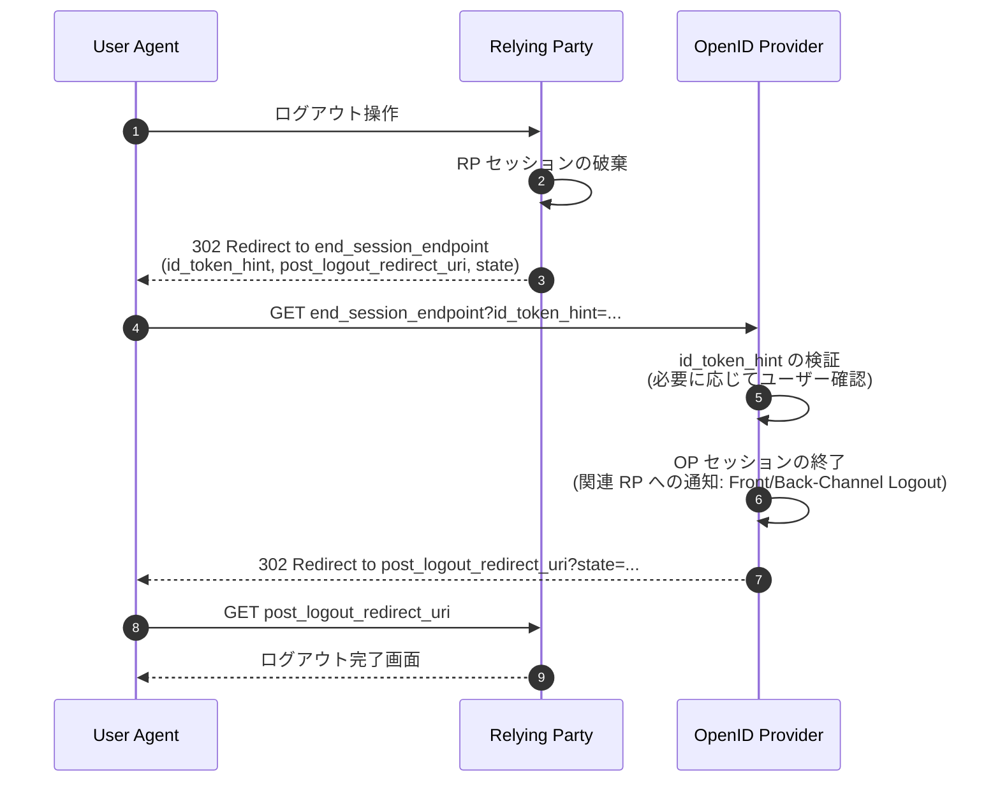

# OpenID Connect RP-Initiated Logout 1.0

## 1. 概要

OpenID Connect RP-Initiated Logout 1.0 は、OpenID Connect Core 1.0 を補完する拡張仕様であり、リライングパーティ (Relying Party, RP) が OpenID Provider (OP) に対してエンドユーザーのログアウトを要求する仕組みを定義する。2022 年 9 月 12 日に Final として発行され、編集者は M. Jones (Microsoft)、B. de Medeiros (Google)、N. Agarwal (Microsoft)、N. Sakimura (NAT.Consulting)、J. Bradley (Yubico) である。

OpenID Connect Core 1.0 はサインインのプロトコルを規定しているが、サインアウトについては定義していない。本仕様は、RP のサインアウト UI を起点として OP のセッションを終了させる、フロントチャネルベース (ユーザーエージェントのリダイレクト経由) のログアウトフローを標準化する。

Session Management 1.0、Front-Channel Logout 1.0、Back-Channel Logout 1.0 と組み合わせて利用することで、OP に紐づく他の RP セッションも併せて終了させるシングルログアウトを構成できる。

## 2. 解決する課題

OpenID Connect Core 1.0 はもともと OpenID Connect Session Management 1.0 の一部としてログアウト機能を定めていたが、Session Management はブラウザの third-party cookie に依存する設計であり、現代のブラウザ環境では機能しなくなっている。一方で、RP からのログアウト要求というユースケース自体は普遍的であり、ブラウザ機能に依存しない形で切り出す必要があった。

具体的には次のような課題に対応する。

- RP のサインアウト操作だけでは RP 自身のセッションしか終了せず、OP の認証セッションは継続したままになる
- ユーザーがログアウトを意図したとき、後続のサインイン時に再認証なしで自動的にセッションが復元されると、共有端末等で意図しないログイン状態が再現される
- RP が OP に対してログアウトを要求する標準的なエンドポイントとパラメータが存在しないと、各 OP が独自実装に走り相互運用性を損なう

RP-Initiated Logout は、RP が OP に対し「このエンドユーザーのセッションを終了してほしい」という意思を伝える共通の手順を、HTTP リダイレクトとクエリパラメータだけで規定することでこれらを解決する。

## 3. 主要概念・用語

- Logout Endpoint
  - RP-Initiated Logout の要求を受け取る OP 側のエンドポイント。Discovery メタデータでは `end_session_endpoint` として公開される
- id_token_hint
  - ログアウト対象のセッションを特定するための、過去に OP が発行した ID Token
- logout_hint
  - id_token_hint の代わりに OP がエンドユーザーを推測するためのヒント (メールアドレス、ユーザー名等)
- post_logout_redirect_uri
  - ログアウト処理完了後に OP がユーザーエージェントをリダイレクトする RP 側の URI
- state
  - ログアウト要求とコールバックの間で状態を維持するための不透明値

その他の用語は OAuth 2.0 (RFC 6749)、HTTP/1.1 (RFC 7230)、OpenID Connect Core 1.0 から継承される。

## 4. プロトコルフロー

典型的な RP-Initiated Logout の流れを以下に示す。



ポイントは次の通り。

- RP は自身のローカルセッションをまず破棄し、続いてユーザーエージェントを OP の `end_session_endpoint` にリダイレクトする
- OP は id_token_hint からセッションとクライアントを特定し、必要であればエンドユーザーに確認ダイアログを表示する
- OP セッションが終了した後、Front-Channel / Back-Channel Logout 等が設定されていれば、それら他の RP にもログアウトが伝播する
- 最後にユーザーエージェントは `post_logout_redirect_uri` に戻され、RP は state を検証して完了画面を表示する

## 5. 詳細解説

### 5.1 Logout Endpoint の発見

RP は OP の Discovery レスポンス (OpenID Connect Discovery 1.0 で定義される `.well-known/openid-configuration`) から `end_session_endpoint` を取得する。このエンドポイントは HTTPS スキームでなければならない。クエリ部分を含んではならず、フラグメントも含んではならない。

Discovery を使用しない構成では、エンドポイント URL は事前に OP/RP 間で合意される必要がある。

### 5.2 ログアウトリクエストのパラメータ

RP は `end_session_endpoint` に対して HTTP GET または POST でリクエストを送信する。POST の場合は `application/x-www-form-urlencoded` で同等のパラメータを送信する。

| パラメータ                 | 種別        | 説明                                                                                                |
| -------------------------- | ----------- | --------------------------------------------------------------------------------------------------- |
| `id_token_hint`            | RECOMMENDED | 過去に発行された ID Token。OP のセッションとクライアントを特定するヒントとして用いる                |
| `logout_hint`              | OPTIONAL    | OP がログアウト対象のエンドユーザーを推測するためのヒント。メールアドレス・電話番号・ユーザー名など |
| `client_id`                | OPTIONAL    | RP のクライアント識別子。`id_token_hint` がない場合の補完情報として利用される                       |
| `post_logout_redirect_uri` | OPTIONAL    | ログアウト後にユーザーエージェントをリダイレクトする URI。事前登録が必須                            |
| `state`                    | OPTIONAL    | RP がリクエストとコールバックの間で状態を維持するための不透明値。CSRF 対策にも利用できる            |
| `ui_locales`               | OPTIONAL    | ログアウト確認 UI で OP に希望する言語・スクリプトの優先リスト (BCP47 形式)                         |

`id_token_hint` は必須ではないが、OP がリクエストの正当性を判断する根拠となるため、強く推奨される。`id_token_hint` がない場合は OP は通常エンドユーザーに対して明示的な確認を求めることが期待される。

`client_id` は、`id_token_hint` を提示できない場面 (例: ID Token を保持していないパブリッククライアントが期限切れ後にログアウトを要求する場合) のために導入された。`id_token_hint` と `client_id` の両方が指定された場合、両者が指す RP が一致しなければならない。

### 5.3 post_logout_redirect_uri の検証と登録

`post_logout_redirect_uri` は OP の RP 登録情報に格納された `post_logout_redirect_uris` (URL の配列) のいずれかと完全一致しなければならない。

- 完全一致比較を行う。スキーム、ホスト、パス、クエリすべてを含めて一致する必要がある
- HTTPS の使用が推奨される。コンフィデンシャルクライアントについては OP の判断で HTTP の使用を許可することができる
- 登録は OpenID Connect Dynamic Client Registration 1.0 (またはそれに準ずる方法) で行う

`post_logout_redirect_uri` が登録されていない、もしくは検証に失敗した場合、OP はリダイレクトを実行してはならず、エラーをエンドユーザーに表示する。

### 5.4 OP の処理

OP は次の手順でリクエストを処理する。

1. `id_token_hint` が指定されていれば署名検証を行い、`aud` から RP を特定する
2. `client_id` が指定されていれば、`id_token_hint` の `aud` と整合することを確認する
3. `post_logout_redirect_uri` が指定されていれば、当該 RP に登録された URI と完全一致するか検証する
4. 必要であれば、エンドユーザーに対してログアウト確認 UI を表示する。`id_token_hint` がない場合は確認 UI を表示することが強く推奨される
5. OP におけるエンドユーザーの認証セッションを終了する
6. 当該セッションに紐づく他の RP に対して、Front-Channel Logout / Back-Channel Logout の手順でログアウトを通知する
7. `post_logout_redirect_uri` が指定されていれば、`state` を含めてリダイレクトを返す

### 5.5 リダイレクトレスポンス

OP は `post_logout_redirect_uri` に対し、リクエストで受け取った `state` をそのまま付与してリダイレクトする。RP は自身が発行した値と一致することを検証することで、CSRF を防止できる。

```http
HTTP/1.1 302 Found
Location: https://rp.example.com/loggedout?state=af0ifjsldkj
```

`post_logout_redirect_uri` が指定されていない場合、OP は自身が定義するログアウト完了画面を表示する。

### 5.6 クライアントメタデータ

OpenID Connect Dynamic Client Registration 1.0 の拡張として、本仕様は次のクライアントメタデータを定義する。

- `post_logout_redirect_uris`
  - 配列。RP がログアウト後のリダイレクト先として要求可能な URL の集合
  - 登録されていない URL は `post_logout_redirect_uri` パラメータの値として受理されない

OAuth 2.0 Dynamic Client Registration (RFC 7591) を用いる場合も、同名のメタデータが拡張として登録できる。

### 5.7 他のログアウト仕様との関係

RP-Initiated Logout は、ログアウトの「起点」を提供する仕様であり、OP に紐づく他の RP セッションを終了させる手段ではない。シングルログアウトを実現するには、以下のいずれかと組み合わせる。

- OpenID Connect Front-Channel Logout 1.0: OP がブラウザ内の不可視 iframe を通じて他の RP にログアウトを通知する
- OpenID Connect Back-Channel Logout 1.0: OP がサーバー間通信で Logout Token を他の RP に POST して通知する
- OpenID Connect Session Management 1.0: OP/RP 間のブラウザベースのセッション状態確認 (現代のブラウザでは利用しにくい)

これらは独立した仕様であり、RP-Initiated Logout 単独でも利用できる。

## 6. セキュリティに関する考慮事項

### 6.1 サービス拒否 (DoS) のリスク

`id_token_hint` のないログアウト要求は、第三者が任意の URL にエンドユーザーをログアウトさせる手段になり得る。OP は `id_token_hint` を伴わないリクエストに対しては、エンドユーザーに明示的な確認を求めることが推奨される。

### 6.2 リダイレクト URI の事前登録

`post_logout_redirect_uri` の検証を疎かにすると、攻撃者が任意の URL にユーザーをリダイレクトさせるオープンリダイレクタとして悪用される。完全一致による検証が必須である。

### 6.3 state による CSRF 対策

RP は推測困難な `state` を生成し、コールバック時に検証することで、第三者が `post_logout_redirect_uri` を直接呼び出して RP の挙動を引き起こす攻撃を防止できる。

### 6.4 完全ログアウトに対するユーザーの期待

ユーザーが RP でログアウト操作を行ったとき、OP やそれに紐づくすべての RP からもログアウトされることを期待する場合がある。共有端末やキオスク環境ではこの期待を裏切らない設計が重要であり、RP-Initiated Logout と Front/Back-Channel Logout の併用を検討する必要がある。

### 6.5 logout_hint の取り扱い

`logout_hint` には個人を特定し得る情報 (メールアドレス・電話番号) が含まれる可能性があるため、URL パラメータでの送信ログ等に注意し、必要に応じて POST メソッドを使用することが望ましい。

### 6.6 id_token_hint の有効期限

`id_token_hint` として渡される ID Token は期限切れでも構わない。OP はログアウト要求の正当性判定にのみ用いるため、`exp` クレームによる拒否は行わない。ただし署名検証は実施すべきである。

## 7. 関連仕様

- OpenID Connect Core 1.0
- OpenID Connect Discovery 1.0 (`end_session_endpoint` の公開)
- OpenID Connect Dynamic Client Registration 1.0 (`post_logout_redirect_uris` の登録)
- OpenID Connect Session Management 1.0
- OpenID Connect Front-Channel Logout 1.0
- OpenID Connect Back-Channel Logout 1.0
- OAuth 2.0 (RFC 6749)
- OAuth 2.0 Dynamic Client Registration Protocol (RFC 7591)
- OAuth 2.0 Authorization Server Metadata (RFC 8414)

## 8. 参考文献

- [OpenID Connect RP-Initiated Logout 1.0 (Final, 2022-09-12)](https://openid.net/specs/openid-connect-rpinitiated-1_0.html)
- [OpenID Connect Core 1.0](https://openid.net/specs/openid-connect-core-1_0.html)
- [OpenID Connect Discovery 1.0](https://openid.net/specs/openid-connect-discovery-1_0.html)
- [OpenID Connect Front-Channel Logout 1.0](https://openid.net/specs/openid-connect-frontchannel-1_0.html)
- [OpenID Connect Back-Channel Logout 1.0](https://openid.net/specs/openid-connect-backchannel-1_0.html)
- [OpenID Connect Session Management 1.0](https://openid.net/specs/openid-connect-session-1_0.html)
