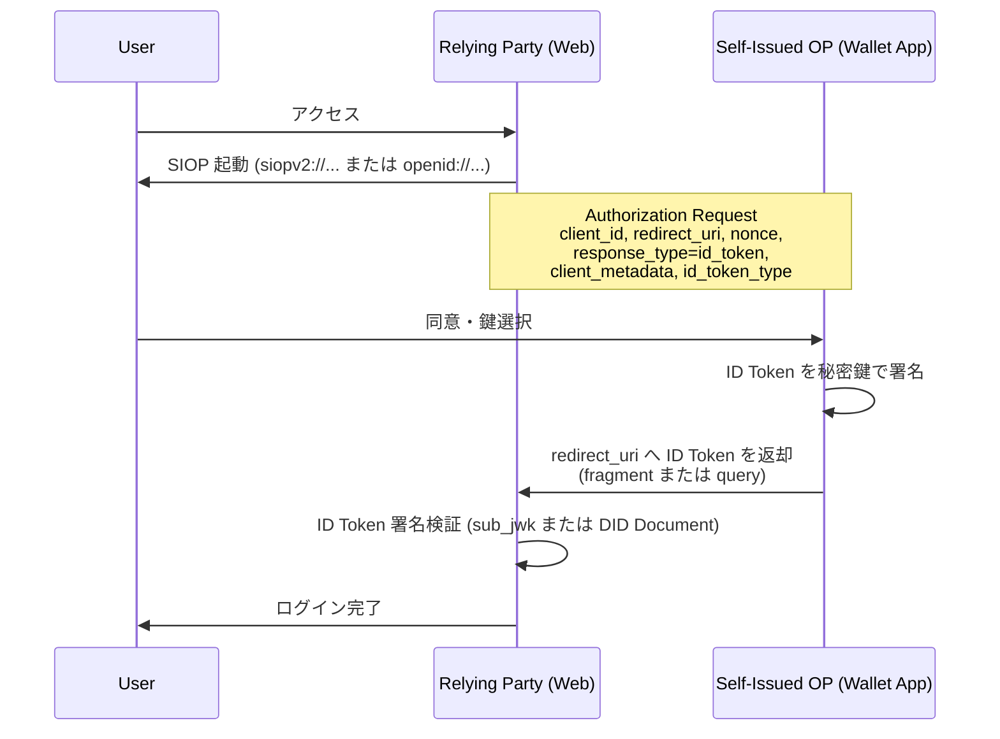
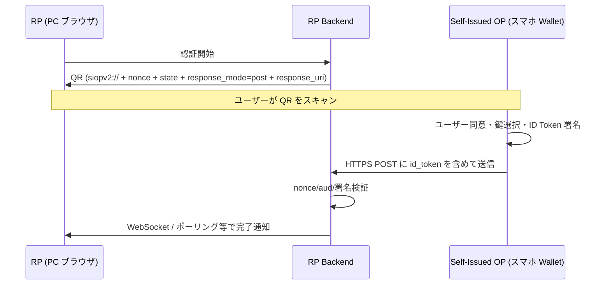
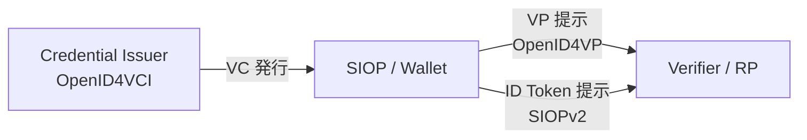

# Self-Issued OpenID Provider v2 (SIOPv2)

## 概要

Self-Issued OpenID Provider v2（以下 SIOPv2）は、OpenID Foundation の Digital Credentials Protocols Working Group（旧 DCP WG, 元 AB/Connect WG）が策定する仕様で、エンドユーザー自身が自らの OpenID Provider（OP）を運用し、署名済み ID Token を発行するモデルを定義する。

中央集権的な IdP に依存せず、ユーザーが保有する暗号鍵あるいは Decentralized Identifier（DID）を主体識別子として用いることで、自己主権型アイデンティティ（Self-Sovereign Identity, SSI）を OpenID Connect の枠組みで実現することを目的とする。

本記事は 2023 年 11 月 28 日公開の Draft 13 を参照している（Editors: K. Yasuda, M. Jones, T. Lodderstedt）。SIOPv2 は OpenID4VCI / OpenID4VP とともにいわゆる「OID4VC ファミリー」を構成する基盤仕様であり、Verifiable Credentials のホルダー側のアイデンティティ提示を担う位置付けにある。

## 解決する課題

従来の OpenID Connect では、Authorization Server（OP）はインターネット上のサービス事業者が運用するエンドポイント（`https://example.com/`）として配備されることを前提としていた。これに対して以下の課題があった。

- ユーザーは OP となる IdP に常にオンラインで認証される必要があり、IdP は属性情報やログイン履歴の集中点（プライバシー上のリスク）となる
- Verifiable Credentials を保有するウォレットがあっても、それを OIDC のフローに自然に接続する手段がなかった
- Cross-Device 体験（PC 上の RP に対してスマートフォンのウォレットで応答する）を OIDC の枠組みで標準化する必要があった

SIOPv2 は、エンドユーザーのデバイス上で動作するウォレットやアプリ自体を OP として扱い、ID Token をエンドユーザー所有の鍵で署名することでこれらを解決する。

## 主要概念・用語

| 用語                         | 説明                                                                                       |
| ---------------------------- | ------------------------------------------------------------------------------------------ |
| Self-Issued OP (SIOP)        | エンドユーザーが管理する OP。多くはスマートフォン等のローカルアプリ                        |
| RP (Relying Party)           | SIOP から発行された ID Token を検証するサービス                                            |
| Subject Syntax Type          | `sub` 値の形式を示す識別子。JWK Thumbprint 形式と DID 形式が定義                           |
| `sub_jwk`                    | JWK Thumbprint 形式時に ID Token に含める公開鍵（JWK）                                     |
| Cryptographic Holder Binding | ID Token を署名した秘密鍵の保有者であることを RP に示す結びつき                            |
| Cross-Device SIOP            | RP とは別デバイス上の SIOP に QR コード等で要求を送るフロー                                |
| `id_token_type`              | `subject_signed_id_token`（自己署名）または `attester_signed_id_token`（第三者発行）の区別 |

### Self-Issued ID Token の識別

SIOPv2 で発行される ID Token は、`iss` クレームと `sub` クレームの値が同一であることをもって Self-Issued であると判定される。これは「主体自身が発行者である」というモデルを暗号学的に表現するための約束事である。

## プロトコルフロー

### Same-Device フロー

RP と SIOP（ウォレット等）が同一デバイス上に存在し、Custom URL Scheme（`siopv2://` または `openid://`）あるいは Universal Links / App Links により呼び出されるパターン。



### Cross-Device フロー

RP がブラウザ等で動作し、SIOP が別デバイス（スマートフォン上のウォレット）で動作するパターン。RP は Authorization Request を QR コードや Deep Link としてエンコードし、SIOP は `response_mode=post` により RP の指定エンドポイントへ HTTPS POST で ID Token を直接送信する。



Cross-Device では、Authorization Request を特定の通信チャネルへ暗号学的にバインドできないという固有の脅威があり、§13 セキュリティ考慮事項で具体的な軽減策が論じられる（後述）。

## 詳細解説

### Discovery（§6）

SIOPv2 はネット上の Discovery エンドポイントが存在しない（ユーザーデバイス上に OP が存在するため）という前提のもと、以下の方法でメタデータを取り扱う。

- 静的構成: SIOP の URI スキーム（`siopv2://`、`openid://`）ごとに既定のメタデータが規定される
- 動的に取得が必要なメタデータは、以下を REQUIRED とする
  - `authorization_endpoint`
  - `subject_syntax_types_supported`
  - `id_token_signing_alg_values_supported`

### RP 登録と Client Identifier Scheme（§7）

SIOPv2 では古典的な OIDC Dynamic Client Registration が利用できないため、以下の三方式が定義される。

| 方式                                         | 説明                                                                 |
| -------------------------------------------- | -------------------------------------------------------------------- |
| `client_id` = `redirect_uri`                 | RP の Client ID をリダイレクト先 URI と一致させる（最も簡易）        |
| OpenID Federation 1.0 Automatic Registration | `client_id` を解決可能な HTTPS URL とし、Entity Statement を取得     |
| Decentralized Identifier                     | `client_id` を DID とし、DID Document から RP の鍵・メタデータを解決 |

### Authorization Request（§9）

SIOPv2 が OIDC Core に追加する主要パラメータは次のとおり。

| パラメータ            | 説明                                                                                    |
| --------------------- | --------------------------------------------------------------------------------------- |
| `response_type`       | `id_token` 固定                                                                         |
| `scope`               | 通常は `openid`                                                                         |
| `nonce`               | 必須。リプレイ攻撃対策                                                                  |
| `client_metadata`     | RP のメタデータをインラインで送付                                                       |
| `client_metadata_uri` | RP メタデータを参照可能な URI として送付                                                |
| `id_token_type`       | `subject_signed_id_token`（自己署名）/ `attester_signed_id_token`（第三者発行、既定値） |
| `response_mode`       | Cross-Device の場合は `post`、Same-Device の場合は `fragment` 等                        |

`client_metadata` と `client_metadata_uri` は相互排他であり、`request` / `request_uri` も併用されない場合には OpenID Federation を使わない限りどちらかが必須となる。

### ID Token と Subject Syntax Types（§8, §11）

SIOPv2 では `sub` の形式は Subject Syntax Type によって区別される。

#### JWK Thumbprint タイプ

- 識別子: `urn:ietf:params:oauth:jwk-thumbprint`
- `sub` 値: 公開鍵 JWK の RFC 7638 SHA-256 サムプリント（base64url）
- `sub_jwk` クレームに公開鍵そのものを含める
- ID Token の署名検証は `sub_jwk` の公開鍵で行い、その鍵のサムプリントが `sub` と一致することを確認することで Cryptographic Holder Binding を成立させる

```json
{
  "iss": "Nzbl...AzBQ",
  "sub": "Nzbl...AzBQ",
  "aud": "https://rp.example.com/cb",
  "nonce": "n-0S6_WzA2Mj",
  "exp": 1745000000,
  "iat": 1744999700,
  "sub_jwk": {
    "kty": "EC",
    "crv": "P-256",
    "x": "f83OJ...",
    "y": "x_FEz..."
  }
}
```

#### Decentralized Identifier タイプ

- 識別子: `did:<method>`（例: `did:key`, `did:web`, `did:jwk` 等）あるいは全 DID メソッドを意味する `did`
- `sub` 値: DID
- `sub_jwk` は禁止
- 署名検証は DID Resolution によって取得した DID Document 中の `verificationMethod` を参照して行う

### JWK Thumbprint 計算手順（RFC 7638 / RFC 9278）

1. JWK から、鍵タイプごとに RFC 7638 が定める「必須メンバ」のみを抽出する
   - RSA 鍵: `e`, `kty`, `n`
   - EC 鍵: `crv`, `kty`, `x`, `y`
   - OKP 鍵: `crv`, `kty`, `x`
2. 抽出したメンバを **辞書順** に並べた最小化 JSON 文字列（UTF-8）を構築
3. その文字列の SHA-256 ハッシュを計算し base64url エンコード

これにより、同一公開鍵に対して常に同一のサムプリントが得られることが保証される。

### Authorization Response（§10）

正常応答では `id_token` をリダイレクト URI（`response_mode` に応じて fragment / query / form_post）または Cross-Device の場合は `response_uri` に POST する。

エラーレスポンスの追加コードは以下。

| エラーコード                          | 用途                                                    |
| ------------------------------------- | ------------------------------------------------------- |
| `user_cancelled`                      | ユーザーがリクエストを拒否                              |
| `subject_syntax_types_not_supported`  | RP/SIOP 間で受容可能な Subject Syntax Type が一致しない |
| `client_metadata_value_not_supported` | RP メタデータの値が SIOP でサポートされない             |
| `invalid_client_metadata_uri`         | `client_metadata_uri` の取得に失敗                      |
| `invalid_client_metadata_object`      | メタデータが不正な形式                                  |

## OID4VC ファミリーにおける位置付け

SIOPv2 は OpenID4VCI（Verifiable Credentials の発行）と OpenID4VP（同じく提示）と組み合わせて、ホルダー側のアイデンティティ・クレデンシャル取扱いの全体像を形成する。



- SIOPv2 単体: ホルダーが自己署名 ID Token によってログインする（クレデンシャルを伴わない自己主権ログイン）
- SIOPv2 + OpenID4VP: ID Token と Verifiable Presentation を同時に返す統合フロー。`vp_token` を Authorization Response に含めることが OpenID4VP 側で定義される
- OpenID4VCI とは別の RP 体験を担うが、ホルダー鍵やウォレット UI は共通化されることが多い

## セキュリティに関する考慮事項

§13 では特に以下が論じられる。

- **Cross-Device リプレイ / セッションフィッシング**: 攻撃者が QR コードを別ユーザーに転送して同意させる脅威。RP は `nonce` を必ず生成・検証し、ユーザーに対し RP の正当性を表示するなどの軽減策を採る
- **Custom URL Scheme の脆弱性**: 任意のアプリが同一カスタムスキームを登録できるため、Universal Links / App Links（HTTPS ベースのアプリ起動）の使用が推奨される
- **Holder Binding の検証**: JWK Thumbprint タイプでは `sub` と `sub_jwk` のサムプリント一致確認が必須。DID タイプでは DID Document 解決と `verificationMethod` の鍵による署名検証が必要
- **メタデータの正当性**: `client_metadata` / `client_metadata_uri` は SIOP 側で内容を検証する必要がある。署名された Request Object（JAR, RFC 9101）の併用が推奨される
- **トラスト確立**: SIOP の Subject に関する信頼は仕様の対象外。一般には Verifiable Credentials（OpenID4VP）による属性証明を組み合わせる

## 関連仕様

- [OpenID Connect Core 1.0](./openid-connect-core.md) - SIOPv2 が拡張する基底仕様
- [OpenID for Verifiable Credential Issuance (OpenID4VCI)](./openid4vci.md) - VC 発行プロトコル
- [OpenID for Verifiable Presentations (OpenID4VP)](./openid4vp.md) - VP 提示プロトコル。SIOPv2 と組み合わせて利用される
- [W3C Decentralized Identifiers (DID) Core 1.0](./did-core.md) - DID 主体識別の基礎
- [W3C Verifiable Credentials Data Model v2.0](./vc-data-model-2.0.md) - VC のデータモデル
- RFC 7638 - JSON Web Key (JWK) Thumbprint
- RFC 9278 - JWK Thumbprint URI
- RFC 9101 - The OAuth 2.0 Authorization Framework: JWT-Secured Authorization Request (JAR)
- OpenID Federation 1.0 - 動的 RP メタデータ解決

## 参考文献

- [Self-Issued OpenID Provider v2 - draft 13](https://openid.net/specs/openid-connect-self-issued-v2-1_0.html) (2023-11-28)
- [OpenID Foundation - Digital Credentials Protocols Working Group](https://openid.net/wg/digital-credentials-protocols/)
- [RFC 7638 - JSON Web Key (JWK) Thumbprint](https://www.rfc-editor.org/rfc/rfc7638)
- [RFC 9278 - JWK Thumbprint URI](https://www.rfc-editor.org/rfc/rfc9278)
- [RFC 9101 - JWT-Secured Authorization Request (JAR)](https://www.rfc-editor.org/rfc/rfc9101)
