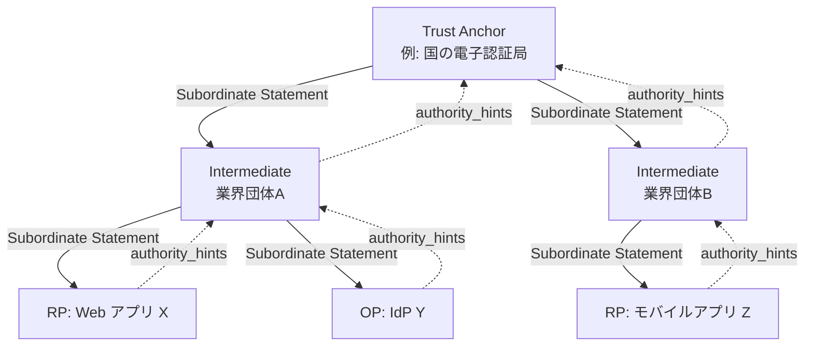
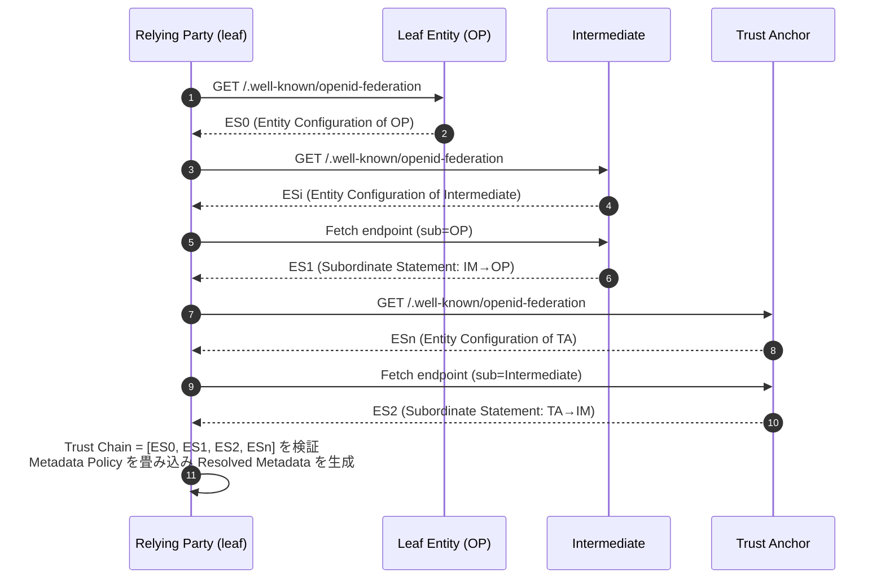
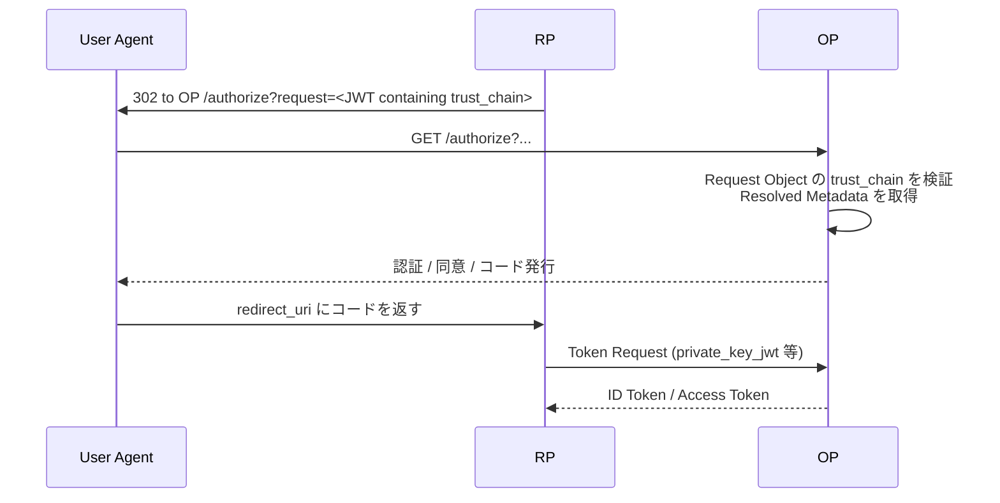

# OpenID Federation 1.0 - 多者間フェデレーションの基盤仕様

## 1. 概要

OpenID Federation 1.0 は、OpenID Foundation の Connect WG が策定した、多者間 (multilateral) フェデレーションを構築するための基盤仕様である。OpenID Connect や OAuth 2.0 を利用するエンティティ間に、暗号学的に検証可能な信頼関係 (Trust) を確立する仕組みを提供する。

従来の OpenID Connect では、Relying Party (RP) と OpenID Provider (OP) は二者間で個別に Dynamic Client Registration (RFC 7591 / OpenID Connect Dynamic Client Registration) を行うか、運用ポリシーに基づき静的に信頼関係を結ぶ必要があった。これに対し OpenID Federation 1.0 は、共通の Trust Anchor を頂点とする階層的な信頼ツリーを構成し、その中で多数のエンティティが相互に信頼関係を検証できるようにする。

本記事執筆時点では、本仕様は eIDAS 2.0 に基づく EUDI Wallet エコシステム、各国の医療・教育分野の ID 連携、研究機関ネットワーク (例: GÉANT / eduGAIN) などへの適用が進められている。

## 2. 解決する課題

OpenID Connect / OAuth 2.0 を大規模な組織横断・国境横断のエコシステムに適用しようとすると、以下の課題が生じる。

- 二者間の事前合意 (out-of-band registration) では、参加者数が増えると組み合わせ爆発が起こる。
- Dynamic Client Registration はメタデータ交換を自動化するが、未知の RP を信頼する根拠を提供しない。
- SAML 2.0 のメタデータ集約モデル (例: eduGAIN) は実績がある一方、XML 署名集中処理や巨大メタデータの配布に運用負荷がある。
- フェデレーションのメンバ資格、ポリシー (例: 必須のトークン署名アルゴリズム、許可された grant_types) を集中管理しつつ、各エンティティが自身のメタデータを自律的に運用したい。
- 認定 (accreditation) を表現する仕組み (Trust Mark) と、その失効・委譲を扱う仕組みが欲しい。

OpenID Federation 1.0 はこれらを以下のアプローチで解決する。

- 各エンティティが自己署名の Entity Configuration を `.well-known/openid-federation` で公開する。
- Trust Anchor から個々のエンティティまでを Subordinate Statement の連鎖 (Trust Chain) で結ぶ。
- Trust Anchor および中間機関が Metadata Policy で配下エンティティのメタデータを制約する。
- Trust Mark JWT により認定・コンプライアンスを表現する。

## 3. 主要概念・用語

| 用語                  | 定義                                                                         |
| --------------------- | ---------------------------------------------------------------------------- |
| Entity Identifier     | エンティティを一意に識別する HTTPS URL                                       |
| Entity Statement      | 署名付き JWT。`typ` ヘッダは `entity-statement+jwt`                          |
| Entity Configuration  | 自己発行の Entity Statement (`iss == sub`)                                   |
| Subordinate Statement | 上位機関が直下のエンティティについて発行する Entity Statement (`iss != sub`) |
| Trust Anchor (TA)     | 信頼ツリーの頂点となるエンティティ。RP / OP が事前に信頼している             |
| Intermediate Entity   | TA と末端 (leaf) の間に位置する中間機関                                      |
| Trust Chain           | leaf → intermediates → TA をつなぐ Entity Statement の列                     |
| Metadata              | エンティティの種別 (entity type) ごとの設定情報                              |
| Metadata Policy       | 上位機関が下位エンティティのメタデータに適用する制約                         |
| Trust Mark            | 認定 / コンプライアンスを表現する署名付き JWT                                |
| Federation Endpoint   | Fetch / List / Resolve / Trust Mark Status などのエンドポイント群            |

### 3.1 Entity Type Identifier

`metadata` 内のトップレベルキーで、エンティティの役割を表す (§5.1)。

- `federation_entity`: フェデレーション運用エンティティ (TA, 中間機関など)
- `openid_provider`: OpenID Connect OP
- `openid_relying_party`: OpenID Connect RP
- `oauth_authorization_server`: OAuth 2.0 認可サーバー
- `oauth_client`: OAuth 2.0 クライアント
- `oauth_resource`: OAuth 2.0 保護リソース

一つのエンティティが複数の type を持つこともできる (例: `openid_provider` かつ `federation_entity`)。

## 4. アーキテクチャ全体像



各エンティティは自身の Entity Configuration の `authority_hints` で直上の Superior を指し示す (上向き)。一方、上位機関は配下に対して Subordinate Statement を発行する (下向き)。これらを組み合わせて Trust Chain を構築する。

## 5. Entity Statement の構造

### 5.1 Entity Configuration の主要クレーム (§3)

```json
{
  "iss": "https://rp.example.com",
  "sub": "https://rp.example.com",
  "iat": 1748000000,
  "exp": 1748086400,
  "jwks": {
    "keys": [{ "kty": "EC", "crv": "P-256", "kid": "fed-key-1", "x": "...", "y": "..." }]
  },
  "authority_hints": ["https://intermediate.example.org"],
  "metadata": {
    "openid_relying_party": {
      "redirect_uris": ["https://rp.example.com/cb"],
      "response_types": ["code"],
      "grant_types": ["authorization_code", "refresh_token"],
      "token_endpoint_auth_method": "private_key_jwt"
    },
    "federation_entity": {
      "federation_fetch_endpoint": "https://rp.example.com/fetch",
      "organization_name": "Example RP Inc."
    }
  },
  "trust_marks": [
    {
      "trust_mark_type": "https://trust-list.example/marks/gold",
      "trust_mark": "eyJhbGciOi..."
    }
  ]
}
```

- `iss == sub` が Entity Configuration の判別条件。
- `jwks` には Federation Entity Key (連鎖検証に用いる署名鍵) のみを置き、OP/RP としての署名鍵 (id_token 等) は `metadata` 配下に置くのが原則。
- `authority_hints` は **直上の Superior のみ** を列挙する。TA 自身はこれを持たない。

### 5.2 Subordinate Statement (§3.1.3)

上位機関が下位エンティティについて発行する Statement で、`iss != sub` となる。`metadata_policy` や `constraints` をここに記載することで、Trust Chain 全体に対するポリシーを伝播させる。

### 5.3 well-known エンドポイント (§9)

Entity Configuration は、Entity Identifier に `/.well-known/openid-federation` を **連結** したパスで公開される。Entity Identifier は HTTPS スキームで、ホスト部に加えてポートやパスを含んでもよい。

```
<entity-identifier>/.well-known/openid-federation
```

例えば `https://entity.example` の Entity Configuration は `https://entity.example/.well-known/openid-federation` となる。Entity Identifier がパス部を含む場合 (例: `https://example.com/tenant1`) は、その末尾に連結して `https://example.com/tenant1/.well-known/openid-federation` となる。Entity Identifier の末尾に `/` がある場合は、連結前にそれを取り除く。

## 6. Trust Chain の構築と検証

### 6.1 構築フロー



`authority_hints` を辿り、各上位機関の Fetch エンドポイント (§8.1) から Subordinate Statement を取得することで Trust Chain を構築する。

### 6.2 検証ルール (§3.2, §4)

Trust Chain `ES[0], ES[1], ..., ES[N]` について以下を検証する。

- 各 Entity Statement が JWT として正しく、`typ` が `entity-statement+jwt`、`alg` が `none` でないこと。
- `iat <= now <= exp` (許容時刻ずれを考慮)。
- `ES[0]` (leaf の Entity Configuration) は `ES[0].jwks` の鍵で自己署名されている。
- 隣接する Statement について `ES[j].iss == ES[j+1].sub`。
- `ES[j]` の署名は `ES[j+1].jwks` 内の鍵 (kid 一致) で検証できる。
- 最後の `ES[N]` は Trust Anchor の Entity Configuration (自己署名) であり、検証者が事前に信頼している鍵集合と一致する。

検証に成功すると、`metadata_policy` を leaf 側のメタデータに対して順に適用し、最終的な **Resolved Metadata** が得られる。

## 7. Metadata Policy

### 7.1 標準オペレータ (§6.1.3)

| オペレータ    | 意味                             |
| ------------- | -------------------------------- |
| `value`       | 固定値を強制                     |
| `add`         | 配列に値を追加                   |
| `default`     | 値が未設定なら適用               |
| `one_of`      | 列挙された値のいずれかであること |
| `subset_of`   | 配列が指定集合の部分集合         |
| `superset_of` | 配列が指定集合の上位集合         |
| `essential`   | そのオペレータの実装を必須とする |

### 7.2 適用例

中間機関が「配下の OP は `id_token` 署名アルゴリズムを `RS256` または `ES256` に限定する」とした場合:

```json
{
  "metadata_policy": {
    "openid_provider": {
      "id_token_signing_alg_values_supported": {
        "subset_of": ["RS256", "ES256"]
      },
      "subject_types_supported": { "value": ["pairwise"] }
    }
  }
}
```

`metadata_policy` は Trust Chain の上位側から順にマージされ、競合が起きた場合はオペレータ間の互換性ルール (§6.1.4) に従う。互換性のない組合せ (例: `value` と異なる `value`) は検証エラーとなる。

### 7.3 Constraints (§6.2)

`constraints` は Trust Chain 全体の構造に対する制約で、以下を含む。

- `max_path_length`: Trust Anchor から leaf までの中間機関数の上限
- `naming_constraints`: 配下エンティティ識別子に許可/禁止するドメイン
- `allowed_entity_types`: 配下に許される Entity Type

## 8. Federation Endpoint (§8)

| エンドポイント                       | 役割                                                                                        |
| ------------------------------------ | ------------------------------------------------------------------------------------------- |
| Fetch (§8.1)                         | 上位機関が自身が発行した直下エンティティの Subordinate Statement を返す                     |
| Subordinate Listing (§8.2)           | 配下のエンティティ識別子一覧を返す                                                          |
| Resolve (§8.3)                       | 任意の leaf について Trust Chain を構築し、Resolved Metadata と Trust Mark の検証結果を返す |
| Trust Mark Status (§8.4)             | Trust Mark の有効性を問い合わせる                                                           |
| Trust Marked Entities Listing (§8.5) | 指定タイプの Trust Mark を保有する subject の一覧                                           |
| Trust Mark Endpoint (§8.6)           | Trust Mark Issuer が対象エンティティに Trust Mark JWT を発行する                            |
| Federation Historical Keys (§8.7)    | 失効・ローテート済みの Federation Entity Key を提供                                         |

Resolve エンドポイントは、クライアントが自前で Trust Chain を辿る代わりに、信頼できる第三者 (典型的には TA や中間機関) に解決を委譲できる仕組みとして重要。

## 9. クライアント登録

OpenID Federation では、従来の事前登録や Dynamic Client Registration を置き換える二つのモードを定義する。

### 9.1 Automatic Registration (§12.1)

RP が認可リクエストの Request Object に自身の Entity Configuration あるいは Trust Chain を埋め込むことで、OP は **事前登録なしに** RP を信頼してリクエストを処理できる。`client_id` は RP の Entity Identifier (HTTPS URL) そのものとなる。



### 9.2 Explicit Registration (§12.2)

RP が事前に OP の Federation Registration Endpoint へ自身の Entity Configuration を送信し、OP がそれを検証して登録レスポンスを返すモード。古典的な OIDC Dynamic Client Registration に近い体験を保ちつつ、信頼の根拠は Trust Chain に基づく。

## 10. Trust Mark

### 10.1 構造 (§7)

Trust Mark は署名付き JWT で、以下のクレームを持つ。

- `iss`: Trust Mark Issuer の Entity Identifier
- `sub`: Trust Mark を保有するエンティティ
- `trust_mark_type`: Trust Mark の種別を表す識別子 (URL)
- `iat`, `exp`: 有効期間
- フレームワーク固有の追加クレーム (認定範囲、レベル等)

エンティティはこれを Entity Configuration の `trust_marks` 配列に含めて公開する。

### 10.2 検証フロー (§7.3)

```mermaid
flowchart LR
    A[Trust Mark JWT] --> B{署名検証}
    B -->|Issuer の Federation Entity Key| C{Issuer は<br/>その type を発行する権限を持つか}
    C -->|Trust Anchor の trust_mark_issuers を確認| D{委譲 (Delegation) があるか}
    D -->|あり| E[Trust Mark Owner の delegation JWT を検証]
    D -->|なし| F[iat / exp チェック]
    E --> F
    F --> G[必要なら Trust Mark Status エンドポイントで失効確認]
    G --> H[有効]
```

Trust Mark Owner と Trust Mark Issuer を分離できる委譲モデルにより、認定主体が発行業務を別組織に委ねるユースケース (例: 国の規制当局が監査法人に発行委託) を扱える。

## 11. セキュリティ考慮事項 (§18)

- **`typ` の明示**: `entity-statement+jwt` 等の固有 `typ` により、他種の JWT との取り違え (cross-JWT confusion) を防ぐ。
- **`alg=none` 禁止**: 署名なし JWT の受理は明確に禁止される。
- **時刻ずれ**: `iat`/`exp` の許容クロックスキューを実装ごとに統一する必要がある。
- **DoS 対策**: 深い Trust Chain や巨大 metadata を持つ悪意ある leaf による枯渇攻撃を、`max_path_length` や応答サイズ制限で防ぐ。
- **未署名エラー応答**: フェデレーションエンドポイントが返すエラーは TLS で保護されるのみで署名されないため、エラー内容を信頼の根拠としない。
- **鍵ローテーション**: Federation Entity Key のローテーション中も連鎖検証を継続できるよう、Historical Keys エンドポイント (§8.7) を運用する。
- **Trust Anchor の事前配布**: TA の鍵と Entity Identifier は安全な経路 (構成管理、ソフトウェア配布) で配布される必要がある。

## 12. 関連仕様

- [RFC 7519 - JSON Web Token](./rfc7519): Entity Statement の基盤
- [RFC 7515 - JWS](./rfc7515): Entity Statement の署名形式
- [RFC 7517 - JWK](./rfc7517): `jwks` クレームの形式
- [OpenID Connect Core](./openid-connect-core): フェデレーションが適用される代表的なプロトコル
- [OpenID Connect Discovery](./openid-connect-discovery): `metadata` の OP メタデータ部分
- [OpenID Connect Dynamic Client Registration](./openid-connect-registration): Explicit Registration の比較対象
- [RFC 8414 - OAuth 2.0 Authorization Server Metadata](./rfc8414): `oauth_authorization_server` メタデータ
- [RFC 7591 - OAuth 2.0 Dynamic Client Registration](./rfc7591): Explicit Registration が代替する仕組み
- [OpenID Connect for Identity Assurance](./openid-connect-4-identity-assurance): IDA 提供者の federation 内表現に利用されうる
- [OpenID4VCI](./openid4vci) / [OpenID4VP](./openid4vp): EUDI Wallet コンテキストで Federation と組み合わされる

## 13. 参考文献

- [OpenID Federation 1.0 (Final Specification)](https://openid.net/specs/openid-federation-1_0.html)
- [OpenID Foundation - Connect WG](https://openid.net/wg/connect/)
- [eIDAS 2.0 / EUDI Wallet Architecture and Reference Framework](https://github.com/eu-digital-identity-wallet/eudi-doc-architecture-and-reference-framework)
