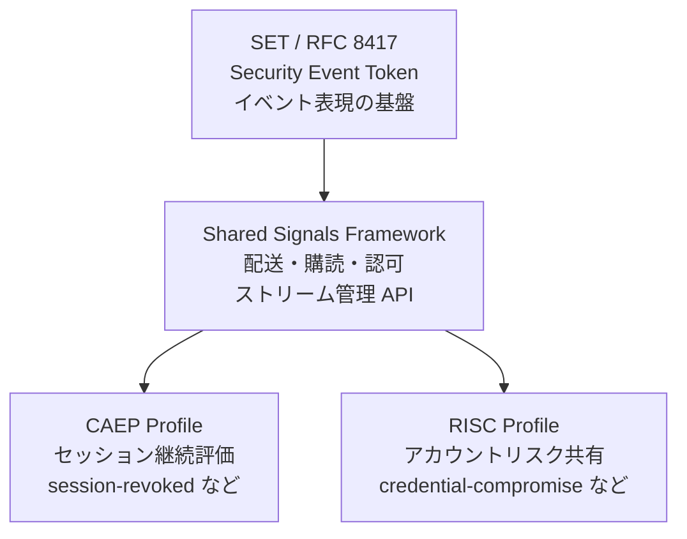
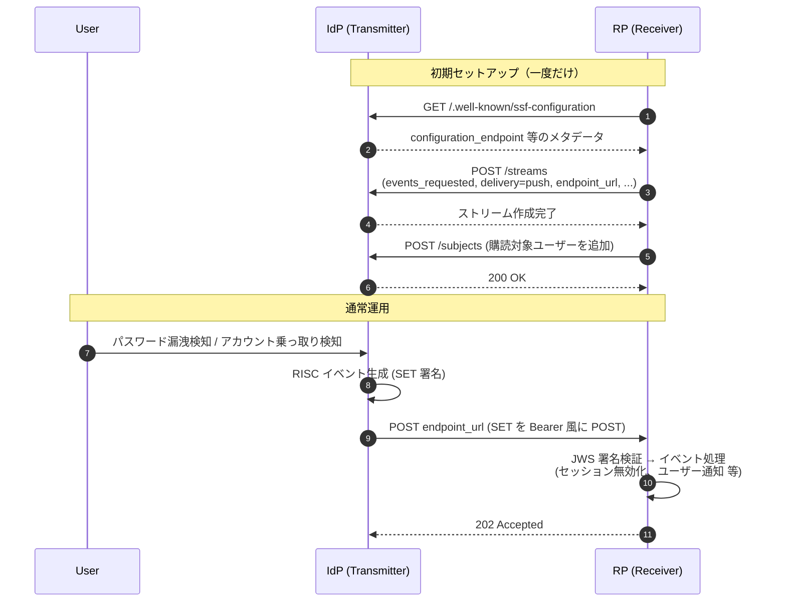

# OpenID RISC Profile 1.0 - Risk Incident Sharing and Coordination

## 概要

OpenID RISC (Risk Incident Sharing and Coordination) Profile は、OpenID Foundation の Shared Signals Working Group が策定した、アカウントに関するリスク情報やセキュリティインシデントを事業者間で共有するための共通スキーマである。具体的には、認証情報漏洩・アカウント乗っ取り・識別子（メールアドレス／電話番号）の変更や再割り当て・アカウントの有効化／無効化といった出来事を、IETF Security Event Token (SET, RFC 8417) として Shared Signals Framework (SSF) 上で配送するための一連のイベントタイプを定義する。

RISC Profile は、CAEP (Continuous Access Evaluation Profile) と並ぶ SSF の主要プロファイルであり、両者を組み合わせることで「セッション単位での即時性の高い継続的アクセス評価 (CAEP)」と「アカウント単位での恒久的なリスク共有 (RISC)」をカバーできる。Google・Apple・Microsoft などのコンシューマー向け IdP が連携サービスへアカウント乗っ取り情報を通知する仕組みとして、本仕様（およびその前身となるドラフト）が実運用されている。

歴史的に RISC は SSF 以前から Google を中心に実装されており、SSF Framework の策定にあたっては既存の RISC エンドポイント（`/risc-configuration` パス等）との後方互換性が明示的に考慮されている。

## 解決する課題

ID 連携の世界では、ある事業者で発生したセキュリティイベントが他の事業者に伝わらないことで連鎖被害が広がる構造的な問題があった。

- ユーザーが IdP のアカウントを乗っ取られても、その IdP で連携した RP 側ではセッションが有効なまま残り続ける
- IdP 側でメールアドレスを変更したのに、RP 側では古いアドレスを保持し続け、ある日そのアドレスが他者に再割り当てされると別人にメール通知が届いてしまう
- 認証情報漏洩がある IdP で検出されても、同じパスワードを使い回している他サービスでは検知できない

これらは、各事業者が個別にカスタム API を実装することでも部分的には解決可能だが、以下の理由から標準化が必要だった。

- ペイロード形式が事業者ごとにバラバラだと、IdP は連携 RP 数だけ実装を抱えることになる
- イベントの「種類」と「意味」が標準化されていないと、RP は受信したイベントをどう解釈すべきか判断できない
- 配送・購読・認可の仕組みが共通化されていなければ、相互運用は実現しない

RISC Profile はこのうち「イベントの種類と意味」を、SSF は「配送・購読・認可の仕組み」を、SET (RFC 8417) は「イベント表現の基盤」を担うことで、3 層構造で問題を解決している。

## Shared Signals エコシステムにおける位置付け



- SET (RFC 8417): イベントを表現する JWT 形式
- SSF: SET をストリームとして配送するためのフレームワーク（Transmitter / Receiver、Push / Poll、ストリーム設定 API）
- CAEP: セッション・トークン・認証コンテキスト等、継続的アクセス評価のためのイベントタイプ
- RISC: アカウント単位のリスク・インシデント共有のためのイベントタイプ

CAEP は「あるセッションで今何が起きたか」を扱うのに対し、RISC は「あるアカウントで何が起きたか／そのアカウントに紐づく識別子は今後信用できるか」を扱う点が大きく異なる。たとえば「ユーザーがログアウトした」「IP アドレスが変わった」は CAEP の管轄、「アカウントが完全削除された」「メールアドレスが他人に再割り当てされた」は RISC の管轄となる。

## 主要概念・用語

### Transmitter / Receiver

SSF と共通の役割定義に従う。Transmitter（送信者）がイベントの発生元、Receiver（受信者）がイベントの購読側である。多くの場合、IdP が Transmitter、RP が Receiver となるが、RISC では IdP 同士の双方向連携も想定される。

### Security Event Token (SET)

RFC 8417 で定義された JWT の特殊形。`events` クレームに「イベントタイプの URI → ペイロード」のマップを格納する。`typ` ヘッダーは `secevent+jwt` で固定され、`exp` や通常の `sub` クレームは禁止される（イベント時点での状態を表すスナップショットだから）。

### Subject Identifier

イベントの対象を一意に識別する構造化された値。SSF の Subject Identifier Formats（`iss_sub`、`email`、`phone_number`、`opaque`、`aliases` 等）を用いる。RISC では特に `email` や `phone_number` 形式が、識別子変更・再割り当てイベントで重要な役割を果たす。

### Event Stream

Transmitter と Receiver の間で確立される論理的なイベント配送パイプ。SSF の Stream Management API で作成・更新・削除し、Push 配送（HTTP POST）または Poll 配送（受信者がエンドポイントから取得）のいずれかで配信される。

## 定義されるイベントタイプ

RISC Profile が定義するイベントタイプは、すべて `https://schemas.openid.net/secevent/risc/event-type/` を共通プレフィックスとする URI で識別される。以下、目的別に分類して示す。

### アカウントのライフサイクル系

| イベント                           | URI 末尾                             | 意味                                 |
| ---------------------------------- | ------------------------------------ | ------------------------------------ |
| Account Credential Change Required | `account-credential-change-required` | ユーザーが認証情報の変更を要求された |
| Account Purged                     | `account-purged`                     | アカウントが完全に削除された         |
| Account Disabled                   | `account-disabled`                   | アカウントが無効化された             |
| Account Enabled                    | `account-enabled`                    | アカウントが有効化された             |

`Account Disabled` は、なぜ無効化されたかを示す `reason` フィールドを持つ。標準値として以下が定義されている。

- `hijacking`: アカウント乗っ取り検出による無効化
- `bulk-account`: 大量自動生成アカウントとして検出されたことによる無効化

Receiver は `hijacking` を受信した場合は当該アカウントに紐づくセッションや連携を即時に無効化する、`bulk-account` の場合は不正登録対策として扱う、といった使い分けができる。

### 識別子の変更・再利用系

| イベント            | URI 末尾              | 意味                                       |
| ------------------- | --------------------- | ------------------------------------------ |
| Identifier Changed  | `identifier-changed`  | ユーザーが識別子（メール／電話）を変更した |
| Identifier Recycled | `identifier-recycled` | 古い識別子が新規ユーザーに再割り当てされた |

両者は似ているが意味が決定的に異なる。

- Identifier Changed: 「**同じユーザー**がメールアドレスを `old@example.com` から `new@example.com` に変えた」。`subject` は古い値（変更前の識別子）、`new-value` フィールドに新しい値を入れる。Receiver は同一アカウントの紐付けを古い識別子から新しい識別子へ更新すべき。
- Identifier Recycled: 「`alice@example.com` を使っていた Alice が削除され、その後 `alice@example.com` が**別人**に再割り当てされた」。Receiver は古い識別子に紐づくセッションや連携を破棄し、新しい所有者を別アカウントとして扱う必要がある。

Receiver が両者を混同すると、別人のアカウントを誤って結合してしまう深刻なセキュリティ事故になり得る。

### 認証情報漏洩

| イベント              | URI 末尾                | 意味                                     |
| --------------------- | ----------------------- | ---------------------------------------- |
| Credential Compromise | `credential-compromise` | ユーザーの認証情報が漏洩したと検出された |

ペイロードフィールド:

- `credential_type` (必須): どの種類の認証情報が漏洩したか（例: `password`）
- `event_timestamp` (任意): 漏洩検出時刻（Unix 秒）
- `reason_admin` (任意): 管理者向けの説明（多言語対応）
- `reason_user` (任意): エンドユーザー向けの説明（多言語対応）

`reason_admin` と `reason_user` は、それぞれ管理画面と利用者通知で利用されることを想定し、別途定義されている。

### Opt-In / Opt-Out 系

RISC イベントの送受信そのものを、ユーザー単位でオプトイン／オプトアウトするためのイベント。

| イベント          | URI 末尾            | 意味                                               |
| ----------------- | ------------------- | -------------------------------------------------- |
| Opt In            | `opt-in`            | RISC イベント送信を有効化                          |
| Opt Out Initiated | `opt-out-initiated` | オプトアウト開始（猶予期間あり）                   |
| Opt Out Cancelled | `opt-out-cancelled` | オプトアウトをキャンセル                           |
| Opt Out Effective | `opt-out-effective` | オプトアウトが有効化された（以後イベント送信停止） |

`opt-out-initiated` と `opt-out-effective` が分かれているのは、攻撃者がアカウントを乗っ取った直後に即座にオプトアウトして RISC 通知を止め、被害を見えなくする攻撃を防ぐためである。一定の猶予期間中は引き続き RISC イベントが流れる設計になっている。

### リカバリ系

| イベント                     | URI 末尾                       | 意味                                               |
| ---------------------------- | ------------------------------ | -------------------------------------------------- |
| Recovery Activated           | `recovery-activated`           | アカウントリカバリフローが開始された               |
| Recovery Information Changed | `recovery-information-changed` | リカバリ用情報（バックアップメール等）が変更された |

リカバリ系イベントは、本人によるパスワードリセット時にも、攻撃者による乗っ取り試行時にも発生し得るため、Receiver は他の文脈情報と組み合わせて評価する必要がある。

### 非推奨イベント

| イベント         | URI 末尾           | 状態                                                 |
| ---------------- | ------------------ | ---------------------------------------------------- |
| Sessions Revoked | `sessions-revoked` | **非推奨**: CAEP の `session-revoked` イベントへ移行 |

Sessions Revoked は当初 RISC で定義されていたが、セッション単位の継続評価は CAEP の領域であるため、CAEP の `session-revoked` イベントへの移行が推奨されている。

## SET としての構造

RISC イベントは SET (RFC 8417) として配送される。典型的な Credential Compromise イベントを例示する。

```json
{
  "iss": "https://idp.example.com",
  "jti": "756E69717565206964656E746966696572",
  "iat": 1717977600,
  "aud": "https://rp.example.com",
  "events": {
    "https://schemas.openid.net/secevent/risc/event-type/credential-compromise": {
      "subject": {
        "format": "iss_sub",
        "iss": "https://idp.example.com",
        "sub": "alice-12345"
      },
      "credential_type": "password",
      "event_timestamp": 1717977000,
      "reason_admin": {
        "en": "Credential found in third-party breach dataset"
      },
      "reason_user": {
        "en": "Please change your password to keep your account secure"
      }
    }
  }
}
```

ポイント:

- 通常の JWT と区別するため、JWT ヘッダーの `typ` は `secevent+jwt`
- `exp` クレームは禁止（過去に発生した事実を表すため有効期限の概念がない）
- 最上位 `sub` クレームの代わりに、`events` 内の各イベントペイロードに `subject` 構造体を入れる（SSF 1.0 では最上位 `sub_id` も併用可能）
- `events` は 1 つの SET に複数イベントを含められるマップだが、RISC では多くの場合 1 イベント / SET で送られる

## 配信フロー

RISC は SSF の上に乗るため、ストリーム確立から配信までは SSF の手順に従う。Push 配信を例にとると、以下のようになる。



Poll 配信の場合は、Receiver が定期的に Transmitter の Poll エンドポイントに対して取得リクエストを送り、配送済みイベントを ACK で確定するモデルになる。

## 既存実装との互換性

SSF 1.0 仕様では、既存の RISC Transmitter 実装が `/risc-configuration` パスで設定メタデータを公開し続けることが認められている（ただし新規実装は SSF が定める `/.well-known/ssf-configuration` を使うべきとされる）。これは Google が早くから RISC を実装していた経緯への配慮である。

また、SSF 1.0 では「既に CAEP および RISC 仕様で定義されたイベント型は、SSF イベント内の `events` クレーム内で `subject` フィールドを使用する場合がある」と明記され、SET の最上位 `sub_id` クレームへの完全な移行を強制せず、既存ペイロードとの並存を許容している。

## セキュリティに関する考慮事項

### Subject Probing 攻撃

Receiver が Transmitter に「このユーザーを購読したい」とリクエストする際、Transmitter が `404 Not Found` を返すと「そのユーザーがこの IdP に存在しない」ことが推測できてしまう。Transmitter は購読リクエストへの応答を慎重に設計し、ユーザー存在の有無が外部から判別できないように配慮すべきとされる。

### Information Harvesting

RISC イベントには `email`、`phone_number`、`reason_user` の説明文など、個人情報や機微情報が含まれ得る。Transmitter は、各 Receiver に対してどの情報まで開示してよいかを事前にポリシー化し、不必要に詳細な情報を含めないようにする必要がある。

### 悪意ある Opt-Out

攻撃者がアカウントを乗っ取った直後に RISC のオプトアウトを実行すれば、以後の RISC 通知が止まり、乗っ取りの痕跡が他事業者へ伝播しなくなる。これを防ぐため、`opt-out-initiated` から `opt-out-effective` までの間に猶予期間を設け、その間は RISC イベントが流れ続ける設計になっている。Receiver はこの中間状態のセマンティクスを正しく実装する必要がある。

### 悪意ある購読解除（Malicious Subject Removal）

攻撃者が購読対象から特定ユーザーを削除してしまうと、そのユーザーに関する悪性イベントが Receiver に届かなくなる。Transmitter は購読解除後も一定期間イベントの送信を継続してもよく、Receiver は購読解除リクエストの正当性検証を実装すべきとされる。

### JWT Confusion 対策

SET は通常の認証 JWT と混同されると深刻なリプレイ攻撃に繋がる。RFC 8417 に従い以下が定められている。

- `typ` ヘッダーを `secevent+jwt` で明示
- `exp` クレームの禁止
- 最上位 `sub` クレームの禁止
- Receiver は `events` クレームの存在を確認すること

### 署名検証

Receiver は Transmitter のメタデータから `jwks_uri` を取得し、公開鍵で SET の JWS 署名を検証する。鍵ローテーションを考慮し、`jwks_uri` を一定期間ごとに再取得する運用が推奨される。

### Identifier Recycled の慎重な処理

Identifier Recycled イベントを Identifier Changed と取り違えると、「再割り当て先の別人」を「元のユーザー」と同一視してしまい、別人のセッションやデータを誤って結合する深刻な事故になり得る。Receiver は両イベントのセマンティクスを厳密に区別する実装が求められる。

## 関連仕様

- [RFC 8417 - Security Event Token (SET)](./rfc8417.md): SET の基本形式
- [RFC 8935 - Push-Based Security Event Token Delivery Using HTTP](./rfc8935.md): SET の Push 配送
- [RFC 8936 - Poll-Based Security Event Token Delivery Using HTTP](./rfc8936.md): SET の Poll 配送
- [RFC 9493 - Subject Identifiers for Security Event Tokens](./rfc9493.md): Subject Identifier Formats
- [OpenID Shared Signals Framework 1.0](./openid-shared-signals-framework.md): SSF 本体
- [OpenID CAEP 1.0](./openid-caep.md): もう一つの SSF プロファイル

## 参考文献

- [OpenID RISC Profile Specification 1.0 (Implementer's Draft 02)](https://openid.net/specs/openid-risc-profile-specification-1_0.html)
- [OpenID RISC Profile 1.0 (前身となる Profile 仕様)](https://openid.net/specs/openid-risc-profile-1_0.html)
- [OpenID Shared Signals Working Group](https://openid.net/wg/sse/)
- [RFC 8417 - Security Event Token (SET)](https://datatracker.ietf.org/doc/html/rfc8417)
