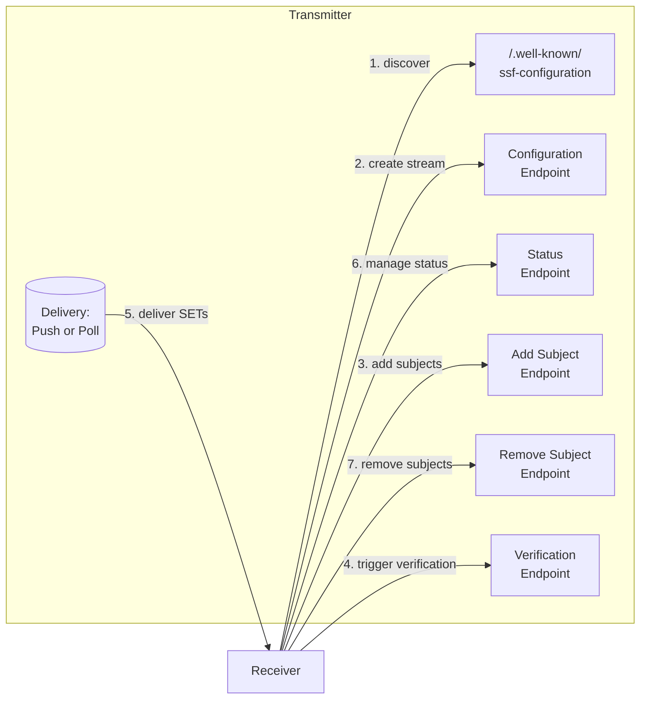
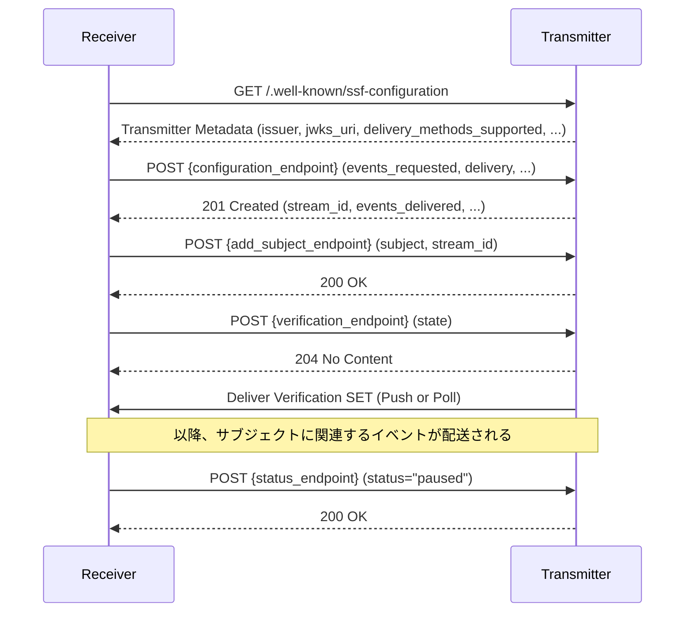
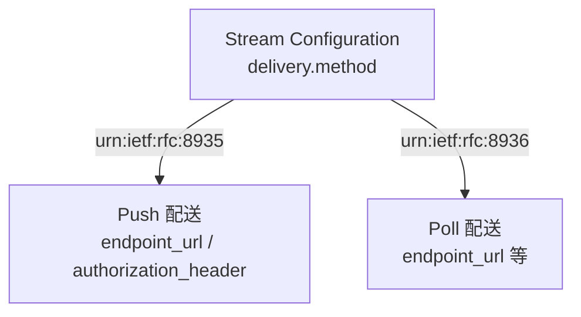
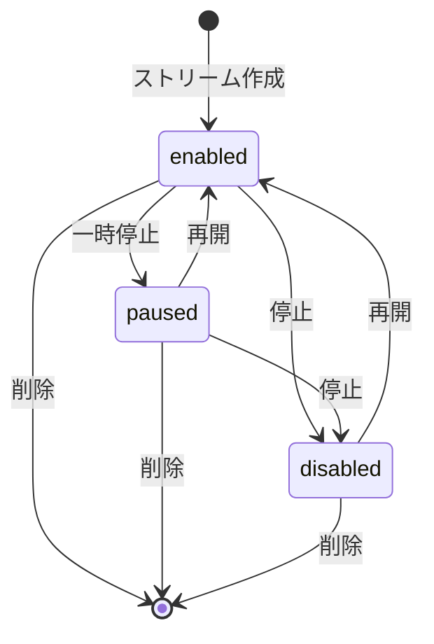

# OpenID Shared Signals Framework 1.0

## 1. 概要

**OpenID Shared Signals Framework 1.0 (SSF)** は、OpenID Foundation の Shared Signals Working Group が策定し 2025 年 8 月 29 日に Final 化された仕様である。協調する事業者間で **セキュリティおよびアイデンティティに関するシグナル (signals)** を継続的かつ相互運用可能な形で共有するためのフレームワークを定義する。

SSF は単体で動くプロトコルというより、以下の仕様を束ねる **プロファイル兼ストリーム管理レイヤー** として位置づけられる。

- イベント表現: **RFC 8417 (Security Event Token, SET)**
- サブジェクト識別子: **RFC 9493 (Subject Identifiers for SETs)**
- 配送方法: **RFC 8935 (Push)** / **RFC 8936 (Poll)**
- 上位ユースケース: **RISC (Risk Incident Sharing and Coordination)** / **CAEP (Continuous Access Evaluation Profile)**

つまり SET が「個々のイベントの封筒」、RFC 8935/8936 が「封筒の運搬手段」だとすれば、SSF はそれらを **長期的な購読関係 (Stream)** として束ね、設定・状態管理・サブジェクト購読・検証を統一的に扱うためのコントロールプレーンを与えるものである。

## 2. 解決する課題

RFC 8417 と RFC 8935/8936 を組み合わせれば、技術的にはイベントを送受信できる。しかし実運用では次の課題が残っていた。

- 受信側 (Receiver) が **どのイベント種別を購読するか** を発行側 (Transmitter) と取り決める標準的な API が存在しない
- 購読対象の **サブジェクト (ユーザー、デバイス、テナント等) を動的に追加・削除** する仕組みがない
- ストリームを一時停止 / 再開 / 削除する **状態管理** の手順が標準化されていない
- 設定が正しいかを確かめる **エンドツーエンドの導通確認 (Verification)** がない
- Transmitter 側の **設定情報・JWKS・サポートする配送方式** を発見する仕組みがない
- RISC / CAEP / その他のユースケースごとに独自仕様が乱立し、相互運用が困難

SSF はこれらをまとめて解決し、**「Stream を作る → サブジェクトを追加する → イベントを受け取る → 検証する → 状態を変える」** という統一されたライフサイクル管理 API を提供する。

## 3. 主要概念・用語

| 用語                 | 説明                                                                                               |
| -------------------- | -------------------------------------------------------------------------------------------------- |
| Transmitter          | シグナル (SET) を発行・送信する側。IdP、CSP、ガバナンスツール等が該当                              |
| Receiver             | シグナルを受信し自身のポリシー判断に利用する側。SP、リライングパーティー、SIEM 等                  |
| Event Stream         | Transmitter から Receiver への論理的なイベント送信チャネル。設定・状態・購読サブジェクトを保持する |
| Stream Configuration | ストリームの設定情報。配送方式、購読イベント種別、Issuer/Audience、ID などを含む                   |
| Stream Status        | ストリームの実行状態。`enabled` / `paused` / `disabled` の 3 状態                                  |
| Subject Principal    | ストリームが対象とするエンティティ。人間ユーザー、ロボット、デバイス、テナント等を含む             |
| Subject Identifier   | RFC 9493 で定義される形式 (`email`, `iss_sub`, `opaque` 等) によりサブジェクトを表現する構造       |
| Verification Event   | ストリームの導通確認のために Transmitter が送出する特別な SET                                      |
| Transmitter Metadata | `/.well-known/ssf-configuration` で公開される Transmitter の設定情報                               |

## 4. アーキテクチャと主要なフロー

### 4.1 全体像

### 4.2 ストリームのライフサイクル

## 5. 詳細解説

### 5.1 Transmitter Configuration Metadata

Transmitter は自身の設定を `/.well-known/ssf-configuration` で公開する。後方互換として RISC 由来の `/.well-known/risc-configuration` も許容される。主なメタデータ項目は以下のとおり。

| メタデータ                   | 説明                                                                     |
| ---------------------------- | ------------------------------------------------------------------------ |
| `spec_version`               | 準拠する SSF のバージョン                                                |
| `issuer`                     | SET の `iss` クレームと一致する HTTPS URL                                |
| `jwks_uri`                   | 署名検証用の JWKS の取得先                                               |
| `configuration_endpoint`     | ストリームの作成・更新・削除を受け付ける URL                             |
| `status_endpoint`            | ストリーム状態の参照・変更 URL                                           |
| `add_subject_endpoint`       | サブジェクト追加 URL                                                     |
| `remove_subject_endpoint`    | サブジェクト削除 URL                                                     |
| `verification_endpoint`      | 検証イベント要求 URL                                                     |
| `delivery_methods_supported` | サポートする配送方式 URI 配列 (`urn:ietf:rfc:8935`, `urn:ietf:rfc:8936`) |
| `critical_subject_members`   | Receiver が必ず処理しなければならないサブジェクトメンバー                |
| `authorization_schemes`      | API 呼び出しに使用可能な認可方式                                         |

### 5.2 Stream Configuration

Stream Configuration は、Transmitter と Receiver の間で「どのイベントを、誰宛に、どの方法で配送するか」を表現する JSON オブジェクトである。フィールドは大きく **Transmitter が決めるもの** と **Receiver が要求するもの** に分かれる。

Transmitter 側が値を確定するフィールド:

- `stream_id`: 削除前のストリームを一意に識別する ID
- `iss`: 配送される SET の `iss` クレームと一致する Issuer
- `aud`: SET の `aud` クレームに用いる Receiver 識別子
- `events_supported`: Transmitter がサポートする全イベント種別
- `events_delivered`: 実際に配送するイベント種別 (`events_requested ∩ events_supported`)

Receiver 側が指定するフィールド:

- `events_requested`: 受信したいイベント種別
- `delivery`: 配送方法とそのエンドポイント等の設定
- `description`: 任意の説明文

### 5.3 配送方式 (Delivery)

SSF はトランスポートを RFC 8935 / RFC 8936 に委譲し、それぞれを以下の URI で区別する。

- **Push (RFC 8935)**: Transmitter が Receiver の指定 URL に HTTP POST で SET を送り込む。`authorization_header` で配送時の認証情報を渡せる
- **Poll (RFC 8936)**: Transmitter が用意した SET 配送エンドポイントから Receiver がポーリングして取得する

### 5.4 サブジェクトの追加と削除

Receiver は Add Subject エンドポイントに `(stream_id, subject)` を POST して、対象サブジェクトを購読する。`subject` には RFC 9493 で定義される **Subject Identifier** を用いる。

- シンプルな形式: `email`, `phone_number`, `iss_sub`, `opaque` など単一値で表現
- 複合形式: `user`, `device`, `session`, `application`, `tenant`, `org_unit`, `group` などの複数フィールドオブジェクト
- SSF が追加で定義する形式: `jwt_id` (`iss + jti`), `saml_assertion_id` (`issuer + assertion_id`), `ip-addresses` (IP アドレス配列)

Remove Subject エンドポイントは購読解除に用いる。なお Transmitter は要求の結果としてサブジェクトの存在情報を漏洩しないよう注意する必要がある (後述のセキュリティ考慮事項)。

### 5.5 ストリームの状態管理

ストリームの状態は Status エンドポイント経由で参照・変更できる。

| 状態       | 意味                                                                                                  |
| ---------- | ----------------------------------------------------------------------------------------------------- |
| `enabled`  | 通常の送信状態。発生したイベントが Receiver に配送される                                              |
| `paused`   | 一時停止。Transmitter は本来送るはずだったイベントを保持し、再開時に送信することが推奨される (SHOULD) |
| `disabled` | 停止。Transmitter は保持を行わず、イベントは失われる                                                  |

### 5.6 検証イベント (Verification)

Receiver は Verification エンドポイントに `state` などのパラメータを POST することで、Transmitter に **検証用 SET** を発行させることができる。これによりストリーム設定の正しさをエンドツーエンドで確認できる。

検証 SET の特徴:

- イベント種別 URI: `https://schemas.openid.net/secevent/ssf/event-type/verification`
- `sub_id`: ストリームを示す opaque 形式の Subject Identifier (例えば `stream_id` を内包)
- `state`: Receiver が指定したエコーバック値 (任意)

### 5.7 SET の SSF プロファイル

SSF で配送される SET は RFC 8417 をベースに、以下の追加要件を課している。

- **明示的型付け必須**: JOSE ヘッダの `typ` を `secevent+jwt` とすること。汎用 JWT との混同を防ぐ
- `sub` クレームは **禁止**。サブジェクトは `events` 内の `sub_id` で表現する
- `exp` クレームは **禁止**。SET は事実の通知であり期限切れ概念を持ち込まないため
- `iss` はストリーム設定の `iss` と一致しなければならない
- `txn` (Transaction Identifier) の付与が推奨され、突合や重複排除に利用できる

### 5.8 エラー処理

SSF API は HTTP のステータスコードを用いて結果を表現する。代表的なものは以下。

| ステータス | 意味                                                          |
| ---------- | ------------------------------------------------------------- |
| 400        | リクエスト解析エラー (パラメータ不正等)                       |
| 401        | 認証失敗                                                      |
| 403        | 認可不足                                                      |
| 404        | リソース未発見                                                |
| 409        | 競合 (例: 単一ストリームしか許さない構成で重複作成を試みた等) |
| 429        | レート制限                                                    |

## 6. セキュリティに関する考慮事項

SSF 仕様が明示する主要な脅威と対策は以下のとおり。

### 6.1 Subject Probing (サブジェクト探索)

Add Subject エンドポイントが「存在しないユーザーには 404 を返す」のように応答を差別化すると、攻撃者がアカウント存在を推測できてしまう。Transmitter は **応答からサブジェクト存在の有無を推測されないよう** に応答を均質化する設計を推奨する。

### 6.2 Information Harvesting (情報収集)

悪意ある Receiver が大量にサブジェクトを追加・購読することで、Transmitter からセキュリティイベントを通じて広範な情報を集約してしまう恐れがある。Transmitter 側は購読許可ポリシーやレート制限により抑制する必要がある。

### 6.3 Stale Subscription (購読の取り残し)

Receiver が Remove Subject せず購読しっぱなしになる、あるいは他の Receiver が継続購読することで、本来「権限を失った」状態以降もイベントを受け取り続ける可能性がある。ストリームの権限設計とライフサイクル管理が重要となる。

### 6.4 SET の型混同

`typ: secevent+jwt` の明示的型付けにより、SSF イベントが ID Token / Access Token などとして誤って受理されることを防ぐ。Receiver はこの型を必ず検証すべきである。

### 6.5 認可

ストリーム管理 API と SET 配送の双方で認可が必須である。Transmitter Metadata の `authorization_schemes` で示された方式 (例: OAuth 2.0 Bearer Token) を用いて、Receiver と Transmitter 双方が認証・認可される必要がある。

## 7. 関連仕様

| 仕様                            | 関係                                                                       |
| ------------------------------- | -------------------------------------------------------------------------- |
| [RFC 8417 (SET)](./rfc8417.md)  | 配送される個々のイベントトークンのフォーマットを定義する                   |
| [RFC 8935 (Push)](./rfc8935.md) | Push 配送のトランスポート方式                                              |
| [RFC 8936 (Poll)](./rfc8936.md) | Poll 配送のトランスポート方式                                              |
| RFC 9493                        | Subject Identifiers for SETs。SSF が購読・配送するサブジェクトの表現を定義 |
| OpenID CAEP 1.0                 | SSF を用いて継続的なアクセス評価のためのイベントを共有する上位プロファイル |
| OpenID RISC Profile             | アカウント侵害等のリスクイベントを SSF 上で共有するプロファイル            |

SSF は SET (RFC 8417) を「個別イベントの封筒」、RFC 8935/8936 を「封筒の運搬手段」とした上で、それらを継続的な購読関係としてまとめ上げる **コントロールプレーン** に相当する。CAEP や RISC は SSF を土台にした **アプリケーションプロファイル** として位置づけられる。

## 8. 参考文献

- [OpenID Shared Signals Framework 1.0 (Final, 2025-08-29)](https://openid.net/specs/openid-sharedsignals-framework-1_0.html)
- [RFC 8417 - Security Event Token (SET)](https://www.rfc-editor.org/rfc/rfc8417)
- [RFC 8935 - Push-Based Security Event Token (SET) Delivery Using HTTP](https://www.rfc-editor.org/rfc/rfc8935)
- [RFC 8936 - Poll-Based Security Event Token (SET) Delivery Using HTTP](https://www.rfc-editor.org/rfc/rfc8936)
- [RFC 9493 - Subject Identifiers for Security Event Tokens](https://www.rfc-editor.org/rfc/rfc9493)
- [OpenID Shared Signals Working Group](https://openid.net/wg/sharedsignals/)
