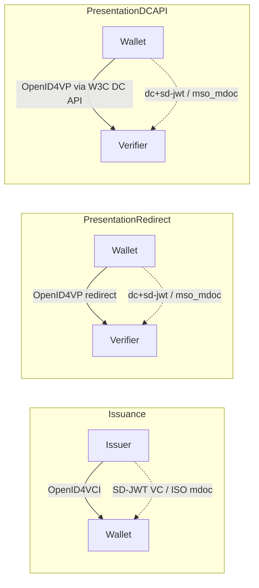
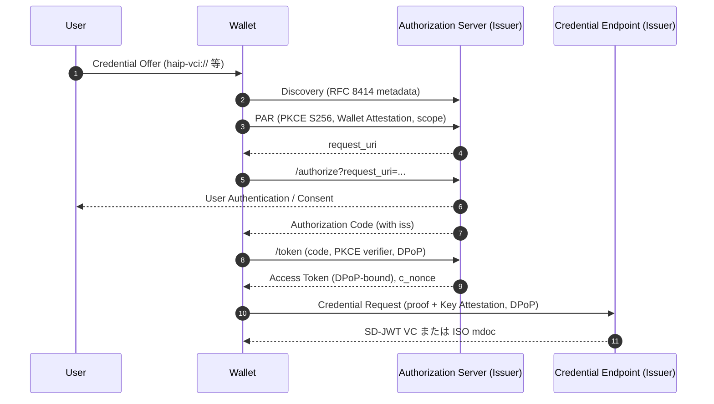
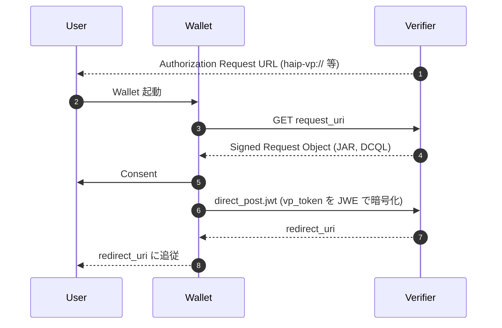

# HAIP 1.0 - OpenID4VC High Assurance Interoperability Profile

## 1. 概要

OpenID4VC High Assurance Interoperability Profile（以下 HAIP）は、Verifiable Credential の発行と提示において高度なセキュリティおよびプライバシー保証を実現するための相互運用プロファイルである。OpenID for Verifiable Credential Issuance（OpenID4VCI）、OpenID for Verifiable Presentations（OpenID4VP）、SD-JWT VC、および ISO/IEC 18013-5 mdoc の各仕様を組み合わせ、それぞれが提供する多数の選択肢の中から「相互運用可能な実装プロファイル」として必須・推奨の技術選択を固定する。

HAIP 1.0 は OpenID Foundation の Digital Credentials Protocols WG（DCP WG）により策定され、Final 仕様として 2025 年 12 月 24 日に発行された。

## 2. 解決する課題

OpenID4VCI / OpenID4VP は柔軟性を最大化するため、利用可能なクレデンシャルフォーマット、署名アルゴリズム、レスポンスモード、クライアント認証メカニズムなどに多くの選択肢を残している。一方で、Wallet・Issuer・Verifier が独立に開発される現実のエコシステム（EUDI Wallet、各国 mDL 展開、業界横断のクレデンシャル流通など）では、選択肢が多すぎることがそのまま相互運用不能の原因となる。

HAIP は以下の課題を解決することを目的とする。

- 多様な実装間で「最低限満たすべき技術スタック」を明示する
- 高保証（High Assurance）ユースケースに耐える暗号スイート・バインディング機構を必須化する
- Wallet・Issuer・Verifier が異なるベンダーから提供されても相互運用が成立するように、メタデータ・エンドポイント・クライアント識別の仕組みを統一する
- エコシステム（EUDI、各国政府発行 ID、業界コンソーシアム等）が独自プロファイルを定義する際の共通の出発点を提供する

## 3. 主要概念・用語

- **High Assurance**: 「クレデンシャルのクレームが正当であること」および「正当な Holder により提示されたものであること」の双方について、強い保証を提供する保証レベルの総称
- **Wallet Attestation**: Wallet 実装が Authorization Server のクライアントとして自身を認証するための署名されたアサーション（HAIP Appendix E）
- **Key Attestation**: Holder のクレデンシャル鍵が認証された Wallet 環境（セキュアエレメント等）に存在することを Issuer に証明する仕組み（HAIP Appendix D）
- **DCQL（Digital Credentials Query Language）**: Verifier が要求するクレデンシャルを表現するためのクエリ言語。HAIP では必須
- **Same-Device Flow / Cross-Device Flow**: Wallet と Issuer/Verifier の UA が同一端末／別端末の場合のフロー区分
- **`haip-vci://` / `haip-vp://`**: Wallet 起動に使われる任意のカスタム URI スキーム

## 4. プロファイルの適用範囲

HAIP は次の 3 つのフローを規定する。

1. OpenID4VCI によるクレデンシャル発行
2. OpenID4VP（リダイレクト経由）によるクレデンシャル提示
3. W3C Digital Credentials API 経由の OpenID4VP によるクレデンシャル提示

実装はすべてのフローをサポートする必要はないが、サポートを宣言したフローについては HAIP の要件すべてに準拠しなければならない。

## 5. クレデンシャルフォーマット

HAIP が必須サポート対象とするフォーマットは次の 2 つである。各フローについて、エコシステムは少なくともいずれか一方の対応を要求する。

- **IETF SD-JWT VC**（フォーマット識別子 `dc+sd-jwt`、コンパクトシリアライゼーション）
- **ISO/IEC 18013-5 mdoc**（フォーマット識別子 `mso_mdoc`）

両フォーマットとも、暗号鍵による Holder Binding が前提となる。

## 6. 発行フロー（OpenID4VCI）

### 6.1 全体像

### 6.2 認可コードフローと FAPI 2.0 ベースライン

- 認可コードフローのサポートは必須
- PKCE は `S256` を必須
- PAR（RFC 9126）の利用、`iss` 認可レスポンスパラメータ（RFC 9207）の検証は必須
- DPoP（RFC 9449）による Access Token の sender-constraint を必須
- スコープ値で Credential Configuration を識別する（Issuer Metadata 内に対応関係を含める）

### 6.3 Wallet 起動

Wallet 呼び出しに `haip-vci://` カスタム URI スキームの利用が任意で認められる。HAIP は Same-Device と Cross-Device の両フローのサポートを必須としている。

### 6.4 Issuer メタデータ

- RFC 8414 に準拠した Authorization Server Metadata、および OpenID4VCI の Credential Issuer Metadata のサポートが必須
- エコシステムの要件に応じて、Signed Issuer Metadata（メタデータの JWT 署名）を利用可能
- 証明書チェーンは `x5c` JOSE ヘッダで配布し、Trust Anchor は含めない。自己署名証明書は禁止

### 6.5 Wallet Attestation（クライアント認証）

PAR・Token エンドポイントにおける Wallet の認証は必須である。HAIP Appendix E が定義する Wallet Attestation を用いる場合、次の制約が課せられる。

- `x5c` JOSE ヘッダに公開鍵証明書チェーンを含める（Trust Anchor は除く）
- Wallet Attestation は Issuer 間で再利用してはならない
- `sub` クレームは Wallet 実装に共通の値であり、インスタンス固有 ID であってはならない（プライバシー保護）
- PAR リクエストでは `client_id` を `sub` 値の文字列として送信する

これにより、Wallet ベンダー単位の認証を維持しつつ、Wallet インスタンスのリンク可能性を抑制している。

### 6.6 Credential Endpoint と Key Attestation

- Credential Endpoint へのアクセスは DPoP-bound Access Token を必須とする
- Wallet は Key Attestation の実装が必須
- Appendix D 形式を用いる場合、`proof_type` として `jwt` の `key_attestation`、および独立した `attestation` の双方をサポートする
- バッチ発行時には、1 つの Key Attestation 内に複数の鍵を含めることが推奨される

### 6.7 Wallet Attestation と Key Attestation の役割

| 観点               | Wallet Attestation                      | Key Attestation                            |
| ------------------ | --------------------------------------- | ------------------------------------------ |
| 目的               | Wallet 実装の正当性（クライアント認証） | クレデンシャル鍵のセキュア環境への存在証明 |
| 利用エンドポイント | PAR / Token                             | Credential Endpoint                        |
| 推奨フォーマット   | HAIP Appendix E                         | HAIP Appendix D                            |
| 鍵配布             | `x5c`（自己署名禁止）                   | `x5c`（自己署名禁止）                      |
| 再利用             | Issuer をまたいで再利用禁止             | リクエストごとに固有                       |

## 7. 提示フロー（OpenID4VP）

### 7.1 共通要件

- レスポンスタイプは `vp_token` を必須とする
- DCQL（Digital Credentials Query Language）の利用が必須
- 署名付きリクエストは JAR（RFC 9101）で行い、`x509_hash` の Client Identifier Prefix を用いる
- レスポンス暗号化は JWE（RFC 7516）必須、鍵共有は `ECDH-ES`（P-256）、コンテンツ暗号化は `A128GCM` または `A256GCM`（`A256GCM` 推奨）

### 7.2 リダイレクト経由フロー

- Wallet 呼び出しに `haip-vp://` カスタム URI スキームの利用が任意で認められる
- JAR の `request_uri` パラメータによる Signed Request 取得を必須
- レスポンスモードは `direct_post.jwt` 必須（vp_token は暗号化されたまま Verifier に直接 POST される）
- Same-Device フローのサポートを必須とし、Verifier はレスポンス中に `redirect_uri` を含め、Wallet はリダイレクトに追従しなければならない

### 7.3 W3C Digital Credentials API 経由フロー

- Web ブラウザ・OS が提供する Digital Credentials API、またはプラットフォーム API を通じて Wallet と通信する
- レスポンスモードは `dc_api.jwt`（暗号化）を必須
- リクエストは「未署名」「単一署名」「複数署名」の 3 種類すべてに対応することが Wallet 側に求められ、Verifier は最低 1 種類をサポートすれば良い

### 7.4 フォーマット別の追加要件

#### 7.4.1 SD-JWT VC（`dc+sd-jwt`）

- 暗号鍵による Holder Binding が必要なクレデンシャルでは、提示時に Key Binding JWT（KB-JWT）を必須とする
- Holder Binding キーは Issuer 発行時の `cnf` クレーム内の JWK と一致する必要がある

#### 7.4.2 ISO mdoc（`mso_mdoc`）

- 複数の mdoc を返す場合、各 DCQL クエリに対応する `DeviceResponse` をそれぞれ返す
- 失効管理は ISO/IEC 18013-5 が定める仕組みを利用可能（VICAL 等）
- `trusted_authorities` パラメータで AKI（Authority Key Identifier）配列を用いた信頼機関の指定をサポート

## 8. クレデンシャルフォーマットプロファイル

### 8.1 SD-JWT VC プロファイル

- シリアライゼーションは **コンパクト形式必須**、JSON シリアライゼーションは任意
- 有効期間表現は `exp` クレームまたは `status` クレーム（Token Status List 連携）が推奨
- Holder Binding 鍵は `cnf` クレームの JWK で表現（RFC 7517 準拠）
- ステータス管理は Token Status List（draft-ietf-oauth-status-list）を必須
- Issuer の識別および鍵解決は `x5c` JOSE ヘッダによる X.509 証明書チェーン（Trust Anchor 除く、自己署名禁止）

### 8.2 ISO mdoc プロファイル

- フォーマット識別子は `mso_mdoc`
- 暗号化バインディング、Issuer 認証ともに ISO/IEC 18013-5 の枠組みに従う
- 失効は同規格が規定する仕組みを使用

## 9. 暗号スイートとハッシュアルゴリズム

### 9.1 デジタル署名

- 必須アルゴリズムは **ES256（ECDSA P-256 + SHA-256）**
  - JOSE 識別子: `ES256`
  - COSE 識別子: `-7` または `-9`
- 証明書チェーンは `x5c` JOSE ヘッダで配布（Trust Anchor を含めない）
- 自己署名証明書は禁止
- エコシステムは追加の署名アルゴリズム（例: ML-DSA 系の post-quantum スイート）をプロファイル拡張として定義可能

### 9.2 ハッシュアルゴリズム

- SD-JWT VC（Selective Disclosure のハッシュ）および ISO mdoc 双方で **SHA-256 を必須**
- エコシステムは追加のハッシュアルゴリズムを定義可能

### 9.3 レスポンス暗号化

- JWE Key Wrapping: `ECDH-ES`（P-256 必須）
- JWE Content Encryption: `A128GCM` または `A256GCM`（`A256GCM` 推奨）

## 10. セキュリティに関する考慮事項

- Wallet Attestation の `sub` クレームをインスタンス固有値にしないことで、Issuer 間での Wallet インスタンスのリンク可能性を防止する
- Key Attestation のバックエンド検証サービスはステートレス設計が推奨される（追跡可能性の低減）
- Status List のインデックスは予測不可能でユニークでなければならず、これにより Issuer による Holder 追跡や Verifier 間のリンク可能性を緩和する
- Verifier 認証のための X.509 証明書プロファイルはエコシステムごとに策定することが推奨される
- DPoP による sender-constraint と PAR・JAR による要求保護を組み合わせ、Authorization Request / Access Token に対する典型的な攻撃（インジェクション、置換、リプレイ）を緩和する

## 11. プライバシーに関する考慮事項

- Wallet Attestation・Key Attestation のいずれも、検証時に追跡データを残さない設計を推奨する
- Holder Binding 鍵は Issuer ごと・クレデンシャルごとに独立した鍵を用いることが望ましい（SD-JWT VC 側でも本来推奨される実装）
- Status List Token は不必要に細かいインデックス空間を用いず、十分なサイズと予測不可性を持たせる

## 12. エコシステムによる拡張ポイント

HAIP は意図的に多くの選択肢を「エコシステムが定義すべき項目」として残している。代表的なものを以下に挙げる。

- 採用するフロー（発行・リダイレクト提示・DC API 提示）と必須クレデンシャルフォーマット
- Signed Issuer Metadata を必須化するか
- Wallet Attestation / Key Attestation のフォーマット（Appendix D/E 以外を採用するか）
- X.509 証明書プロファイル（Issuer/Verifier 用の発行ポリシー、Trust Anchor 配布）
- 追加の暗号スイート・ハッシュアルゴリズム

EUDI Wallet のような大規模エコシステムは、HAIP を出発点とした上で、上記項目を自身のプロファイルで具体化することが想定されている。

## 13. 関連仕様

- [OpenID for Verifiable Credential Issuance 1.0](./openid4vci.md)
- [OpenID for Verifiable Presentations 1.0](./openid4vp.md)
- [SD-JWT VC](./sd-jwt-vc.md)
- [SD-JWT (RFC 9901)](./rfc9901.md)
- [Token Status List](./draft-ietf-oauth-status-list.md)
- [RFC 9101 - JWT-Secured Authorization Request (JAR)](./rfc9101.md)
- [RFC 9126 - Pushed Authorization Requests (PAR)](./rfc9126.md)
- [RFC 9207 - OAuth 2.0 Authorization Server Issuer Identification](./rfc9207.md)
- [RFC 9449 - DPoP](./rfc9449.md)
- [RFC 8414 - OAuth 2.0 Authorization Server Metadata](./rfc8414.md)
- [RFC 7517 - JSON Web Key](./rfc7517.md)
- ISO/IEC 18013-5（mDL / mdoc）
- W3C Digital Credentials API

## 14. 参考文献

- OpenID Foundation, "OpenID4VC High Assurance Interoperability Profile 1.0", 2025-12-24
  <https://openid.net/specs/openid4vc-high-assurance-interoperability-profile-1_0.html>
- OpenID Foundation, "OpenID for Verifiable Credential Issuance 1.0"
- OpenID Foundation, "OpenID for Verifiable Presentations 1.0"
- IETF, "SD-JWT-based Verifiable Credentials (SD-JWT VC)"
- IETF, "OAuth Status List"
- ISO/IEC 18013-5:2021, "Personal identification — ISO-compliant driving licence — Part 5: Mobile driving licence (mDL) application"
- W3C, "Digital Credentials API"
