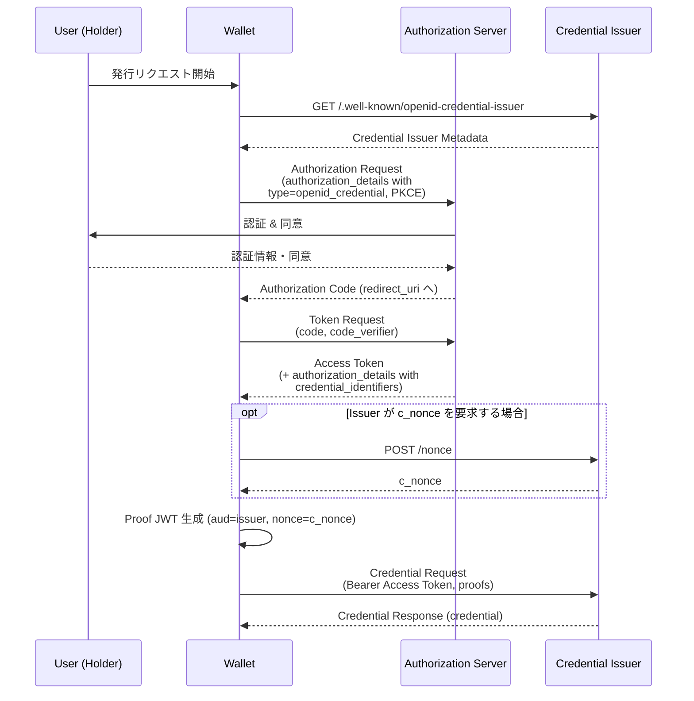
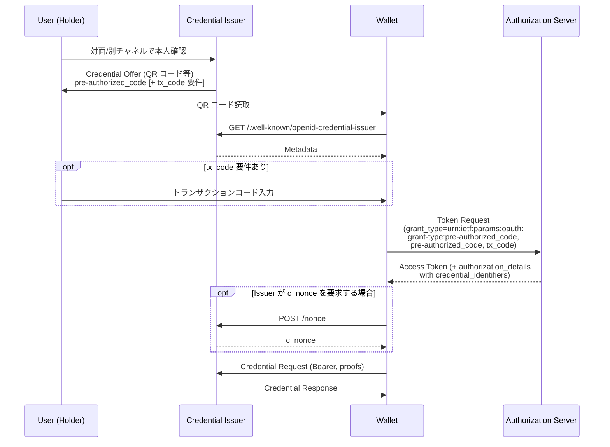

# OpenID for Verifiable Credential Issuance 1.0 (OID4VCI)

## 1. 概要

OpenID for Verifiable Credential Issuance 1.0（以下 OID4VCI）は、OpenID Foundation の Digital Credentials Protocols Working Group が策定した、OAuth 2.0 で保護された API を介して Verifiable Credential（検証可能な資格情報）を Wallet に発行するためのプロトコルである。2025 年 9 月 16 日に Final 化された。

OID4VCI は特定のクレデンシャル・フォーマットに依存せず、IETF SD-JWT VC、ISO/IEC 18013-5 mobile document (mdoc)、W3C Verifiable Credentials Data Model などを共通の発行フローで扱える点が大きな特徴である。EU Digital Identity Wallet（EUDIW）をはじめとする各国のデジタル ID ウォレット施策における標準的な発行プロトコルとして採用が進んでいる。

## 2. 解決する課題

従来の OAuth 2.0 / OpenID Connect は、Issuer（IdP）が発行した ID Token や Access Token を、その場で Relying Party に提示する「ベアラートークン」モデルに最適化されていた。一方で、検証可能な資格情報のユースケース（運転免許証、学位、住民票、医療資格など）では以下の特性が求められる。

- 発行から提示まで時間が経過し得る（長期保管）
- ホルダーがクレデンシャルを保管し、複数の Verifier に提示する
- 発行時とは独立した鍵で署名された Proof of Possession (PoP) を伴う
- 発行者・ホルダー・検証者の三者モデル（issuer-holder-verifier model）
- 選択的開示やゼロ知識証明など、Verifier ごとに異なる開示制御

OID4VCI は OAuth 2.0 の認可フローを再利用しつつ、これらの要件に応える発行 API を定義する。これにより、既存の認可サーバー資産（IdP、認証 UI、同意管理）を活かしながら、Verifiable Credential のエコシステムに参加できる。

## 3. 主要概念・用語

- **Credential Issuer**: Verifiable Credential を発行する主体。OAuth の Resource Server として振る舞う。
- **Wallet**: ホルダーが操作するソフトウェア。OAuth の Client として認可サーバーと通信し、発行されたクレデンシャルを保管する。
- **Authorization Server**: ホルダー（エンドユーザー）を認証し、Access Token を発行する。Credential Issuer に組み込まれていてもよいし、外部のものでもよい。
- **Holder**: クレデンシャルの保有者（エンドユーザー）。
- **Verifier**: クレデンシャルの提示を受けて検証する主体（OID4VP を用いる）。
- **Credential Offer**: Issuer から Wallet に対して「これこれのクレデンシャルを発行できる」と提示するオブジェクト。
- **Credential Configuration**: Issuer が発行可能なクレデンシャルの定義（フォーマット、対応 Proof Type、スコープ等）。`credential_configuration_id` で識別される。
- **Credential Format**: クレデンシャルのシリアライズ形式。`dc+sd-jwt`、`mso_mdoc`、`jwt_vc_json`、`ldp_vc` などのプロファイルが Appendix A で定義されている。
- **Proof of Possession (PoP)**: Wallet が、発行されるクレデンシャルにバインドする鍵を保有していることを示す証明。

## 4. プロトコルフロー

OID4VCI は二つの主要な認可フローを定義する。

### 4.1 Authorization Code Flow

エンドユーザー認証と同意取得が必要な、最も一般的なフロー。



### 4.2 Pre-Authorized Code Flow

Issuer 側で既にユーザーの認証・本人確認が完了している場合に、認可エンドポイントを省略するフロー。Issuer の窓口担当者が QR コードを発行し、ホルダーが Wallet で読み取る、といった対面シナリオに適する。



## 5. 詳細解説

### 5.1 Credential Issuer Metadata（Section 12）

Issuer は `<credential_issuer>/.well-known/openid-credential-issuer` で JSON メタデータを公開する。主なパラメータは次の通り。

- `credential_issuer`: Issuer 識別子（HTTPS URL）
- `authorization_servers`: 利用可能な認可サーバーの配列
- `credential_endpoint`: クレデンシャル発行エンドポイント URL
- `nonce_endpoint`: `c_nonce` 取得用エンドポイント（任意）
- `deferred_credential_endpoint`: 非同期発行用エンドポイント（任意）
- `notification_endpoint`: 発行後の通知エンドポイント（任意）
- `credential_response_encryption`: 応答暗号化のサポート状況
- `credential_configurations_supported`: 発行可能なクレデンシャルの構成定義（キーが `credential_configuration_id`）

`credential_configurations_supported` の各エントリには `format`、`scope`、`cryptographic_binding_methods_supported`、`credential_signing_alg_values_supported`、`proof_types_supported`、フォーマット固有のパラメータ（例: SD-JWT VC なら `vct`、mdoc なら `doctype`）などが含まれる。

### 5.2 Credential Offer（Section 4）

Issuer は Wallet に対し、URI 形式の Credential Offer で「何を発行できるか」を提示する。

```json
{
  "credential_issuer": "https://issuer.example.com",
  "credential_configuration_ids": ["UniversityDegreeCredential"],
  "grants": {
    "authorization_code": {
      "issuer_state": "eyJhbGciOiJSU0Et..."
    },
    "urn:ietf:params:oauth:grant-type:pre-authorized_code": {
      "pre-authorized_code": "adhjhdjajkdkhjhdj",
      "tx_code": {
        "input_mode": "numeric",
        "length": 6,
        "description": "対面で受け取った 6 桁コードを入力してください"
      }
    }
  }
}
```

Wallet は `openid-credential-offer://` カスタム URI スキームや Universal Link を通じてこのオブジェクトを受け取り、フローを開始する。

### 5.3 Authorization Request と authorization_details（Section 5）

Authorization Code Flow では、要求するクレデンシャルを RFC 9396（Rich Authorization Requests）の `authorization_details` パラメータで指定する。

```json
[
  {
    "type": "openid_credential",
    "credential_configuration_id": "UniversityDegreeCredential"
  }
]
```

Authorization Code Flow では、PKCE（RFC 7636）と Pushed Authorization Requests（RFC 9126）の利用が推奨される（Section 5）。Wallet を信頼できないインストールから保護するため、Wallet Attestation（Appendix E）や OAuth 2.0 Attestation-Based Client Authentication と組み合わせる構成も定義されている。

### 5.4 Token Response（Section 6.2）

Token Response は通常の OAuth 2.0 応答に加え、以下の拡張パラメータを返し得る。

- `authorization_details`: Authorization Request または Token Request で `authorization_details` を用いた場合は必須。`type=openid_credential` のエントリには、Issuer 側で生成された `credential_identifiers`（文字列配列）が付与され、これにより同じ Credential Configuration から複数の個別 Credential Dataset を識別して発行できる。

なお OID4VCI Final（2025-09-16）では、Proof of Possession に用いる `c_nonce` は Token Response では返却されず、必要に応じて後述の Nonce Endpoint から個別に取得する設計となっている。

### 5.5 Nonce Endpoint（Section 7）

PoP のリプレイ対策として用いる `c_nonce` を取得する非認証エンドポイント。Wallet は `POST /nonce` で新鮮なナンスを取得し、Proof JWT に組み込む。

### 5.6 Credential Endpoint（Section 8）

Wallet は Access Token を Bearer（または DPoP）として付与し、Credential Request を送信する。

```http
POST /credential HTTP/1.1
Host: issuer.example.com
Authorization: Bearer eyJhbGc...
Content-Type: application/json

{
  "credential_configuration_id": "UniversityDegreeCredential",
  "proofs": {
    "jwt": [
      "eyJ0eXAiOiJvcGVuaWQ0dmNpLXBy..."
    ]
  }
}
```

`credential_configuration_id` の代わりに、Token Response で得た `credential_identifier` を指定することもできる（後者はより精密な発行制御を可能にする）。

Proof Type は Appendix F で次のように定義される。

- `jwt`（F.1）: `typ` ヘッダが `openid4vci-proof+jwt` の JWT。`iss`（Wallet クライアント ID、Pre-Authorized Code Flow など Client 認証がない場合は省略）、`aud`（Credential Issuer 識別子）、`iat`、`nonce`（`c_nonce`）を含み、ヘッダに `jwk` / `kid` / `x5c` のいずれかで公開鍵を示す。
- `di_vp`（F.2）: VC Data Model の Verifiable Presentation を Data Integrity で保護したものを Key Proof として用いる形式。
- `attestation`（F.3）: Appendix D で定義される JWT 形式の Key Attestation を Key Proof として用いる形式。

複数の PoP を一度に提示することで、一度の Credential Request で同一フォーマットの複数クレデンシャル（バッチ発行）を取得できる。

### 5.7 Credential Response（Section 8.3）

即時発行できる場合は HTTP 200 で `credentials` 配列を返す。各要素は `credential` メンバを持つオブジェクトで、文字列またはオブジェクトとして 1 件の Credential を含む（バイナリ形式は base64url エンコード）。`notification_id` は Notification Endpoint で参照するための識別子として返される。

```json
{
  "credentials": [{ "credential": "eyJhbGciOi..." }],
  "notification_id": "3fwe98js"
}
```

即時発行ができない場合、Issuer は HTTP 202 で `transaction_id` と `interval`（次回ポーリングまでの最小秒数）を返し、Wallet は後述の Deferred Credential Endpoint で取得する。`credentials` と `transaction_id` は相互排他である。

### 5.8 Deferred Credential Endpoint（Section 9）

KYC や審査などで発行に時間を要するケース向け。Wallet は `transaction_id` を POST し、準備ができ次第クレデンシャルを受け取る。準備中の場合は `issuance_pending` エラーが返る。

### 5.9 Encrypted Credential Response（Section 10）

`credential_response_encryption` を要求することで、JWE による応答暗号化が可能。Wallet は復号鍵を含む JWK と対応アルゴリズムを Credential Request で提示する。

### 5.10 Notification Endpoint（Section 11）

Wallet は Credential Response で受け取った `notification_id` を用い、Access Token を Bearer として付与した上で Issuer に状態を通知する。`event` パラメータの値は次の 3 種に限定されている（Section 11.1）。

- `credential_accepted`: Credential が Wallet に正常に保管された場合（ユーザー操作の有無を問わない）
- `credential_deleted`: ユーザーの操作が原因で Credential の発行が成立しなかった場合
- `credential_failure`: 上記以外の理由で発行が成立しなかった場合（バッチ発行時に一部でも失敗すれば全体を失敗として扱う）

任意で `event_description` を付与してエラー詳細を伝えられる。Issuer 側のクレデンシャル・ライフサイクル管理（失効、再発行など）に活用される。

### 5.11 サポートされる Credential Format（Appendix A）

OID4VCI 本体はフォーマット非依存だが、Appendix A で次のプロファイルを定義している。

- W3C Verifiable Credentials Data Model（A.1）
  - `jwt_vc_json`: JSON-LD を用いず JWT として署名された VC
  - `jwt_vc_json-ld`: JSON-LD を用い JWT として署名された VC
  - `ldp_vc`: JSON-LD と Data Integrity（Linked Data Canonicalization を伴う Proof Suite）で保護された VC
- `mso_mdoc`（A.2）: ISO/IEC 18013-5 の Mobile Security Object で保護された mdoc（モバイル運転免許など）
- `dc+sd-jwt`（A.3）: IETF SD-JWT VC

各プロファイルで `credential_configurations_supported` および Credential Request の追加パラメータが規定されている。

## 6. セキュリティに関する考慮事項

仕様書 Section 13 / 14 / 15 で詳細に議論されている主要な論点を以下にまとめる。

- **TLS 必須**: 全エンドポイントは TLS で保護する。
- **PKCE と PAR**: Authorization Code Flow では PKCE（RFC 7636）と Pushed Authorization Requests（RFC 9126）の利用が推奨される。
- **Pre-Authorized Code の保護**: 短命かつ単一使用とし、対面・別チャネルで配布する `tx_code` を組み合わせて、偶発的・悪意ある第三者の利用を防ぐ。
- **Proof リプレイ防止**: `c_nonce` を発行毎に更新し、Proof JWT の `aud` を Issuer 識別子にバインドする。
- **Wallet 真正性**: Wallet Attestation や Client Attestation を組み合わせ、改ざんされたウォレットからの発行要求を防ぐ。
- **クレデンシャル / 鍵バインディング**: Issuer は Proof で示された公開鍵をクレデンシャルにバインドして署名し、ホルダー以外による提示を防ぐ。
- **プライバシー**: バッチ発行や `credential_identifier` の活用で、Issuer に対する逐次的なリンク可能性を緩和する。Issuer 単独で全クレデンシャルの提示先を把握できないよう、Verifier との直接通信を避ける設計を選択できる。
- **同意とトラッキング**: ホルダーは自身がどの Verifier 向けにクレデンシャルを取得したかを意識的に制御できることが望ましい。

## 7. 関連仕様

- [OAuth 2.0 (RFC 6749)](./rfc6749.md): 認可フローの基盤
- [PKCE (RFC 7636)](./rfc7636.md): Authorization Code Flow の保護
- [JWT (RFC 7519)](./rfc7519.md) / [JWS (RFC 7515)](./rfc7515.md): Proof JWT の表現
- [Pushed Authorization Requests (RFC 9126)](./rfc9126.md): 認可要求の整合性確保
- [Rich Authorization Requests (RFC 9396)](./rfc9396.md): `authorization_details` の基盤
- [DPoP (RFC 9449)](./rfc9449.md): Access Token の Sender-Constrained 化
- [W3C Verifiable Credentials Data Model 2.0](./vc-data-model-2.0.md): 発行対象となるクレデンシャル・モデルの一つ
- [W3C Decentralized Identifiers (DID) Core 1.0](./did-core.md): クレデンシャル主体の識別子
- OpenID for Verifiable Presentations 1.0 (OID4VP): 発行されたクレデンシャルの提示プロトコル（姉妹仕様）
- IETF SD-JWT VC（draft-ietf-oauth-sd-jwt-vc）: 選択的開示対応フォーマット
- ISO/IEC 18013-5: モバイル運転免許のフォーマット

## 8. 参考文献

- [OpenID for Verifiable Credential Issuance 1.0 (Final, 2025-09-16)](https://openid.net/specs/openid-4-verifiable-credential-issuance-1_0.html)
- [OpenID Foundation - Digital Credentials Protocols WG](https://openid.net/wg/digital-credentials-protocols/)
- [RFC 9396: OAuth 2.0 Rich Authorization Requests](https://www.rfc-editor.org/rfc/rfc9396.html)
- [RFC 9126: OAuth 2.0 Pushed Authorization Requests](https://www.rfc-editor.org/rfc/rfc9126.html)
- [RFC 7636: PKCE](https://www.rfc-editor.org/rfc/rfc7636.html)
