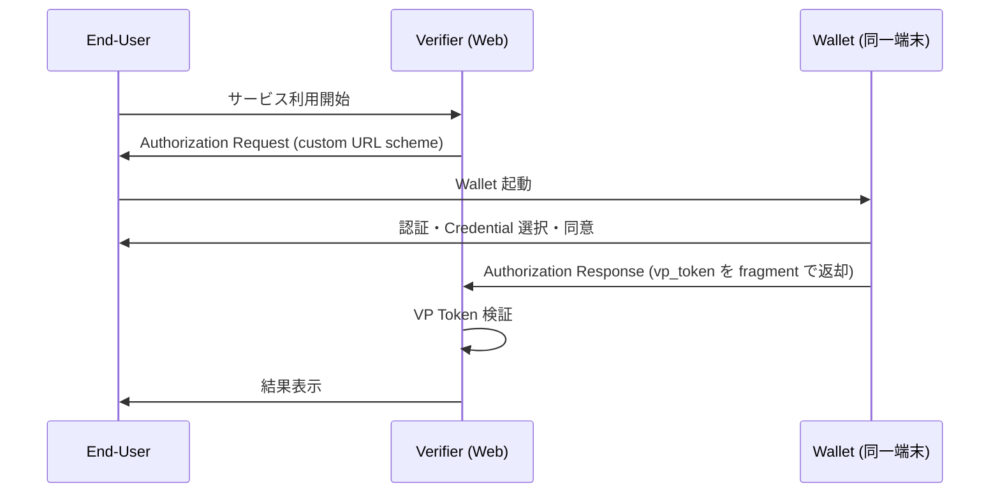
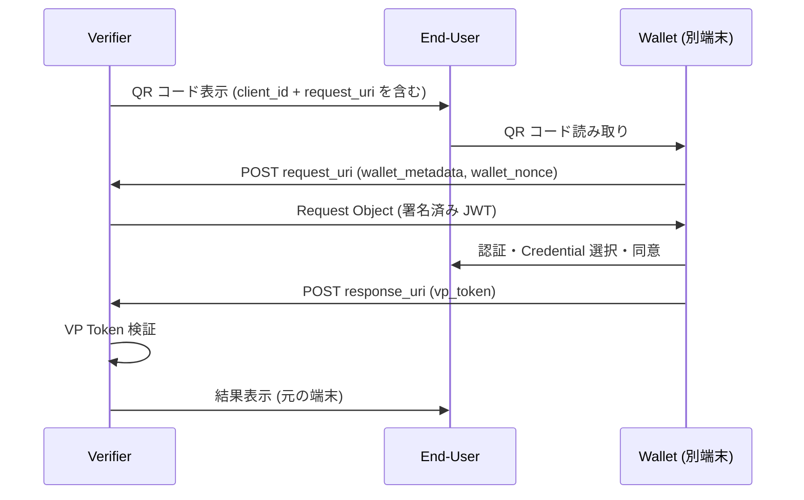

# OpenID for Verifiable Presentations (OID4VP) 1.0

## 1. 概要

OpenID for Verifiable Presentations 1.0 (以下 OID4VP) は、Wallet が保持する Verifiable Credential から導出された Presentation を、Verifier が安全に要求・取得・検証するためのプロトコルである。OAuth 2.0 を基盤とし、Authorization Request / Response の枠組みを Credential Presentation のために拡張する。

OpenID Foundation の Digital Credentials Protocols (DCP) Working Group が策定し、2025 年 7 月 9 日に Final 1.0 として承認された。著者は Oliver Terbu (MATTR)、Torsten Lodderstedt (SPRIND)、Kristina Yasuda (SPRIND)、Daniel Fett (Authlete)、Joseph Heenan (Authlete) である。

OID4VP は Credential 発行を扱う [OpenID for Verifiable Credential Issuance (OID4VCI)](./openid4vci.md) と対をなす Wallet エコシステムの基幹仕様であり、Credential フォーマットに対して中立に設計されている。W3C Verifiable Credentials Data Model、ISO/IEC 18013-5 mdoc、IETF SD-JWT VC など任意の Credential 形式を同一フレームワーク内で扱える。

## 2. 解決する課題

従来の OAuth 2.0 / OpenID Connect では、Identity Provider (IdP) が常時オンラインで Claim を提供する「フェデレーション型」モデルが前提だった。これに対し Verifiable Credential では、発行者・所有者・検証者の三者モデル (Issuer-Holder-Verifier Model) が採用され、以下の特性が求められる。

- 発行と提示の時間的・物理的分離 (Issuer がオフラインでも Presentation できる)
- Holder (End-User) が自身の Wallet から能動的に Credential を選択し提示する
- 選択的開示 (Selective Disclosure) によりプライバシーを保護する
- 複数の Credential 形式 (W3C VC、mdoc、SD-JWT VC) を統一的に扱う
- Same-Device (同一端末) と Cross-Device (異端末) の両フローを実装する
- Web / ネイティブアプリの両プラットフォームで Wallet を呼び出す

OID4VP はこれらの要件を OAuth 2.0 の上に薄く実装し、既存の OAuth エコシステムとの親和性と Credential フォーマットへの中立性を両立させる。

## 3. 主要概念・用語

| 用語                     | 定義                                                                                              |
| ------------------------ | ------------------------------------------------------------------------------------------------- |
| Verifier                 | Presentation を要求・受領・検証するエンティティ。OAuth 2.0 の Client に相当する                   |
| Wallet                   | Credential を受領・保管・提示・管理するエンティティ。OAuth 2.0 の Authorization Server に相当する |
| Credential               | Issuer が発行した一つ以上の Claim 集合                                                            |
| Presentation             | 特定の Verifier に提示するために Credential から導出されたデータ                                  |
| VP Token                 | 一つ以上の Presentation を格納するコンテナ。複数フォーマット混在を許容する                        |
| Holder Binding           | Credential の正当な所有を証明する能力。暗号鍵バインディング、生体、Claim ベース等がある           |
| DCQL                     | Digital Credentials Query Language。Verifier が要求する Credential を JSON で記述するクエリ言語   |
| Client Identifier Prefix | `client_id` の信頼方式を示す接頭辞 (例: `x509_san_dns:`、`did:`)                                  |
| Transaction Data         | Presentation に紐付けて承認すべき取引情報 (決済額や署名対象ハッシュ等)                            |

## 4. プロトコルフロー

OID4VP は Same-Device Flow と Cross-Device Flow の二つを主要フローとして定義する。さらに W3C Digital Credentials API 経由のブラウザ統合フローを Appendix A で規定する。

### 4.1 Same-Device Flow

End-User が Verifier と同一端末上の Wallet (ネイティブアプリ等) を呼び出すフロー。`response_mode=fragment` がデフォルトとなる。



### 4.2 Cross-Device Flow

End-User が別端末の Wallet (スマートフォン等) を用いるフロー。Verifier が QR コードを表示し、Wallet がそれを読み取って `request_uri` を取得する。Authorization Response は `response_mode=direct_post` で Verifier の `response_uri` に HTTPS POST される。



### 4.3 Digital Credentials API 経由フロー

ブラウザの [Digital Credentials API](../articles/2026-04-18-digital-credentials-api.md) を介して Wallet を呼び出すフロー。`response_mode=dc_api` または `dc_api.jwt` を使用し、`client_id` には Origin ベースの識別子を用いることが多い。OS / ブラウザが Wallet 選択 UI を仲介するため、フィッシング耐性と Wallet 競合解決の両面で利点がある。

## 5. 詳細解説

### 5.1 Authorization Request パラメータ

OID4VP の Authorization Request は OAuth 2.0 の Authorization Request を拡張する。主要パラメータを以下に示す (Section 5)。

| パラメータ           | 用途                                                                     |
| -------------------- | ------------------------------------------------------------------------ |
| `response_type`      | 常に `vp_token` を指定する (Section 5.6)                                 |
| `client_id`          | Verifier 識別子。Client Identifier Prefix を伴い得る (Section 5.9)       |
| `response_mode`      | `fragment` / `direct_post` / `direct_post.jwt` / `dc_api` / `dc_api.jwt` |
| `response_uri`       | `direct_post` 系で Authorization Response を POST する宛先               |
| `redirect_uri`       | `fragment` モード時の戻り先                                              |
| `nonce`              | リプレイ攻撃防止用乱数。必須                                             |
| `state`              | Holder Binding なしの場合に必須 (Section 5.3)                            |
| `dcql_query`         | DCQL 形式の Credential 要求 (Section 6)                                  |
| `scope`              | DCQL の代替として事前合意済みクエリを参照する場合に使用                  |
| `client_metadata`    | Verifier のメタデータ (`vp_formats_supported`、暗号化鍵 `jwks` 等)       |
| `request_uri`        | Request Object を別エンドポイントから取得させる                          |
| `request_uri_method` | `get` または `post`。`post` の場合 Wallet 能力を送信できる               |
| `transaction_data`   | base64url(JSON) 配列。承認対象の取引情報                                 |
| `verifier_info`      | Verifier に関する追加の attestation 情報                                 |

`request_uri_method=post` を用いると、Wallet は Request Object 取得時に `wallet_metadata` と `wallet_nonce` を送信できる。これにより Verifier は Wallet が実際にサポートする Credential 形式や暗号アルゴリズムに合わせて Request Object を動的に生成でき、相互運用性が高まる。

### 5.2 Client Identifier Prefix

`client_id` は単純な文字列だけでなく、信頼経路を示す接頭辞 (Client Identifier Prefix) を持ち得る (Section 5.9.3)。これにより Verifier の本人性をどのように検証するかが明示される。

| Prefix                     | 信頼方式                                       | 署名                            |
| -------------------------- | ---------------------------------------------- | ------------------------------- |
| (なし)                     | 事前登録済みクライアント                       | Wallet が事前に保持する鍵で検証 |
| `redirect_uri`             | Client ID = Redirect URI                       | 署名不可 (用途限定)             |
| `x509_san_dns`             | X.509 証明書の SAN (DNS)                       | 必須                            |
| `x509_hash`                | X.509 証明書ハッシュ                           | 必須                            |
| `openid_federation`        | OpenID Federation の Entity Statement チェーン | 信頼チェーンで担保              |
| `decentralized_identifier` | DID で識別                                     | 必須                            |
| `verifier_attestation`     | Verifier Attestation JWT                       | 必須                            |

ブラウザ統合フローでは `web-origin:` 接頭辞 (Appendix A) も定義され、ブラウザが提供する Origin が `client_id` として安全に利用できる。

### 5.3 DCQL (Digital Credentials Query Language)

DCQL は OID4VP 1.0 で新たに導入された JSON ベースのクエリ言語であり、従来の DIF Presentation Exchange を置き換える役割を持つ (Section 6)。Verifier が要求する Credential と Claim を簡潔かつ厳密に表現できる。

```json
{
  "credentials": [
    {
      "id": "identity_credential",
      "format": "dc+sd-jwt",
      "meta": {
        "vct_values": ["https://example.com/identity"]
      },
      "require_cryptographic_holder_binding": true,
      "claims": [
        { "id": "last_name_claim", "path": ["last_name"] },
        { "id": "first_name_claim", "path": ["first_name"] }
      ]
    }
  ],
  "credential_sets": [
    {
      "options": [["identity_credential"]],
      "required": true
    }
  ]
}
```

主要要素は以下のとおりである。

- `credentials`: 個別の Credential Query の配列 (Section 6.1)。`id`、`format`、`meta`、`claims`、`claim_sets`、`trusted_authorities`、`require_cryptographic_holder_binding` 等を含む。
- `credential_sets`: Credential Query の組み合わせ要件 (Section 6.2)。`options` は許容される ID 集合の選択肢、`required` は必須/オプションの区別を示す。
- `claims`: 取得すべき Claim の指定 (Section 6.3)。`path` には Claims Path Pointer (Section 7) を指定し、JSON 構造と ISO mdoc namespace/element の双方を統一的に表現できる。
- `trusted_authorities`: 受入可能な Issuer 信頼アンカー (Section 6.1.1)。`aki`、`etsi_tl`、`openid_federation` 等の `type` がある。

DCQL は Credential Set による「AかつB」「AまたはB」の表現や、複数 Claim 組み合わせ (`claim_sets`) の指定が可能で、複雑な提示要件をスキーマ駆動で記述できる点が特徴である。

### 5.4 Response Mode

| Mode              | 説明                                                        | 主な用途              |
| ----------------- | ----------------------------------------------------------- | --------------------- |
| `fragment`        | URL fragment で返却 (OAuth 2.0 デフォルト)                  | Same-Device Flow      |
| `direct_post`     | `response_uri` に application/x-www-form-urlencoded で POST | Cross-Device Flow     |
| `direct_post.jwt` | `direct_post` を JWE で暗号化                               | 暗号化応答            |
| `dc_api`          | Digital Credentials API 経由                                | ブラウザ統合          |
| `dc_api.jwt`      | DC API + JWE 暗号化                                         | ブラウザ統合 + 暗号化 |

`direct_post.jwt` および `dc_api.jwt` では `client_metadata` に含まれる `jwks` に基づいて Authorization Response を暗号化する。Cross-Device Flow で QR から渡される URL に Response が現れないため、傍受や偶発的なログ収集に対する保護が向上する。

### 5.5 VP Token と Authorization Response

成功時の Authorization Response は以下を含む (Section 8.1)。

```json
{
  "vp_token": {
    "identity_credential": "<eyJ... の SD-JWT Presentation>"
  },
  "state": "..."
}
```

- `vp_token` は DCQL Credential ID をキーに持つマップで、値は各 Presentation の文字列または配列である。複数の Credential を同時に提示する場合は各キーに対応する Presentation が並ぶ。
- 古い Implementer's Draft で利用されていた DIF Presentation Submission ベースの Response は、Final 1.0 では DCQL 主体の構造に置き換えられている。
- `state` はリクエストに `state` を含めた場合のみ返却される。

### 5.6 Transaction Data

`transaction_data` (Section 5) は、Presentation に「承認」を結びつけるための仕組みである。Wallet は End-User に取引内容を表示したうえで同意を取得し、`transaction_data` のハッシュを Presentation の署名対象に含める。

```json
{
  "type": "qes_authorization",
  "credential_ids": ["identity_credential"],
  "transaction_data_hashes_alg": ["sha-256"]
}
```

代表的なユースケースに QES (適格電子署名) の認可、決済承認、契約締結時の意思確認などがある。各 `type` の具体的なクレーム定義は本仕様の範囲外であり、別仕様やプロファイル (例: 決済プロファイル、QES プロファイル) で規定される。

### 5.7 Verifier Attestation

`verifier_attestation` Client Identifier Prefix を用いる場合、Verifier は信頼できる第三者から発行された Verifier Attestation JWT を提示する。JOSE ヘッダの `jwt` パラメータに配置され、以下を満たす必要がある。

- `sub` クレームが Client Identifier と一致する
- `cnf` クレームに Verifier の公開鍵を含み、Wallet はこの鍵で Request Object 署名を検証する
- Wallet は発行者を信頼ルートで検証する

この仕組みにより、Verifier ごとの事前登録を伴わずに、信頼アンカーから派生した属性付き Verifier を運用できる。

## 6. セキュリティに関する考慮事項

OID4VP の Section 14 には以下が定められている。

- **リプレイ攻撃防止 (14.1)**: `nonce` は必須。Holder Binding がない Credential を提示する場合は `state` も必須。`nonce` は Presentation の署名対象に含めて Wallet が新鮮性を担保する。
- **Session Fixation (14.2)**: `state` 検証で Verifier 側のセッションとリクエストを結合する。
- **Response URI 検証 (14.3.1)**: `response_uri` のスキーム・ホスト・パスを `client_id` から導出可能な範囲に制限する。`x509_san_dns:` 利用時は SAN の FQDN と一致させる。
- **応答の暗号化 (14.5)**: Cross-Device で機微 Claim を扱う場合は `direct_post.jwt` を強く推奨。
- **TLS 必須 (14.6)**: すべての HTTPS エンドポイントは TLS 必須。
- **Credential 検証 (14.9)**: Verifier は Issuer の信頼性・失効状態を必ず確認する。
- **Wallet なりすまし**: ブラウザ統合 (DC API) や OS 仲介 (App Intents 等) を活用してフィッシングを抑制する。
- **エンドユーザー UX**: Wallet は要求 Claim と Verifier 情報を明示し、選択的開示の対象を End-User が理解できる形で提示する。

## 7. 関連仕様

- [OpenID for Verifiable Credential Issuance (OID4VCI) 1.0](./openid4vci.md) — Credential 発行プロトコル。OID4VP と対をなす。
- [W3C Verifiable Credentials Data Model 2.0](./vc-data-model-2.0.md) — Credential / Presentation のデータモデル。
- [W3C Decentralized Identifiers (DID) Core 1.0](./did-core.md) — Issuer / Holder の識別子として利用される。
- [RFC 6749 (OAuth 2.0)](./rfc6749.md) — 基盤プロトコル。
- [RFC 9101 (JWT-Secured Authorization Request, JAR)](./rfc9101.md) — Request Object の署名形式。
- [RFC 7519 (JWT)](./rfc7519.md) — 各種 Attestation の符号化形式。
- IETF SD-JWT VC (draft-ietf-oauth-sd-jwt-vc) — 選択的開示対応の Credential 形式。
- ISO/IEC 18013-5 (mdoc) — モバイル運転免許証の Credential 形式。
- Self-Issued OpenID Provider v2 (SIOPv2) — OID4VP と組み合わせて自己発行 ID 提示に利用される。
- OpenID Federation 1.0 — `openid_federation` Client Identifier Prefix の信頼基盤。
- W3C Digital Credentials API — ブラウザ統合の Wallet 呼び出し API。

## 8. 参考文献

- OpenID Foundation, "OpenID for Verifiable Presentations 1.0", Final, 2025-07-09. <https://openid.net/specs/openid-4-verifiable-presentations-1_0.html>
- OpenID Digital Credentials Protocols Working Group. <https://openid.net/wg/digital-credentials-protocols/>
- DCQL (Digital Credentials Query Language) — 上記仕様 Section 6 および 7
- Appendix A: W3C Digital Credentials API Profile
