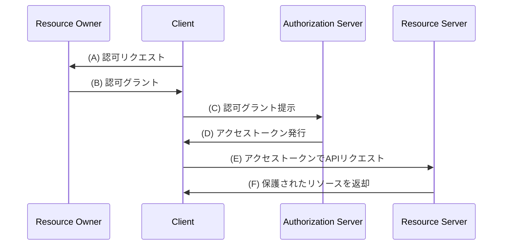
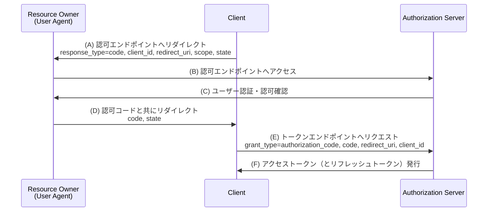
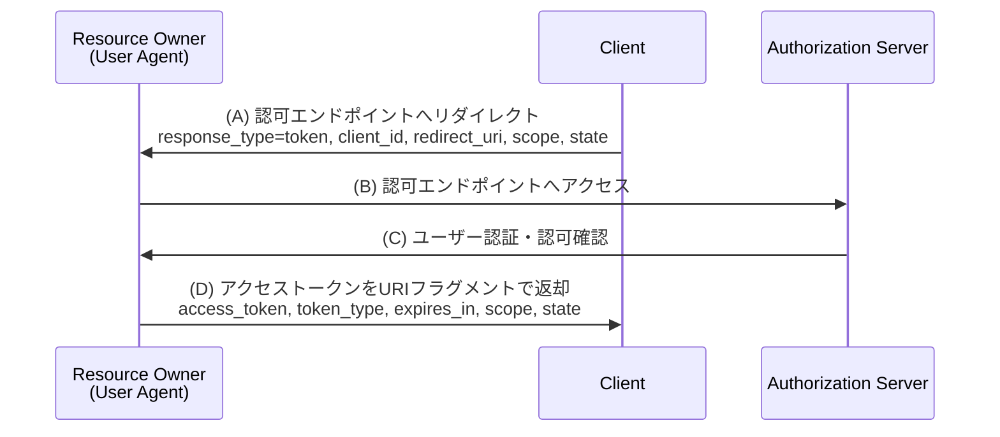
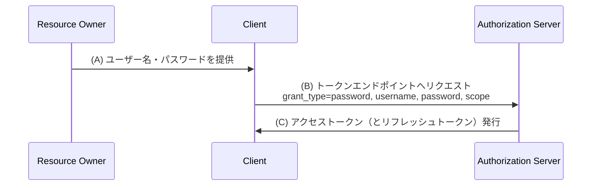
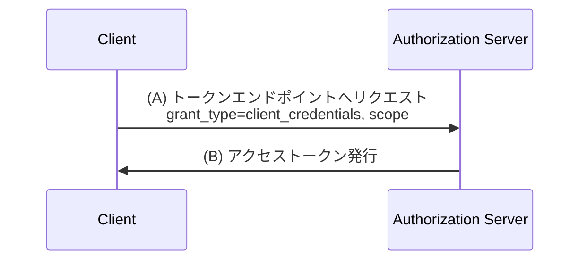
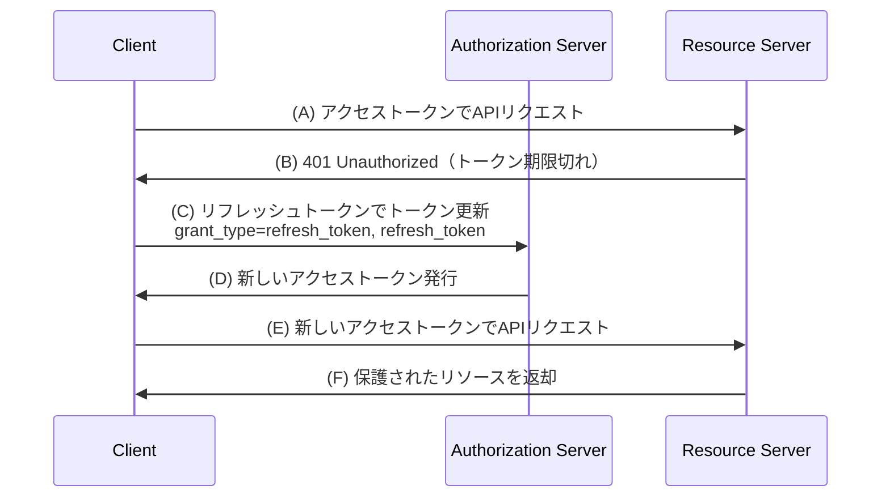

# RFC 6749 - The OAuth 2.0 Authorization Framework

## 概要

RFC 6749 は、OAuth 2.0 認可フレームワークを定義する仕様である。2012年10月にIETFによって公開され、サードパーティアプリケーションがHTTPサービスへの限定的なアクセスを取得できる仕組みを提供する。リソースオーナーのクレデンシャルを直接共有することなく、認可レイヤーを介してアクセス制御を実現する。

OAuth 2.0 はOAuth 1.0（RFC 5849）を廃止・置き換えるものであり、よりシンプルで拡張性の高い設計となっている。

## 解決する課題

OAuth 2.0 以前の伝統的なクライアント・サーバー認証モデルでは、サードパーティがリソースにアクセスする際にリソースオーナーのクレデンシャル（ユーザー名・パスワード）をクライアントに共有する必要があった。この方式には以下の問題があった。

- **パスワードの漏洩リスク**: クライアントはリソースオーナーのパスワードをプレーンテキストで保存・使用する必要がある
- **過剰なアクセス権限**: クライアントはリソースオーナーのリソース全体への無制限のアクセス権を得てしまう
- **個別の権限取り消し不可**: 特定のクライアントへのアクセスを取り消すには、パスワード変更しかなく、全クライアントへのアクセスが無効化される
- **多要素認証との非互換性**: パスワードが漏洩した場合、全クライアントがリスクにさらされる

OAuth 2.0 はこれらの課題を解決するため、クライアントとリソースオーナーを分離する認可レイヤーを導入した。

## 主要概念・用語

### ロール

RFC 6749 では4つのロールを定義している。

| ロール                                  | 説明                                                                                   |
| --------------------------------------- | -------------------------------------------------------------------------------------- |
| **リソースオーナー (Resource Owner)**   | 保護されたリソースへのアクセスを許可できるエンティティ。通常はエンドユーザー           |
| **リソースサーバー (Resource Server)**  | 保護されたリソースをホストするサーバー。アクセストークンを検証してリクエストを処理する |
| **クライアント (Client)**               | リソースオーナーの代わりに保護されたリソースへのアクセスを要求するアプリケーション     |
| **認可サーバー (Authorization Server)** | リソースオーナーの認証と認可取得後、クライアントにアクセストークンを発行するサーバー   |

### クライアントの種類

クライアントはクレデンシャルの機密性を維持できるかどうかにより分類される。

- **コンフィデンシャルクライアント (Confidential Client)**: クライアントクレデンシャルを安全に保管できるクライアント（サーバーサイドWebアプリなど）
- **パブリッククライアント (Public Client)**: クライアントクレデンシャルを安全に保管できないクライアント（ネイティブアプリ、ブラウザベースのアプリなど）

### トークン

| トークン                                 | 説明                                                                               |
| ---------------------------------------- | ---------------------------------------------------------------------------------- |
| **アクセストークン (Access Token)**      | 保護されたリソースにアクセスするためのクレデンシャル。スコープと有効期間を表す     |
| **リフレッシュトークン (Refresh Token)** | アクセストークンの再取得に使用する任意のクレデンシャル。認可サーバーにのみ送信する |

### スコープ

`scope` パラメータでアクセス要求の範囲を指定する。スペース区切りの文字列で複数のスコープを指定できる。スコープの意味はアプリケーション固有であり、RFC 6749 自体は具体的なスコープ値を定義しない。

## プロトコルフロー

### 抽象的な認可フロー

OAuth 2.0 の基本フローは以下の通りである。



### 認可コードグラント (Authorization Code Grant)

最もセキュアで広く利用されるグラントタイプ。コンフィデンシャルクライアントに最適。



**特徴:**

- 認可コードはリダイレクトURIを通じてクライアントに渡されるが、ブラウザの履歴等にアクセストークンが残らない
- クライアント認証によりアクセストークンをクライアントに直接紐付けられる
- `state` パラメータでCSRF攻撃を防止する

### インプリシットグラント (Implicit Grant)

ブラウザで動作するJavaScriptアプリ向けの簡略化フロー。現在は非推奨とされている（RFC 9700 参照; 推奨代替: RFC 7636 PKCE を使用した認可コードフロー）。



**特徴:**

- 中間の認可コードを省略し、アクセストークンを直接発行
- リフレッシュトークンは発行しない
- URIフラグメントにトークンが含まれるためセキュリティリスクが高い

### リソースオーナーパスワードクレデンシャルグラント (Resource Owner Password Credentials Grant)

リソースオーナーがクライアントを高度に信頼する場合（OSやデバイスの組み込みアプリ等）に限定使用。



**注意**: クライアントがユーザーのパスワードを直接受け取るため、信頼できるクライアントでのみ使用すること。

### クライアントクレデンシャルグラント (Client Credentials Grant)

クライアント自身がリソースオーナーである場合、またはクライアントが認可サーバーと事前に取り決めたアクセスを要求する場合に使用。



## 詳細解説

### エンドポイント

#### 認可エンドポイント (Authorization Endpoint)

クライアントがリソースオーナーの認可を取得するためのエンドポイント。主にインタラクティブなユーザー認証に使用する。

- **方法**: GETメソッドを使用（クライアントはPOSTもサポート可能）
- **TLS必須**: リソースオーナーへのなりすまし防止のためHTTPS必須
- **パラメータ**:
  - `response_type` (必須): `code`（認可コード）または `token`（インプリシット）
  - `client_id` (必須): クライアント識別子
  - `redirect_uri` (任意): レスポンスの送信先URI
  - `scope` (任意): アクセス要求のスコープ
  - `state` (推奨): クロスサイトリクエストフォージェリ防止用の不透明な値

#### トークンエンドポイント (Token Endpoint)

クライアントが認可グラントやリフレッシュトークンをアクセストークンと交換するエンドポイント。

- **方法**: POSTメソッド必須
- **TLS必須**: クライアントクレデンシャルやトークンの保護のためHTTPS必須
- **コンテントタイプ**: `application/x-www-form-urlencoded`
- **クライアント認証**: コンフィデンシャルクライアントは認証が必要（Basic認証またはリクエストボディ）

#### リダイレクションエンドポイント (Redirection Endpoint)

認可サーバーがリソースオーナーのユーザーエージェントを通じて認可クレデンシャルをクライアントに返すエンドポイント。

### アクセストークンレスポンス

成功時のトークンレスポンス例:

```json
HTTP/1.1 200 OK
Content-Type: application/json;charset=UTF-8
Cache-Control: no-store
Pragma: no-cache

{
  "access_token": "2YotnFZFEjr1zCsicMWpAA",
  "token_type": "Bearer",
  "expires_in": 3600,
  "refresh_token": "tGzv3JOkF0XG5Qx2TlKWIA",
  "scope": "read write"
}
```

### リフレッシュトークンフロー

アクセストークンが期限切れになった場合、リフレッシュトークンを使用して新しいアクセストークンを取得できる。



### エラーレスポンス

認可エンドポイントとトークンエンドポイントのエラーレスポンスには以下のコードが使用される。

| エラーコード                | 説明                                                                   |
| --------------------------- | ---------------------------------------------------------------------- |
| `invalid_request`           | リクエストに必須パラメータが欠落、または無効なパラメータが含まれている |
| `unauthorized_client`       | クライアントがこのグラントタイプを使用する認可を持っていない           |
| `access_denied`             | リソースオーナーまたは認可サーバーがリクエストを拒否した               |
| `unsupported_response_type` | 認可サーバーがこのレスポンスタイプをサポートしていない                 |
| `invalid_scope`             | 要求されたスコープが無効または不明                                     |
| `server_error`              | 認可サーバーで予期しないエラーが発生した                               |
| `temporarily_unavailable`   | 認可サーバーが一時的に対応できない状態                                 |

## セキュリティに関する考慮事項

### TLSの必須化

認可エンドポイントとトークンエンドポイントはTLS（HTTPS）が必須。クライアントのリダイレクトURIも可能な限りHTTPSを使用すること。

### 認可コードの保護

- 認可コードは短命であるべき（RFC 6749では最大10分を推奨）
- 認可コードは一度しか使用できない。二度目の使用を検知した場合は、そのコードで発行済みのトークンを全て無効化すること
- 認可コードはTLSで保護されたチャネルを通じてのみ送信する

### CSRFの防止

`state` パラメータを使用してCSRF攻撃を防ぐ。クライアントはリクエスト時に推測困難な値を `state` に設定し、コールバック時に検証すること。

### リダイレクトURIの検証

認可サーバーはリダイレクトURIを事前登録済みの値と完全一致で検証すること。部分一致やパターンマッチは攻撃の可能性があるため危険。

### クライアント認証

コンフィデンシャルクライアントはトークンエンドポイントでの認証が必要。クライアントIDとクライアントシークレットはHTTP Basic認証（推奨）またはリクエストボディで送信する。

### トークンの漏洩防止

- アクセストークンをURIパラメータに含めない（ログやブラウザ履歴に残るため）
- `Cache-Control: no-store` および `Pragma: no-cache` ヘッダーをトークンレスポンスに設定する

### インプリシットグラントのリスク

インプリシットグラントは以下のリスクがあり、現在は非推奨とされている。

- アクセストークンがURIフラグメントに含まれるため、参照元サイトやブラウザ履歴に漏洩する可能性がある
- アクセストークンのバインディングが困難で、トークン置換攻撃に脆弱

## 関連仕様

| 仕様                | 概要                                                                                |
| ------------------- | ----------------------------------------------------------------------------------- |
| RFC 6750            | Bearer トークンの使用方法                                                           |
| RFC 7636            | PKCE（Proof Key for Code Exchange）- パブリッククライアント向けのコード傍受攻撃防止 |
| RFC 7009            | トークンの失効（Token Revocation）                                                  |
| RFC 7662            | トークンのイントロスペクション（Token Introspection）                               |
| RFC 8414            | 認可サーバーメタデータ（Authorization Server Metadata）                             |
| RFC 9126            | Pushed Authorization Requests (PAR)                                                 |
| RFC 9396            | OAuth 2.0 Rich Authorization Requests                                               |
| OpenID Connect Core | OAuth 2.0 を拡張した認証レイヤー                                                    |

## 参考文献

- [RFC 6749 原文 - The OAuth 2.0 Authorization Framework](https://www.rfc-editor.org/rfc/rfc6749)
- [RFC 6750 - The OAuth 2.0 Authorization Framework: Bearer Token Usage](https://www.rfc-editor.org/rfc/rfc6750)
- [OAuth 2.0 Security Best Current Practice (RFC 9700)](https://www.rfc-editor.org/rfc/rfc9700)
