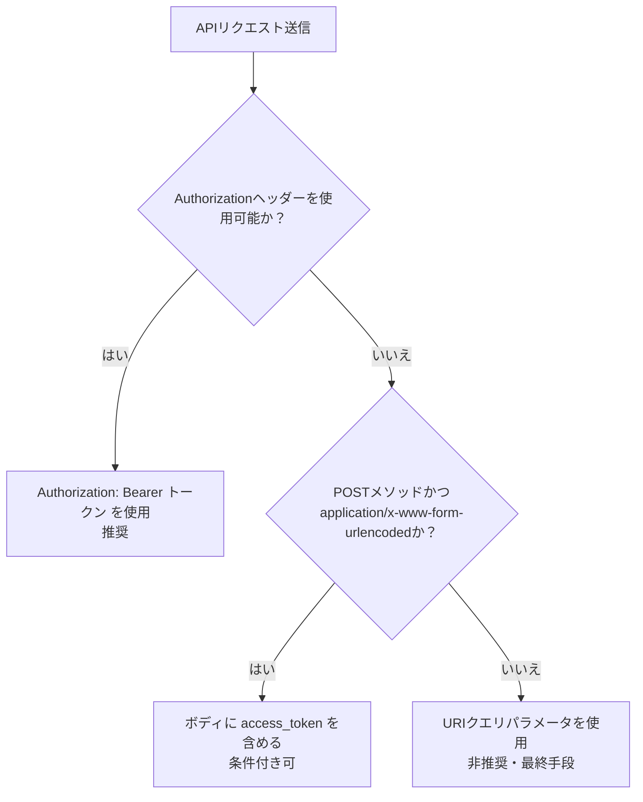
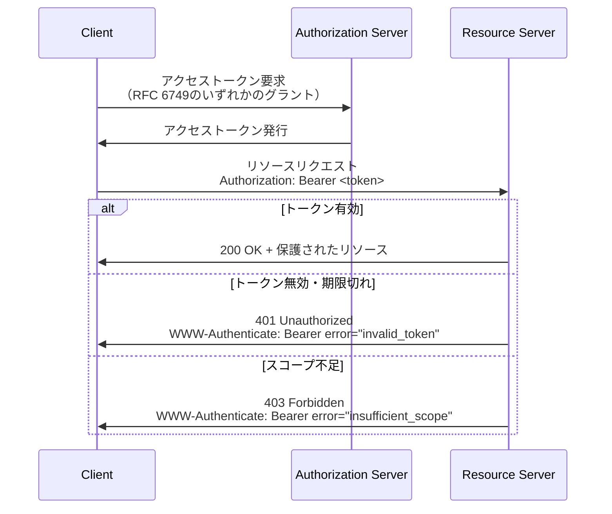

# RFC 6750 - Bearer Token Usage

## 概要

RFC 6750は、OAuth 2.0（RFC 6749）で発行されたアクセストークンを HTTP リクエストに含めてリソースサーバーへ送信する方法を規定する仕様である。"Bearer Token（ベアラートークン）"という概念を定義し、その安全な使用方法とエラーハンドリングを定めている。

OAuth 2.0はアクセストークンの取得方法を規定するが、取得したトークンをどのようにリソースサーバーへ提示するかは個別の仕様に委ねられている。RFC 6750はこのギャップを埋める補完仕様であり、OAuth 2.0エコシステムの中核をなす。

## 解決する課題

OAuth 2.0では、クライアントはアクセストークンを取得した後、それをリソースサーバーへの HTTP リクエストに含める必要がある。しかし RFC 6749 自体はトークンの送信方法を規定していない。以下の課題が存在した：

- トークンをどのHTTPフィールドに載せるか
- 複数の送信方法が存在する場合の優先順位
- リソースサーバーが認証エラーをどのように伝えるか
- トークンの安全な取り扱いに関するガイダンス

RFC 6750はこれらを統一的に定義することで、クライアントとリソースサーバー間の相互運用性を確保する。

## 主要概念・用語

### Bearer Token

「ベアラートークン」とは、「所持しているだけで使用できる」トークンを指す。具体的には：

> "any party in possession of the token (a 'bearer') can use the token in any way that any other party in possession of it can"

すなわち、トークンを持つ者は暗号学的な鍵の所有証明を必要とせず、そのトークンを提示するだけでリソースへアクセスできる。このシンプルさがBearer Tokenの利点であると同時に、トークンの漏洩が即座な不正アクセスにつながるというリスクでもある。

### 登場するロール

- **クライアント（Client）**: アクセストークンを保持し、リソースサーバーへリクエストを送るアプリケーション
- **リソースサーバー（Resource Server）**: 保護されたリソースをホストし、トークンを検証するサーバー
- **認可サーバー（Authorization Server）**: アクセストークンを発行するサーバー

## トークンの送信方法

RFC 6750は3種類のトークン送信方法を定義している。

### 方法1: Authorization Request Header Field（推奨）

HTTP `Authorization` ヘッダーフィールドにBearerスキームでトークンを含める方法。最も安全で推奨される方法である。

```http
GET /resource HTTP/1.1
Host: server.example.com
Authorization: Bearer mF_9.B5f-4.1JqM
```

構文は以下の通り：

```
Authorization: Bearer <b64token>
```

`b64token`は英数字および `-`, `.`, `_`, `~`, `+`, `/` 等の記号で構成される。

### 方法2: Form-Encoded Body Parameter（条件付き）

POSTリクエストのボディに `access_token` パラメータとしてトークンを含める方法。以下の条件をすべて満たす場合のみ使用可能：

- HTTPメソッドが `POST` である
- `Content-Type` ヘッダーが `application/x-www-form-urlencoded` である
- リクエストボディが単一部分（シングルパート）である

```http
POST /resource HTTP/1.1
Host: server.example.com
Content-Type: application/x-www-form-urlencoded

access_token=mF_9.B5f-4.1JqM
```

Authorizationヘッダーを使用できない場合（例：レガシーシステムとの連携）の代替手段として位置付けられる。

### 方法3: URI Query Parameter（非推奨）

URLのクエリパラメータに `access_token` を含める方法。

```http
GET /resource?access_token=mF_9.B5f-4.1JqM HTTP/1.1
Host: server.example.com
```

仕様では以下の理由からこの方法の使用を強く制限している：

- アクセスログやブラウザ履歴にトークンが記録される
- リファラヘッダーを通じてサードパーティへ漏洩する可能性がある
- URLをコピー・共有した際にトークンが意図せず露出する

> "SHOULD NOT be used unless it is impossible to transport the access token in the 'Authorization' request header field"

使用する場合は `Cache-Control: no-store` ヘッダーの付加が求められる。

### 送信方法の選択フロー



## プロトコルフロー

Bearer Tokenを使ったリソースアクセスの全体フローを示す。



## エラーレスポンス

リソースサーバーは認証・認可に失敗した場合、`WWW-Authenticate` ヘッダーを含むエラーレスポンスを返す。

### エラーコード

| エラーコード         | HTTPステータス   | 意味                                       |
| -------------------- | ---------------- | ------------------------------------------ |
| `invalid_request`    | 400 Bad Request  | 必須パラメータの欠落、複数のトークン指定等 |
| `invalid_token`      | 401 Unauthorized | トークンが期限切れ、失効、不正など         |
| `insufficient_scope` | 403 Forbidden    | アクセスに必要なスコープが不足             |

### WWW-Authenticate ヘッダー

```http
HTTP/1.1 401 Unauthorized
WWW-Authenticate: Bearer realm="example",
                  error="invalid_token",
                  error_description="The access token expired"
```

`realm` 属性はアクセス先のリソース空間を示す。`scope` 属性でアクセスに必要なスコープを示すことも可能：

```http
HTTP/1.1 403 Forbidden
WWW-Authenticate: Bearer realm="example",
                  scope="read write",
                  error="insufficient_scope"
```

## セキュリティに関する考慮事項

### 主要な脅威

RFC 6750は以下の脅威を明示している：

| 脅威                   | 説明                                                   |
| ---------------------- | ------------------------------------------------------ |
| トークンの偽造・改ざん | 攻撃者がトークンを作成または変更して不正アクセスを得る |
| トークンの漏洩         | 保存・転送時にトークンが第三者に露出する               |
| トークンのリダイレクト | 本来とは異なるリソースサーバーへトークンを提示される   |
| トークンのリプレイ     | 一度使用されたトークンが再利用される                   |

### 推奨される対策

**TLSの義務化**

仕様はTLSの使用を必須とする：

> "TLS is mandatory to implement and use with this specification"

クライアントはTLS証明書チェーンを検証し、中間者攻撃を防ぐ必要がある。

**短命トークンの発行**

> "Token servers SHOULD issue short-lived (one hour or less) bearer tokens"

トークンの有効期間を短くすることで、漏洩した場合の被害を限定する。

**スコープの制限**

必要最小限の権限のみを付与したトークンを発行する（最小権限の原則）。

**Cookieへの非格納**

> "bearer tokens MUST NOT be stored in cookies that can be sent in the clear"

平文で送信される可能性のあるCookieにトークンを格納してはならない。

**URLへの非掲載**

> "Bearer tokens SHOULD NOT be passed in page URLs"

ブラウザ履歴やリファラヘッダーによる漏洩を防ぐため、URLにトークンを含めることを避ける。

## IANA登録

RFC 6750は以下のIANA登録を行っている：

- **OAuthアクセストークンタイプ**: `Bearer`
- **OAuthエラーコード**: `invalid_request`, `invalid_token`, `insufficient_scope`

## 関連仕様

- **[RFC 6749](/specs/rfc6749)** - OAuth 2.0 Authorization Framework: Bearer Tokenの発行元となるアクセストークンのフレームワーク
- **RFC 7235** - Hypertext Transfer Protocol (HTTP/1.1): Authentication: `WWW-Authenticate` ヘッダーの定義
- **RFC 9700** - OAuth 2.0 Security Best Current Practice: Bearer Token使用に関する最新のセキュリティ推奨事項
- **RFC 9449** - OAuth 2.0 Demonstrating Proof of Possession (DPoP): Bearer Tokenの弱点を補うPoPトークンの仕様

## 参考文献

- [RFC 6750 原文](https://datatracker.ietf.org/doc/html/rfc6750)
