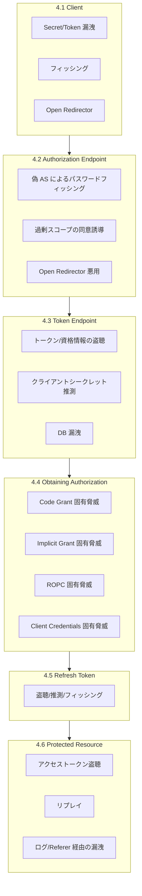
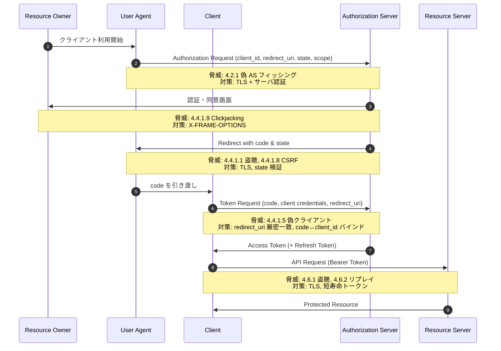
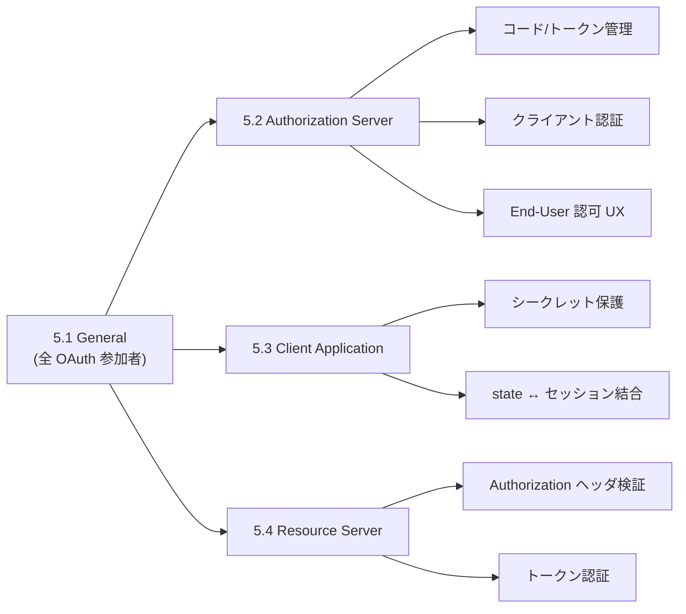

# RFC 6819 - OAuth 2.0 Threat Model and Security Considerations

## 概要

RFC 6819 は 2013 年 1 月に Informational として発行された、OAuth 2.0 (RFC 6749) を対象とする包括的な脅威モデル文書である。著者は T. Lodderstedt (Deutsche Telekom AG), M. McGloin (IBM), P. Hunt (Oracle Corporation)。

RFC 6749 / RFC 6750 が定義する OAuth 2.0 のコア仕様には「Security Considerations」セクションが含まれるものの、実装者が現場で直面する脅威を網羅的に整理しているわけではない。RFC 6819 はその不足を補い、プロトコルの各エンドポイントと各グラントタイプを対象に、想定される脅威と対応策をシステマティックに列挙する。本文書はその後の OAuth セキュリティ系仕様（RFC 8252, RFC 7636 PKCE, RFC 8725 JWT BCP, RFC 9700 OAuth Security BCP など）の出発点となっており、現在では RFC 9700 によって「Updated by」関係にある。

## 解決する課題

RFC 6749 は柔軟性を重視したフレームワーク仕様であり、デプロイ環境の前提によって脅威の現れ方が大きく異なる。例えば次のような問いに対し、コア仕様だけでは具体的な指針が乏しい。

- パブリッククライアント（ネイティブアプリ、SPA）でクライアントシークレットをどう扱うか
- 認可コードが攻撃者に漏洩した場合、どこまで被害が広がるか
- リフレッシュトークンの長期保管をどう保護するか
- CSRF、クリックジャッキング、オープンリダイレクタといった Web 一般の脅威が OAuth フローでどのように悪用されるか

RFC 6819 は、これらを「脅威モデル」と「対応策（Countermeasures）」という二部構成で整理し、実装者が自分のデプロイ環境に合わせてリスク評価を行えるリファレンスを提供することを目的としている。

## 主要概念・用語

### スコープと前提

RFC 6819 が脅威分析の前提とする攻撃者モデルは強力である。

- ネットワーク上でクライアントとサーバ間の通信を完全に盗聴できる
- 無制限の計算資源を持つ
- OAuth に関与する 3 者（Resource Owner / Client / Authorization Server + Resource Server）のうち 2 者が共謀する可能性も考慮する

一方、以下は本文書のスコープ外である。

- Authorization Server と Resource Server 間の通信
- トークンフォーマットの詳細（後の RFC 9068 等で別途定義）
- ユーザ認証メカニズム（ただし Resource Owner Password Credentials Grant は例外）
- アサーションの妥当性検証アルゴリズム

### トークンの分類

RFC 6819 は OAuth のトークンを次の 2 軸で分類する。

- 形式: Handle-based（不透明な参照値で、Authorization Server への問い合わせが必要）/ Assertion-based（自己完結的で署名検証のみで利用可能）
- 認証方式: Bearer Token（所持のみで利用可能）/ Proof Token（クライアント認証等の追加証明が必要）

これらの選択がトークン漏洩時の被害範囲を直接左右する。

### Security Features（既存の保護機構）

第 3 章では OAuth 2.0 がすでに備える保護機構を整理している。

- スコープによる権限の最小化
- アクセストークンの短い有効期限
- リフレッシュトークンによる長期権限の分離
- 認可コードによる「フロントチャネルに直接アクセストークンを露出させない」設計
- `redirect_uri` の事前登録と検証
- `state` パラメータによる CSRF 対策とリクエスト相関
- `client_id` による関連リクエストの紐付け

これらは「使えば自動的に安全」になるものではなく、正しく使わない限り後述の脅威に晒される点が繰り返し強調される。

## 脅威モデルの全体像

第 4 章「Threat Model」は、OAuth のコンポーネントと各フローを軸として脅威を分類する。

以下では特に Authorization Code Grant に対する脅威と、リフレッシュトークン、Protected Resource アクセスに対する脅威を中心に解説する。

## Authorization Code Grant に対する脅威（4.4.1）

Authorization Code Grant は OAuth 2.0 で最も推奨されるフローだが、RFC 6819 は 13 種類のサブ脅威を列挙している。代表的なものを示す。

### 認可コードの盗聴・漏洩（4.4.1.1）

`redirect_uri` を介してフロントチャネル（ブラウザのリダイレクト）で渡される認可コードは、TLS が適切に使われていない場合に盗聴される。盗まれたコードは、対応するクライアントシークレットを持たない攻撃者には直接トークン化できないが、パブリッククライアントではこの保護が機能しないため後の PKCE (RFC 7636) 策定の動機となった。

### CSRF 攻撃 (4.4.1.8)

攻撃者が自身のアカウントで取得した認可コードを、被害者のブラウザにリダイレクトさせて消費させると、被害者のクライアントセッションが攻撃者の OAuth リソースに紐付けられる。`state` パラメータをユーザエージェントセッションに結びつけて検証することが必須の対策である。

### Authorization Code Phishing / Counterfeit Client (4.4.1.5, 4.4.1.7)

攻撃者が正規クライアントになりすまし、`client_id` を流用してフィッシング画面を表示し、被害者の同意を取得する。AS 側で `redirect_uri` の厳密一致検証、クライアント情報（名称・ロゴ）の表示、繰り返し同意における追加確認が対策となる。

### Code Substitution (4.4.1.13)

攻撃者の OAuth セッションで取得したコードを、被害者のクライアントセッションに注入してログインを乗っ取る攻撃。後に OAuth 2.0 Security BCP (RFC 9700) や Mix-Up 対策（`iss` パラメータ: RFC 9207）に発展する論点である。RFC 6819 の時点では、`client_id` と `redirect_uri` への code の bind を AS 側で行うことが推奨される。

## Authorization Code Flow と脅威の対応図

## Implicit Grant に対する脅威（4.4.2）

Implicit Grant ではアクセストークンが URL フラグメントとしてブラウザに直接返却される。RFC 6819 はこのフローについて以下の固有脅威を指摘する。

- ブラウザ履歴・Referer ヘッダ・ログへのトークン残留（4.4.2.2）
- スクリプト操作によるトークン窃取（4.4.2.4）
- リフレッシュトークン取得不可による長寿命トークンへの依存

これらの分析は後に Implicit Grant の非推奨化（RFC 9700 / OAuth 2.0 Security BCP）に直接つながった。

## Resource Owner Password Credentials Grant に対する脅威（4.4.3）

ROPC ではクライアントがエンドユーザのパスワードを直接扱うため、フィッシング耐性が低く、クライアント側でのパスワード漏洩リスクを生む。RFC 6819 は 6 種類の脅威を列挙し、本フローは「クライアントが完全に信頼される極めて限定的な状況」のみで利用すべきと位置付けている。これも RFC 9700 で正式に非推奨化される根拠となった。

## リフレッシュトークンに対する脅威（4.5）と対応策（5.2.2）

リフレッシュトークンは長期間有効であり、漏洩時の被害が大きい。RFC 6819 は次の対応策を提示する。

- リフレッシュトークン発行の制限（5.2.2.1）
- `client_id` への bind（5.2.2.2）
- リフレッシュトークン・ローテーション: 使用ごとに新しいトークンへ差し替え、旧トークンの再利用検知時に系列全体を失効させる（5.2.2.3）
- 失効機構の提供（5.2.2.4）
- デバイス識別による複製検知（5.2.2.5）

これらは現代の OAuth 実装で標準的な保護策となっており、特にローテーションは SPA 向け Refresh Token 利用（RFC 9449 DPoP との組み合わせを含む）における推奨パターンである。

## Protected Resource アクセスに対する脅威（4.6）

アクセストークンを用いた API アクセスでは、次の脅威が指摘される。

- 通信路での盗聴（4.6.1）: TLS 必須
- リプレイ（4.6.2）: 短い有効期限、`aud` クレームによる対象限定
- 偽 Resource Server によるトークンフィッシング（4.6.4）: クライアント側でのサーバ認証検証
- 正規 RS / Client によるトークン濫用（4.6.5）: トークンの受信者を限定する `audience` 制約（後の RFC 8707 Resource Indicators に発展）
- HTTP プロキシ経由でのデータ漏洩（4.6.6）
- ログ・Referer ヘッダ経由のトークン漏洩（4.6.7）

## 対応策（Countermeasures）の階層

第 5 章は対応策をロールごとに整理する。実装観点では次の四つに整理して読むと理解しやすい。

### 5.1 General Countermeasures

- 5.1.1 リクエスト機密性の確保（TLS）
- 5.1.2 サーバ認証の活用（証明書検証）
- 5.1.3 Resource Owner への継続的な通知
- 5.1.4 資格情報保護（パスワードハッシュ化、SQL Injection 対策、エントロピー、アカウントロック）
- 5.1.5 トークン管理（スコープ限定、短寿命化、ワンタイム使用、`audience` バインド、署名・暗号化）
- 5.1.6 アクセストークンを永続化せず一時メモリに保持

### 5.2 Authorization Server の対応策

- 5.2.1 認可コード管理（不正検知時の派生トークン自動失効）
- 5.2.2 リフレッシュトークン制御（前述）
- 5.2.3 クライアント認証
  - パブリッククライアントへのシークレット発行禁止（5.2.3.1）
  - パブリッククライアントでのユーザ同意必須化（5.2.3.2）
  - `client_id` と `redirect_uri` の組での発行（5.2.3.3）
  - インストール単位の独立シークレット（5.2.3.4）
  - `redirect_uri` の事前登録と厳密検証（5.2.3.5）
  - クライアントシークレットの失効機構（5.2.3.6）
  - アサーション・トークンによる強力な認証（5.2.3.7）
- 5.2.4 End-User 認可
  - リピート認可時のクライアント検証（5.2.4.1）
  - スコープの透明な説明（5.2.4.2）
  - クライアント識別表示の検証（5.2.4.3）
  - 認可コードの `client_id` / `redirect_uri` への bind（5.2.4.4, 5.2.4.5）

### 5.3 Client Application

- コードやバンドルリソースへの資格情報埋め込み禁止（5.3.1）
- 設定ファイル・DB の標準的な Web サーバ保護（5.3.2）
- ローカルストレージのセキュアな利用（5.3.3）
- デバイスロック機構の活用（5.3.4）
- `state` パラメータをユーザエージェントセッションへ結合（5.3.5）

### 5.4 Resource Server

- `Authorization` ヘッダの厳密検証（5.4.1）
- トークンによるリクエスト認証（5.4.2）
- 署名付きリクエストの検証（5.4.3）

## RFC 6819 の歴史的位置付け

RFC 6819 で示された脅威分析と対応策は、その後の OAuth エコシステム全体の設計思想を形作った。代表的な後続仕様との対応関係を整理する。

| RFC 6819 の論点                          | 後続仕様での具体化                                 |
| ---------------------------------------- | -------------------------------------------------- |
| パブリッククライアントのコード盗聴対策   | RFC 7636 (PKCE)                                    |
| ネイティブアプリ向けのベストプラクティス | RFC 8252 (OAuth 2.0 for Native Apps)               |
| トークンの audience 制限                 | RFC 8707 (Resource Indicators)                     |
| Mix-Up 攻撃対策                          | RFC 9207 (`iss` Authorization Server Issuer ID)    |
| トークン送信者の検証                     | RFC 8705 (MTLS), RFC 9449 (DPoP)                   |
| JWT 利用時の落とし穴                     | RFC 8725 (JWT BCP)                                 |
| 全体的なベストプラクティスのアップデート | RFC 9700 (OAuth 2.0 Security BCP, RFC 6819 を更新) |

特に RFC 9700 は本文書を正式に「Updated by」する関係にあり、現代のデプロイメントでは RFC 6819 と RFC 9700 を併読することが推奨される。RFC 6819 は脅威カタログとして網羅性に優れ、RFC 9700 は現代の推奨事項（PKCE 必須化、Implicit / ROPC 非推奨など）を簡潔に示す、という補完関係にある。

## セキュリティに関する考慮事項

RFC 6819 自体が OAuth のセキュリティ考察文書であるが、本文書の利用にあたって留意すべき点をいくつか挙げる。

- 攻撃者モデルの強さ: ネットワーク全面盗聴・無制限資源・三者中二者の共謀という強い前提を置いている。自身のデプロイがこの前提と整合するか評価したうえで、対応策の優先度を決定する必要がある。
- スコープ外項目: AS と RS の関係（Token Introspection, RFC 7662 等）、トークンフォーマット（RFC 9068 等）、ユーザ認証方式（OIDC 等）は別文書に委ねられている。
- 経年劣化: 2013 年時点の分析であるため、Mix-Up 攻撃、Resource Server のなりすまし、SPA における Refresh Token 利用など、後に発見された問題は本文書では十分にカバーされていない。これらは RFC 9700 や FAPI 2.0 などを併読する必要がある。
- Informational ステータス: RFC 6819 は Informational であり、要件レベルのキーワード（MUST / SHOULD）は限定的に用いられる。実装で従うべき規範は最終的にコア仕様および後続の BCP に基づく。

## 関連仕様

- [RFC 6749 - The OAuth 2.0 Authorization Framework](./rfc6749.md)
- [RFC 6750 - The OAuth 2.0 Authorization Framework: Bearer Token Usage](./rfc6750.md)
- [RFC 7636 - Proof Key for Code Exchange by OAuth Public Clients](./rfc7636.md)
- [RFC 8252 - OAuth 2.0 for Native Apps](./rfc8252.md)
- [RFC 8705 - OAuth 2.0 Mutual-TLS Client Authentication and Certificate-Bound Access Tokens](./rfc8705.md)
- [RFC 8707 - Resource Indicators for OAuth 2.0](./rfc8707.md)
- [RFC 8725 - JSON Web Token Best Current Practices](./rfc8725.md)
- [RFC 9068 - JSON Web Token (JWT) Profile for OAuth 2.0 Access Tokens](./rfc9068.md)
- [RFC 9207 - OAuth 2.0 Authorization Server Issuer Identification](./rfc9207.md)
- [RFC 9449 - OAuth 2.0 Demonstrating Proof of Possession (DPoP)](./rfc9449.md)
- [RFC 9700 - Best Current Practice for OAuth 2.0 Security](./rfc9700.md)

## 参考文献

- [RFC 6819 - OAuth 2.0 Threat Model and Security Considerations](https://www.rfc-editor.org/rfc/rfc6819.html)
- [IETF Datatracker: RFC 6819](https://datatracker.ietf.org/doc/rfc6819/)
- [RFC 6749 - The OAuth 2.0 Authorization Framework](https://www.rfc-editor.org/rfc/rfc6749.html)
- [RFC 9700 - Best Current Practice for OAuth 2.0 Security](https://www.rfc-editor.org/rfc/rfc9700.html)
