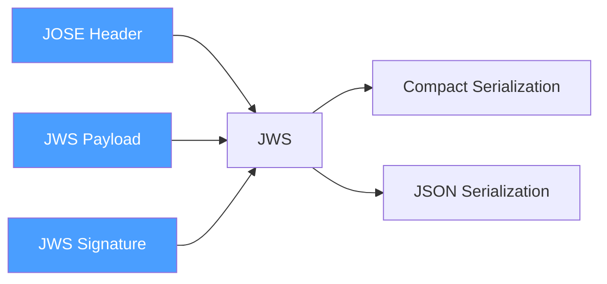
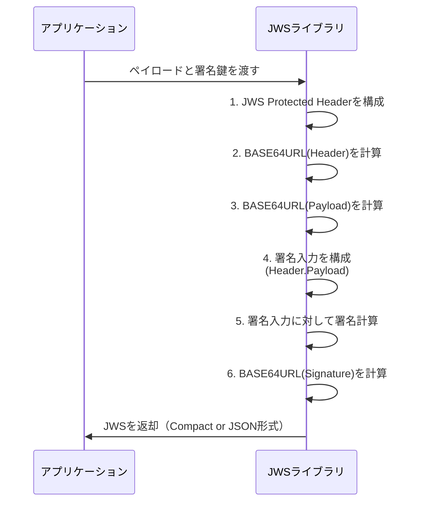
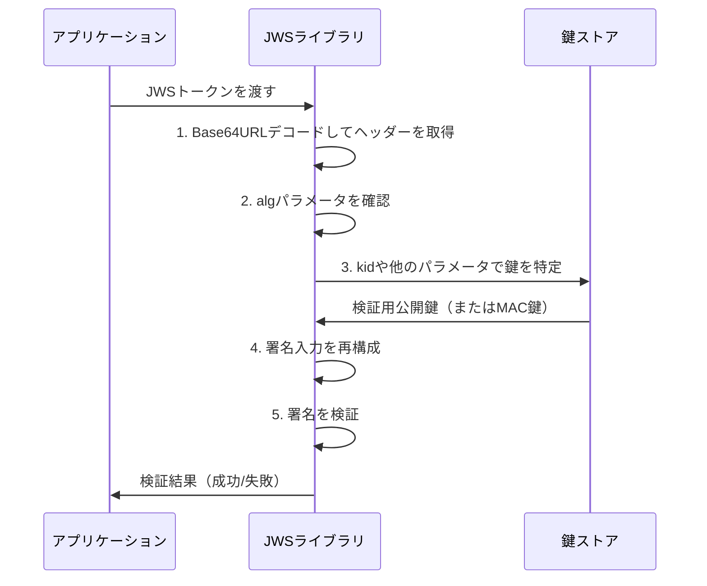
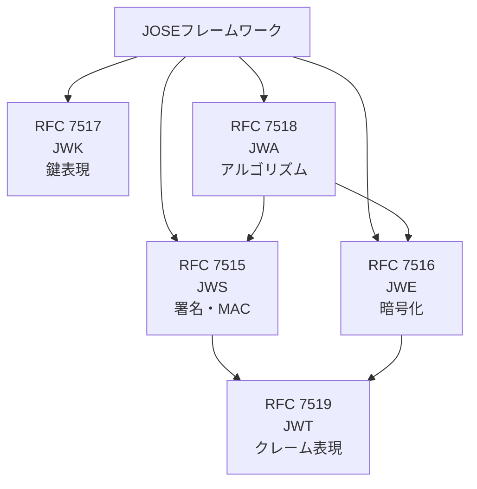

# RFC 7515 - JSON Web Signature (JWS)

## 概要

RFC 7515は、JSONベースのデータ構造を使用してデジタル署名またはメッセージ認証コード（MAC）で保護されたコンテンツを表現するための標準仕様である。JWSは**JOSE（JSON Object Signing and Encryption）**フレームワークの中核を成し、RFC 7519（JWT）の署名メカニズムの基盤となっている。

JWSは主に以下の目的で使用される：

- メッセージの完全性の保証（改ざん検知）
- メッセージの真正性の確認（送信元の確認）

暗号化によるメッセージの機密保護はJWE（RFC 7516）が担い、JWSはその対となる仕様として位置づけられる。

## 解決する課題

JWS策定以前、デジタル署名の実装にはXML Signature（XMLDsig）やPKCS#7（CMS）といった仕様が使用されていた。これらは機能的には十分であったが、以下の課題があった：

- **複雑性**: XML/ASN.1ベースのフォーマットは実装が複雑で、ライブラリ依存度が高い
- **URLへの非親和性**: バイナリデータや特殊文字を含む形式はHTTPヘッダーやURIに適さない
- **冗長性**: Webサービスにとって不必要に大きいペイロード

JWSはJSON + Base64URLエンコーディングを採用することで、Web APIやHTTPプロトコルとの親和性が高く、シンプルで軽量な署名メカニズムを提供する。

## 主要概念・用語

| 用語                          | 説明                                                       |
| ----------------------------- | ---------------------------------------------------------- |
| **JWS**                       | JSON Web Signature。本仕様全体を指す                       |
| **JOSE Header**               | 署名アルゴリズムやその他のパラメータを含むJSONオブジェクト |
| **JWS Protected Header**      | Base64URLエンコードされ、署名の対象となるヘッダー          |
| **JWS Unprotected Header**    | 署名の対象外のヘッダー（JSON Serializationのみ）           |
| **JWS Payload**               | 署名の対象となるメッセージ本体（任意のオクテット列）       |
| **JWS Signature**             | ProtectedヘッダーとPayloadに対する署名またはMAC値          |
| **JWS Compact Serialization** | URLセーフなドット区切りの文字列形式                        |
| **JWS JSON Serialization**    | JSON形式。複数署名に対応                                   |
| **Base64URL**                 | パディングなしのBase64URL（RFC 4648 §5）エンコーディング   |

## JWSの構造

JWSは3つの主要コンポーネントで構成される。



### JOSE Header

暗号化操作とパラメータを記述するJSONオブジェクト。JWS Protected HeaderとJWS Unprotected Headerの和集合として構成される。

### JWS Payload

署名対象のメッセージ。任意のオクテット列であり、通常はBase64URLエンコードされる。JWTの場合はJSONクレームセットがPayloadとなる。

### JWS Signature

以下の入力に対して計算された署名値：

```
ASCII(BASE64URL(JWS Protected Header) || '.' || BASE64URL(JWS Payload))
```

## シリアライゼーション形式

### JWS Compact Serialization

最も一般的に使用される形式。3つの部分をドット（`.`）で区切ったURLセーフな文字列：

```
BASE64URL(JWS Protected Header) . BASE64URL(JWS Payload) . BASE64URL(JWS Signature)
```

**例（JWT）:**

```
eyJhbGciOiJSUzI1NiIsInR5cCI6IkpXVCJ9
.
eyJzdWIiOiIxMjM0NTY3ODkwIiwibmFtZSI6IkpvaG4gRG9lIn0
.
SflKxwRJSMeKKF2QT4fwpMeJf36POk6yJV_adQssw5c
```

特徴：

- 単一の署名のみサポート
- Unprotected Headerは使用不可
- HTTPヘッダー、URI、クエリパラメータへの組み込みに適している

### JWS JSON Serialization

JSON形式で表現される。**一般構文**と**フラット構文**の2種類がある。

#### 一般構文（General JWS JSON Serialization）

複数の署名をサポートする：

```json
{
  "payload": "BASE64URL(JWS Payload)",
  "signatures": [
    {
      "protected": "BASE64URL(JWS Protected Header)",
      "header": { "kid": "key-1" },
      "signature": "BASE64URL(JWS Signature)"
    },
    {
      "protected": "BASE64URL(JWS Protected Header)",
      "header": { "kid": "key-2" },
      "signature": "BASE64URL(JWS Signature)"
    }
  ]
}
```

#### フラット構文（Flattened JWS JSON Serialization）

単一署名に最適化された簡潔な形式：

```json
{
  "payload": "BASE64URL(JWS Payload)",
  "protected": "BASE64URL(JWS Protected Header)",
  "header": { "kid": "key-1" },
  "signature": "BASE64URL(JWS Signature)"
}
```

## ヘッダーパラメータ

### alg（Algorithm）

**必須**。使用する暗号化アルゴリズムを識別する。RFC 7518（JWA）で定義されたアルゴリズム識別子を使用する。

| alg値   | アルゴリズム                | 種別                   |
| ------- | --------------------------- | ---------------------- |
| `RS256` | RSASSA-PKCS1-v1_5 + SHA-256 | 非対称（デジタル署名） |
| `RS384` | RSASSA-PKCS1-v1_5 + SHA-384 | 非対称（デジタル署名） |
| `RS512` | RSASSA-PKCS1-v1_5 + SHA-512 | 非対称（デジタル署名） |
| `ES256` | ECDSA + P-256 + SHA-256     | 非対称（デジタル署名） |
| `ES384` | ECDSA + P-384 + SHA-384     | 非対称（デジタル署名） |
| `ES512` | ECDSA + P-521 + SHA-512     | 非対称（デジタル署名） |
| `PS256` | RSASSA-PSS + SHA-256        | 非対称（デジタル署名） |
| `HS256` | HMAC + SHA-256              | 対称（MAC）            |
| `HS384` | HMAC + SHA-384              | 対称（MAC）            |
| `HS512` | HMAC + SHA-512              | 対称（MAC）            |
| `none`  | 署名なし                    | 非推奨                 |

### 鍵識別パラメータ

| パラメータ | 説明                                             |
| ---------- | ------------------------------------------------ |
| `jku`      | JWK SetのURL。署名検証に使用するJWK群を参照      |
| `jwk`      | 署名に使用した公開鍵（JWK形式）                  |
| `kid`      | 鍵識別子。検証者が適切な鍵を選択するためのヒント |
| `x5u`      | X.509証明書またはチェーンのURL                   |
| `x5c`      | X.509証明書チェーン（Base64エンコード）          |
| `x5t`      | X.509証明書のSHA-1フィンガープリント             |
| `x5t#S256` | X.509証明書のSHA-256フィンガープリント           |

### その他のパラメータ

| パラメータ | 説明                                                   |
| ---------- | ------------------------------------------------------ |
| `typ`      | JWSオブジェクトのメディアタイプ（例: `JWT`）           |
| `cty`      | ペイロードのコンテンツタイプ（ネスト構造の場合に使用） |
| `crit`     | 必須として処理すべき拡張ヘッダーパラメータ名の配列     |

## 署名生成・検証プロセス

### 署名生成フロー



**署名入力（Signing Input）:**

```
ASCII(BASE64URL(JWS Protected Header) || '.' || BASE64URL(JWS Payload))
```

### 署名検証フロー



重要な検証ステップ：

1. JWSのBase64URLデコードとJSON解析
2. `alg`ヘッダーパラメータの確認とアルゴリズムの特定
3. 使用する鍵の特定（`kid`, `jku`, `jwk`等を参照）
4. 署名入力の再構成
5. 指定アルゴリズムで署名の検証
6. `crit`ヘッダーで指定された拡張パラメータの処理

## セキュリティに関する考慮事項

### アルゴリズム置換攻撃（Algorithm Substitution Attack）

攻撃者がalgヘッダーを改ざんして意図しないアルゴリズムで検証させようとする攻撃。

**対策:**

- `alg`パラメータを必ずJWS Protected Headerに配置する（Unprotected Headerには置かない）
- 検証側は期待するアルゴリズムを明示的に指定し、algヘッダーの値をそのまま信頼しない

### `none`アルゴリズムの危険性

`alg: none`は署名なしのJWSを表す。一部の不適切な実装では、攻撃者がalgを`none`に改ざんして署名検証をバイパスできる脆弱性（CVE等）が発覚している。

**対策:**

- 本番環境では`none`アルゴリズムを使用しない
- 受け入れるアルゴリズムを明示的なホワイトリストで管理する

### 鍵管理

- MAC（HS256等）に使用する共有秘密鍵は、最低128ビット（推奨256ビット）以上のエントロピーを持つ高品質な乱数で生成する
- 秘密鍵・MAC鍵は厳重に保護し、不必要な露出を避ける
- `jku`や`x5u`で外部URLを参照する場合は、信頼できるURL（自ドメイン等）のみを受け入れる

### タイミング攻撃対策

署名検証の結果（成功/失敗）を時間の差異によって推測できないよう、定数時間比較（constant-time comparison）を使用する。

### リプレイ攻撃対策

JWS自体にはリプレイ防止機能がない。JWTのように`jti`（JWT ID）、`exp`（有効期限）、`nbf`（Not Before）等のクレームで対策する。

## JWSとJWT・JWEの関係



| 仕様           | 役割                               |
| -------------- | ---------------------------------- |
| RFC 7515 (JWS) | 署名・MACによるメッセージ保護      |
| RFC 7516 (JWE) | 暗号化によるメッセージ保護         |
| RFC 7517 (JWK) | JSON形式での暗号鍵の表現           |
| RFC 7518 (JWA) | アルゴリズム識別子の定義           |
| RFC 7519 (JWT) | JWSまたはJWEを使ったクレームの表現 |

## 関連仕様

- **[RFC 7516](/specs/rfc7516)** - JSON Web Encryption (JWE)
- **[RFC 7517](/specs/rfc7517)** - JSON Web Key (JWK)
- **[RFC 7518](/specs/rfc7518)** - JSON Web Algorithms (JWA)
- **[RFC 7519](/specs/rfc7519)** - JSON Web Token (JWT)
- **[RFC 7638](/specs/rfc7638)** - JSON Web Key (JWK) Thumbprint

## 参考文献

- [RFC 7515 - JSON Web Signature (JWS)](https://www.rfc-editor.org/rfc/rfc7515) - IETF RFC原文
- [RFC 7518 - JSON Web Algorithms (JWA)](https://www.rfc-editor.org/rfc/rfc7518) - アルゴリズム定義
- [IANA: JSON Web Signature and Encryption Header Parameters](https://www.iana.org/assignments/jose/jose.xhtml) - IANAレジストリ
