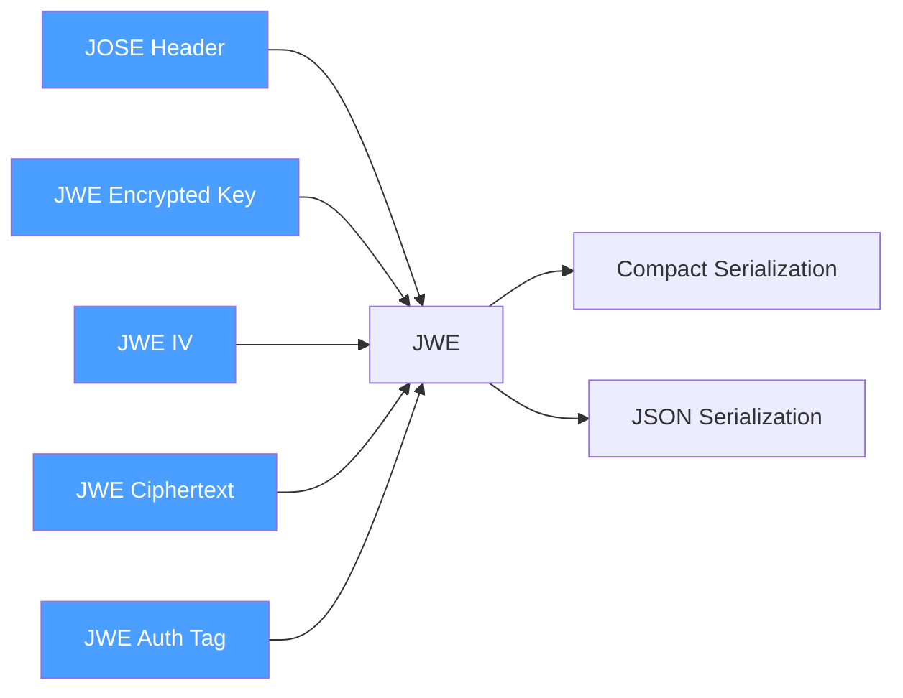
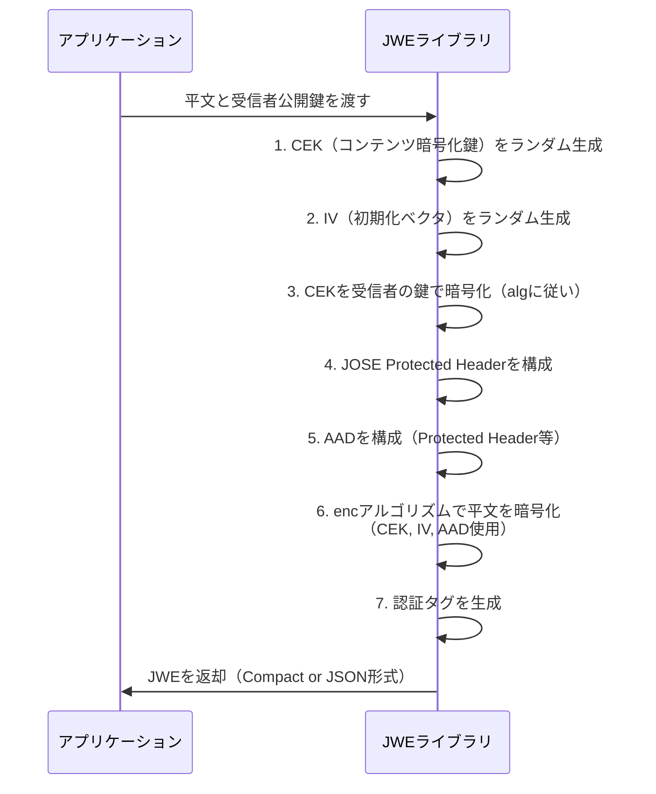
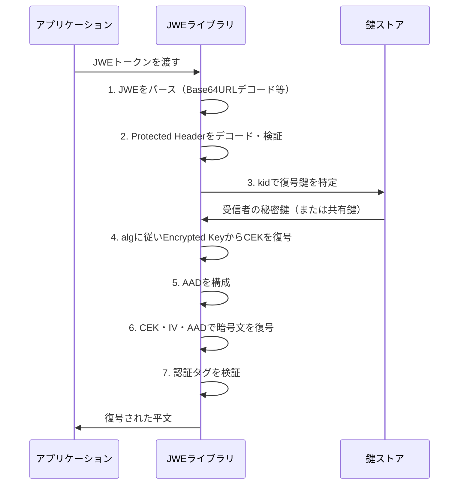
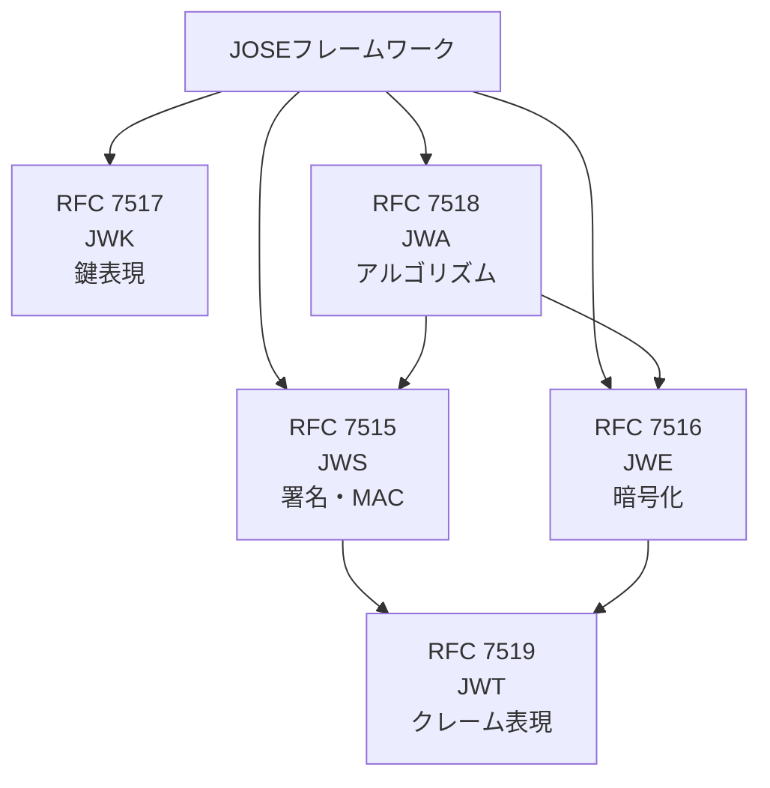

# RFC 7516 - JSON Web Encryption (JWE)

## 概要

RFC 7516は、**JSON Web Encryption（JWE）** を定義する標準仕様である。JWEはJSONベースのデータ構造を使用して、暗号化されたコンテンツを表現する。JWSが署名によってメッセージの完全性を保証するのに対し、JWEは暗号化によってメッセージの**機密性**を保証する。

JWEは**JOSE（JSON Object Signing and Encryption）** フレームワークの一部として、以下の目的で使用される：

- 送受信者間でのコンテンツの機密性保護
- 認可されたエンティティのみが内容を参照できるトークンの発行
- JWT（RFC 7519）と組み合わせたクレームの暗号化保護

## 解決する課題

JWE策定以前、コンテンツの暗号化にはXML Encryptionやバイナリベースのフォーマット（CMS/PKCS#7）が使用されていた。これらには以下の課題があった：

- **複雑性**: ASN.1やXMLベースのフォーマットは実装が複雑で、Webエコシステムとの親和性が低い
- **URLへの非親和性**: バイナリデータはHTTPヘッダーやURIに組み込みにくい
- **冗長性**: Webサービスに対して不必要に大きいペイロード

JWEはJSON + Base64URLエンコーディングを採用することで、Web API・HTTPプロトコルと親和性が高く、シンプルで軽量な暗号化メカニズムを提供する。

## 主要概念・用語

| 用語                              | 説明                                                       |
| --------------------------------- | ---------------------------------------------------------- |
| **JWE**                           | JSON Web Encryption。本仕様全体を指す                      |
| **JOSE Header**                   | 暗号化アルゴリズムやその他パラメータを含むJSONオブジェクト |
| **JWE Protected Header**          | Base64URLエンコードされ、認証の対象となるヘッダー          |
| **JWE Unprotected Header**        | 認証の対象外のヘッダー（JSON Serializationのみ）           |
| **Content Encryption Key**        | コンテンツの暗号化に使用される対称鍵（CEK）                |
| **JWE Encrypted Key**             | 受信者の鍵で暗号化されたCEK                                |
| **JWE Initialization Vector**     | 暗号化アルゴリズムに使用する初期化ベクタ（IV）             |
| **JWE Ciphertext**                | CEKで暗号化されたコンテンツ                                |
| **JWE Authentication Tag**        | コンテンツの完全性を保証する認証タグ                       |
| **Additional Authenticated Data** | 暗号化はされないが認証の対象となるデータ（AAD）            |

## JWEの構造

JWEは5つの主要コンポーネントで構成される。



### 2層暗号化アーキテクチャ

JWEは**2層構造**を採用している：

1. **コンテンツ暗号化層**: ランダムに生成されたCEKでコンテンツを暗号化（高速な対称暗号を使用）
2. **鍵暗号化層**: 受信者の公開鍵や共有鍵でCEKを暗号化

この設計により、同一コンテンツを複数の受信者それぞれの鍵で効率的に配送できる。

## シリアライゼーション形式

### JWE Compact Serialization

最も一般的に使用される形式。5つの部分をドット（`.`）で区切ったURLセーフな文字列：

```
BASE64URL(UTF8(JWE Protected Header))
. BASE64URL(JWE Encrypted Key)
. BASE64URL(JWE Initialization Vector)
. BASE64URL(JWE Ciphertext)
. BASE64URL(JWE Authentication Tag)
```

特徴：

- 単一受信者のみサポート
- Unprotected Headerは使用不可
- HTTPヘッダー、URI、クエリパラメータへの組み込みに適している

### JWE JSON Serialization

JSON形式で表現され、**一般構文**と**フラット構文**の2種類がある。

#### 一般構文（General JWE JSON Serialization）

複数受信者をサポートし、受信者ごとに異なる鍵を使用できる：

```json
{
  "protected": "BASE64URL(JWE Protected Header)",
  "unprotected": { "jku": "https://example.com/keys" },
  "recipients": [
    {
      "header": { "kid": "key-1", "alg": "RSA-OAEP" },
      "encrypted_key": "BASE64URL(JWE Encrypted Key for recipient 1)"
    },
    {
      "header": { "kid": "key-2", "alg": "A256KW" },
      "encrypted_key": "BASE64URL(JWE Encrypted Key for recipient 2)"
    }
  ],
  "iv": "BASE64URL(JWE IV)",
  "ciphertext": "BASE64URL(JWE Ciphertext)",
  "tag": "BASE64URL(JWE Authentication Tag)"
}
```

#### フラット構文（Flattened JWE JSON Serialization）

単一受信者に最適化した簡潔な形式：

```json
{
  "protected": "BASE64URL(JWE Protected Header)",
  "unprotected": { "jku": "https://example.com/keys" },
  "header": { "kid": "key-1" },
  "encrypted_key": "BASE64URL(JWE Encrypted Key)",
  "iv": "BASE64URL(JWE IV)",
  "ciphertext": "BASE64URL(JWE Ciphertext)",
  "tag": "BASE64URL(JWE Authentication Tag)"
}
```

## ヘッダーパラメータ

### alg（Key Management Algorithm）

**必須**。CEKの鍵管理に使用するアルゴリズムを識別する（RFC 7518 / JWAで定義）。

| alg値                | アルゴリズム                               | 概要                              |
| -------------------- | ------------------------------------------ | --------------------------------- |
| `RSA-OAEP`           | RSAES-OAEP using SHA-1 and MGF1 with SHA-1 | RSA公開鍵でCEKを暗号化            |
| `RSA-OAEP-256`       | RSAES-OAEP using SHA-256                   | RSA-OAEPのSHA-256版               |
| `RSA1_5`             | RSAES-PKCS1-v1_5                           | 非推奨（脆弱性あり）              |
| `A128KW`             | AES Key Wrap with 128-bit key              | AES鍵ラップ（128bit）             |
| `A192KW`             | AES Key Wrap with 192-bit key              | AES鍵ラップ（192bit）             |
| `A256KW`             | AES Key Wrap with 256-bit key              | AES鍵ラップ（256bit）             |
| `dir`                | Direct use of a shared symmetric key       | CEKとして共有鍵を直接使用         |
| `ECDH-ES`            | ECDH-ES key agreement                      | ECDH-ES鍵合意（ephemeral static） |
| `ECDH-ES+A128KW`     | ECDH-ES + AES-128 Key Wrap                 | ECDH-ES + AES鍵ラップ             |
| `A128GCMKW`          | AES GCM Key Wrap with 128-bit key          | AES-GCMによる鍵ラップ             |
| `PBES2-HS256+A128KW` | PBES2 with HMAC SHA-256 and A128KW         | パスワードベースの鍵暗号化        |

### enc（Content Encryption Algorithm）

**必須**。コンテンツの暗号化に使用するアルゴリズムを識別する。

| enc値           | アルゴリズム                                   | 鍵長   |
| --------------- | ---------------------------------------------- | ------ |
| `A128CBC-HS256` | AES-128-CBC + HMAC-SHA256（AES_CBC_HMAC_SHA2） | 256bit |
| `A192CBC-HS384` | AES-192-CBC + HMAC-SHA384                      | 384bit |
| `A256CBC-HS512` | AES-256-CBC + HMAC-SHA512                      | 512bit |
| `A128GCM`       | AES-GCM 128-bit key                            | 128bit |
| `A192GCM`       | AES-GCM 192-bit key                            | 192bit |
| `A256GCM`       | AES-GCM 256-bit key                            | 256bit |

GCM系はAEAD（認証付き暗号）を提供し、IV・認証タグも組み込まれるため現代的な選択として推奨される。

## 暗号化・復号プロセス

### 暗号化フロー



### 復号フロー



## セキュリティに関する考慮事項

### 暗号化ライブラリの使用

JWEの暗号化アルゴリズムは正確に実装しなければならない。特にAES-GCMのIVは同じ鍵に対して絶対に再使用してはならない。実績ある暗号ライブラリを使用することが強く推奨される。

### RSA-PKCS1-v1_5の非推奨

`RSA1_5`（RSAES-PKCS1-v1_5）はPadding Oracle攻撃（Bleichenbacher攻撃）に対して脆弱である。新規実装では`RSA-OAEP`または`RSA-OAEP-256`を使用すること。

### 鍵サイズの選択

| 用途           | 推奨最小値             |
| -------------- | ---------------------- |
| RSA鍵          | 2048ビット（推奨4096） |
| EC鍵           | P-256（NIST曲線）      |
| 対称CEK（AES） | 128ビット以上          |

### Compact vs JSON Serialization

Compact Serializationでは全ヘッダーがProtected Header（認証対象）となるため、改ざん防止の観点からより安全である。JSON SerializationのUnprotected Headerは認証されないため、機密性が必要なパラメータを配置しないよう注意する。

### 復号エラーの取り扱い

復号エラーの詳細（パディングエラー、MACエラー等）を攻撃者に漏らさないよう、エラー内容を具体的に返さないことが重要である。

## JWEとJWSの関係



| 仕様           | 役割                               |
| -------------- | ---------------------------------- |
| RFC 7515 (JWS) | 署名・MACによるメッセージ保護      |
| RFC 7516 (JWE) | 暗号化によるメッセージ保護         |
| RFC 7517 (JWK) | JSON形式での暗号鍵の表現           |
| RFC 7518 (JWA) | アルゴリズム識別子の定義           |
| RFC 7519 (JWT) | JWSまたはJWEを使ったクレームの表現 |

## 関連仕様

- **[RFC 7515](/specs/rfc7515)** - JSON Web Signature (JWS)
- **[RFC 7517](/specs/rfc7517)** - JSON Web Key (JWK)
- **[RFC 7518](/specs/rfc7518)** - JSON Web Algorithms (JWA)
- **[RFC 7519](/specs/rfc7519)** - JSON Web Token (JWT)

## 参考文献

- [RFC 7516 - JSON Web Encryption (JWE)](https://www.rfc-editor.org/rfc/rfc7516) - IETF RFC原文
- [RFC 7518 - JSON Web Algorithms (JWA)](https://www.rfc-editor.org/rfc/rfc7518) - アルゴリズム定義
- [IANA: JSON Web Signature and Encryption Algorithms](https://www.iana.org/assignments/jose/jose.xhtml) - IANAレジストリ
