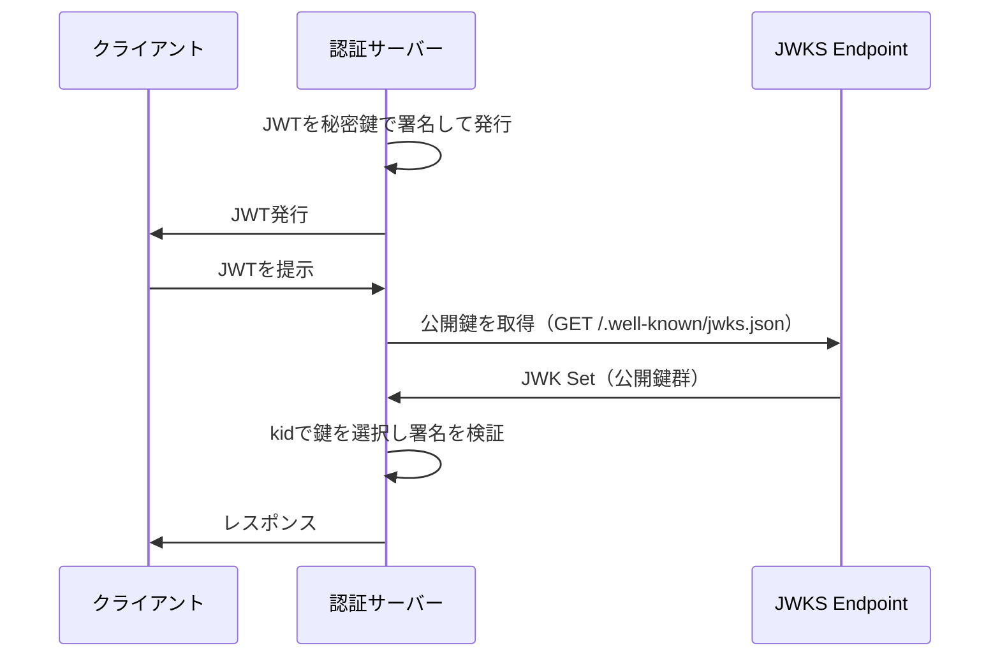
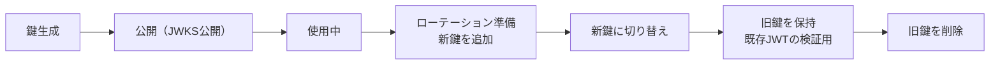

# RFC 7517 - JSON Web Key (JWK)

## 概要

RFC 7517は、**JSON Web Key（JWK）** を定義する標準仕様である。JWKは暗号鍵をJSONオブジェクトとして表現するためのデータ構造で、公開鍵・秘密鍵・対称鍵のいずれも表現できる。

JWKは**JOSE（JSON Object Signing and Encryption）** フレームワークの鍵表現層として機能し、JWS・JWEで使用する鍵の標準的な配布・管理方法を提供する。

複数のJWKをまとめた**JWK Set（JWKS）** は、OpenID Connectのディスカバリメタデータで広く使われており、署名検証用公開鍵の動的な取得・ローテーションを可能にする。

## 解決する課題

JWK策定以前、暗号鍵の交換にはX.509証明書（PEM/DER形式）やPKCS#8といった形式が使用されていた。これらには以下の課題があった：

- **複雑な解析**: ASN.1/DERベースのフォーマットはJSONを前提とするWebエコシステムと相性が悪い
- **メタデータの欠如**: 鍵の用途や識別子を標準的に付与する仕組みがない
- **複数鍵の管理**: 複数の公開鍵をひとつのドキュメントで表現する標準的な方法がない

JWKはJSONネイティブな鍵表現を提供し、Web APIでの鍵配布を簡素化する。

## 主要概念・用語

| 用語         | 説明                                                       |
| ------------ | ---------------------------------------------------------- |
| **JWK**      | JSON Web Key。単一の暗号鍵を表すJSONオブジェクト           |
| **JWK Set**  | 複数のJWKを含むJSONオブジェクト（`keys`配列を持つ）        |
| **kty**      | Key Type。鍵の種類を示す（RSA, EC, oct 等）                |
| **use**      | Public Key Use。鍵の用途（`sig`=署名, `enc`=暗号化）       |
| **key_ops**  | Key Operations。鍵の操作（`sign`, `verify`, `encrypt` 等） |
| **kid**      | Key ID。鍵を識別するための任意の文字列                     |
| **JWKS URI** | JWK Setを公開するURL（OpenID Connectで広く使用）           |

## JWKの構造

### 共通パラメータ

すべての鍵タイプに適用可能なパラメータ：

| パラメータ | 必須/任意 | 説明                                               |
| ---------- | --------- | -------------------------------------------------- |
| `kty`      | **必須**  | 鍵タイプ（`RSA`, `EC`, `oct`）                     |
| `use`      | 任意      | 用途（`sig`, `enc`）。`key_ops`と同時使用は非推奨  |
| `key_ops`  | 任意      | 許可する操作の配列                                 |
| `alg`      | 任意      | この鍵で使用するアルゴリズム（例: `RS256`）        |
| `kid`      | 任意      | 鍵識別子。JWSの`kid`ヘッダーと照合して鍵を選択する |
| `x5u`      | 任意      | X.509証明書またはチェーンのURL                     |
| `x5c`      | 任意      | X.509証明書チェーン（Base64エンコード）            |
| `x5t`      | 任意      | X.509証明書のSHA-1フィンガープリント               |
| `x5t#S256` | 任意      | X.509証明書のSHA-256フィンガープリント             |

### RSA鍵

```json
{
  "kty": "RSA",
  "use": "sig",
  "kid": "my-rsa-key-1",
  "alg": "RS256",
  "n": "0vx7agoebGcQSuuPiLJXZptN9nndrQmbXEps2aiAFbWhM78LhWx...",
  "e": "AQAB",
  "d": "X4cTteJY_gn4FYPsXB8rdXix5vwsg1FLN5E3EaG6RJoVH-HLLKD9...",
  "p": "83i-7IvMGXoMXCskv73TKr8637FiO7Z27zv8oj6pbWUQyLPQBQxtPV...",
  "q": "3dfOR9cuYq-0S-mkFLzgItgMEfFzB2q3hWehMuG0oCuqnb3vobLyum...",
  "dp": "G4sPXkc6Ya9y8oJW9_ILj4xuppu0lzi_H7VTkS8xj5SdX3coE0oim...",
  "dq": "s9lAH9fggBsoFR33s8IWSighagAZA4UMwx2lB2CJNgQxTxlZ4Wj3ZW...",
  "qi": "GyM_p6JrXySiz1toFgKbWV-JdI3jT4s9e-4sUCCsrAKobo-nXEjcWA..."
}
```

RSA鍵のパラメータ（いずれもBase64URL エンコード）：

| パラメータ | 説明                           |
| ---------- | ------------------------------ |
| `n`        | モジュラス（公開鍵）           |
| `e`        | 公開指数（公開鍵）             |
| `d`        | 秘密指数（秘密鍵のみ）         |
| `p`, `q`   | 素因数（秘密鍵の最適化に使用） |
| `dp`, `dq` | CRT指数（秘密鍵の最適化）      |
| `qi`       | CRT係数（秘密鍵の最適化）      |

### EC鍵（楕円曲線）

```json
{
  "kty": "EC",
  "use": "sig",
  "kid": "my-ec-key-1",
  "alg": "ES256",
  "crv": "P-256",
  "x": "f83OJ3D2xF1Bg8vub9tLe1gHMzV76e8Tus9uPHvRVEU",
  "y": "x_FEzRu9m36HLN_tue659LNpXW6pCyStikYjKIWI5a0",
  "d": "jpsQnnGQmL-YBIffH1136cspYG6-0iY7X1fCE9-E9LI"
}
```

EC鍵のパラメータ：

| パラメータ | 説明                                |
| ---------- | ----------------------------------- |
| `crv`      | 曲線名（`P-256`, `P-384`, `P-521`） |
| `x`        | X座標（Base64URL）                  |
| `y`        | Y座標（Base64URL）                  |
| `d`        | 秘密スカラー（秘密鍵のみ）          |

### 対称鍵（oct）

```json
{
  "kty": "oct",
  "use": "sig",
  "kid": "my-hmac-key",
  "alg": "HS256",
  "k": "GawgguFyGrWKav7AX4VKUg"
}
```

| パラメータ | 説明                        |
| ---------- | --------------------------- |
| `k`        | 鍵値（Base64URLエンコード） |

## JWK Set

複数のJWKをひとつのドキュメントにまとめた形式。`keys`メンバーが必須。

```json
{
  "keys": [
    {
      "kty": "RSA",
      "use": "sig",
      "kid": "rsa-sig-2024",
      "alg": "RS256",
      "n": "...",
      "e": "AQAB"
    },
    {
      "kty": "EC",
      "use": "enc",
      "kid": "ec-enc-2024",
      "crv": "P-256",
      "x": "...",
      "y": "..."
    }
  ]
}
```

### JWKS URIを使った鍵配布



OpenID Connectでは認証サーバーが`/.well-known/openid-configuration`でJWKS URIを公開し、クライアントはそこからID Tokenの検証用公開鍵を動的に取得する。

## 鍵のライフサイクル管理



鍵ローテーション時は以下の手順が一般的：

1. 新しい鍵ペアを生成し、新`kid`を付与
2. JWKS URIに新鍵を追加（旧鍵も残す）
3. 新鍵で署名を開始
4. 旧鍵で発行されたトークンの有効期限が切れるまで旧鍵を保持
5. 旧鍵をJWKS URIから削除

## セキュリティに関する考慮事項

### 秘密鍵の保護

JWKに秘密鍵パラメータ（`d`等）を含める場合、その配布は厳重に制限しなければならない。JWKS URIで公開するJWK Setには公開鍵のみを含めること。

### JWKS URIのTLS保護

JWKS URIはHTTPSで提供しなければならない。JWKの改ざんはJWS署名の検証を完全に無効化する。

### `kid`の衝突

JWK Setに同じ`kid`を持つ複数の鍵を含めてはならない。衝突した場合の動作は未定義であり、実装によって異なる。

### `use`と`key_ops`の一貫性

`use`と`key_ops`を同時に指定する場合、両者の意味は一貫していなければならない。たとえば`use: sig`と`key_ops: ["encrypt"]`を同時に指定してはならない。

## 関連仕様

- **[RFC 7515](/specs/rfc7515)** - JSON Web Signature (JWS)
- **[RFC 7516](/specs/rfc7516)** - JSON Web Encryption (JWE)
- **[RFC 7518](/specs/rfc7518)** - JSON Web Algorithms (JWA)
- **[RFC 7519](/specs/rfc7519)** - JSON Web Token (JWT)
- **[RFC 7638](/specs/rfc7638)** - JSON Web Key (JWK) Thumbprint

## 参考文献

- [RFC 7517 - JSON Web Key (JWK)](https://www.rfc-editor.org/rfc/rfc7517) - IETF RFC原文
- [IANA: JSON Web Key Parameters](https://www.iana.org/assignments/jose/jose.xhtml#web-key-parameters) - IANAレジストリ
- [RFC 7638 - JSON Web Key (JWK) Thumbprint](https://www.rfc-editor.org/rfc/rfc7638) - 鍵のフィンガープリント算出
