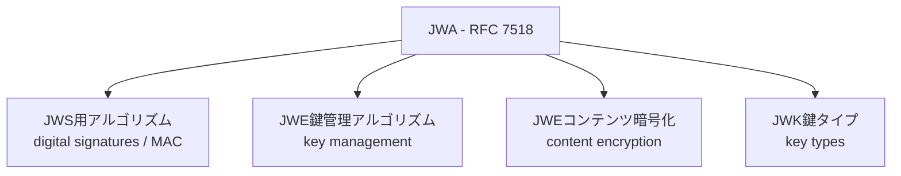
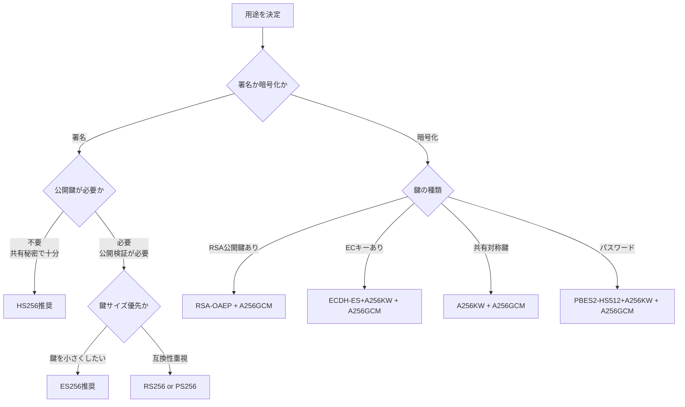

# RFC 7518 - JSON Web Algorithms (JWA)

## 概要

RFC 7518は、**JSON Web Algorithms（JWA）** を定義する標準仕様である。JWAはJOSEフレームワーク（JWS・JWE・JWK）で使用する暗号アルゴリズムの識別子と、それぞれのアルゴリズムの使用方法を規定する。

JWSの`alg`ヘッダー、JWEの`alg`・`enc`ヘッダー、JWKの`kty`パラメータなど、JOSEで使用するすべてのアルゴリズム識別子はJWAで定義されている。

## 解決する課題

JWSやJWEといった仕様がアルゴリズムに依存せず汎用的に定義されるためには、アルゴリズムの識別子と使用方法を別途標準化する必要がある。JWAはこの役割を担い、以下を実現する：

- アルゴリズム識別子の統一（`RS256`、`A256GCM`等）による相互運用性の確保
- 各アルゴリズムの具体的な使用方法（鍵サイズ、パラメータ等）の明文化
- 新アルゴリズム追加のための拡張ポイントの提供

## アルゴリズムの分類

JWAは大きく以下の3カテゴリに分類される：

## JWS用アルゴリズム（`alg`）

JWS（RFC 7515）の`alg`ヘッダーパラメータに使用する署名・MACアルゴリズム。

### HMAC（対称MAC）

| alg値   | アルゴリズム       | 鍵長       | 要件 |
| ------- | ------------------ | ---------- | ---- |
| `HS256` | HMAC using SHA-256 | 256bit以上 | 必須 |
| `HS384` | HMAC using SHA-384 | 384bit以上 | 任意 |
| `HS512` | HMAC using SHA-512 | 512bit以上 | 任意 |

HMACは共有秘密鍵を使用するMAC（メッセージ認証コード）であり、署名者と検証者が同じ鍵を持つ必要がある。公開検証が不要なサービス間通信に適している。

### RSASSA-PKCS1-v1_5

| alg値   | アルゴリズム                    | 鍵長        | 要件 |
| ------- | ------------------------------- | ----------- | ---- |
| `RS256` | RSASSA-PKCS1-v1_5 using SHA-256 | 2048bit以上 | 推奨 |
| `RS384` | RSASSA-PKCS1-v1_5 using SHA-384 | 2048bit以上 | 任意 |
| `RS512` | RSASSA-PKCS1-v1_5 using SHA-512 | 2048bit以上 | 任意 |

公開鍵暗号を使用したデジタル署名。広く実装されているが、RSASSA-PSSより安全性が低い。

### RSASSA-PSS

| alg値   | アルゴリズム                                   | 鍵長        | 要件 |
| ------- | ---------------------------------------------- | ----------- | ---- |
| `PS256` | RSASSA-PSS using SHA-256 and MGF1 with SHA-256 | 2048bit以上 | 任意 |
| `PS384` | RSASSA-PSS using SHA-384 and MGF1 with SHA-384 | 2048bit以上 | 任意 |
| `PS512` | RSASSA-PSS using SHA-512 and MGF1 with SHA-512 | 2048bit以上 | 任意 |

RSASSA-PKCS1-v1_5より安全なパディングスキームを採用。新規実装では`PS256`以上が推奨される。

### ECDSA（楕円曲線デジタル署名）

| alg値   | アルゴリズム                  | 曲線  | 要件 |
| ------- | ----------------------------- | ----- | ---- |
| `ES256` | ECDSA using P-256 and SHA-256 | P-256 | 推奨 |
| `ES384` | ECDSA using P-384 and SHA-384 | P-384 | 任意 |
| `ES512` | ECDSA using P-521 and SHA-512 | P-521 | 任意 |

RSAより短い鍵長で同等のセキュリティを提供する。モバイル・IoT環境等のリソース制約環境に適している。

### none（署名なし）

| alg値  | 説明                                     | 要件 |
| ------ | ---------------------------------------- | ---- |
| `none` | JWSを署名なしで使用する（Unsecured JWS） | 必須 |

外部のセキュリティ機構（TLS等）で保護されている場合のみ使用可能。本番環境での使用は原則禁止。

## JWE鍵管理アルゴリズム（`alg`）

JWE（RFC 7516）の`alg`ヘッダーパラメータに使用するCEK鍵管理アルゴリズム。

### RSAベース

| alg値          | アルゴリズム            | 概要                         | 推奨 |
| -------------- | ----------------------- | ---------------------------- | ---- |
| `RSA-OAEP`     | RSAES-OAEP with SHA-1   | RSA-OAEPによるCEK暗号化      | ◎    |
| `RSA-OAEP-256` | RSAES-OAEP with SHA-256 | SHA-256版（より安全）        | ◎    |
| `RSA1_5`       | RSAES-PKCS1-v1_5        | 非推奨（Bleichenbacher攻撃） | ✕    |

### AES鍵ラップ

| alg値    | アルゴリズム              | 鍵長   |
| -------- | ------------------------- | ------ |
| `A128KW` | AES Key Wrap with 128-bit | 128bit |
| `A192KW` | AES Key Wrap with 192-bit | 192bit |
| `A256KW` | AES Key Wrap with 256-bit | 256bit |

### 直接鍵使用

| alg値 | 説明                                          |
| ----- | --------------------------------------------- |
| `dir` | 共有対称鍵をCEKとして直接使用（鍵ラップなし） |

### ECDH-ES（楕円曲線Diffie-Hellman）

| alg値            | 説明                                   |
| ---------------- | -------------------------------------- |
| `ECDH-ES`        | ECDH-ESでCEKを直接導出（鍵合意）       |
| `ECDH-ES+A128KW` | ECDH-ES + AES-128 Key Wrapで鍵を暗号化 |
| `ECDH-ES+A192KW` | ECDH-ES + AES-192 Key Wrap             |
| `ECDH-ES+A256KW` | ECDH-ES + AES-256 Key Wrap             |

### AES-GCMによる鍵ラップ

| alg値       | 説明                         |
| ----------- | ---------------------------- |
| `A128GCMKW` | AES-GCM 128-bitでCEKを暗号化 |
| `A192GCMKW` | AES-GCM 192-bitでCEKを暗号化 |
| `A256GCMKW` | AES-GCM 256-bitでCEKを暗号化 |

### パスワードベース

| alg値                | 説明                                 |
| -------------------- | ------------------------------------ |
| `PBES2-HS256+A128KW` | PBES2-HMAC-SHA256 + AES-128 Key Wrap |
| `PBES2-HS384+A192KW` | PBES2-HMAC-SHA384 + AES-192 Key Wrap |
| `PBES2-HS512+A256KW` | PBES2-HMAC-SHA512 + AES-256 Key Wrap |

## JWEコンテンツ暗号化アルゴリズム（`enc`）

JWE（RFC 7516）の`enc`ヘッダーパラメータに使用するコンテンツ暗号化アルゴリズム。

### AES-CBC + HMAC-SHA2（複合型AEAD）

| enc値           | アルゴリズム               | CEK長  |
| --------------- | -------------------------- | ------ |
| `A128CBC-HS256` | AES-128-CBC + HMAC-SHA-256 | 256bit |
| `A192CBC-HS384` | AES-192-CBC + HMAC-SHA-384 | 384bit |
| `A256CBC-HS512` | AES-256-CBC + HMAC-SHA-512 | 512bit |

2つのサブキー（暗号化用とMAC用）に分割して使用する複合型AEAD構造。

### AES-GCM（ネイティブAEAD）

| enc値     | アルゴリズム        | CEK長  |
| --------- | ------------------- | ------ |
| `A128GCM` | AES-GCM 128-bit key | 128bit |
| `A192GCM` | AES-GCM 192-bit key | 192bit |
| `A256GCM` | AES-GCM 256-bit key | 256bit |

GCMモードはネイティブなAEAD（Authenticated Encryption with Associated Data）を提供し、暗号化と認証を一体化。CBC+HMACより実装がシンプルで、多くのハードウェアで高速化サポートがある。

## JWK鍵タイプ（`kty`）

JWK（RFC 7517）の`kty`パラメータで使用する鍵タイプ識別子。

| kty値 | 説明                           | 主な用途                               |
| ----- | ------------------------------ | -------------------------------------- |
| `RSA` | RSA鍵                          | JWS: RS256等、JWE: RSA-OAEP等          |
| `EC`  | 楕円曲線鍵                     | JWS: ES256等、JWE: ECDH-ES等           |
| `oct` | オクテット列（対称鍵・HMAC鍵） | JWS: HS256等、JWE: A256KW等（CEK直接） |

### EC鍵の曲線

| crv値   | 曲線       | 用途           |
| ------- | ---------- | -------------- |
| `P-256` | NIST P-256 | ES256, ECDH-ES |
| `P-384` | NIST P-384 | ES384, ECDH-ES |
| `P-521` | NIST P-521 | ES512, ECDH-ES |

## アルゴリズム選択指針

## セキュリティに関する考慮事項

### 非推奨アルゴリズム

以下のアルゴリズムは既知の脆弱性があるため、新規実装では使用しないこと：

| アルゴリズム | 理由                                       |
| ------------ | ------------------------------------------ |
| `RSA1_5`     | Bleichenbacher攻撃に脆弱                   |
| `none`       | 署名なし。意図せず受け入れると認証バイパス |

### アルゴリズム置換攻撃

JWSの検証時、`alg`ヘッダーの値をそのまま信用してはならない。検証側は事前に許可するアルゴリズムをホワイトリストで定義し、ヘッダーの値ではなくホワイトリストに基づいてアルゴリズムを選択すること。

### IV（初期化ベクタ）の一意性

AES-GCMを使用する場合、同じ鍵に対してIVを再使用してはならない。IVの再使用はGCMの認証機能を完全に破壊し、秘密鍵の漏洩にもつながる。JWAでは96ビット（12バイト）のランダムIVが推奨される。

### 鍵長の選択

各アルゴリズムの推奨鍵長より短い鍵を使用しないこと。特にHMACの秘密鍵は使用するハッシュアルゴリズムの出力長以上のエントロピーを持つ必要がある。

## 関連仕様

- **[RFC 7515](/specs/rfc7515)** - JSON Web Signature (JWS)
- **[RFC 7516](/specs/rfc7516)** - JSON Web Encryption (JWE)
- **[RFC 7517](/specs/rfc7517)** - JSON Web Key (JWK)
- **[RFC 7519](/specs/rfc7519)** - JSON Web Token (JWT)

## 参考文献

- [RFC 7518 - JSON Web Algorithms (JWA)](https://www.rfc-editor.org/rfc/rfc7518) - IETF RFC原文
- [IANA: JSON Web Signature and Encryption Algorithms](https://www.iana.org/assignments/jose/jose.xhtml#web-signature-encryption-algorithms) - IANAレジストリ
- [NIST Special Publication 800-57](https://csrc.nist.gov/publications/detail/sp/800-57-part-1/rev-5/final) - 鍵管理推奨事項
