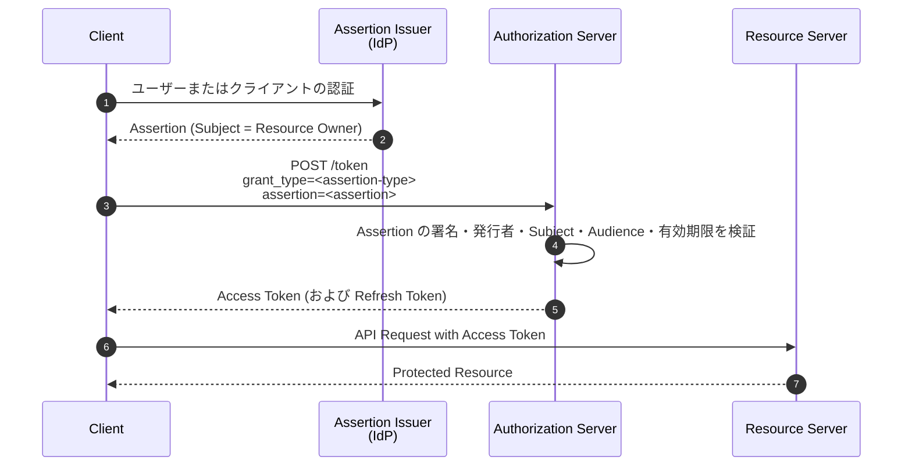
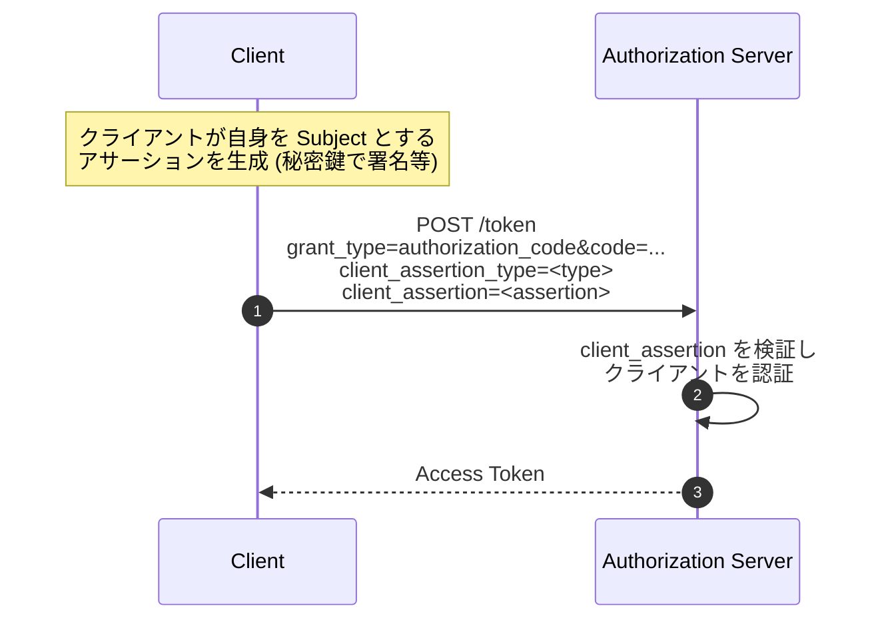

# RFC 7521 - Assertion Framework for OAuth 2.0 Client Authentication and Authorization Grants

## 1. 概要

RFC 7521 は、OAuth 2.0 において「アサーション (assertion)」を利用するための汎用的なフレームワークを定義する仕様である。アサーションとは、複数のセキュリティドメインの間でセキュリティ情報をやり取りするための情報パッケージを指し、典型的には発行者 (Issuer) によってデジタル署名または MAC で保護され、信頼関係を持つ第三者が検証可能な形をとる。

本フレームワークは、OAuth 2.0 のトークンエンドポイントに対して以下の二つの目的でアサーションを利用するための共通基盤を規定する。

- **Authorization Grant としての利用**: アサーション自体を提示することで、認可サーバーからアクセストークンを取得する拡張グラントタイプ
- **Client Authentication としての利用**: トークンエンドポイントなどでクライアント自身が自らを認証する手段としてのアサーション

RFC 7521 はアサーション形式そのものを規定せず、抽象的なメッセージフロー、必要なパラメータ、アサーションに含まれるべき情報、検証要件、セキュリティ考慮事項を定義する。具体的なアサーション形式は、SAML 2.0 を扱う [RFC 7522](./rfc7522) や JWT を扱う [RFC 7523](./rfc7523) など、コンパニオン仕様によって定義される。

## 2. 解決する課題

RFC 6749 が定めるオリジナルの OAuth 2.0 は、クライアント認証および認可グラントの手段が以下に限られていた。

- クライアント認証: `client_secret_basic`、`client_secret_post` (共有秘密の送信)
- 認可グラント: Authorization Code、Implicit、Resource Owner Password Credentials、Client Credentials

これらは以下の課題を抱える。

- 共有秘密 (`client_secret`) をネットワーク越しに送る必要があり、漏えいリスクが高い
- 既存のエンタープライズ ID 基盤 (SAML IdP など) が発行したセキュリティトークンを直接 OAuth 2.0 に持ち込む標準的手段が無い
- エンドユーザーのブラウザを介さないサーバー間連携 (Server-to-Server) で、外部 IdP の発行したトークンを使ってアクセストークンを取得するフローが標準化されていない

RFC 7521 はこれらに対し、「アサーションを提示することで認可サーバーから信頼を得る」という抽象モデルを定義し、SAML 2.0 や JWT といった既存のセキュリティトークン形式と OAuth 2.0 を橋渡しする。これにより、企業内 SSO と OAuth 2.0 リソースアクセスを統合したり、非対称鍵によるクライアント認証 (`private_key_jwt`) を実現したりできるようになる。

## 3. 主要概念・用語

| 用語                        | 説明                                                                                                                                         |
| --------------------------- | -------------------------------------------------------------------------------------------------------------------------------------------- |
| **Assertion**               | セキュリティ情報を複数のセキュリティドメイン間で伝達するための情報パッケージ。デジタル署名または MAC で完全性を保護される                    |
| **Issuer**                  | アサーションを発行するエンティティ。アサーション内に一意な識別子として記載される                                                             |
| **Subject**                 | アサーションの主体となるプリンシパル。認可グラントとして使う場合はリソースオーナーを、クライアント認証として使う場合はクライアント自身を指す |
| **Audience**                | アサーションが向けられる対象。OAuth 2.0 では認可サーバーのトークンエンドポイント URL が典型的な値となる                                      |
| **Relying Party**           | アサーションを受信し検証するエンティティ。OAuth 2.0 においては認可サーバーが該当する                                                         |
| **Bearer Assertion**        | 所持しているだけでアサーションが主張する権限を行使できるアサーション。所持証明は不要                                                         |
| **Holder-of-Key Assertion** | アサーションに紐付いた暗号鍵の所持証明を追加で要求するアサーション                                                                           |

アサーションが持つ性質として、署名による発行者の認証、構造化されたクレーム表現、Subject と Audience の明示的な指定、有効期限の設定が挙げられる。これらにより、複数のセキュリティドメイン間で信頼を伝播させることが可能になる。

## 4. プロトコルフロー

### 4.1 Authorization Grant としてのアサーション利用

クライアントが既に何らかの手段で取得したアサーションを提示し、認可サーバーから対応するアクセストークンを取得するフロー。

リクエストパラメータは以下の二つを必須とする。

- `grant_type`: アサーション形式を識別する絶対 URI (例: `urn:ietf:params:oauth:grant-type:saml2-bearer`)
- `assertion`: アサーション本体 (一つだけ含めること)

`scope` パラメータは任意であるが、元々アサーションが付与する権限範囲を超えてはならない。エラー時、認可サーバーは RFC 6749 Section 5.2 に従い `invalid_grant` を返す。失効、署名不正、Subject/Audience 不一致などはすべて `invalid_grant` として扱われる。

### 4.2 Client Authentication としてのアサーション利用

クライアント自身がアサーションを提示することで自らを認証するフロー。任意のグラントタイプ (authorization_code、refresh_token、client_credentials 等) と組み合わせて使える。

リクエストパラメータは以下を必須とする。

- `client_assertion_type`: クライアントアサーション形式を識別する絶対 URI (例: `urn:ietf:params:oauth:client-assertion-type:jwt-bearer`)
- `client_assertion`: クライアントアサーション本体

`client_id` は任意であるが、含まれる場合は `client_assertion` の Subject と一致しなければならない。認証失敗時は `invalid_client` を返す。

## 5. 詳細解説

### 5.1 認可サーバーの認証要件

RFC 7521 は、認可サーバーがアサーション送信元の TLS による認証を要求してもよいことを述べている。ただしアサーション自体の署名検証が主たる認証手段である。クライアント認証用途では、クライアントが他の認証スキーム (例: TLS クライアント証明書) と組み合わせて多要素的に自身を主張することも許される。

### 5.2 アサーションの内容と検証

RFC 7521 はアサーション形式に依存しない抽象的な要件として、以下の必須要素を定める (Section 5.1, 5.2)。

| 要素           | 説明                                                                                                              |
| -------------- | ----------------------------------------------------------------------------------------------------------------- |
| **Issuer**     | アサーションを発行したエンティティの一意な識別子。クライアント認証用で自己発行の場合は通常 `client_id` の値となる |
| **Subject**    | アサーションが主張する主体。認可グラントではリソースオーナー、クライアント認証ではクライアント自身                |
| **Audience**   | アサーションの想定受信者。OAuth 2.0 では認可サーバーのトークンエンドポイント URL を識別する値                     |
| **Expires At** | アサーションが失効する時刻。これを過ぎたアサーションは拒否される                                                  |

任意要素として以下が定義される。

- **Not Before**: この時刻以前は有効でない
- **Issued At**: アサーション発行時刻
- **Assertion ID**: 一意な識別子。リプレイ防止のため認可サーバーが追跡するのに利用できる

認可サーバーが行うべき検証手順は以下である。

1. アサーションの完全性を署名または MAC で検証する
2. Issuer が既知かつ信頼できる発行者であるか確認する
3. Subject が認可サーバーにとって意味のある識別子であるか確認する
4. Audience がこの認可サーバー自身を指していることを確認する
5. 有効期限が将来であり、Not Before が過去であることを確認する
6. (オプション) Assertion ID を追跡して再利用を拒否する

### 5.3 Bearer と Holder-of-Key

RFC 7521 は二種類のアサーションを区別する。

- **Bearer Assertion**: 所持していること自体がアサーションの主張を行使する資格となる。盗難に弱いため TLS による伝送中保護と短い有効期限が必須
- **Holder-of-Key Assertion**: アサーションに紐付けられた暗号鍵の所持を別途証明する必要がある。盗まれても鍵が無ければ使えない

RFC 7521 本体は両形式を許容する枠組みを示すが、コンパニオン仕様である RFC 7522/7523 はいずれも **Bearer** 形式に特化したプロファイルである。Holder-of-Key 形式の具体的なプロファイルは別仕様に委ねられる。

### 5.4 エラー応答

| エラーコード     | 用途                                                                                          |
| ---------------- | --------------------------------------------------------------------------------------------- |
| `invalid_grant`  | 認可グラントとしてのアサーションが無効・期限切れ・署名不正・Audience 不一致・Subject 不正など |
| `invalid_client` | クライアント認証としてのアサーションが無効・署名不正・Issuer 不明など                         |
| `invalid_scope`  | 要求された scope がアサーションが付与する権限を超える場合                                     |

RFC 6749 のエラー処理規定 (Section 5.2) を踏襲する形となっている。

## 6. セキュリティに関する考慮事項

### 6.1 主な脅威

RFC 7521 Section 8 は、アサーションを OAuth 2.0 で利用する際の主要な脅威を列挙している。

| 脅威                               | 対策                                                                                                                                              |
| ---------------------------------- | ------------------------------------------------------------------------------------------------------------------------------------------------- |
| **偽造 (Forged Assertion)**        | デジタル署名または MAC によりアサーションの完全性を保護する。認可サーバーは信頼できる Issuer 鍵のみで検証する                                     |
| **盗難・リプレイ (Stolen/Replay)** | TLS による伝送中保護を必須化する。Audience を厳密に指定し他の認可サーバーで再利用できないようにする。短い有効期限と Assertion ID 追跡で再送を防ぐ |
| **権限昇格**                       | Subject と発行者の関係を認可サーバーが検証し、Subject が指す主体への代理権を Issuer が本当に有しているか確認する                                  |
| **個人情報漏洩**                   | TLS によるトランスポート保護に加え、必要に応じてアサーション暗号化を利用する。アサーションには必要最小限の情報のみを含める                        |

### 6.2 アサーション有効期間の設計

RFC 7521 は、アサーションの有効期間が「対応するアクセストークンの有効期間を大幅に超えてはならない」と注意喚起している。長寿命のアサーションは Bearer 性質と相まって深刻な被害につながる。一般的には数分程度の短い有効期限を推奨する。

### 6.3 認可サーバーと Issuer の信頼関係

認可サーバーは事前に Issuer の公開鍵または共有秘密を取得し、信頼できる Issuer のリストを管理しなければならない。鍵のローテーションや失効を考慮した運用設計が必要である。

### 6.4 Audience 制約の重要性

アサーションが特定の認可サーバーを Audience として持たない場合、別の認可サーバーで再利用されるクロスドメインリプレイのリスクがある。認可サーバーは自身を一意に識別する URL (典型的にはトークンエンドポイント URL) を Audience として要求し、厳密に比較すべきである。

## 7. 関連仕様

RFC 7521 は抽象フレームワークであり、実際の利用には具体的なアサーション形式を定める仕様が必要となる。

- **[RFC 7522](./rfc7522)** — SAML 2.0 Profile for OAuth 2.0 Client Authentication and Authorization Grants: SAML 2.0 アサーションを用いた具体プロファイル
- **[RFC 7523](./rfc7523)** — JWT Profile for OAuth 2.0 Client Authentication and Authorization Grants: JWT を用いた具体プロファイル。OpenID Connect の `private_key_jwt`/`client_secret_jwt` クライアント認証の基盤
- **[RFC 6749](./rfc6749)** — OAuth 2.0 Authorization Framework: 本仕様の上位フレームワーク
- **[RFC 7519](./rfc7519)** — JSON Web Token: RFC 7523 で用いられるアサーション形式
- **[RFC 8693](./rfc8693)** — OAuth 2.0 Token Exchange: 異なるセキュリティトークン間の交換を扱う仕様。アサーション利用の発展形と位置づけられる

OpenID Connect Core の Section 9 で定義される `private_key_jwt` および `client_secret_jwt` のクライアント認証方式は、RFC 7521 + RFC 7523 を組み合わせて構築されており、現代の高保証 OAuth/OIDC エコシステム (FAPI、Open Banking など) で広く利用されている。

## 8. 参考文献

- [RFC 7521 - Assertion Framework for OAuth 2.0 Client Authentication and Authorization Grants](https://datatracker.ietf.org/doc/html/rfc7521)
- [RFC 7522 - Security Assertion Markup Language (SAML) 2.0 Profile for OAuth 2.0 Client Authentication and Authorization Grants](https://datatracker.ietf.org/doc/html/rfc7522)
- [RFC 7523 - JSON Web Token (JWT) Profile for OAuth 2.0 Client Authentication and Authorization Grants](https://datatracker.ietf.org/doc/html/rfc7523)
- [RFC 6749 - The OAuth 2.0 Authorization Framework](https://datatracker.ietf.org/doc/html/rfc6749)
- [OpenID Connect Core 1.0 - Section 9. Client Authentication](https://openid.net/specs/openid-connect-core-1_0.html#ClientAuthentication)
