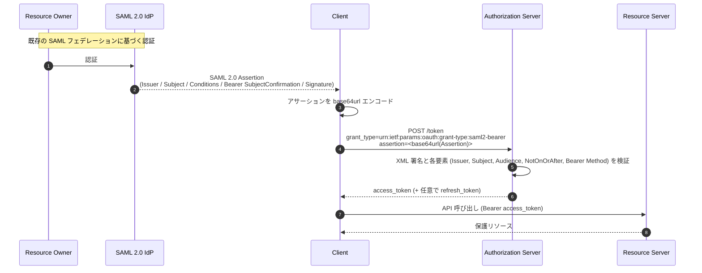
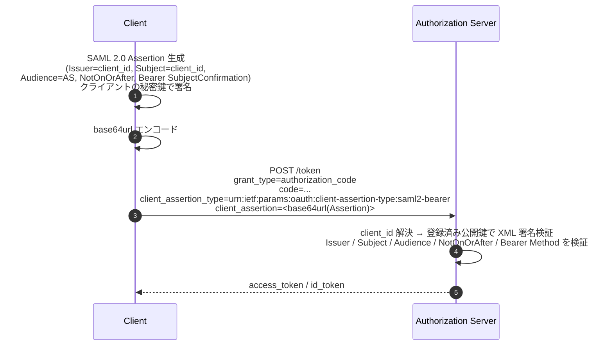
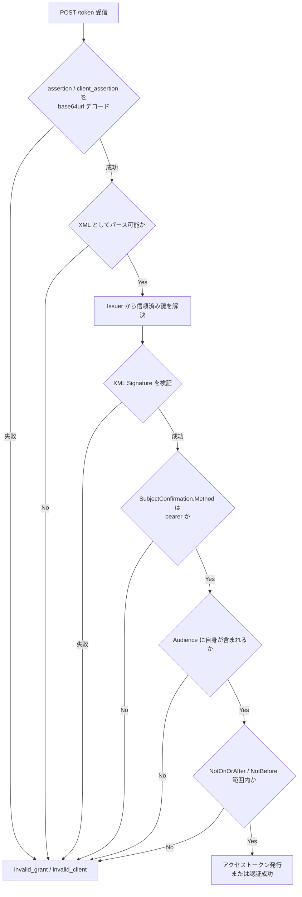

# RFC 7522 - Security Assertion Markup Language (SAML) 2.0 Profile for OAuth 2.0 Client Authentication and Authorization Grants

## 1. 概要

RFC 7522 は、OAuth 2.0 において SAML 2.0 アサーションを「アサーション」として利用するためのプロファイルを定義する仕様である。汎用的なアサーションフレームワークである [RFC 7521](./rfc7521.md) を SAML 2.0 という具体形式に具体化したもので、次の二つのユースケースを規定する。

- **Authorization Grant としての利用**: SAML 2.0 アサーションを提示することで、認可サーバーからアクセストークンを取得する拡張グラントタイプ
- **Client Authentication としての利用**: トークンエンドポイントにおけるクライアント認証手段として SAML 2.0 アサーションを用いる方式

JWT を用いる [RFC 7523](./rfc7523.md) と並んで、RFC 7521 を二つのプロファイルが具体化する形になっており、SAML / JWT / Framework の三仕様で OAuth 2.0 の Assertion ベース連携が完結する。RFC 7522 は、既存の SAML フェデレーション基盤と OAuth 2.0 エコシステムを橋渡しする役割を担う。

## 2. 解決する課題

エンタープライズ環境では、SAML 2.0 ベースのアイデンティティプロバイダ (IdP) を中核に据えたシングルサインオン基盤が長く運用されてきた。一方で、API 認可の世界では OAuth 2.0 が事実上の標準となり、両者を統合する標準的な手段が求められた。

RFC 7522 が解決する典型的な課題は次のとおり。

- 既存の SAML IdP が発行したアサーションを再利用し、ユーザーのブラウザを介した認可コードフローを経ずに API アクセス用のアクセストークンを取得したい
- SAML アサーションに含まれる属性情報をベースに、認可サーバーが OAuth 2.0 のスコープやクレームを決定したい
- 共有秘密 (`client_secret`) ではなく、組織が運用する SAML IdP の鍵基盤を用いてクライアントを認証したい

これらのユースケースを満たすため、RFC 7522 は SAML 2.0 アサーションをそのまま OAuth 2.0 トークンエンドポイントへ持ち込み、対応するアクセストークンや認証結果に変換するための形式的な要件を定める。

## 3. 主要概念・用語

### 3.1 アサーション

[RFC 7521](./rfc7521.md) と [SAML V2.0 Core (OASIS SAML2.0-Core)](http://docs.oasis-open.org/security/saml/v2.0/saml-core-2.0-os.pdf) の用語をそのまま継承する。アサーションは Issuer が Subject について発行する Audience 向けの署名付きステートメントであり、本仕様ではその具体形式として SAML 2.0 の `<Assertion>` 要素を用いる。

### 3.2 二つのプロファイル URI

RFC 7522 は IANA に対して以下二つの絶対 URI を新規登録する。

| 用途                  | パラメータ              | 値                                                         |
| --------------------- | ----------------------- | ---------------------------------------------------------- |
| Authorization Grant   | `grant_type`            | `urn:ietf:params:oauth:grant-type:saml2-bearer`            |
| Client Authentication | `client_assertion_type` | `urn:ietf:params:oauth:client-assertion-type:saml2-bearer` |

両者は同じ SAML 2.0 アサーションを利用するが、論理的には独立である。グラント発行のためのアサーション発行者と、クライアント認証のためのアサーション発行者が別エンティティであるケースなどでは、同一リクエスト内で双方を併用することもできる。

### 3.3 SAML 2.0 アサーションの要素

本仕様が要件を課す主な SAML アサーション要素は次のとおり。

| 要素                        | 必須     | 内容                                                                                                                                             |
| --------------------------- | -------- | ------------------------------------------------------------------------------------------------------------------------------------------------ |
| `<Issuer>`                  | 必須     | アサーション発行者を一意に識別する文字列。認可サーバーは Simple String Comparison で比較する                                                     |
| `<Subject>`                 | 必須     | アサーションの主体 (Authorization Grant ではリソースオーナー、Client Authentication ではクライアント自身)                                        |
| `<SubjectConfirmation>`     | 必須     | `Method` 属性に `urn:oasis:names:tc:SAML:2.0:cm:bearer` を指定する必要がある                                                                     |
| `<SubjectConfirmationData>` | 条件付き | `Recipient` 属性に認可サーバーのトークンエンドポイント URL を、`NotOnOrAfter` 属性に有効期限を設定する。リプレイ防止のための情報をここに収容する |
| `<Conditions>`              | 必須     | `NotOnOrAfter` 属性で有効期限を、`<AudienceRestriction>` で対象認可サーバーを限定する                                                            |
| `<AudienceRestriction>`     | 必須     | 認可サーバーを識別する URI を `<Audience>` 子要素として一つ以上含める                                                                            |
| `<AuthnStatement>`          | 任意     | リソースオーナーの認証イベントを表現する (Authorization Grant の場合に有用)                                                                      |
| `<AttributeStatement>`      | 任意     | 主体に紐付く属性情報を伝達する                                                                                                                   |
| `<ds:Signature>` (XML署名)  | 必須     | アサーション全体に対するデジタル署名または HMAC                                                                                                  |

`<Conditions>` 内の `NotBefore` 属性は任意であり、指定された場合は認可サーバーがその時刻以前の利用を拒否する。

### 3.4 エンコーディング

OAuth 2.0 のトークンエンドポイントは `application/x-www-form-urlencoded` を前提とするため、SAML アサーション (XML) はそのままでは送れない。RFC 7522 はアサーションを **base64url エンコード** することを要求する (RFC 4648 Section 5)。さらに末尾の **パディング文字 `=` は含めない** ことが明示されている。

## 4. プロトコルフロー / メカニズム

### 4.1 Authorization Grant としての利用

SAML IdP からアサーションを取得済みのクライアントが、そのアサーションをトークンエンドポイントへ提示してアクセストークンを得る。



リクエスト例 (RFC 7522 Section 2.1 より):

```http
POST /token.oauth2 HTTP/1.1
Host: authz.example.net
Content-Type: application/x-www-form-urlencoded

grant_type=urn%3Aietf%3Aparams%3Aoauth%3Agrant-type%3Asaml2-bearer
&assertion=PEFzc2VydGlvbiBJc3N1ZUluc3RhbnQ9IjIwMTEtMDU...[省略: base64url]...
&scope=read%20write
```

- `assertion` パラメータには **SAML 2.0 Assertion を一つだけ** 含める
- `scope` の指定は任意であるが、本来アサーションが認可サーバーに対して付与し得る権限を超えてはならない
- このフローではリソースオーナーがブラウザを介してクライアントと対話する必要がない。SAML フェデレーションで既に確立された信頼関係をそのまま OAuth 2.0 へ持ち込む形になる

### 4.2 Client Authentication としての利用

クライアントが自身を Issuer かつ Subject とする SAML アサーションを生成し、`client_assertion` として送る。任意のグラントタイプ (authorization_code、refresh_token、client_credentials 等) と組み合わせ可能である。



リクエスト例 (Authorization Code Grant と組み合わせる場合):

```http
POST /token.oauth2 HTTP/1.1
Host: authz.example.net
Content-Type: application/x-www-form-urlencoded

grant_type=authorization_code
&code=n0esc3NRze7LTCu7iYzS6a5acc3f0ogp4
&client_assertion_type=urn%3Aietf%3Aparams%3Aoauth%3Aclient-assertion-type%3Asaml2-bearer
&client_assertion=PEFzc2VydGlvbiBJc3N1ZUluc3RhbnQ9IjIwMTEtMDU...[省略]...
```

ここで `<Issuer>` および `<Subject>` はいずれもクライアント識別子 (`client_id`) であり、`<Audience>` は認可サーバーを識別する URI である。署名はクライアントが保持する秘密鍵で行い、認可サーバーは事前に登録された公開鍵で検証する。

## 5. 詳細解説

### 5.1 アサーション形式と処理規則 (RFC 7522 Section 3)

RFC 7522 Section 3 は、認可サーバーが受信した SAML アサーションに対して以下の検証を必須として規定する。番号は仕様本文の処理規則と対応する。

1. アサーションは `<Issuer>` を持ち、値は発行者を一意に識別する。認可サーバーは Issuer を Simple String Comparison で評価し、信頼済みの発行者であることを確認する
2. アサーションは `<Subject>` を含む。Authorization Grant ではリソースオーナーを、Client Authentication ではクライアント自身を識別する
3. `<Subject>` には少なくとも一つの `<SubjectConfirmation>` が含まれ、その `Method` 属性は `urn:oasis:names:tc:SAML:2.0:cm:bearer` でなければならない (本仕様は **Bearer 確認のみ** を扱う)
4. `<SubjectConfirmationData>` は `Recipient` 属性に認可サーバーのトークンエンドポイント URL を含める。また `NotOnOrAfter` 属性で有効期限を制限する。`Address` 属性が設定されている場合、認可サーバーは適切に検証してもよい
5. アサーションは `<Conditions>` を含み、`<AudienceRestriction>` の `<Audience>` 子要素として認可サーバーを示す URI を一つ以上指定しなければならない。認可サーバーは自身を識別する値が含まれない場合、アサーションを拒否する
6. アサーションは `NotOnOrAfter` 属性により有効期限を持ち、それを過ぎたアサーションを認可サーバーは拒否する。`NotBefore` がある場合は、現在時刻がそれより前のアサーションを拒否する
7. クロックスキューは認可サーバーのポリシーで許容される範囲内に収める
8. アサーションは発行者の鍵によりデジタル署名 (XML Signature) または MAC が付与されていなければならない。認可サーバーは署名検証に失敗したアサーションを拒否しなければならない
9. 認可サーバーは SAML 2.0 の仕様に照らして無効なアサーションを拒否する

これらの要件は [RFC 7521](./rfc7521.md) Section 5 が抽象的に定める検証要件を、SAML 2.0 固有の要素にマッピングしたものといえる。

### 5.2 `assertion` / `client_assertion` パラメータ仕様

- 値は **単一の SAML 2.0 Assertion** のみ。`<samlp:Response>` のような上位要素や複数のアサーションをまとめた構造は許されない
- アサーションは XML 文字列を **base64url エンコード** したものを送る (RFC 4648 Section 5)
- **パディング文字 `=` は含めない**
- HTTP の `application/x-www-form-urlencoded` で送る関係上、エンコード後の値はさらに URL エンコードされる

### 5.3 Authorization Grant 固有の意味付け

- `<Issuer>`: SAML IdP やセキュリティトークンサービス (STS) など、認可サーバーが事前に信頼関係を確立した発行者
- `<Subject>`: 認可対象となるリソースオーナーを示す識別子。NameID の Format は当事者間の合意による
- `<AttributeStatement>` を活用すると、認可サーバーがアサーション内の属性情報からスコープや権限の決定材料を得られる
- Refresh Token の発行可否は [RFC 7521](./rfc7521.md) Section 4.1 の原則に従い、典型的にはアサーション提示時に refresh_token は発行されない (再度アサーションを発行することが想定される)

### 5.4 Client Authentication 固有の意味付け

- `<Issuer>`: クライアント識別子 (`client_id`)
- `<Subject>`: クライアント識別子 (通常 `<Issuer>` と同じ値)
- `<Audience>`: 認可サーバーを識別する URI。実装上はトークンエンドポイント URL や認可サーバーの Issuer 識別子が用いられる
- リプレイ攻撃対策として、`<SubjectConfirmationData>` の `NotOnOrAfter` を短く設定し、アサーション ID (`ID` 属性) を一定期間追跡することが推奨される

### 5.5 認可サーバーによる検証フロー



### 5.6 鍵の入手と信頼確立

認可サーバーが SAML アサーション検証用の鍵を取得する方法は RFC 7522 の範囲外で、運用上は次のいずれかが用いられる。

- SAML 2.0 Metadata (`<md:IDPSSODescriptor>` 等) で公開される X.509 証明書
- クライアント登録時に管理者が登録した X.509 証明書 / 公開鍵
- [RFC 7591](./rfc7591.md) ベースの動的登録時に伝達される鍵情報

いずれの場合も、Issuer と鍵の対応付けを認可サーバーが事前に確立しておく必要がある。

## 6. セキュリティに関する考慮事項

RFC 7522 Section 4 は、[RFC 7521](./rfc7521.md) Section 8 と [RFC 6749](./rfc6749.md) Section 10、および [OASIS SAML 2.0 のセキュリティ・プライバシー考慮事項 (SAML2.0-Security)](http://docs.oasis-open.org/security/saml/v2.0/saml-sec-consider-2.0-os.pdf) の議論を包括的に参照することを求める。特に押さえるべき要点は以下。

### 6.1 リプレイ攻撃の緩和

Bearer 型アサーションは所持しているだけで権限を行使できる。RFC 7522 はリプレイ防止の具体的手段を **必須ではなく実装上の選択肢** として位置付ける。実運用では次の組み合わせが採られる。

- `<Conditions>` の `NotOnOrAfter` を短く設定する
- `<SubjectConfirmationData>` の `NotOnOrAfter` をさらに厳しく制限する
- アサーションの `ID` 属性を認可サーバー側で一定期間保持し、再利用を検出する
- 全通信を TLS で保護する

### 6.2 Audience の厳格な検証

`<AudienceRestriction>` の検証を怠ると、他の認可サーバー向けに発行されたアサーションが流用される恐れがある。認可サーバーは「自身を識別する値」が `<Audience>` に含まれることを必ず確認しなければならない。

### 6.3 SubjectConfirmation Method の限定

本仕様は `urn:oasis:names:tc:SAML:2.0:cm:bearer` のみを扱う。Holder-of-Key 等の他の確認方式を用いる場合、本仕様の範囲外である。Bearer 方式は所持証明を要求しないため、伝送路と保存時の機密性が決定的に重要になる。

### 6.4 XML 署名検証の落とし穴

XML 署名は柔軟である一方、**XML Signature Wrapping 攻撃** など実装誤りに起因する脆弱性が報告されてきた。認可サーバーは検証ライブラリの選定、署名対象範囲の固定、Canonicalization アルゴリズムの限定など、SAML 2.0 セキュリティ考慮事項の指針を踏襲する必要がある。

### 6.5 機密性

SAML アサーションには主体や属性等のセキュリティ情報が含まれ得る。盗聴・改ざんを防ぐため通信路を TLS で保護し、必要に応じて `<EncryptedAssertion>` を用いてアサーション自体を暗号化することが望ましい。

## 7. エラーハンドリング

RFC 7522 における検証失敗時、認可サーバーは [RFC 6749](./rfc6749.md) の標準エラーレスポンスを返す。

| 利用形態                         | エラーコード     |
| -------------------------------- | ---------------- |
| Authorization Grant の検証失敗   | `invalid_grant`  |
| Client Authentication の検証失敗 | `invalid_client` |

`error_description` および `error_uri` で追加情報を返してもよいが、内部実装の詳細が漏れない範囲に留めるべきである。

## 8. IANA レジストリ登録

RFC 7522 は IANA の OAuth URI レジストリに対し、以下二つの URN を新規登録した。

- `urn:ietf:params:oauth:grant-type:saml2-bearer` (Section 6.1)
- `urn:ietf:params:oauth:client-assertion-type:saml2-bearer` (Section 6.2)

いずれも変更管理者は IESG、参照は本仕様 (RFC 7522)。

## 9. 関連仕様

- [RFC 7521 - Assertion Framework for OAuth 2.0 Client Authentication and Authorization Grants](./rfc7521.md): 本仕様の上位概念となる抽象フレームワーク。RFC 7522 はこれを SAML 2.0 に具体化したもの
- [RFC 7523 - JSON Web Token (JWT) Profile for OAuth 2.0](./rfc7523.md): 同じ役割を JWT で果たす姉妹仕様
- [RFC 6749 - The OAuth 2.0 Authorization Framework](./rfc6749.md): 拡張ポイント (Extension Grants / Client Authentication) を提供する基盤仕様
- OASIS SAML V2.0 Core (saml-core-2.0-os): SAML 2.0 アサーションの XML 構文と意味論
- OASIS SAML V2.0 Profiles / Bindings: SAML フェデレーションの実装プロファイル
- [RFC 7591 - OAuth 2.0 Dynamic Client Registration Protocol](./rfc7591.md): SAML 用のクライアント鍵を動的に登録する文脈で関連

## 10. 参考文献

- RFC 7522: <https://datatracker.ietf.org/doc/html/rfc7522>
- RFC 7521 (Assertion Framework): <https://datatracker.ietf.org/doc/html/rfc7521>
- RFC 7523 (JWT Profile): <https://datatracker.ietf.org/doc/html/rfc7523>
- RFC 6749 (OAuth 2.0): <https://datatracker.ietf.org/doc/html/rfc6749>
- OASIS SAML V2.0 Core: <http://docs.oasis-open.org/security/saml/v2.0/saml-core-2.0-os.pdf>
- OASIS SAML V2.0 Security and Privacy Considerations: <http://docs.oasis-open.org/security/saml/v2.0/saml-sec-consider-2.0-os.pdf>
- IANA OAuth Parameters Registry: <https://www.iana.org/assignments/oauth-parameters/oauth-parameters.xhtml>
