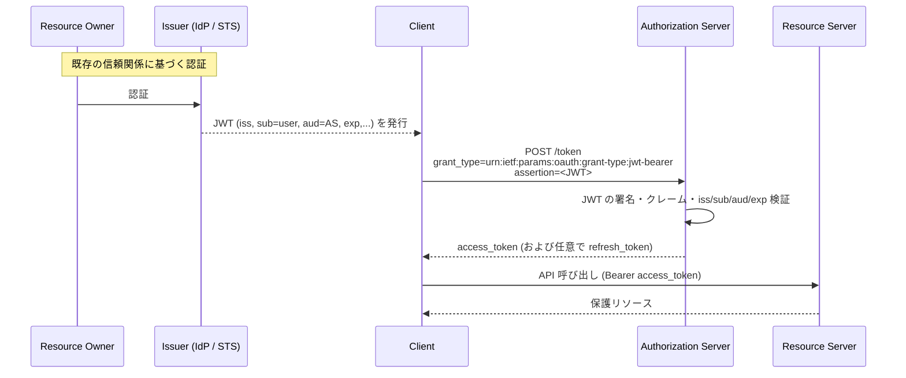
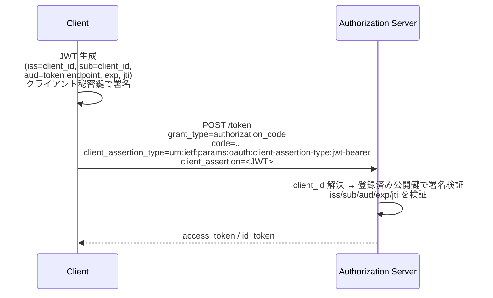

# RFC 7523 - JSON Web Token (JWT) Profile for OAuth 2.0 Client Authentication and Authorization Grants

## 1. 概要

RFC 7523 は、OAuth 2.0 において JSON Web Token (JWT) を「アサーション」として利用するためのプロファイルを定義する仕様である。汎用的なアサーションフレームワーク RFC 7521 を JWT 形式に具体化したもので、次の二つのユースケースを規定する。

- **Authorization Grant としての利用**: JWT を提示することで、認可サーバーからアクセストークンを取得する拡張グラントタイプ
- **Client Authentication としての利用**: トークンエンドポイント等におけるクライアント認証手段としての JWT (一般に `private_key_jwt` あるいは `client_secret_jwt` として知られる)

特に Client Authentication 用途は OpenID Connect Core や FAPI といった上位プロファイル、機密性の高いクライアント認証で広く採用されており、現代の OAuth/OIDC エコシステムの基盤的仕様として位置付けられる。

## 2. 解決する課題

RFC 6749 が定めるオリジナルのクライアント認証手段は `client_secret_basic` および `client_secret_post` の二つで、いずれも共有秘密 (client_secret) をネットワーク越しに送信する必要があった。これは以下の弱点を持つ。

- 共有秘密の漏えいリスクが高い (TLS 終端や中間プロキシ、ログへの混入)
- 認可サーバー側で秘密値を平文または可逆形式で保持しがちになる
- クライアントの保有を証明する非対称鍵 (公開鍵暗号) との親和性が低い

また、外部 IdP が発行したセキュリティトークンを既に保有する状況で、ユーザーのブラウザを介した認可コードフロー無しに直接アクセストークンを得たいケース (バックエンド連携、トークン交換的な用途) において、標準的な手段が欠けていた。

RFC 7523 は JWT という IETF 標準のセキュリティトークン形式を OAuth 2.0 に統合し、上記の課題を解決する。

## 3. 主要概念・用語

### 3.1 アサーション

RFC 7521 の用語を継承する。アサーションは発行者 (Issuer) が主体 (Subject) について発行する、対象者 (Audience) 向けの署名付きステートメントである。本仕様ではアサーション形式に JWT ([RFC 7519](./rfc7519.md)) を採用する。

### 3.2 二つのプロファイル URI

RFC 7523 は新規に二つの絶対 URI を IANA レジストリに登録する。

| 用途                  | パラメータ              | 値                                                       |
| --------------------- | ----------------------- | -------------------------------------------------------- |
| Authorization Grant   | `grant_type`            | `urn:ietf:params:oauth:grant-type:jwt-bearer`            |
| Client Authentication | `client_assertion_type` | `urn:ietf:params:oauth:client-assertion-type:jwt-bearer` |

両者は同じ JWT という形式を利用するが、論理的には独立であり、同一リクエスト内で併用することもできる (Authorization Grant の発行者と、クライアント認証の発行者が別エンティティであるケース等)。

### 3.3 JWT クレーム

RFC 7523 が JWT に対して要件を課すクレームは次の通り。

| クレーム | 必須 | 内容                                                                                                                                |
| -------- | ---- | ----------------------------------------------------------------------------------------------------------------------------------- |
| `iss`    | 必須 | JWT の発行者を一意に識別する文字列                                                                                                  |
| `sub`    | 必須 | JWT の主体。Authorization Grant ではリソースオーナーを、Client Authentication ではクライアント自身 (通常 `client_id` と一致) を示す |
| `aud`    | 必須 | JWT の対象者。認可サーバーを識別する値で、トークンエンドポイント URL が典型                                                         |
| `exp`    | 必須 | 有効期限 (NumericDate)。これを超えた JWT は拒否される                                                                               |
| `nbf`    | 任意 | 利用可能となる開始時刻                                                                                                              |
| `iat`    | 任意 | JWT の発行時刻                                                                                                                      |
| `jti`    | 任意 | JWT 一意識別子。リプレイ攻撃防止に利用する                                                                                          |

これに加え、ユースケース固有の追加クレームを含めても構わない。

## 4. プロトコルフロー / メカニズム

### 4.1 Authorization Grant としての利用

クライアントが既に外部 IdP やセキュリティトークンサービス (STS) から JWT を取得済みで、その JWT と引き換えに OAuth 2.0 アクセストークンを得るユースケース。



リクエスト例:

```http
POST /token HTTP/1.1
Host: as.example.com
Content-Type: application/x-www-form-urlencoded

grant_type=urn%3Aietf%3Aparams%3Aoauth%3Agrant-type%3Ajwt-bearer
&assertion=eyJhbGciOiJSUzI1NiIsImtpZCI6IjE2In0.eyJpc3MiOiJodHRwczovL2p3dC1pZHAuZXhhbXBsZS5jb20iLCJzdWIiOiJtYWlsdG86bWlrZUBleGFtcGxlLmNvbSIsImF1ZCI6Imh0dHBzOi8vYXMuZXhhbXBsZS5jb20vdG9rZW4iLCJleHAiOjEzMDA4MTkzODB9.SIGNATURE
&scope=read%20write
```

このフローではリソースオーナーがブラウザを介してクライアントと対話する必要がない。リソースオーナーと Issuer の間で既に確立済みの認証セッションや信頼関係を、認可サーバーが JWT 経由で受け取り、その上でアクセストークンを発行する。

### 4.2 Client Authentication としての利用

クライアントが自身を認証するために、自分自身を `iss` および `sub` とする JWT を生成し、`client_assertion` として送信する。



リクエスト例 (Authorization Code Grant と組み合わせる場合):

```http
POST /token HTTP/1.1
Host: as.example.com
Content-Type: application/x-www-form-urlencoded

grant_type=authorization_code
&code=n0esc3NRze7LTCu7iYzS6a5acc3f0ogp4
&client_assertion_type=urn%3Aietf%3Aparams%3Aoauth%3Aclient-assertion-type%3Ajwt-bearer
&client_assertion=eyJhbGciOiJSUzI1NiIsImtpZCI6IjIyIn0.eyJpc3MiOiJzNkJoZFJrcXQzIiwic3ViIjoiczZCaGRSa3F0MyIsImF1ZCI6Imh0dHBzOi8vYXMuZXhhbXBsZS5jb20vdG9rZW4iLCJqdGkiOiJiYWRjMGZmZWUiLCJleHAiOjEzMDA4MTkzODB9.SIGNATURE
```

ここで `iss` および `sub` はいずれもクライアント識別子 `s6BhdRkqt3` であり、`aud` は認可サーバーのトークンエンドポイント URL である。署名はクライアントが保持する秘密鍵で行い、認可サーバーは事前に登録された公開鍵 (あるいは共有秘密) で検証する。

## 5. 詳細解説

### 5.1 JWT の構築要件

RFC 7523 セクション 3 が定める JWT への共通要件は以下の通り。

1. `iss` クレームを必ず含めること
2. `sub` クレームを必ず含めること
3. 認可サーバーを識別する値を `aud` クレームに含めること。複数の値を指定してもよいが、認可サーバーは自分が含まれていることを検証しなければならない
4. `exp` クレームを必ず含めること。認可サーバーは現在時刻と比較して期限切れを拒否する
5. 任意で `nbf` / `iat` / `jti` を含められる
6. JWT は発行者の鍵によりデジタル署名されるか MAC が付与されなければならない。`alg=none` は許されない
7. 認可サーバーは無効な署名/MAC を持つ JWT を拒否しなければならない

### 5.2 Authorization Grant 固有の意味付け

- `iss`: JWT 発行者 (例: 外部 IdP)。認可サーバーは事前に信頼関係を確立した発行者からの JWT のみを受け入れる
- `sub`: 認可対象となるリソースオーナーを識別する値
- 認可サーバーは JWT に基づいてアクセストークンを発行するが、スコープ・有効期限・対象リソース等は認可サーバーのポリシーに従う
- 認可サーバーは Refresh Token を発行してもよいが、本仕様自体は推奨しない (RFC 7521 と同様、必要なら再度 JWT を提示すればよい設計)

### 5.3 Client Authentication 固有の意味付け

- `iss`: クライアント識別子 (`client_id`)
- `sub`: クライアント識別子 (通常 `iss` と同一値)
- `aud`: 認可サーバーのトークンエンドポイント URL を強く推奨。Issuer 識別子等を許容するかは認可サーバーの裁量
- `jti` の使用が**強く推奨**される。認可サーバーが `jti` を一定期間記録することで JWT のリプレイを防止できる

OpenID Connect Core では本プロファイルを基に、二つの具体的なクライアント認証方式が定義されている。

- `private_key_jwt`: クライアントの非対称秘密鍵で署名 (RS256, ES256 等)
- `client_secret_jwt`: クライアントシークレットを HMAC 鍵として MAC を付与 (HS256 等)

### 5.4 認可サーバーによる検証手順

認可サーバーは受信した JWT に対して、概ね次の順序で検証を行う。

```mermaid
flowchart TD
    A[JWT 受信] --> B{形式は妥当か}
    B -->|No| X[invalid_grant / invalid_client]
    B -->|Yes| C[iss を解決して公開鍵/秘密を取得]
    C --> D{署名/MAC 検証}
    D -->|失敗| X
    D -->|成功| E{iss/sub/aud は許容範囲か}
    E -->|No| X
    E -->|Yes| F{exp/nbf 範囲内か}
    F -->|No| X
    F -->|Yes| G{jti は未使用か (オプション)}
    G -->|重複| X
    G -->|OK| H[アクセストークン発行 / 認証成功]
```

### 5.5 鍵の入手

認可サーバーが JWT 検証用の鍵を入手する方法は本仕様の範囲外だが、典型的には次が用いられる。

- クライアント登録時 ([RFC 7591](./rfc7591.md) / [OIDC Dynamic Registration](./openid-connect-registration.md)) に `jwks` または `jwks_uri` で登録された公開鍵
- 認可サーバーの管理画面でクライアント管理者が登録した公開鍵
- OpenID Provider の `jwks_uri` 経由で公開された IdP 鍵 (Authorization Grant ケース)

### 5.6 アルゴリズム要件

RFC 7523 は RS256 を実装必須 (MUST implement) として規定する。それ以外のアルゴリズムの利用は当事者間の合意による。なお `alg=none` は明示的に禁止される。

## 6. セキュリティに関する考慮事項

### 6.1 リプレイ攻撃

JWT は Bearer 的に提示されるため、入手したアサーションをそのまま使い回されるリスクがある。緩和策として以下が挙げられる。

- `exp` を短く設定する (典型的には数十秒〜数分)
- `jti` を必須化し、認可サーバー側で `exp` までの期間ユニーク性を強制する
- 全通信を TLS で保護する

### 6.2 Audience の厳格な検証

`aud` の不適切な検証は致命的である。攻撃者が他の認可サーバー向けに発行された JWT を別の認可サーバーに使い回せてしまう。認可サーバーは「自身を識別する値」が `aud` に含まれていることを必ず確認しなければならない。

### 6.3 機密性

JWT には主体や属性等のセキュリティ情報が含まれる。盗聴・改ざんを防ぐため、TLS でチャネルを保護する。場合によっては JWT 自体を JWE で暗号化する (Nested JWT)。

### 6.4 共有秘密に依存しない選択

`private_key_jwt` を採用すると、認可サーバーはクライアントの秘密値を保有しないため、認可サーバー側のデータ漏えいによるクライアント認証情報の流出を防げる。FAPI などの高保証プロファイルでこの方式が要求される所以である。

### 6.5 アルゴリズム混乱攻撃

JWT 検証実装が `alg` ヘッダの値を信用しすぎると、対称鍵を非対称鍵として扱う等の脆弱性が生じうる ([RFC 7515](./rfc7515.md) のセキュリティ考慮事項参照)。認可サーバーはクライアントごとに許可するアルゴリズムを事前に固定するべきである。

## 7. エラーハンドリング

RFC 7523 に基づく検証失敗時、認可サーバーは RFC 6749 の標準エラーレスポンスを返す。

| 利用形態                         | エラーコード     |
| -------------------------------- | ---------------- |
| Authorization Grant の検証失敗   | `invalid_grant`  |
| Client Authentication の検証失敗 | `invalid_client` |

`error_description` および `error_uri` を併用して詳細を返してもよい。ただしセキュリティ上、内部情報を過度に開示しないよう注意する。

## 8. 関連仕様

- [RFC 7519 - JSON Web Token (JWT)](./rfc7519.md): 本仕様が利用するトークン形式
- [RFC 7515 - JSON Web Signature (JWS)](./rfc7515.md): JWT の署名形式
- [RFC 7516 - JSON Web Encryption (JWE)](./rfc7516.md): JWT を暗号化する場合の形式
- [RFC 6749 - The OAuth 2.0 Authorization Framework](./rfc6749.md): 拡張ポイント (Extension Grants / Client Authentication) を提供する基盤仕様
- RFC 7521 - Assertion Framework for OAuth 2.0: 本仕様の上位概念となる抽象フレームワーク
- RFC 7522 - SAML 2.0 Profile: SAML 版の同等プロファイル
- [OpenID Connect Core 1.0](./openid-connect-core.md): `private_key_jwt` / `client_secret_jwt` を具体的に定義する上位仕様
- [RFC 9101 - JWT-Secured Authorization Request (JAR)](./rfc9101.md) や [RFC 9126 - PAR](./rfc9126.md) も JWT を活用する関連仕様

## 9. 参考文献

- RFC 7523: <https://datatracker.ietf.org/doc/html/rfc7523>
- RFC 7521: <https://datatracker.ietf.org/doc/html/rfc7521>
- RFC 7519 (JWT): <https://datatracker.ietf.org/doc/html/rfc7519>
- RFC 6749 (OAuth 2.0): <https://datatracker.ietf.org/doc/html/rfc6749>
- OpenID Connect Core 1.0 Section 9 (Client Authentication): <https://openid.net/specs/openid-connect-core-1_0.html#ClientAuthentication>
