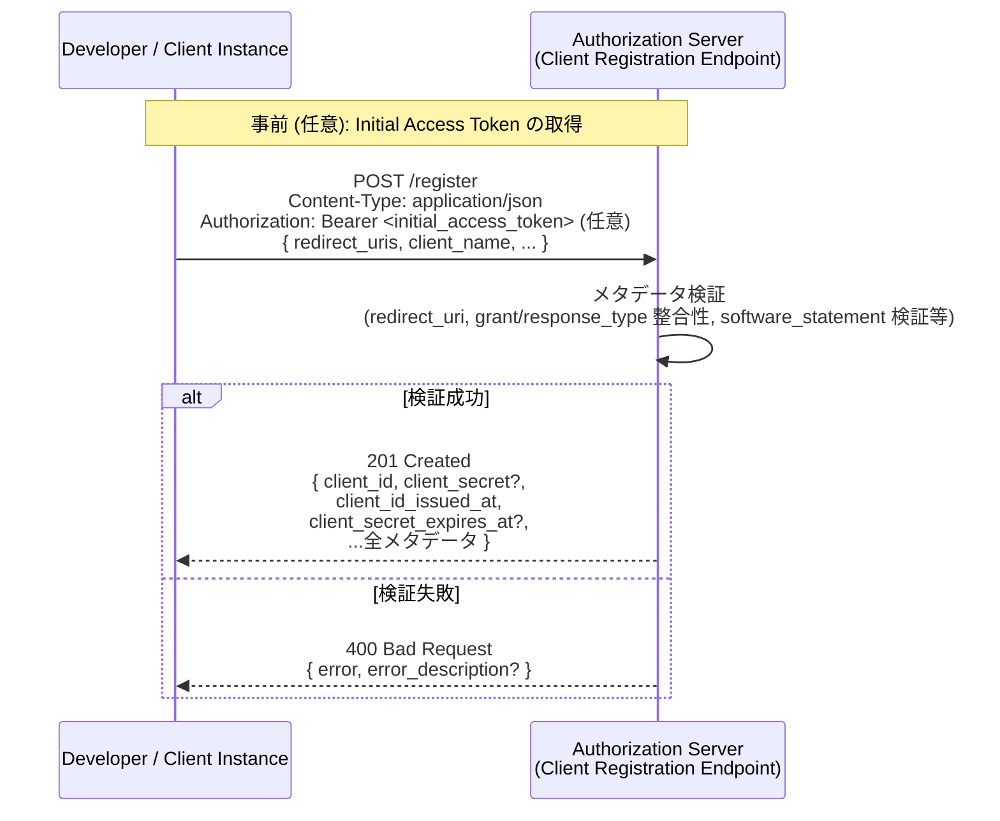
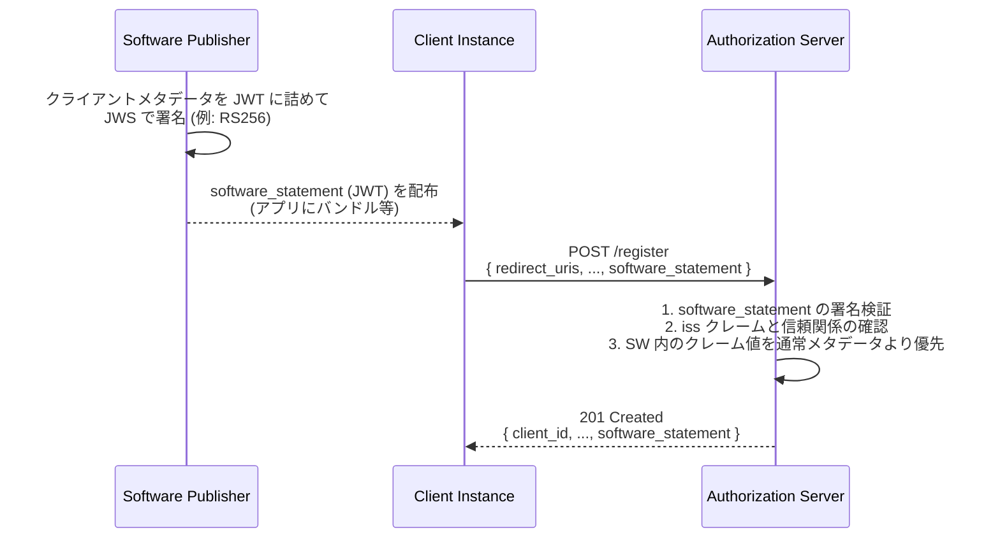

# RFC 7591 - OAuth 2.0 Dynamic Client Registration Protocol

## 1. 概要

RFC 7591 は、OAuth 2.0 クライアントが認可サーバーに対して動的に登録を行うためのプロトコルを定義する仕様である。従来、OAuth 2.0 のクライアントは事前に認可サーバーへ手動で登録 (out-of-band) される必要があったが、本仕様はそのプロセスを HTTP/JSON ベースの API として標準化する。

仕様の核心は次の三点にある。

- クライアントメタデータ (redirect_uris、grant_types、client_name など) を表現する JSON 形式の標準スキーマ
- それらを送受信するための Client Registration Endpoint と、そこに対する HTTP POST リクエスト/レスポンスのフォーマット
- ソフトウェアの素性を第三者が証明するための Software Statement (署名付き JWT) 形式

RFC 7591 は登録の「初回作成」のみを対象とし、登録後のクライアントの読み出し・更新・削除といった管理操作は姉妹仕様である [RFC 7592](https://datatracker.ietf.org/doc/html/rfc7592) で定義される。

## 2. 解決する課題

OAuth 2.0 ([RFC 6749](./rfc6749.md)) は「クライアントは事前に認可サーバーに登録されている」ことを前提としていたが、登録の手段については規定されておらず、各実装独自のポータルや手動手続きに委ねられていた。これは次のようなユースケースで深刻な障害となる。

- ネイティブアプリケーションのように多数のインスタンスが個別にクライアントとなる場合に、各インスタンスを事前登録するのが非現実的である
- OpenID Connect のフェデレーションにおいて、相互に未知の RP と OP がオンデマンドで接続する場合
- IoT デバイスや動的にデプロイされるサービスのように、出荷時点では特定の認可サーバーが定まっていない場合

RFC 7591 はこうしたシナリオで、クライアントが必要な瞬間に自身を識別する `client_id` を取得し、OAuth フローへ参加できる経路を提供する。

## 3. 主要概念・用語

### Client Registration Endpoint

クライアントが自身のメタデータを送信し、`client_id` の発行を受けるための OAuth 2.0 エンドポイント。認可サーバーのメタデータ ([RFC 8414](./rfc8414.md)) における `registration_endpoint` で示される。

### Client Metadata

登録対象クライアントの性質を記述する値の集合 (redirect_uris、token_endpoint_auth_method、client_name など)。リクエスト本文とレスポンス本文の両方で同じスキーマが用いられる。

### Initial Access Token

登録エンドポイントへのアクセスを制限したい認可サーバーが、開発者やデプロイ主体に事前発行する OAuth 2.0 アクセストークン。クライアントは Bearer Token として登録リクエストの `Authorization` ヘッダに付与する。仕様上は OPTIONAL であり、認可サーバーは未認証の登録リクエストを許容することも、Initial Access Token を必須とすることも、いずれも選択できる。

### Software Statement

クライアントソフトウェアに関するメタデータを、信頼できる発行者がアサートした署名付き JWT ([RFC 7519](./rfc7519.md))。JWS ([RFC 7515](./rfc7515.md)) で署名され、`iss` クレームで発行者を識別する。Software Statement を信頼する認可サーバーは、そこに含まれるクレーム値を通常のメタデータ値より優先しなければならない。

### Software ID と Software Version

- `software_id`: クライアントソフトウェア (ビルド一式) を一意に識別する不変の値。インスタンスではなく「ソフトウェア」を指す
- `software_version`: そのソフトウェアのバージョン文字列。リリースごとに変更される

これらは Software Statement に含めることが推奨されており、認可サーバーがソフトウェアごとの統計や挙動制御を行うために利用される。

## 4. プロトコルフロー

### 4.1 基本的な登録フロー



### 4.2 Software Statement を伴う登録フロー



## 5. 詳細解説

### 5.1 クライアントメタデータ

RFC 7591 §2 で定義される主なメタデータフィールドは次のとおり。すべて JSON のトップレベルメンバとして表現される。

| フィールド                         | 意味                                                                                                                                                |
| ---------------------------------- | --------------------------------------------------------------------------------------------------------------------------------------------------- |
| `redirect_uris`                    | 認可コードフロー等で利用するリダイレクト URI 配列                                                                                                   |
| `token_endpoint_auth_method`       | トークンエンドポイントでのクライアント認証方式 (`none` / `client_secret_basic` / `client_secret_post` / `client_secret_jwt` / `private_key_jwt` 等) |
| `grant_types`                      | クライアントが用いる grant type の配列 (`authorization_code`, `client_credentials`, `refresh_token` 等)                                             |
| `response_types`                   | 認可エンドポイントで用いる response_type 配列                                                                                                       |
| `client_name`                      | エンドユーザーに表示する人間可読なクライアント名                                                                                                    |
| `client_uri`                       | クライアントのホームページ URL                                                                                                                      |
| `logo_uri`                         | クライアントのロゴ URL                                                                                                                              |
| `scope`                            | スペース区切りで列挙された利用可能スコープ値                                                                                                        |
| `contacts`                         | 責任者のメールアドレス等の配列                                                                                                                      |
| `tos_uri` / `policy_uri`           | 利用規約 / プライバシーポリシー URL                                                                                                                 |
| `jwks_uri` / `jwks`                | クライアント公開鍵セットを示す URI、または値そのもの (両者は併用不可)                                                                               |
| `software_id` / `software_version` | ソフトウェア識別子 / バージョン                                                                                                                     |
| `software_statement`               | 上記メタデータを含む署名付き JWT                                                                                                                    |

`grant_types` と `response_types` の整合性 (例: `authorization_code` を使うなら `response_types` に `code` が必要) は認可サーバーが検証する。値が省略された場合のデフォルトは仕様の §2 に明示されており、`grant_types` は `["authorization_code"]`、`response_types` は `["code"]` となる。

### 5.2 登録リクエスト

クライアントは Client Registration Endpoint に対して HTTP POST を発行する。本文は `application/json`、Initial Access Token を用いる場合は `Authorization: Bearer` で付与する。

```http
POST /register HTTP/1.1
Host: server.example.com
Content-Type: application/json
Accept: application/json
Authorization: Bearer ey...        # 任意

{
  "redirect_uris": [
    "https://client.example.org/callback",
    "https://client.example.org/callback2"
  ],
  "client_name": "Example Client",
  "client_uri": "https://client.example.org/",
  "logo_uri": "https://client.example.org/logo.png",
  "token_endpoint_auth_method": "client_secret_basic",
  "scope": "read write",
  "grant_types": ["authorization_code", "refresh_token"],
  "response_types": ["code"],
  "contacts": ["ops@example.org"]
}
```

### 5.3 登録レスポンス

検証に成功した場合、認可サーバーは HTTP 201 で次の構造の JSON を返す。`Cache-Control: no-store` および `Pragma: no-cache` を併せて返すことが規定されている。

| レスポンスフィールド                                          | 意味                                                                             |
| ------------------------------------------------------------- | -------------------------------------------------------------------------------- |
| `client_id` (必須)                                            | 発行されたクライアント識別子                                                     |
| `client_secret` (任意)                                        | 機密クライアント向けのクライアントシークレット                                   |
| `client_id_issued_at` (任意)                                  | `client_id` 発行時刻 (UNIX 時刻、秒)                                             |
| `client_secret_expires_at` (`client_secret` がある場合は必須) | シークレット有効期限 (UNIX 時刻、秒)。`0` は無期限                               |
| 受理されたメタデータ                                          | リクエストで送信されたメタデータ。認可サーバーが値を補正・置換していることもある |

加えて、後述の RFC 7592 によるクライアント管理を許容する認可サーバーは、`registration_access_token` と `registration_client_uri` を返却することができる。これらは RFC 7592 が定義する値であり、登録後の読み出し・更新・削除に用いられる Bearer トークンと URI である。RFC 7591 自身は管理操作を範囲外としており、これらのフィールドは [RFC 7592](https://datatracker.ietf.org/doc/html/rfc7592) の規定に従って解釈される。

```http
HTTP/1.1 201 Created
Content-Type: application/json
Cache-Control: no-store
Pragma: no-cache

{
  "client_id": "s6BhdRkqt3",
  "client_secret": "cf136dc3c1...",
  "client_id_issued_at": 2893256800,
  "client_secret_expires_at": 2893265600,
  "redirect_uris": [
    "https://client.example.org/callback",
    "https://client.example.org/callback2"
  ],
  "client_name": "Example Client",
  "token_endpoint_auth_method": "client_secret_basic",
  "scope": "read write",
  "grant_types": ["authorization_code", "refresh_token"],
  "response_types": ["code"]
}
```

### 5.4 Software Statement の処理

Software Statement は、クライアントメタデータを表す JWT であり、署名 (JWS) が必須である。仕様は次の処理規則を規定している。

- `iss` クレームは必須
- `software_id` クレームを含めることが推奨される
- 署名アルゴリズムは RS256 を推奨
- 同じメタデータ名がリクエスト本文の JSON と Software Statement の両方に存在する場合、Software Statement が信頼されているなら **Software Statement の値が優先される**
- Software Statement から採用されたメタデータは、登録レスポンスにもトップレベルのメタデータ値として返さなければならない (値は要求値と異なる可能性がある)
- どの発行者の Software Statement を信頼するかは仕様の範囲外であり、認可サーバーのポリシーに委ねられる

これにより、たとえばアプリ配布元 (Software Publisher) がアプリ署名と同じ鍵で Software Statement に署名し、認可サーバーはその公開鍵を信頼することで「このバイナリは正規ビルドである」というレベルでクライアントを認識できる。

### 5.5 エラーレスポンス

登録失敗時は HTTP 400 で次の構造の JSON を返す。

```json
{
  "error": "invalid_redirect_uri",
  "error_description": "One or more redirect_uri values are invalid"
}
```

RFC 7591 が定義するエラーコードは次の 4 種類である。

| エラーコード                    | 意味                                                          |
| ------------------------------- | ------------------------------------------------------------- |
| `invalid_redirect_uri`          | redirect_uri の値が一つ以上不正                               |
| `invalid_client_metadata`       | クライアントメタデータの値が不正で受理できない                |
| `invalid_software_statement`    | Software Statement のフォーマットや署名が不正                 |
| `unapproved_software_statement` | Software Statement の発行者を当該認可サーバーが信頼していない |

## 6. セキュリティに関する考慮事項

RFC 7591 §5 で扱われる主要な考慮事項を以下に整理する。

### 6.1 通信路の保護

すべての登録通信は TLS で保護されなければならない。Initial Access Token や `client_secret` を含むレスポンス本文を、平文経路で送受信してはならない。

### 6.2 自己申告メタデータの取り扱い

`client_name`、`logo_uri`、`client_uri`、`policy_uri`、`tos_uri` といったエンドユーザー表示用のフィールドは、登録者の自己申告にすぎない。攻撃者が信頼ブランドを詐称した値を送り込み、同意画面で利用者を欺くリスクがあるため、認可サーバーは

- ドメイン所有権の確認 (例: `client_uri` のホストと `logo_uri` のホストの一致確認)
- 既知ブランド名との衝突検出
- 必要に応じて手動承認やレート制限の併用

を検討すべきである。

### 6.3 redirect_uri の検証

`redirect_uri` は OAuth セキュリティの最重要パラメータの一つであり、認可サーバーは次の検証を行うべきである。

- HTTPS スキームの強制 (一部の native client 用スキームや localhost を除く)
- ワイルドカードや過度に緩いパターンの禁止
- 開発用 URI が本番クライアントに混入していないか

### 6.4 Software Statement の信頼

Software Statement は「発行者が事実をアサートする」仕組みにすぎず、発行者の信頼度を超えて自動的にクライアントを信頼してよいものではない。発行者の公開鍵管理 (鍵の失効、鍵ローテーション) が破綻すると Software Statement 全体の信頼が崩れる。

### 6.5 オープン登録のリスク

Initial Access Token を要求せずに誰でも登録可能とする運用 (オープン登録) では、攻撃者によるクライアントの大量登録、ブランドなりすまし、登録エンドポイントへの DoS などが起こりうる。レート制限、CAPTCHA、登録後のクライアント数上限、検証付き登録モードへのフォールバックといった対策が望ましい。

### 6.6 client_secret の一意性

`client_secret` を発行する場合、`client_id` ごとに一意でなければならない。複数インスタンスが同じシークレットを共有する設計はそもそも動的登録の利点を損なう。

## 7. 関連仕様

- [RFC 6749 - The OAuth 2.0 Authorization Framework](./rfc6749.md): 本仕様の基盤となる OAuth 2.0 本体
- [RFC 7592 - OAuth 2.0 Dynamic Client Registration Management Protocol](https://datatracker.ietf.org/doc/html/rfc7592): 登録後のクライアントを読み出し・更新・削除するための姉妹仕様 (`registration_access_token` / `registration_client_uri` を定義)
- [RFC 8414 - OAuth 2.0 Authorization Server Metadata](./rfc8414.md): `registration_endpoint` を含む AS メタデータ
- [RFC 7519 - JSON Web Token](./rfc7519.md): Software Statement の基盤となる JWT
- [RFC 7515 - JSON Web Signature](./rfc7515.md): Software Statement の署名形式
- [OpenID Connect Dynamic Client Registration 1.0](https://openid.net/specs/openid-connect-registration-1_0.html): OIDC 向けに RFC 7591 を拡張し、`application_type`、`sector_identifier_uri`、`id_token_signed_response_alg` などの OIDC 固有メタデータを追加した仕様

## 8. 参考文献

- [RFC 7591: OAuth 2.0 Dynamic Client Registration Protocol](https://datatracker.ietf.org/doc/html/rfc7591)
- [RFC 7592: OAuth 2.0 Dynamic Client Registration Management Protocol](https://datatracker.ietf.org/doc/html/rfc7592)
- [RFC 6749: The OAuth 2.0 Authorization Framework](https://datatracker.ietf.org/doc/html/rfc6749)
- [RFC 8414: OAuth 2.0 Authorization Server Metadata](https://datatracker.ietf.org/doc/html/rfc8414)
- [OpenID Connect Dynamic Client Registration 1.0](https://openid.net/specs/openid-connect-registration-1_0.html)
