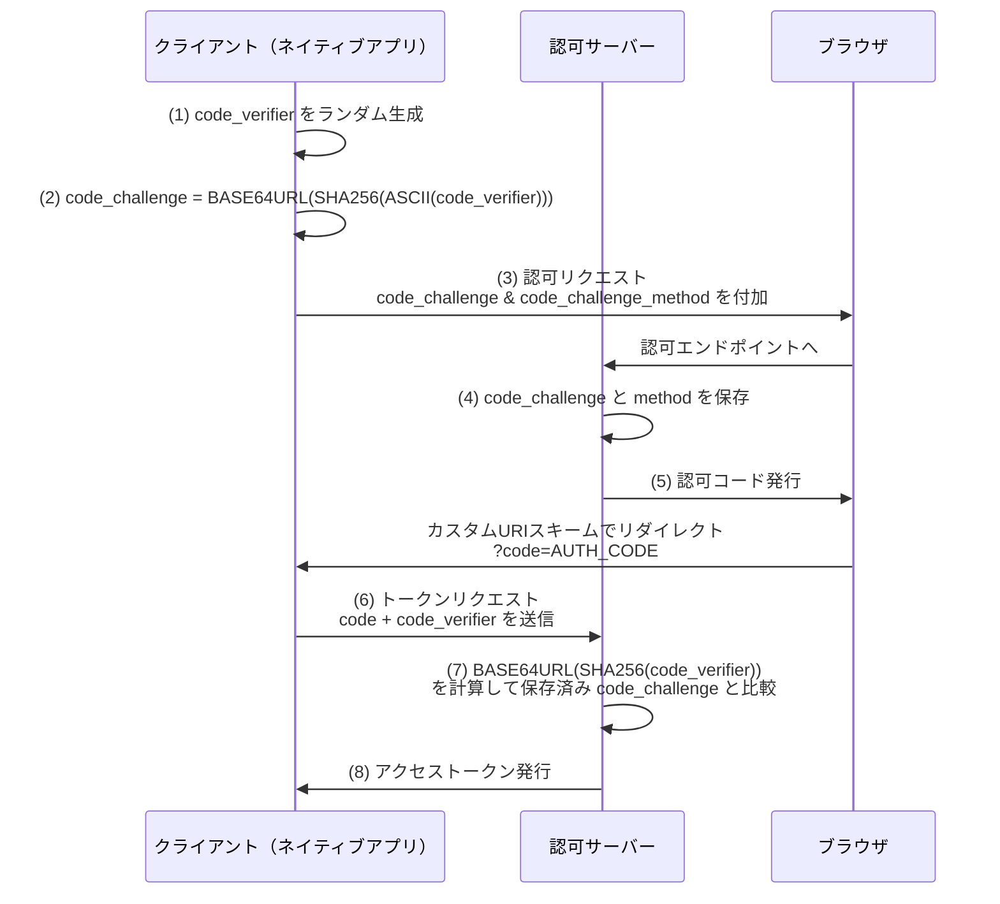

# RFC 7636 - Proof Key for Code Exchange by OAuth Public Clients (PKCE)

## 概要

RFC 7636は、2015年9月にIETFが策定したOAuth 2.0のセキュリティ拡張仕様である。PKCE（Proof Key for Code Exchange、「ピクシー」と読む）と呼ばれるこの拡張は、認可コードフローを利用するパブリッククライアント（主にネイティブアプリ）を認可コード横取り攻撃から保護する。

OAuth 2.0のRFC 6749では、認可コードフローにおけるパブリッククライアントのセキュリティは十分に考慮されていなかった。PKCEはこのギャップを埋め、現在ではネイティブアプリだけでなく、SPAを含むすべてのOAuthクライアントに対して推奨されるセキュリティ強化策となっている。

## 解決する課題

### 認可コード横取り攻撃（Authorization Code Interception Attack）

ネイティブアプリは認可サーバーからのリダイレクトを受け取るために、カスタムURIスキーム（例: `myapp://callback`）を登録することが多い。しかし、OSはこのカスタムURIスキームを複数のアプリが同時に登録することを許可している場合があり、悪意のあるアプリが正規アプリになりすまして認可コードを横取りできてしまう。

```
認可サーバー
    │
    │ リダイレクト (myapp://callback?code=XXX)
    ▼
OS のURIスキーム解決
    ├──▶ 正規アプリ（本来の受け取り先）
    └──▶ 悪意あるアプリ（認可コードを横取り！）
```

パブリッククライアントはクライアントシークレットを安全に保持できないため、横取りされた認可コードを使ってトークンエンドポイントへのリクエストを偽装されてしまう。

PKCEはこの問題を、認可リクエストとトークンリクエストを暗号学的に結びつけることで解決する。

## 主要概念・用語

### Code Verifier（コードベリファイア）

トークンリクエスト時に送信する秘密のランダム文字列。以下の条件を満たす必要がある。

- 文字セット: `[A-Z] / [a-z] / [0-9] / "-" / "." / "_" / "~"`（URLセーフな非予約文字）
- 長さ: 43〜128文字
- エントロピー: 最低256ビット（推奨: 32オクテットのランダムバイト列をbase64urlエンコード）

### Code Challenge（コードチャレンジ）

コードベリファイアから生成される変換値。認可リクエスト時に送信する。コードベリファイア本体は送信しないため、認可リクエストが傍受されても安全が保たれる。

### Code Challenge Method（変換メソッド）

コードベリファイアからコードチャレンジを生成する方法。2種類が定義されている。

| メソッド | 変換式                                    | 推奨                               |
| -------- | ----------------------------------------- | ---------------------------------- |
| `S256`   | `BASE64URL(SHA256(ASCII(code_verifier)))` | 推奨（必須実装）                   |
| `plain`  | `code_challenge = code_verifier`          | 非推奨（技術的制約がある場合のみ） |

`plain`は認可リクエストの傍受に対する保護を提供しないため、`S256`を使用できる場合は必ず`S256`を使う。

## プロトコルフロー

PKCEはOAuth 2.0の認可コードフロー（RFC 6749）に対するオーバーレイとして動作する。



### 各ステップの詳細

**ステップ1〜2: クライアントによる事前準備**

クライアントは認可リクエスト前に、暗号学的にランダムな`code_verifier`を生成し、そこから`code_challenge`を計算する。

```
# code_verifier 生成例（Pythonイメージ）
code_verifier = base64url(os.urandom(32))

# code_challenge 生成（S256メソッド）
code_challenge = base64url(sha256(code_verifier.encode('ascii')))
```

**ステップ3〜4: 認可リクエスト**

`code_challenge`と`code_challenge_method`を認可リクエストに付加して送信する。認可サーバーはこれらを認可コードに紐づけて保存する。

**ステップ5〜6: トークンリクエスト**

認可コードを受け取ったクライアントは、元の`code_verifier`をトークンリクエストに含めて送信する。

**ステップ7〜8: サーバーによる検証**

認可サーバーは受信した`code_verifier`から`code_challenge`を再計算し、保存済みの値と一致するか検証する。一致した場合のみトークンを発行する。

悪意あるアプリが認可コードを横取りしても、`code_verifier`を知らないため、トークンリクエストを成功させることができない。

## 詳細解説

### 認可リクエストのパラメータ

| パラメータ              | 必須/任意          | 説明                                      |
| ----------------------- | ------------------ | ----------------------------------------- |
| `code_challenge`        | 必須（PKCE使用時） | コードチャレンジ値（43〜128文字）         |
| `code_challenge_method` | 任意               | 変換メソッド。省略時は`plain`がデフォルト |

認可リクエスト例:

```
GET /authorize?
  response_type=code
  &client_id=s6BhdRkqt3
  &state=xyz
  &redirect_uri=https%3A%2F%2Fclient.example.com%2Fcb
  &code_challenge=E9Melhoa2OwvFrEMTJguCHaoeK1t8URWbuGJSstw-cM
  &code_challenge_method=S256
```

### トークンリクエストのパラメータ

| パラメータ      | 必須/任意          | 説明                                         |
| --------------- | ------------------ | -------------------------------------------- |
| `code_verifier` | 必須（PKCE使用時） | 認可リクエスト時に生成したコードベリファイア |

トークンリクエスト例:

```
POST /token
Content-Type: application/x-www-form-urlencoded

grant_type=authorization_code
&code=SplxlOBeZQQYbYS6WxSbIA
&redirect_uri=https%3A%2F%2Fclient.example.com%2Fcb
&client_id=s6BhdRkqt3
&code_verifier=dBjftJeZ4CVP-mB92K27uhbUJU1p1r_wW1gFWFOEjXk
```

### サーバー側の検証ロジック

```
# S256メソッドの場合
if BASE64URL(SHA256(ASCII(code_verifier))) == stored_code_challenge:
    issue_token()
else:
    return_error("invalid_grant")

# plainメソッドの場合
if code_verifier == stored_code_challenge:
    issue_token()
else:
    return_error("invalid_grant")
```

### 後方互換性

PKCEはPKCE非対応サーバーとの後方互換性を保つよう設計されている。PKCE非対応サーバーはPKCEパラメータを単に無視するため、既存のOAuth 2.0フローとの互換性が維持される。

ただし、実際のセキュリティ強化はPKCE対応サーバーとの通信においてのみ実現される。

## セキュリティに関する考慮事項

### エントロピー要件

`code_verifier`は最低256ビットのエントロピーを持つ必要がある。推奨実装:

```
32オクテット（256ビット）のCSPRNG出力をbase64urlエンコード
→ 43文字の code_verifier が生成される
```

エントロピーが不十分な場合、ブルートフォース攻撃による`code_verifier`の推定が可能になる。

### ダウングレード攻撃の防止

クライアントは`S256`メソッドを試みた後、`plain`にダウングレードしてはならない（MUST NOT）。この規則は、攻撃者が`S256`失敗を引き起こすことで`plain`フォールバックを強制する中間者攻撃を防ぐ。

### ソルティングを採用しない理由

`code_challenge`の生成にソルトを加えないのは意図的な設計判断である。`code_verifier`自体が十分なエントロピーを持つため、ソルティングはブルートフォース耐性の向上に寄与しない。

### TLSとの補完関係

PKCEはTLS（BCP 195）の代替ではなく補完として機能する。すべての通信はHTTPS上で行われる必要がある。PKCEはTLSが提供しないアプリ間の横取り攻撃に対する追加保護を提供する。

### 認可サーバーの実装要件

RFC 7636では認可サーバーに以下を推奨している:

- PKCEをサポートするクライアントからのリクエストには`code_challenge`を要求する
- パブリッククライアントからのリクエストに対しては`code_challenge`を必須とすることを検討する

## 関連仕様

| 仕様                       | 関連性                                                                             |
| -------------------------- | ---------------------------------------------------------------------------------- |
| [RFC 6749](/specs/rfc6749) | OAuth 2.0 Authorization Framework（PKCEが拡張する基盤）                            |
| [RFC 6750](/specs/rfc6750) | OAuth 2.0 Bearer Token Usage（アクセストークンの使用方法）                         |
| RFC 8252                   | OAuth 2.0 for Native Apps（ネイティブアプリのOAuthガイドライン、PKCEの使用を要求） |
| RFC 9126                   | OAuth 2.0 Pushed Authorization Requests（認可リクエストのセキュリティ強化）        |
| RFC 9700                   | Best Current Practice for OAuth 2.0 Security（PKCEをすべてのクライアントに推奨）   |

## 参考文献

- [RFC 7636 原文](https://www.rfc-editor.org/rfc/rfc7636) - IETF RFC Editor
