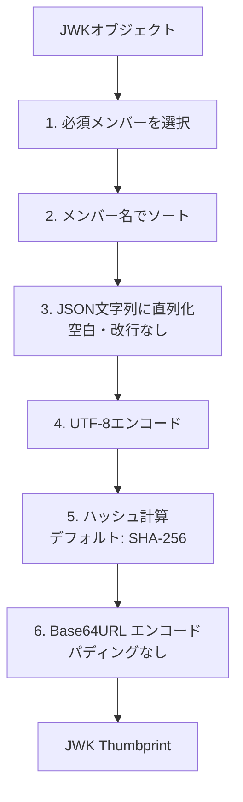
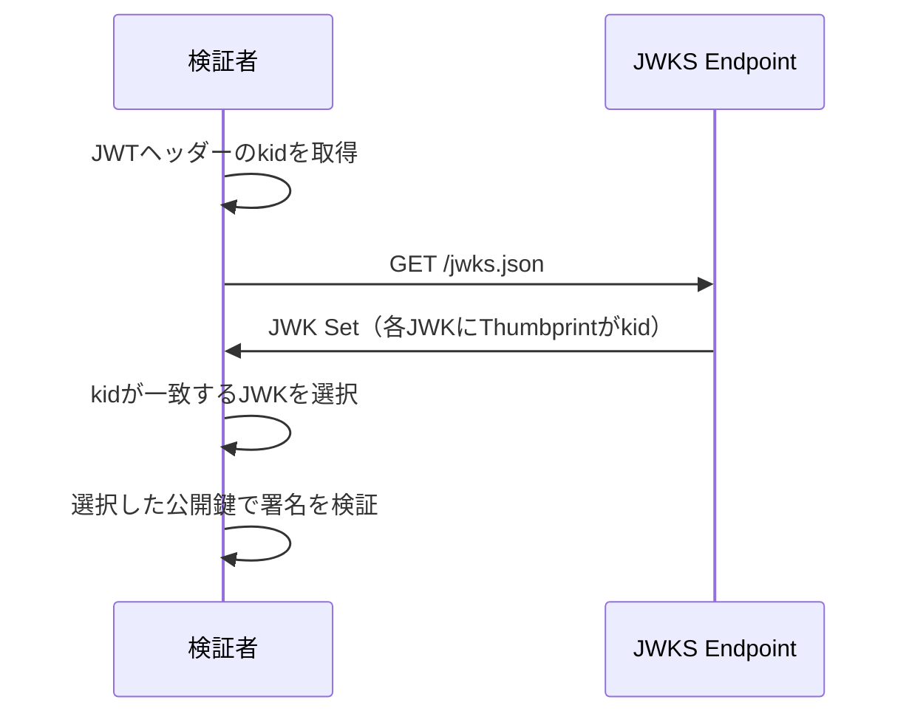

# RFC 7638 - JSON Web Key (JWK) Thumbprint

## 概要

RFC 7638は、**JSON Web Key（JWK）Thumbprint** を定義する標準仕様である。JWK Thumbprintは暗号鍵を一意に識別するための短い識別子（フィンガープリント）であり、JWKオブジェクトから決定論的に算出される。

主な用途：

- JWKの`kid`（Key ID）パラメータとして使用し、鍵を一意に識別する
- 署名や証明書において鍵への参照として使用する
- 鍵の同一性確認（2つのJWKが同じ鍵を表しているかの確認）

## 解決する課題

JWK（RFC 7517）では`kid`パラメータで鍵を識別できるが、`kid`の値は任意文字列であり、以下の問題があった：

- **一意性の保証がない**: 複数のシステム間で`kid`が衝突する可能性がある
- **命名規則の標準がない**: 実装ごとに異なる命名規則が使われ、相互運用性が低い
- **鍵内容との連動がない**: `kid`を見ても鍵の内容を検証できない

JWK ThumbprintはJWKの内容から決定論的に算出されるため、同じ鍵には常に同じThumbprintが得られ、これを`kid`として使用することで上記の問題を解決する。

## 算出アルゴリズム

JWK Thumbprintの算出手順はSection 3で定義されている：



### ステップ詳細

**ステップ1: 必須メンバーの選択**

鍵タイプ（`kty`）ごとに、Thumbprint計算に含める必須メンバーが定義されている：

| kty   | 必須メンバー（ソート順） |
| ----- | ------------------------ |
| `RSA` | `e`, `kty`, `n`          |
| `EC`  | `crv`, `kty`, `x`, `y`   |
| `oct` | `k`, `kty`               |

`kid`、`use`、`alg`等のメタデータパラメータは含めない。

**ステップ2–3: ソートとJSON直列化**

メンバー名のUnicodeコードポイント昇順でソートし、空白・改行を含まないJSONに直列化する。

**RSAの例:**

```json
{
  "e": "AQAB",
  "kty": "RSA",
  "n": "0vx7agoebGcQSuuPiLJXZptN9nndrQmbXEps2aiAFbWhM78LhWx4cbbfAAtVT86zwu1RK7aPFFxuhDR1L6tSoc_BJECPebWKRXjBZCiFV4n3oknjhMstn64tZ_2W-5JsGY4Hc5n9yBXArwl93lqt7_RN5w6Cf0h4QyQ5v-65YGjQR0_FDW2QvzqY368QQMicAtaSqzs8KJZgnYb9c7d0zgdAZHzu6qMQvRL5hajrn1n91CbOpbISD08qNLyrdkt-bFTWhAI4vMQFh6WeZu0fM4lFd2NcRwr3XPksINHaQ-G_xBniIqbw0Ls1jF44-csFCur-kEgU8awapJzKnqDKgw"
}
```

**ステップ4–6: ハッシュとBase64URL**

上記JSON文字列のUTF-8バイト列にSHA-256を適用し、結果をBase64URLエンコードする。

```
SHA-256(UTF8(JSON)) → Base64URL → Thumbprint
```

上記RSAの例のThumbprintは: `NzbLsXh8uDCcd-6MNwXF4W_7noWXFZAfHkxZsRGC9Xs`

## 実装例

### RSA鍵のThumbprint計算

```python
import json
import hashlib
import base64

def jwk_thumbprint(jwk: dict) -> str:
    # ktyごとに必須メンバーを定義
    required_members = {
        "RSA": ["e", "kty", "n"],
        "EC": ["crv", "kty", "x", "y"],
        "oct": ["k", "kty"],
    }

    kty = jwk["kty"]
    members = required_members[kty]

    # 必須メンバーのみを選択してソート済みJSON直列化
    normalized = {k: jwk[k] for k in sorted(members)}
    json_str = json.dumps(normalized, separators=(",", ":"), sort_keys=True)

    # SHA-256ハッシュを計算
    digest = hashlib.sha256(json_str.encode("utf-8")).digest()

    # Base64URLエンコード（パディングなし）
    return base64.urlsafe_b64encode(digest).rstrip(b"=").decode("ascii")
```

## Thumbprintをkidとして使用する

RFC 7638では、JWK ThumbprintをJWKの`kid`値として使用することを推奨している。

```json
{
  "kty": "RSA",
  "n": "0vx7agoebGcQSuuPiLJXZptN9...",
  "e": "AQAB",
  "kid": "NzbLsXh8uDCcd-6MNwXF4W_7noWXFZAfHkxZsRGC9Xs",
  "use": "sig",
  "alg": "RS256"
}
```

### JWS・JWEでの鍵参照

JWSヘッダーの`kid`とJWK Setの各JWKの`kid`（Thumbprint）を照合することで、署名・暗号化に使用した鍵を一意に特定できる：



## RFC 9278との関係

RFC 7638を基盤とする**RFC 9278（JWK Thumbprint URI）** が定義されている。RFC 9278はJWK ThumbprintをURI形式で表現する方法を規定する：

```
urn:ietf:params:oauth:jwk-thumbprint:sha-256:NzbLsXh8uDCcd-6MNwXF4W_7noWXFZAfHkxZsRGC9Xs
```

このURI形式により、異なるハッシュアルゴリズムを使用したThumbprintを明確に区別できる。

## セキュリティに関する考慮事項

### ハッシュアルゴリズムの選択

RFC 7638ではSHA-256がデフォルトだが、アプリケーション要件に応じてSHA-384やSHA-512も使用できる。MD5やSHA-1は衝突耐性の問題があるため使用しないこと。

### Thumbprintの衝突耐性

SHA-256の出力は256ビットであり、現実的な衝突攻撃は不可能である。ただし、理論上は異なる鍵が同じThumbprintを生成する可能性があるため、Thumbprintのみによる認証（鍵内容の検証を省略）は行わないこと。

### 秘密鍵パラメータの除外

Thumbprintの計算には公開鍵パラメータのみを使用する（RSAの`d`、ECの`d`等は含めない）。これにより、秘密鍵を持たない検証者も同じThumbprintを算出でき、公開の鍵識別子として安全に使用できる。

### 対称鍵Thumbprintの情報漏洩

対称鍵（`oct`）のThumbprintは鍵の内容から算出されるため、Thumbprintを公開することで鍵の推測攻撃に利用される可能性がある。対称鍵のThumbprintは非公開情報として扱い、公開の鍵識別子として使用しないこと。

### `kid`の一致確認

JWS・JWEの処理において、`kid`が一致したJWKが実際に正しい鍵であることをThumbprintの再計算で確認することが望ましい。`kid`の偽造・置換攻撃への対策となる。

## 関連仕様

- **[RFC 7515](/specs/rfc7515)** - JSON Web Signature (JWS)
- **[RFC 7517](/specs/rfc7517)** - JSON Web Key (JWK)
- **[RFC 7518](/specs/rfc7518)** - JSON Web Algorithms (JWA)
- **[RFC 7519](/specs/rfc7519)** - JSON Web Token (JWT)

## 参考文献

- [RFC 7638 - JSON Web Key (JWK) Thumbprint](https://www.rfc-editor.org/rfc/rfc7638) - IETF RFC原文
- [RFC 9278 - JWK Thumbprint URI](https://www.rfc-editor.org/rfc/rfc9278) - URI形式のThumbprint
