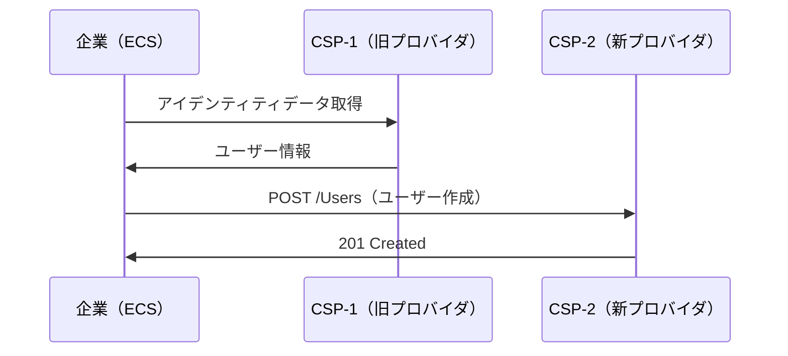
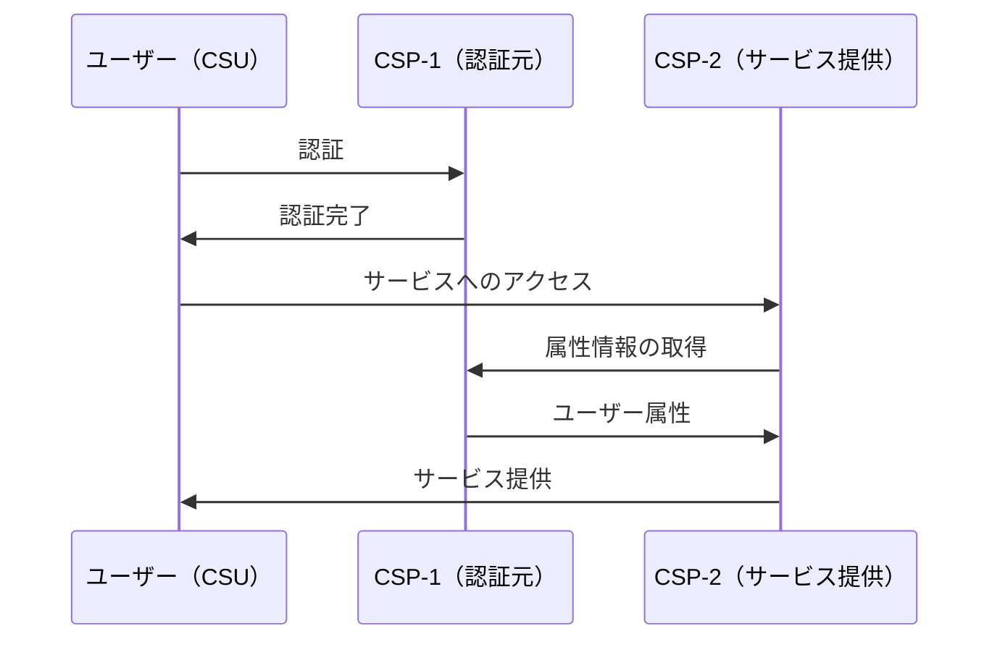
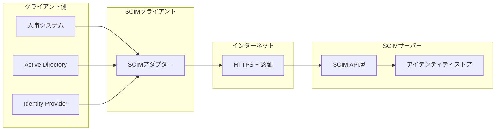
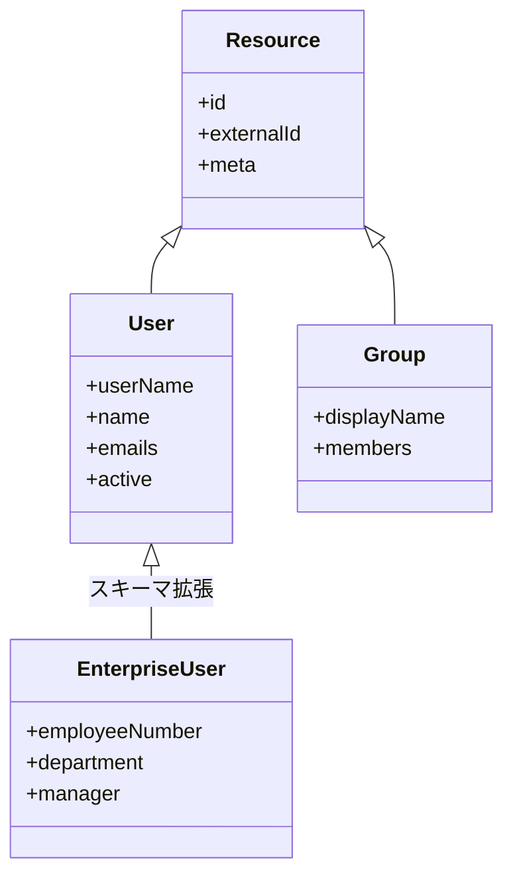
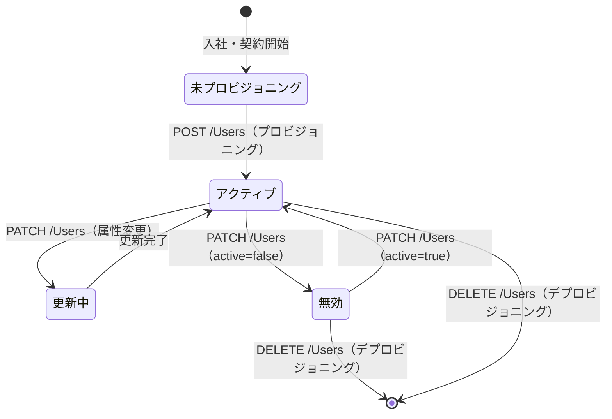

# RFC 7642 - System for Cross-domain Identity Management: Definitions, Overview, Concepts, and Requirements

## 概要

RFC 7642 は、SCIM（System for Cross-domain Identity Management）の概念・用語定義・ユースケース・要件を定める仕様である。2015年9月に IETF によって Informational RFC として発行された。

SCIM はクラウドサービス間でユーザーやグループなどのアイデンティティ情報を効率的にプロビジョニング・管理するためのプロトコル群であり、RFC 7642・RFC 7643・RFC 7644 の三仕様で構成される。RFC 7642 はその入口として、SCIM が解決しようとする問題、ユースケース、設計原則、主要概念の定義を体系化する。実際のデータモデルは RFC 7643、HTTP プロトコルは RFC 7644 で定義される。

## 解決する課題

### クラウド時代のアイデンティティプロビジョニング問題

企業が複数の SaaS アプリケーションを利用する場面では、各サービスに対してユーザーアカウントを個別に作成・管理しなければならない。このとき以下のような問題が生じる。

- **プロビジョニングの断片化**: 各 SaaS がそれぞれ固有のユーザー管理 API を持ち、統合コストが高い
- **デプロビジョニングの遅延**: 退職者のアカウントを各サービスから手動削除する必要があり、削除漏れが発生する
- **属性の不整合**: サービスをまたいだユーザー属性（メールアドレス、部署名等）の一元更新が困難

SCIM はアイデンティティ情報の共通スキーマと RESTful な操作 API を標準化することで、上記問題を解決する。

### SCIM 以前の状況

SCIM の前身となる仕様として、Service Provisioning Markup Language（SPML）が存在した。しかし SPML は XML ベースで複雑であり、実装間の相互運用性が低いという問題があった。SCIM は JSON・REST を採用し、実装の容易さと相互運用性を重視する設計に転換した。

## 主要概念・用語定義

RFC 7642 は SCIM に関連する用語を以下のように定義する。

| 用語                                     | 定義                                                                                                                   |
| ---------------------------------------- | ---------------------------------------------------------------------------------------------------------------------- |
| **SCIM サービスプロバイダ**              | SCIM プロトコルのサーバー側を実装し、アイデンティティリソースを管理するエンティティ（SaaS アプリ、クラウドサービス等） |
| **SCIM クライアント**                    | SCIM プロトコルを使って SCIM サービスプロバイダを操作するエンティティ（IdP、ディレクトリサービス、HR システム等）      |
| **リソース（Resource）**                 | SCIM で管理されるオブジェクトの総称。User・Group がコアで定義される                                                    |
| **アイデンティティ（Identity）**         | ユーザーに関連する属性・識別子の集合                                                                                   |
| **プロビジョニング（Provisioning）**     | アイデンティティ情報を対象システムに作成・設定する行為                                                                 |
| **デプロビジョニング（Deprovisioning）** | 対象システムからアイデンティティ情報を削除・無効化する行為                                                             |
| **Just-in-time プロビジョニング**        | ユーザーが初めてサービスにアクセスした時点でプロビジョニングを実行する方式                                             |
| **エンタープライズユーザー**             | 企業や組織に属するユーザー。組織固有の拡張属性（社員番号、コストセンター等）を持つ                                     |
| **アイデンティティプロバイダ（IdP）**    | ユーザーのアイデンティティを管理・認証し、他サービスへプロビジョニングする主体                                         |
| **テナント（Tenant）**                   | クラウドサービスにおけるマルチテナント環境の1組織                                                                      |
| **フェデレーション（Federation）**       | 複数の組織・システム間でアイデンティティを信頼関係に基づいて共有する仕組み                                             |
| **CSP（Cloud Service Provider）**        | クラウドサービスを運営するエンティティ。SCIM プロトコルのサーバー側実装者                                              |
| **ECS（Enterprise Cloud Subscriber）**   | 関連するアイデンティティレコードの中間集約者。企業・組織に相当する                                                     |
| **CSU（Cloud Service User）**            | 実際のクラウドサービスエンドユーザー                                                                                   |
| **トリガー（Trigger）**                  | SCIM フローを開始するイベント。Create・Update・Delete・SSO の各操作が対象                                              |
| **Push / Pull モード**                   | クライアントがサーバーへ変更を送信する Push 型と、サーバー側の変更をクライアントが取得する Pull 型のデータフロー       |

## ユースケース

RFC 7642 は SCIM が想定する代表的なユースケースをセクション 3 で 5 件列挙している。

### ユースケース 1: アイデンティティの移行（Migration of Identities）

CSP 間でアイデンティティ情報を移行するシナリオ。フォーマット変換なしにユーザー情報を移動できることが要件となる。アイデンティティ情報の共通標準、規制要件への準拠、セキュアな監査ログが必要とされる。

### ユースケース 2: シングルサインオン（SSO）サービス（Single Sign-On Service）

ユーザー（CSU）が一方の CSP で認証し、別の CSP のサービスにアクセスするシナリオ。CSP 間のフェデレーションが必要であり、属性の安全な転送と調整された監査ログが求められる。

### ユースケース 3: コミュニティ向けプロビジョニング（Provisioning for Community of Interest）

組織が HR サービスをグローバルオフィスに分散させるシナリオ。パブリッククラウドとプライベートクラウドを組み合わせた環境で、技術的・規制的な境界を越えたタイムリーなプロビジョニングが必要とされる。プライバシー保護と包括的な監査証跡も要件に含まれる。

### ユースケース 4: リライングパーティへの属性転送（Transfer of Attributes to Relying Party）

ユーザーが自身のプライマリディレクトリからリライングパーティのウェブサイトへ属性を転送することを許可するシナリオ。リライングパーティの認証、安全な情報転送、管轄域間のコンプライアンス、キャッシュ済み属性の変更通知が要件となる。

### ユースケース 5: 変更通知（Change Notification）

ディレクトリサービスがユーザー属性の変更をリライングパーティに通知するシナリオ。データセット全体をプッシュするのではなく、変更の選択的な取得をサポートし、転送と通知の両方についてユーザーの認可を必要とする。

## SCIM アーキテクチャ

### 全体像

SCIM は HTTP ベースの REST API として設計されており、クライアント・サーバーモデルに従う。

### 三仕様の役割分担

| 仕様                   | 役割                                               |
| ---------------------- | -------------------------------------------------- |
| **RFC 7642**（本仕様） | ユースケース・用語定義・要件・設計原則             |
| **RFC 7643**           | データモデル（User・Group のスキーマ定義）         |
| **RFC 7644**           | HTTP プロトコル（CRUD 操作・フィルタ・バルク操作） |

### データモデルの概要

SCIM のリソースモデルは、共通属性を持つベースリソースを基盤とし、User・Group がそれを継承する構造を持つ。さらにスキーマ拡張によって組織固有の属性を追加できる。

## 設計原則

RFC 7642 は SCIM の設計に際して以下の原則を定めている。

### 既存標準の活用

SCIM は新たなプロトコルを一から設計するのではなく、広く普及した既存標準を活用する：

- **HTTP/REST**: リソース操作のベースプロトコル
- **JSON**: データフォーマット
- **OAuth 2.0**: 認可フレームワーク
- **TLS**: 通信の暗号化

### シンプルさと拡張性の両立

コアスキーマは User と Group のみに絞り込み、シンプルに保つ。一方で、スキーマ拡張の仕組みにより任意の属性を追加できる拡張性を確保する。

### プル型とプッシュ型

SCIM は主にプッシュ型（クライアントがサーバーへ変更を送信）で動作する。クライアントがサーバー側の変更をポーリングするプル型のモデルは、SCIM の主要スコープ外であるが、フィルタリングと `meta.lastModified` を用いた差分取得は可能である。

### 可搬性（Portability）

ユーザーデータを特定サービスの独自形式に依存させず、共通スキーマで表現することで、サービス間でのアイデンティティデータの移行を容易にする。

## 要件

RFC 7642 の各ユースケース（セクション 3）には実装が満たすべき要件が列挙されており、具体的なプロトコル要件は後継仕様（RFC 7643・RFC 7644）で規定される。代表的な要件を以下に整理する。

### プロトコル要件

| 要件         | 内容                                                                               |
| ------------ | ---------------------------------------------------------------------------------- |
| HTTP ベース  | SCIM は HTTP 上で動作しなければならない（MUST）                                    |
| JSON         | データ表現には JSON を使用しなければならない（MUST）                               |
| TLS          | すべての通信は TLS によって保護しなければならない（MUST）                          |
| CRUD         | ユーザー・グループの作成・読み取り・更新・削除をサポートしなければならない（MUST） |
| 認証         | クライアントは認証されなければならない（MUST）                                     |
| ディスカバリ | サービスプロバイダはサポート機能を公開しなければならない（MUST）                   |

### スキーマ要件

| 要件           | 内容                                                     |
| -------------- | -------------------------------------------------------- |
| 共通属性       | すべてのリソースは `id`・`externalId`・`meta` を持つこと |
| スキーマ識別子 | リソースはスキーマ URI で識別されること                  |
| 拡張性         | スキーマ拡張をサポートすること                           |
| 相互運用性     | 実装間でユーザー属性が互換的に扱えること                 |

### 操作要件

| 要件             | 内容                                                       |
| ---------------- | ---------------------------------------------------------- |
| フィルタリング   | 属性値によるリソースの絞り込みをサポートすること（SHOULD） |
| ページネーション | 大量リソースの分割取得をサポートすること（SHOULD）         |
| ソート           | リソース一覧のソートをサポートすること（SHOULD）           |
| バルク操作       | 複数操作の一括実行をサポートすること（SHOULD）             |
| 部分更新         | リソースの一部属性のみの更新をサポートすること（SHOULD）   |
| 変更通知         | リソース変更のプッシュ通知をサポートすること（OPTIONAL）   |

## プロビジョニングのライフサイクル

RFC 7642 はユーザーのライフサイクル管理を SCIM の主要ユースケースとして位置づける。

### 属性マッピングの考慮事項

企業の内部ディレクトリと SCIM スキーマの間では属性名・形式が異なる場合がある。SCIM クライアントはプロビジョニング前に適切なマッピングを行う必要がある。

| 内部ディレクトリ | SCIM 属性                                    |
| ---------------- | -------------------------------------------- |
| `sAMAccountName` | `userName`                                   |
| `givenName`      | `name.givenName`                             |
| `sn`             | `name.familyName`                            |
| `mail`           | `emails[type eq "work"].value`               |
| `employeeID`     | `urn:.../enterprise:2.0:User:employeeNumber` |

## セキュリティに関する考慮事項

### 認証・認可の必須化

SCIM エンドポイントはアイデンティティデータを扱うため、すべてのリクエストに認証・認可を適用しなければならない。RFC 7642 は以下の認証方式を推奨している：

- **OAuth 2.0 Bearer トークン**（RFC 6750）: 最も広く使われる方式
- **SAML アサーション**: SAML ベースの環境との統合に適する
- **相互 TLS**: クライアント証明書による認証

匿名アクセスは、公開登録などの限定的なシナリオにおいてのみ、適切なアクセス制御のもとで許容される。

### 最小権限の原則

SCIM クライアントはアクセスに必要な最小限のスコープのみを要求すること。例えば、ユーザー属性を読み取るだけのクライアントはユーザー削除の権限を持つべきでない。

### 監査ログ

アイデンティティデータの変更は重大なセキュリティイベントであるため、すべての SCIM 操作（作成・更新・削除）を監査ログに記録することを推奨する。

### データの機密性

SCIM で転送されるアイデンティティデータには個人情報が含まれる。プライバシー規制（GDPR 等）への準拠のため、データの収集目的・保持期間・第三者への共有について適切に管理する必要がある。

### `externalId` の取り扱い

`externalId` は SCIM クライアントが設定する識別子であり、SCIM サーバーはこれを不透明な文字列として扱わなければならない（意味の解釈や変換は行わない）。複数のクライアントが同じ `externalId` を使用した場合の衝突についても考慮が必要である。

## SCIM の採用状況

RFC 7642 が定義したユースケースに対応する形で、主要なクラウドサービスや IdP が SCIM を実装している。

- **IdP/IAM**: Okta、Microsoft Entra ID（旧 Azure AD）、OneLogin、Ping Identity
- **SaaS アプリ**: Salesforce、Slack、Google Workspace、Zoom
- **クラウドインフラ**: AWS SSO、Databricks、Snowflake

これらの実装により、IdP と SaaS アプリ間のユーザープロビジョニングを設定ベースで自動化できる環境が整備されている。

## 関連仕様

| 仕様                       | 関係                                                         |
| -------------------------- | ------------------------------------------------------------ |
| [RFC 7643](/specs/rfc7643) | SCIM コアスキーマ。RFC 7642 の要件に基づくデータモデルを定義 |
| [RFC 7644](/specs/rfc7644) | SCIM プロトコル。RFC 7642 の要件に基づく HTTP 操作を定義     |
| [RFC 6749](/specs/rfc6749) | OAuth 2.0。SCIM API の認可フレームワーク                     |
| [RFC 6750](/specs/rfc6750) | Bearer トークン。SCIM API へのアクセスに使用                 |

## 参考文献

- [RFC 7642 原文](https://www.rfc-editor.org/rfc/rfc7642)
