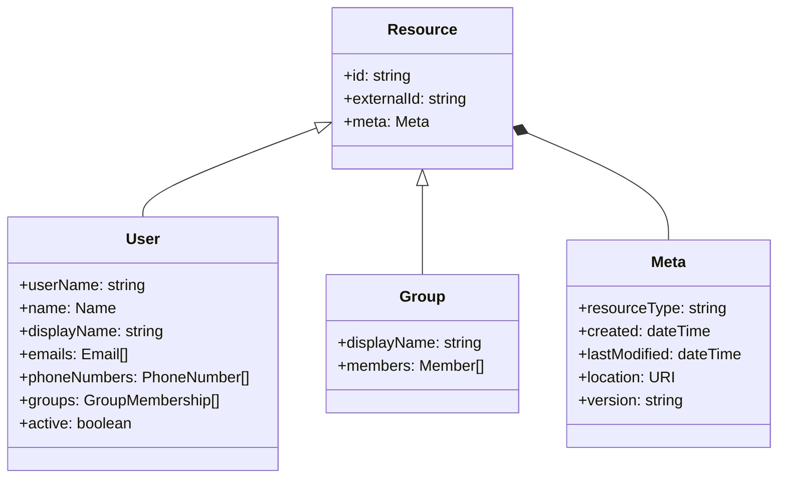
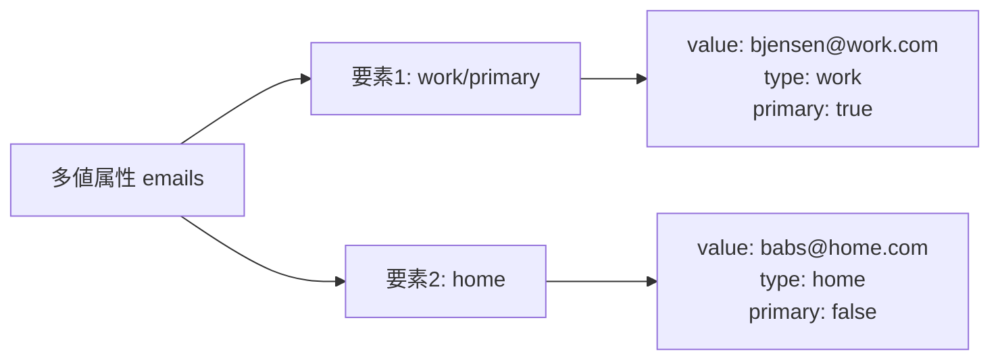

# RFC 7643 - System for Cross-domain Identity Management: Core Schema

## 概要

RFC 7643 は、SCIM（System for Cross-domain Identity Management）のコアスキーマを定義する仕様である。2015年9月に IETF によって標準化された。

SCIM は、クラウドサービス間でユーザーやグループなどのアイデンティティ情報を効率的にプロビジョニング・管理するためのプロトコル群である。RFC 7643 はそのデータモデル（スキーマ）を定義し、RFC 7644 がプロトコル（HTTP API）を定義する。

RFC 7643 は、サービスプロバイダが共通のフォーマットでアイデンティティ情報を表現・交換できるよう、JSON ベースのスキーマとリソースモデルを標準化する。

## 解決する課題

### アイデンティティ情報の異種スキーマ問題

クラウドサービスが普及する以前から、企業内では LDAP や Active Directory を使ってユーザー管理を行ってきた。しかし、SaaS アプリケーションが増加するにつれ、それぞれのサービスが独自のユーザーモデルを持ち、プロビジョニング方法もバラバラになるという問題が生じた。

- サービスごとに異なる属性名・データ形式
- ユーザー作成・更新・削除の自動化が困難
- サービスをまたいだアイデンティティ管理の一元化が不可能

### 手動管理によるリスク

アイデンティティ情報の管理が手動に頼ると、以下のリスクが高まる：

- 退職者アカウントの削除漏れ（オーバープロビジョニング）
- サービス間でのユーザー情報の不整合
- 管理コストの増大

SCIM はこれらの問題を解決するため、アイデンティティ情報の標準スキーマと REST ベースの操作プロトコルを提供する。

## 主要概念・用語

| 用語                     | 説明                                                                                     |
| ------------------------ | ---------------------------------------------------------------------------------------- |
| **リソース（Resource）** | SCIM で管理されるオブジェクト。User や Group が代表的なリソースタイプ                    |
| **スキーマ（Schema）**   | リソースの属性セットを定義する構造体。URN で識別される                                   |
| **属性（Attribute）**    | リソースの各フィールド。名前、データ型、制約（必須・一意性・変更可能性など）を持つ       |
| **多値属性**             | 複数の値を持てる属性（emails、phoneNumbers など）。各値は副属性（type、value 等）を持つ  |
| **スキーマ拡張**         | 標準スキーマに独自属性を追加するための仕組み。URN で識別される拡張スキーマとして定義する |
| **サービスプロバイダ**   | SCIM サーバーを実装し、リソースを管理する側（SaaS アプリ等）                             |
| **プロビジョニング**     | アイデンティティ情報の作成・更新・削除を自動的に行うこと                                 |

## リソースタイプとスキーマ

SCIM ではリソースタイプごとにスキーマ URI が割り当てられる。コアで定義されるリソースタイプは `User` と `Group` の 2 種類である。



### 共通属性（すべてのリソースに適用）

すべての SCIM リソースが持つ共通属性を以下に示す。

| 属性         | 型     | 説明                                                                                                     |
| ------------ | ------ | -------------------------------------------------------------------------------------------------------- |
| `id`         | string | サービスプロバイダが付与する一意識別子。読み取り専用                                                     |
| `externalId` | string | クライアント（プロビジョニングシステム等）が付与する識別子。サービスプロバイダは不透明な文字列として扱う |
| `meta`       | 複合型 | リソースのメタデータ（作成日時・更新日時・バージョン等）                                                 |

`schemas` 属性には、そのリソースが準拠するスキーマ URI の配列が含まれる。

```json
{
  "schemas": [
    "urn:ietf:params:scim:schemas:core:2.0:User",
    "urn:ietf:params:scim:schemas:extension:enterprise:2.0:User"
  ],
  "id": "2819c223-7f76-453a-919d-413861904646",
  "externalId": "bjensen",
  "meta": {
    "resourceType": "User",
    "created": "2010-01-23T04:56:22Z",
    "lastModified": "2011-05-13T04:42:34Z",
    "version": "W/\"3694e05e9dff591\"",
    "location": "https://example.com/v2/Users/2819c223-7f76-453a-919d-413861904646"
  }
}
```

### User リソース

スキーマ URI: `urn:ietf:params:scim:schemas:core:2.0:User`

User リソースは個人ユーザーを表す。主要な単数属性と多値属性を以下に示す。

**単数属性:**

| 属性                | 型      | 必須 | 説明                                            |
| ------------------- | ------- | ---- | ----------------------------------------------- |
| `userName`          | string  | 必須 | サービスプロバイダにおける一意のユーザー識別子  |
| `name`              | 複合型  | 任意 | ユーザー名（familyName、givenName 等の副属性）  |
| `displayName`       | string  | 任意 | 表示用ユーザー名                                |
| `nickName`          | string  | 任意 | ニックネーム                                    |
| `profileUrl`        | string  | 任意 | プロフィール URL                                |
| `title`             | string  | 任意 | 職位・役職                                      |
| `userType`          | string  | 任意 | ユーザー種別（Employee、Contractor 等）         |
| `preferredLanguage` | string  | 任意 | 優先言語（BCP 47 準拠）                         |
| `locale`            | string  | 任意 | ロケール                                        |
| `timezone`          | string  | 任意 | タイムゾーン（IANA Time Zone database 準拠）    |
| `active`            | boolean | 任意 | アカウントの有効/無効状態                       |
| `password`          | string  | 任意 | パスワード。writeOnly（レスポンスに含まれない） |

**多値属性:**

| 属性               | 説明                                     |
| ------------------ | ---------------------------------------- |
| `emails`           | メールアドレス（type: work/home/other）  |
| `phoneNumbers`     | 電話番号                                 |
| `ims`              | インスタントメッセージングアドレス       |
| `photos`           | プロフィール写真 URL                     |
| `addresses`        | 物理的な住所（複合型）                   |
| `groups`           | 所属グループ（読み取り専用）             |
| `entitlements`     | エンタイトルメント（権限・ライセンス等） |
| `roles`            | ロール                                   |
| `x509Certificates` | X.509 証明書                             |

**User リソースの例:**

```json
{
  "schemas": ["urn:ietf:params:scim:schemas:core:2.0:User"],
  "id": "2819c223-7f76-453a-919d-413861904646",
  "userName": "bjensen@example.com",
  "name": {
    "formatted": "Ms. Barbara J Jensen III",
    "familyName": "Jensen",
    "givenName": "Barbara",
    "middleName": "Jane",
    "honorificPrefix": "Ms.",
    "honorificSuffix": "III"
  },
  "displayName": "Babs Jensen",
  "emails": [
    {
      "value": "bjensen@example.com",
      "type": "work",
      "primary": true
    },
    {
      "value": "babs@jensen.org",
      "type": "home"
    }
  ],
  "active": true
}
```

### Group リソース

スキーマ URI: `urn:ietf:params:scim:schemas:core:2.0:Group`

Group リソースはユーザーのグループを表し、ロールベースやグループベースのアクセス制御モデルを実現する。

| 属性          | 型     | 必須 | 説明                             |
| ------------- | ------ | ---- | -------------------------------- |
| `displayName` | string | 必須 | グループの表示名                 |
| `members`     | 配列   | 任意 | グループメンバー（複合多値属性） |

`members` の各要素は以下の副属性を持つ：

| 副属性    | 説明                                          |
| --------- | --------------------------------------------- |
| `value`   | メンバーの SCIM リソース ID                   |
| `$ref`    | メンバーリソースへの URI（User または Group） |
| `type`    | リソース種別（"User" または "Group"）         |
| `display` | 表示用の名前                                  |

## 属性の特性

SCIM の各属性はメタデータによってその振る舞いが定義される。

### データ型

| 型          | 説明                                     |
| ----------- | ---------------------------------------- |
| `string`    | Unicode 文字列                           |
| `boolean`   | `true` または `false`                    |
| `decimal`   | 小数点を含む実数                         |
| `integer`   | 整数                                     |
| `dateTime`  | ISO 8601 形式の日時                      |
| `reference` | URI 参照                                 |
| `complex`   | 副属性を持つ複合型                       |
| `binary`    | Base64url エンコードされたバイナリデータ |

### Mutability（変更可能性）

| 値          | 説明                                                                  |
| ----------- | --------------------------------------------------------------------- |
| `readOnly`  | クライアントによる変更不可。`id`、`meta` 等                           |
| `readWrite` | デフォルト値。いつでも読み書き可能                                    |
| `immutable` | 作成時のみ設定可能。作成後の変更は禁止（変更リクエストは 400 エラー） |
| `writeOnly` | 書き込みのみ可能。`password` など。レスポンスには含まれない           |

### Returned（返却タイミング）

| 値        | 説明                                                                       |
| --------- | -------------------------------------------------------------------------- |
| `always`  | 常にレスポンスに含まれる                                                   |
| `never`   | レスポンスに含まれない                                                     |
| `default` | デフォルトで含まれるが、`attributes` パラメータで除外可能                  |
| `request` | リクエストで `attributes` パラメータに明示的に指定された場合のみ返却される |

### Uniqueness（一意性）

| 値       | 説明                         |
| -------- | ---------------------------- |
| `none`   | デフォルト。一意性の制約なし |
| `server` | サービスプロバイダ内で一意   |
| `global` | グローバルに一意（URI など） |

## 多値属性の詳細

多値属性は JSON 配列として表現される。各要素は以下の標準副属性を持つことができる：

| 副属性    | 説明                                                            |
| --------- | --------------------------------------------------------------- |
| `type`    | 属性の用途を示すラベル（"work"、"home"、"other" 等）            |
| `primary` | 優先値を示すブール値。配列内で最大1つの要素のみ `true` にできる |
| `display` | 表示用の人間可読名称（変更不可）                                |
| `value`   | 属性の主要な値                                                  |
| `$ref`    | 参照先リソースの URI                                            |



## スキーマ拡張

SCIM では標準スキーマに独自属性を追加するためのスキーマ拡張機能が提供される。RFC 7643 では Enterprise User 拡張スキーマが定義されている。

### Enterprise User 拡張スキーマ

スキーマ URI: `urn:ietf:params:scim:schemas:extension:enterprise:2.0:User`

企業環境で一般的に必要とされる追加属性を定義する。

| 属性             | 型     | 説明                                         |
| ---------------- | ------ | -------------------------------------------- |
| `employeeNumber` | string | 社員番号                                     |
| `costCenter`     | string | コストセンター                               |
| `organization`   | string | 組織名                                       |
| `division`       | string | 部門                                         |
| `department`     | string | 部署                                         |
| `manager`        | 複合型 | マネージャー情報（value、$ref、displayName） |

拡張スキーマは JSON の最上位オブジェクトに拡張スキーマ URI をキーとしてネストされる：

```json
{
  "schemas": [
    "urn:ietf:params:scim:schemas:core:2.0:User",
    "urn:ietf:params:scim:schemas:extension:enterprise:2.0:User"
  ],
  "userName": "bjensen@example.com",
  "urn:ietf:params:scim:schemas:extension:enterprise:2.0:User": {
    "employeeNumber": "701984",
    "costCenter": "4130",
    "organization": "Universal Studios",
    "division": "Theme Park",
    "department": "Tour Operations",
    "manager": {
      "value": "26118915-6090-4610-87e4-49d8ca9f808d",
      "$ref": "../Users/26118915-6090-4610-87e4-49d8ca9f808d",
      "displayName": "John Smith"
    }
  }
}
```

### カスタム拡張スキーマ

サービスプロバイダは独自のスキーマ拡張を定義できる。スキーマ URI は一般に以下の形式を用いる：

```
urn:ietf:params:scim:schemas:extension:<組織名>:<バージョン>:<リソースタイプ>
```

## Schema エンドポイント

SCIM サービスプロバイダは `/Schemas` エンドポイントを提供し、サポートするスキーマの定義を公開する。クライアントはこのエンドポイントを参照することで、サービスプロバイダがサポートする属性の一覧と詳細を動的に取得できる。

スキーマレスポンスの例（一部省略）：

```json
{
  "schemas": ["urn:ietf:params:scim:api:messages:2.0:ListResponse"],
  "totalResults": 3,
  "Resources": [
    {
      "id": "urn:ietf:params:scim:schemas:core:2.0:User",
      "name": "User",
      "description": "User Account",
      "attributes": [
        {
          "name": "userName",
          "type": "string",
          "multiValued": false,
          "required": true,
          "caseExact": false,
          "mutability": "readWrite",
          "returned": "default",
          "uniqueness": "server"
        }
      ]
    }
  ]
}
```

## セキュリティに関する考慮事項

### 認証・認可

SCIM エンドポイントはアイデンティティ情報を扱うため、必ずアクセス制御を実装しなければならない。RFC 7643 では認証・認可の実装を推奨しており、OAuth 2.0 Bearer トークン（RFC 6750）が一般的に使用される。

### センシティブ属性の保護

`password` 属性は `writeOnly` かつ `returned: never` として定義されており、レスポンスには含まれない。サービスプロバイダはパスワードをハッシュ化して保管し、平文での保存・返却を行ってはならない。

### TLS の必須化

アイデンティティ情報の転送には TLS による暗号化が必須である。RFC 7643 では SCIM サービスプロバイダが TLS をサポートすることを強く推奨している。

### 一意性の保証

`id` 属性はサービスプロバイダ内で一意かつ変更不可でなければならない。リソースの削除後も同じ `id` を再利用してはならない。

### 情報漏洩への配慮

SCIM レスポンスには大量のユーザー情報が含まれる可能性がある。サービスプロバイダは、リクエストしたクライアントに開示してよい情報のみを返却するよう適切なアクセス制御を実装すること。

## 関連仕様

| 仕様                                               | 関係                                                         |
| -------------------------------------------------- | ------------------------------------------------------------ |
| [RFC 7644](https://www.rfc-editor.org/rfc/rfc7644) | SCIM プロトコル。RFC 7643 のスキーマを使った HTTP API を定義 |
| [RFC 7642](https://www.rfc-editor.org/rfc/rfc7642) | SCIM の概念・概要・要件                                      |
| [RFC 6749](/specs/rfc6749)                         | OAuth 2.0。SCIM API の認可に使用                             |
| [RFC 6750](/specs/rfc6750)                         | Bearer トークン。SCIM API へのアクセスに使用                 |

## 参考文献

- [RFC 7643 原文](https://www.rfc-editor.org/rfc/rfc7643)
