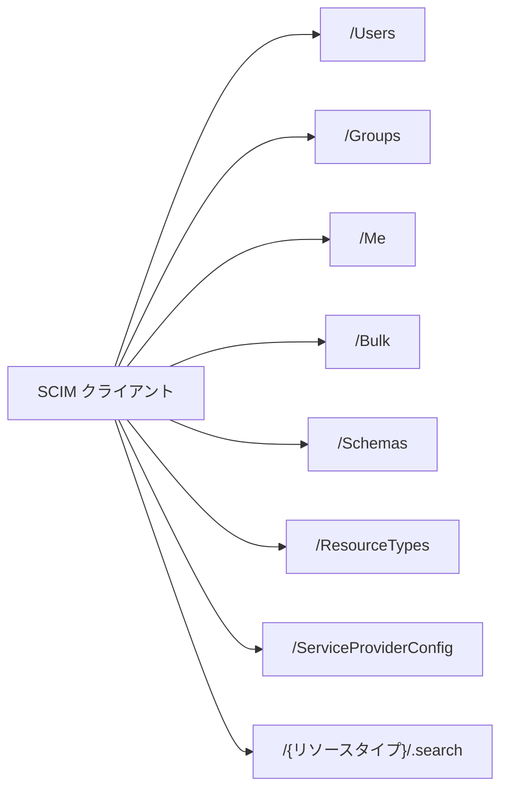
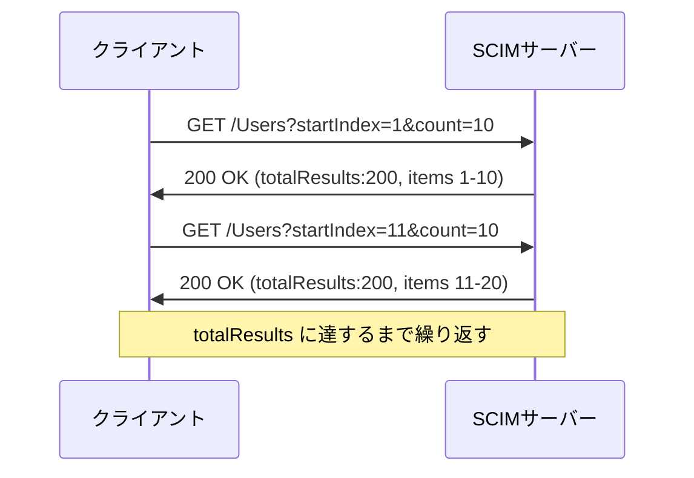
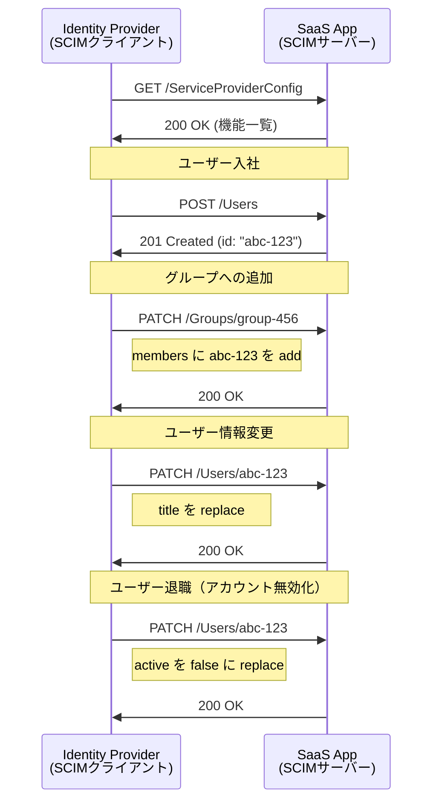

# RFC 7644 - System for Cross-domain Identity Management: Protocol

## 概要

RFC 7644 は、SCIM（System for Cross-domain Identity Management）のプロトコルを定義する仕様である。2015年9月に IETF によって標準化された。

SCIM は、クラウドサービス間でユーザーやグループなどのアイデンティティ情報を効率的にプロビジョニング・管理するためのプロトコル群である。RFC 7643 がデータモデル（スキーマ）を定義するのに対し、RFC 7644 はそのスキーマを用いた HTTP ベースの操作プロトコルを定義する。

本仕様は REST アーキテクチャに基づき、標準的な HTTP メソッドを使ってリソースの作成・取得・更新・削除を行う。フィルタリング、ページネーション、ソート、バルク操作といった機能も定義されている。

## 解決する課題

### プロビジョニング操作の標準化

RFC 7643 でスキーマ（データ形式）が標準化されても、それを操作するための HTTP API の仕様が各サービスごとに異なれば、統合コストは依然として高いままである。

- エンドポイント設計・URL 構造がサービスごとにバラバラ
- フィルタリングや検索構文が統一されていない
- エラーレスポンスの形式が不統一

### 大規模プロビジョニングの非効率性

ユーザー数千件を一括登録する場合、個別 API 呼び出しでは通信オーバーヘッドが大きい。バルク操作の仕組みが必要であった。

RFC 7644 は HTTP 操作の意味論、フィルタ構文、ページネーション、バルク操作を標準化することで、これらの課題を解決する。

## 主要概念・用語

| 用語                             | 説明                                                                     |
| -------------------------------- | ------------------------------------------------------------------------ |
| **サービスプロバイダ**           | SCIM サーバーを実装し、リソースを管理する側（SaaS アプリ等）             |
| **プロビジョニングクライアント** | SCIM API を呼び出してリソースを操作する側（IdP、ディレクトリサービス等） |
| **リソースエンドポイント**       | `/Users`、`/Groups` など、リソースタイプごとのベース URL                 |
| **ListResponse**                 | 複数リソースを返すレスポンスの標準フォーマット                           |
| **ETag**                         | リソースのバージョンを示す HTTP ヘッダー。楽観的ロックに使用             |
| **bulkId**                       | バルク操作内で新規作成リソースを一時的に参照するための識別子             |

## エンドポイント構成

SCIM サーバーが提供する標準エンドポイントを以下に示す。



| エンドポイント           | 説明                                          |
| ------------------------ | --------------------------------------------- |
| `/Users`                 | User リソースの CRUD 操作                     |
| `/Groups`                | Group リソースの CRUD 操作                    |
| `/Me`                    | 認証済みユーザー自身のリソース操作            |
| `/Bulk`                  | 複数操作を一括実行                            |
| `/Schemas`               | サポートするスキーマ定義の取得                |
| `/ResourceTypes`         | サポートするリソースタイプ定義の取得          |
| `/ServiceProviderConfig` | サービスプロバイダの機能・設定情報の取得      |
| `/.search`               | POST による高度な検索（フィルタが長い場合等） |

## HTTP 操作

### CREATE（POST）

新規リソースを作成する。

```
POST /Users HTTP/1.1
Host: example.com
Content-Type: application/scim+json

{
  "schemas": ["urn:ietf:params:scim:schemas:core:2.0:User"],
  "userName": "bjensen@example.com",
  "name": {
    "familyName": "Jensen",
    "givenName": "Barbara"
  },
  "emails": [
    {
      "value": "bjensen@example.com",
      "type": "work",
      "primary": true
    }
  ]
}
```

成功時のレスポンスは `201 Created` で、作成されたリソース（`id` や `meta` を含む）が返却される。

### READ（GET）

リソース ID を指定して単一リソースを取得する。

```
GET /Users/2819c223-7f76-453a-919d-413861904646 HTTP/1.1
Host: example.com
```

`attributes` クエリパラメータで返却属性を絞り込める：

```
GET /Users/2819c223?attributes=userName,emails
```

`excludedAttributes` で特定属性を除外することもできる：

```
GET /Users/2819c223?excludedAttributes=members
```

### UPDATE（PUT）

リソース全体を置き換える。指定しなかった属性はデフォルト値またはサービスプロバイダが定める値にリセットされる。

```
PUT /Users/2819c223-7f76-453a-919d-413861904646 HTTP/1.1
Host: example.com
Content-Type: application/scim+json

{
  "schemas": ["urn:ietf:params:scim:schemas:core:2.0:User"],
  "id": "2819c223-7f76-453a-919d-413861904646",
  "userName": "bjensen@example.com",
  "active": false
}
```

PUT は新規リソースの作成には使用できない。

### PARTIAL UPDATE（PATCH）

リソースの特定属性のみを更新する。PatchOp スキーマ（`urn:ietf:params:scim:api:messages:2.0:PatchOp`）を使用し、`add`・`remove`・`replace` の 3 種類の操作が定義されている。

```json
{
  "schemas": ["urn:ietf:params:scim:api:messages:2.0:PatchOp"],
  "Operations": [
    {
      "op": "replace",
      "path": "active",
      "value": false
    },
    {
      "op": "add",
      "path": "emails",
      "value": [
        {
          "value": "babs@jensen.org",
          "type": "home"
        }
      ]
    },
    {
      "op": "remove",
      "path": "phoneNumbers[type eq \"work\"]"
    }
  ]
}
```

成功時は `200 OK`（更新後リソースを返す場合）または `204 No Content` を返す。

### DELETE

リソースを削除する。

```
DELETE /Users/2819c223-7f76-453a-919d-413861904646 HTTP/1.1
Host: example.com
```

成功時は `204 No Content` を返す。

## フィルタリング

`filter` クエリパラメータを使って検索条件を指定できる。フィルタはリスト取得（GET）時のほか、`/.search` エンドポイントの POST リクエストでも使用できる。

### 比較演算子

| 演算子 | 意味                      | 例                                            |
| ------ | ------------------------- | --------------------------------------------- |
| `eq`   | 等しい                    | `userName eq "bjensen"`                       |
| `ne`   | 等しくない                | `active ne false`                             |
| `co`   | 含む（contains）          | `emails.value co "@example"`                  |
| `sw`   | で始まる（starts with）   | `userName sw "b"`                             |
| `ew`   | で終わる（ends with）     | `emails.value ew ".com"`                      |
| `pr`   | 属性が存在する（present） | `title pr`                                    |
| `gt`   | より大きい                | `meta.lastModified gt "2020-01-01T00:00:00Z"` |
| `ge`   | 以上                      | `meta.created ge "2020-01-01T00:00:00Z"`      |
| `lt`   | より小さい                | `meta.lastModified lt "2023-01-01T00:00:00Z"` |
| `le`   | 以下                      | `meta.created le "2023-01-01T00:00:00Z"`      |

### 論理演算子

`and`、`or`、`not` を使って複合条件を記述できる。

```
filter=userName sw "b" and emails.type eq "work"
filter=not (active eq false)
```

### 多値属性のフィルタリング

角括弧記法を使って多値属性の要素を絞り込める：

```
filter=emails[type eq "work" and value co "@example.com"]
```

## ページネーション

大量のリソースを取得する場合、ページネーションパラメータを使用する。

| パラメータ   | 説明                                  | デフォルト |
| ------------ | ------------------------------------- | ---------- |
| `startIndex` | 取得を開始する 1 ベースのインデックス | 1          |
| `count`      | 1 回のリクエストで返す最大件数        | 実装依存   |

ListResponse には以下のフィールドが含まれる：

```json
{
  "schemas": ["urn:ietf:params:scim:api:messages:2.0:ListResponse"],
  "totalResults": 200,
  "startIndex": 1,
  "itemsPerPage": 10,
  "Resources": [...]
}
```



ページネーション中にリソースが変更された場合、結果が一貫しない可能性があることに注意が必要である。

## ソート

`sortBy` と `sortOrder` パラメータでソートを制御する。

```
GET /Users?sortBy=name.familyName&sortOrder=ascending
GET /Users?sortBy=meta.lastModified&sortOrder=descending
```

| パラメータ  | 値                                           |
| ----------- | -------------------------------------------- |
| `sortBy`    | ソート対象の属性名またはパス                 |
| `sortOrder` | `ascending`（デフォルト）または `descending` |

多値属性の場合、`primary` 副属性が `true` の値、またはリストの先頭値を基準にソートされる。

## バルク操作

`/Bulk` エンドポイントへの POST リクエストで、複数の操作を一括実行できる。

```json
{
  "schemas": ["urn:ietf:params:scim:api:messages:2.0:BulkRequest"],
  "failOnErrors": 1,
  "Operations": [
    {
      "method": "POST",
      "path": "/Users",
      "bulkId": "qwerty",
      "data": {
        "schemas": ["urn:ietf:params:scim:schemas:core:2.0:User"],
        "userName": "Alice"
      }
    },
    {
      "method": "POST",
      "path": "/Groups",
      "bulkId": "ytrewq",
      "data": {
        "schemas": ["urn:ietf:params:scim:schemas:core:2.0:Group"],
        "displayName": "Tour Ops",
        "members": [
          {
            "type": "User",
            "value": "bulkId:qwerty"
          }
        ]
      }
    }
  ]
}
```

### bulkId による循環参照の解決

上記の例のように、`bulkId:qwerty` という記法を使うと、同じバルクリクエスト内でまだ作成されていないリソースを参照できる。サービスプロバイダはこれを解決して適切な順序で操作を実行する。

### failOnErrors

`failOnErrors` フィールドでエラー発生時の挙動を制御する。指定した件数のエラーが発生した時点で残りの操作を中断する。省略した場合はエラーを無視して可能な限り全操作を実行する。`0` を指定した場合は最初のエラーで残りの操作を中断する（許容エラー数がゼロ）。

バルクレスポンス例：

```json
{
  "schemas": ["urn:ietf:params:scim:api:messages:2.0:BulkResponse"],
  "Operations": [
    {
      "method": "POST",
      "bulkId": "qwerty",
      "status": "201",
      "location": "https://example.com/v2/Users/92b725cd-9465-4910-9e2f-b6f5e7c6e0b2"
    }
  ]
}
```

## サービスプロバイダ設定

`/ServiceProviderConfig` エンドポイントはサービスプロバイダの対応機能を公開する。クライアントはこれを参照して実装に応じた操作を選択できる。

```json
{
  "schemas": ["urn:ietf:params:scim:schemas:core:2.0:ServiceProviderConfig"],
  "documentationUri": "https://example.com/scim/help",
  "patch": { "supported": true },
  "bulk": {
    "supported": true,
    "maxOperations": 1000,
    "maxPayloadSize": 1048576
  },
  "filter": {
    "supported": true,
    "maxResults": 200
  },
  "changePassword": { "supported": true },
  "sort": { "supported": true },
  "etag": { "supported": true },
  "authenticationSchemes": [
    {
      "name": "OAuth Bearer Token",
      "description": "Authentication scheme using the OAuth Bearer Token Standard",
      "specUri": "https://www.rfc-editor.org/rfc/rfc6750",
      "type": "oauthbearertoken",
      "primary": true
    }
  ]
}
```

## エラーハンドリング

SCIM エラーレスポンスは標準 HTTP ステータスコードに加え、JSON エラーボディを返す。

```json
{
  "schemas": ["urn:ietf:params:scim:api:messages:2.0:Error"],
  "status": "400",
  "scimType": "invalidFilter",
  "detail": "Filter expression 'emails eq' is not valid."
}
```

| HTTP ステータス                | 用途                                       |
| ------------------------------ | ------------------------------------------ |
| `200 OK`                       | GET、PUT、PATCH（更新リソースを返す場合）  |
| `201 Created`                  | POST によるリソース作成成功                |
| `204 No Content`               | DELETE 成功、PATCH（ボディを返さない場合） |
| `400 Bad Request`              | リクエスト形式エラー、フィルタ構文エラー等 |
| `401 Unauthorized`             | 認証失敗                                   |
| `403 Forbidden`                | 認可エラー                                 |
| `404 Not Found`                | 指定リソースが存在しない                   |
| `409 Conflict`                 | 一意性制約違反（userName 重複等）          |
| `413 Request Entity Too Large` | バルクリクエストのサイズ超過               |

`scimType` フィールドで SCIM 固有のエラー種別を表現する：

| scimType        | 説明                                   |
| --------------- | -------------------------------------- |
| `uniqueness`    | 一意性制約に違反している               |
| `tooMany`       | リクエストの操作数が上限を超えている   |
| `mutability`    | 変更不可属性への書き込みを試みた       |
| `invalidFilter` | フィルタ構文が正しくない               |
| `noTarget`      | PATCH の `path` が対象属性に一致しない |
| `invalidValue`  | 属性値が仕様の型・制約に違反している   |
| `invalidSyntax` | リクエストボディの JSON が正しくない   |

## プロビジョニングフロー

一般的な SCIM を用いたユーザープロビジョニングのフローを示す。



## セキュリティに関する考慮事項

### TLS の必須化

すべての SCIM 通信は TLS によって暗号化しなければならない。アイデンティティ情報（ユーザー名、メールアドレス、パスワード等）は機密性の高い情報であり、平文での転送は禁止される。

### 認証

SCIM エンドポイントへのアクセスには以下のいずれかの認証方式が推奨される：

- **OAuth 2.0 Bearer トークン**（RFC 6750）：最も一般的。IdP が発行したトークンで SCIM サーバーへアクセス
- **TLS クライアント認証**：相互 TLS によるクライアント認証
- **HTTP Basic 認証**：非推奨。TLS と組み合わせる場合のみ許容される

匿名アクセスは、自己登録（セルフサービス）など特定のシナリオでのみ適切なアクセス制御のもとで許可される。

### 認可

認証されたクライアントは、そのクライアントに許可されたリソースのみ操作できるよう、アクセス制御を実装する必要がある。サービスプロバイダはクライアントを適切なアクセス制御ポリシーにマッピングしなければならない。

### センシティブデータの URI への含有禁止

フィルタリングに機密情報（パスワードなど）を使用する場合、これらが URI のクエリパラメータとして含まれるとログやブラウザ履歴に残るリスクがある。`/.search` エンドポイントへの POST を使用することで、フィルタ条件をリクエストボディに含めて保護できる。

### ETag による競合検出

リソースの楽観的ロックには ETag を使用する。クライアントは取得時の `ETag` 値を `If-Match` ヘッダーに含めて更新・削除リクエストを送ることで、その間にリソースが変更されていないことを確認できる。

```
PUT /Users/abc-123 HTTP/1.1
If-Match: W/"3694e05e9dff591"
```

バージョン不一致の場合は `412 Precondition Failed` が返される。

## 関連仕様

| 仕様                                               | 関係                                                     |
| -------------------------------------------------- | -------------------------------------------------------- |
| [RFC 7643](https://www.rfc-editor.org/rfc/rfc7643) | SCIM コアスキーマ。RFC 7644 が操作するデータモデルを定義 |
| [RFC 7642](https://www.rfc-editor.org/rfc/rfc7642) | SCIM の概念・概要・要件                                  |
| [RFC 6749](/specs/rfc6749)                         | OAuth 2.0。SCIM API の認可に使用                         |
| [RFC 6750](/specs/rfc6750)                         | Bearer トークン。SCIM API へのアクセスに使用             |

## 参考文献

- [RFC 7644 原文](https://www.rfc-editor.org/rfc/rfc7644)
