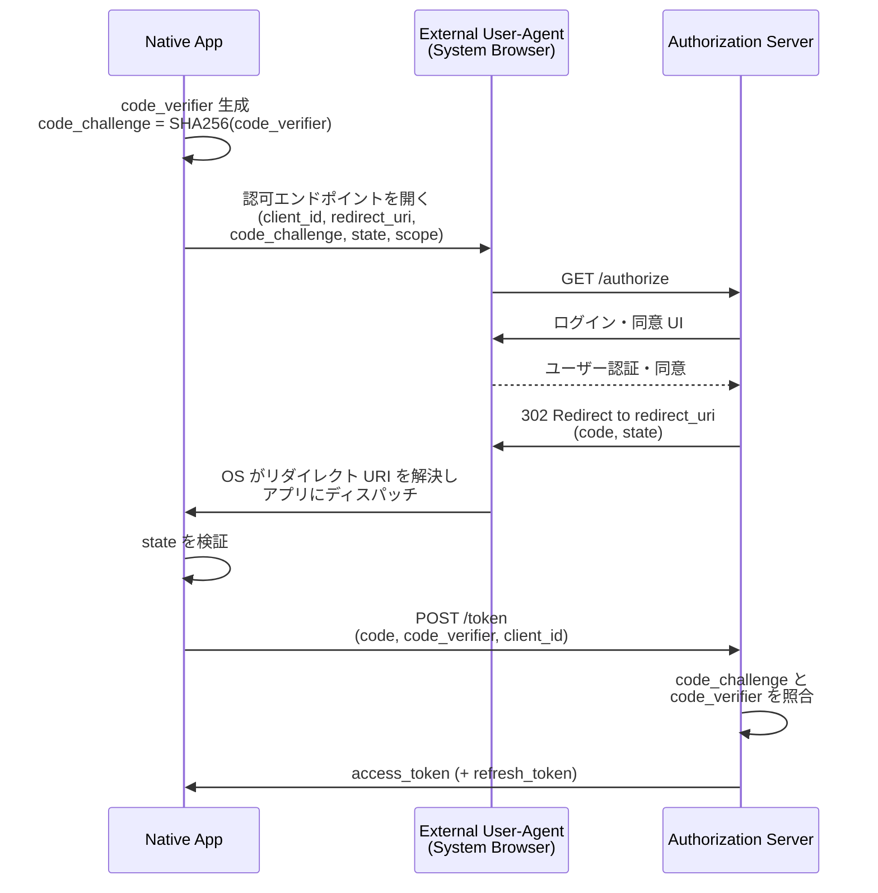

# RFC 8252 - OAuth 2.0 for Native Apps

## 1. 概要

RFC 8252 は IETF が 2017 年 10 月に発行した Best Current Practice (BCP 212) で、ネイティブアプリケーション (モバイルアプリ、デスクトップアプリ、CLI ツール等) が OAuth 2.0 を安全に利用するための実装指針を定めている。タイトルが示すとおり、本仕様は新しいプロトコル要素を導入するものではなく、既存の OAuth 2.0 (RFC 6749) の構成要素をネイティブアプリ環境でどのように組み合わせるべきかを規定する。

中核となるメッセージは「ネイティブアプリは認可リクエストを **外部ユーザーエージェント (external user-agent)** 経由で行わなければならない」という一点に集約される。具体的には、アプリに埋め込まれた WebView (embedded user-agent) ではなく、システムのブラウザ、または OS がブラウザの UI を共有可能にする仕組み (iOS の `SFSafariViewController`、Android の Custom Tabs 等) を用いる。これに加え、Public Client であるネイティブアプリの安全性を確保するため、PKCE (RFC 7636) の実装を必須化している。

本仕様は OpenID Connect Dynamic Client Registration や RFC 9700 (OAuth Security BCP) でも前提として参照されており、ネイティブアプリ向け OAuth/OIDC を設計する際の出発点となる。

## 2. 解決する課題

OAuth 2.0 が公開された当初、リダイレクトベースの認可フローは主に Web アプリケーション向けに設計されていた。ネイティブアプリで同じフローを実装する際、開発者は次のような選択肢に直面した。

- **Embedded user-agent (WebView) の利用**: アプリ内に Web ビューを埋め込み、認可エンドポイントを表示する。実装は容易だが、ホストアプリは表示中の Web ページに対する全アクセス権 (Cookie、フォーム値、JavaScript 実行結果) を持つため、ユーザーの認証情報を窃取できてしまう。また、システムブラウザのセッションを共有できないため SSO が機能しない。
- **Resource Owner Password Credentials (パスワードグラント)**: ユーザーがアプリに直接 ID/パスワードを入力する方式。ユーザーがアプリを「正規ログイン UI」と認識する習慣を助長し、フィッシング耐性を下げる。
- **External user-agent (システムブラウザ) の利用**: 安全性は高いが、認可レスポンスをアプリにどう返すか (リダイレクト URI の扱い) が課題となる。

加えて、ネイティブアプリは配布バイナリ内に静的な `client_secret` を埋め込むことができず、本質的に Public Client である。認可コードがネットワーク上または同一デバイス上の他アプリに横取りされた場合、`client_secret` による検証ができないため、攻撃者はそのコードをトークンと交換できてしまう (Authorization Code Interception Attack)。

RFC 8252 は、これらの問題に対し「External user-agent + PKCE + 適切なリダイレクト方式」という組み合わせを最善実践として明文化した。

## 3. 主要概念・用語

### 3.1 Native App

エンドユーザーのデバイス (モバイル、デスクトップ等) にインストールされ、デバイス上で実行されるパブリッククライアント。Web ブラウザ上で動作する Web アプリと対比される。Native App はバイナリ配布物に秘密情報を安全に格納できないため、すべて Public Client として扱う。

### 3.2 External User-Agent

ネイティブアプリの外部で動作するユーザーエージェント。具体的には以下を含む。

- システムのデフォルトブラウザ
- iOS の `SFSafariViewController` のような「ブラウザの状態を共有する」コンポーネント
- Android の Custom Tabs のような「OS が提供する共有 Web ビュー」

重要なのは、ホストアプリが当該ユーザーエージェントの内部状態 (Cookie、入力値、DOM) にアクセスできないことである。

### 3.3 Embedded User-Agent

アプリプロセス内に埋め込まれた WebView コンポーネント (iOS の `WKWebView`、Android の `WebView` 等)。ホストアプリは表示内容を完全に制御・観測できるため、認可フローでは使用してはならない。

### 3.4 Claimed "https" Scheme URI

アプリがオペレーティングシステムに対し、特定の HTTPS URL の所有権を主張し、その URL に対する受信ハンドラとして登録される仕組み。iOS の Universal Links、Android の App Links がこれに該当する。OS と Web サーバーの連携 (ドメイン所有の検証) により、他アプリが同じ URL を奪取できない点が特徴。

### 3.5 Private-Use URI Scheme

`com.example.app:` のような、IANA 登録の標準スキーム (`http`, `https`, `mailto` 等) ではないスキーム。アプリは OS に対しこのスキームのハンドラとして登録する。逆ドメイン記法 (reverse domain name) を用いることが必須とされている。

### 3.6 Loopback Interface Redirection

`http://127.0.0.1:<port>/` または `http://[::1]:<port>/` のような、ローカルループバックアドレスを指すリダイレクト URI。デスクトップアプリでは、アプリが一時的なローカル HTTP サーバーを立ち上げ、認可レスポンスを受信する方式として利用される。

## 4. プロトコルフロー

RFC 8252 が推奨する標準的なフローは以下のとおりである。Authorization Code フロー + PKCE を、external user-agent 経由で実行する。



このフローの肝は以下の三点である。

1. **認可リクエストを開く際にシステムブラウザを呼び出す**: アプリ内 WebView は使わない。
2. **PKCE で認可コードを保護する**: `code_verifier` はアプリのメモリ内にのみ存在するため、認可コードが第三者に漏れても、第三者は `code_verifier` を持たないためトークン交換に失敗する。
3. **OS がリダイレクト URI をアプリに配送する**: ブラウザからアプリへの戻りは、後述する 3 つの方式のいずれかで実現する。

## 5. 詳細解説

### 5.1 認可リクエストの開始 (Sec 6)

ネイティブアプリは、認可リクエストの URL を構築したのち、OS が提供する「URL を開く」 API を呼び出して external user-agent に渡す。アプリ自身が HTTP リクエストを送信して認可エンドポイントの HTML を取得することはしてはならない (これは embedded user-agent と同様の問題を引き起こす)。

リクエストには `response_type=code` を指定し、PKCE パラメータ (`code_challenge`、`code_challenge_method`) を含める。`code_challenge_method` は `S256` を推奨する。

### 5.2 リダイレクト方式 (Sec 7)

#### 5.2.1 Private-Use URI Scheme Redirection (Sec 7.1)

アプリ独自のカスタムスキームを使う方式。

```
com.example.app:/oauth2redirect/example-provider
```

要件:

- スキーム名は **逆ドメイン記法** で、アプリ開発者が制御するドメインを使う必要がある (例: `com.example.app`)。
- スキーム部分の後はパス成分が続き、ホスト成分は存在しない (`com.example.app:/path` 形式)。
- 同一スキームを複数アプリが登録してしまうと、悪意ある別アプリが認可コードを奪取できる。OS がスキーム登録に対し所有権を強制しないプラットフォームでは、PKCE による保護が決定的に重要となる。

#### 5.2.2 Claimed "https" Scheme Redirection (Sec 7.2)

iOS の Universal Links / Android の App Links のように、HTTPS URI の所有権を OS が検証してアプリへ配送する方式。

```
https://app.example.com/oauth2redirect/example-provider
```

要件:

- アプリ開発者は対象ドメインの Web サーバーに、所有権証明用のメタデータファイル (iOS の `apple-app-site-association`、Android の `assetlinks.json`) を配置する。
- OS はインストール時または更新時にこのファイルを検証し、アプリと URL を結びつける。
- 悪意あるアプリが同じ URL を奪取することは原則できないため、ネイティブアプリ向けリダイレクトの中で最も堅牢である。OS とプラットフォームが対応している場合、本方式が **推奨** される。

#### 5.2.3 Loopback Interface Redirection (Sec 7.3)

```
http://127.0.0.1:51772/callback
http://[::1]:51772/callback
```

要件:

- ホストは `127.0.0.1` または `[::1]` (リテラル) を用いる。`localhost` は推奨されない (名前解決の挙動が OS や設定で揺れるため)。
- ポート番号はアプリ起動ごとに動的に変わってよい。**Authorization Server は登録された Loopback Redirect URI に対し、ポート番号の違いを許容しなければならない**。それ以外の構成要素 (スキーム、ホスト、パス) は完全一致で照合する。
- デバイス内ローカル通信のため HTTP (TLS なし) で構わない。

### 5.3 認可レスポンスの受信

ブラウザに返されたリダイレクト URI は、OS が次の経路でアプリに渡す。

- Private-Use URI Scheme / Claimed HTTPS Scheme: OS のインテント/URL ディスパッチ機構がアプリを起動 (またはフォアグラウンド化) し、URL を引数として渡す。
- Loopback: アプリが起動した一時 HTTP サーバーが、ブラウザからの GET リクエストとしてレスポンスを受信する。

いずれの場合も、アプリは受信した `state` パラメータが認可リクエスト時の値と一致することを必ず確認し、認可コードを PKCE の `code_verifier` とともにトークンエンドポイントへ送る。

### 5.4 Authorization Server の対応事項 (Appendix A)

RFC 8252 は、ネイティブアプリをサポートする Authorization Server に対し、次の事項の実装を求める。

- Private-Use URI Scheme リダイレクト URI のサポート
- Claimed HTTPS Scheme リダイレクト URI のサポート
- Loopback IP リダイレクト URI (任意ポートの許容) のサポート
- PKCE のサポート
- ネイティブアプリは公開クライアントであり `client_secret` を保持しないことの前提

これらは新規構築する Authorization Server / OpenID Provider のチェックリストとして実用的である。

### 5.5 プラットフォーム別ガイダンス (Appendix B)

- **iOS**: `SFSafariViewController` または `ASWebAuthenticationSession` (iOS 12+) を利用する。Claimed HTTPS Scheme (Universal Links) が推奨。`WKWebView` は避ける。
- **Android**: Custom Tabs を利用し、Implicit Intent (またはApp Links) で受信する。WebView は避ける。
- **Windows**: 古典的なデスクトップアプリでは Loopback。UWP では Web Authentication Broker も選択肢。
- **macOS**: Private-Use URI Scheme または Loopback。
- **Linux / その他デスクトップ**: Loopback が事実上の標準。

## 6. セキュリティに関する考慮事項

RFC 8252 はセクション 8 で 12 項目のセキュリティ考慮事項を挙げる。代表的なものは以下のとおり。

### 6.1 Authorization Code Interception 対策 (Sec 8.1)

ネイティブアプリのパブリッククライアント性質上、認可コードがデバイス内で他アプリに横取りされる可能性がある。PKCE はこの攻撃を緩和するため、Public Native Client は PKCE を実装しなければならない。Authorization Server もこれに対応しなければならない。

### 6.2 Implicit Grant の非推奨 (Sec 8.2)

ネイティブアプリでは Implicit Flow を利用してはならない。Implicit Flow ではアクセストークンがフラグメント経由でブラウザを介して渡されるため、ブラウザ履歴やシステムログへの漏洩経路が増える。Authorization Code Flow + PKCE を用いる。

### 6.3 Loopback リダイレクトの考慮 (Sec 8.3)

Loopback ではデバイス内通信のため HTTPS を要求しない。ただし、同一デバイス上の悪意あるプロセスが先にポートを掌握する競合状態に注意する必要がある。

### 6.4 クライアント認証 (Sec 8.5)

ネイティブアプリはパブリッククライアントであり、`client_secret` をバイナリに埋め込んで配布することは「秘密」を意味しない。Authorization Server はネイティブアプリに対する `client_secret` ベースのクライアント認証に依存してはならない。

### 6.5 クライアント偽装 (Sec 8.6)

同じ `client_id` を装う悪意あるアプリが現れる可能性に対し、Claimed HTTPS Scheme は OS によるドメイン所有権検証を介して身元を担保できる。

### 6.6 CSRF 対策 (Sec 8.9)

`state` パラメータには十分なエントロピーを持つランダム値を設定し、認可レスポンス受信時に厳密に照合する。

### 6.7 Authorization Server の混同緩和 (Sec 8.10)

Authorization Server は登録済み Redirect URI と着信した Redirect URI を **完全一致** で比較する (Loopback におけるポート番号を除く)。部分一致やワイルドカードは認可コード横取りの足がかりとなるため避ける。

### 6.8 Embedded User-Agent の禁止 (Sec 8.12)

Embedded User-Agent は、ホストアプリが認可サーバーへの認証情報入力を完全に観測・改変できる位置にあること、SSO のセッション共有が行えないこと、ユーザーがフィッシング UI と本物の UI を識別できないことから、認可フローに用いてはならない。

## 7. 関連仕様

- [RFC 6749](./rfc6749.md) — OAuth 2.0 の中核仕様。本仕様の前提となる。
- [RFC 7636](./rfc7636.md) — PKCE。本仕様がネイティブアプリで必須化する保護メカニズム。
- [RFC 7591](./rfc7591.md) — Dynamic Client Registration。ネイティブアプリの動的登録時に Redirect URI ポリシーが関係する。
- [OpenID Connect Dynamic Client Registration](./openid-connect-registration.md) — OIDC におけるクライアント登録。Redirect URI 検証の議論で RFC 8252 を参照する。
- RFC 9700 — OAuth 2.0 Security Best Current Practice。RFC 8252 の方針を継承・拡張している。
- RFC 8414 — Authorization Server Metadata。ネイティブアプリ向けに `code_challenge_methods_supported` 等のメタデータを公開する。

## 8. 参考文献

- [RFC 8252 - OAuth 2.0 for Native Apps](https://www.rfc-editor.org/rfc/rfc8252)
- [RFC 6749 - The OAuth 2.0 Authorization Framework](https://www.rfc-editor.org/rfc/rfc6749)
- [RFC 7636 - Proof Key for Code Exchange by OAuth Public Clients](https://www.rfc-editor.org/rfc/rfc7636)
- [BCP 212](https://www.rfc-editor.org/info/bcp212)
