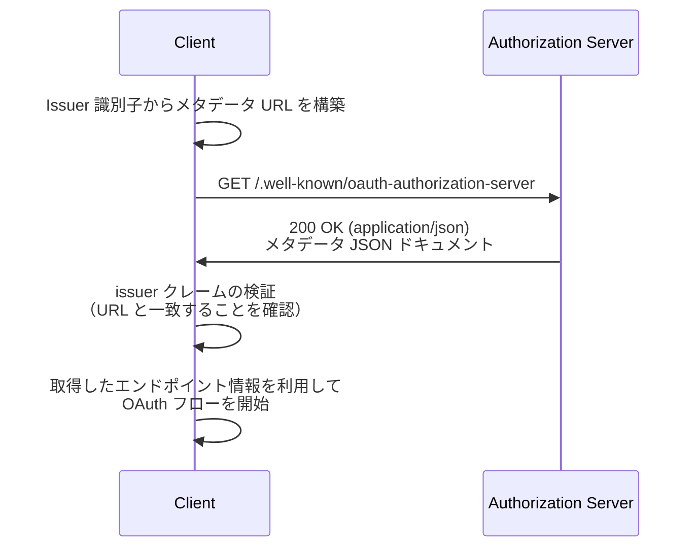

# RFC 8414 - OAuth 2.0 Authorization Server Metadata

## 概要

RFC 8414 は、OAuth 2.0 クライアントが認可サーバーと相互作用するために必要な情報を動的に取得するための**メタデータ形式**を定義した仕様である。2018年6月に IETF により公開された。

認可サーバーがサポートするエンドポイントの URL や対応する機能（グラントタイプ、レスポンスタイプ、認証方式等）を JSON 形式で宣言することで、クライアントは事前の手動設定なしにサーバーの構成情報を発見できる。

OpenID Connect Discovery 1.0 を OAuth 2.0 全般に適用できるよう一般化した仕様であり、OpenID Connect との互換性も保持している。

## 解決する課題

RFC 8414 以前、OAuth 2.0 クライアントが認可サーバーと連携するには、トークンエンドポイント URL や対応グラントタイプなどを設定ファイルや実装にハードコードする必要があった。この方式には以下の問題があった。

- **設定の硬直性**: サーバー側の設定変更がクライアント側の更新を伴わない
- **マルチテナント対応の困難さ**: 複数の認可サーバーや発行者を動的に切り替えにくい
- **相互運用性の欠如**: ベンダーごとに独自のディスカバリー手段を用いており標準がなかった

RFC 8414 は「よく知られた URL（Well-Known URI）」を通じたメタデータ取得を標準化し、クライアントが実行時にサーバーの構成を自動的に取得できる仕組みを提供する。

## 主要概念・用語

| 用語                              | 説明                                                                 |
| --------------------------------- | -------------------------------------------------------------------- |
| **Issuer**                        | 認可サーバーの識別子。クエリ文字列・フラグメントを含まない HTTPS URL |
| **Authorization Server Metadata** | 認可サーバーの設定・機能情報を記述した JSON ドキュメント             |
| **Well-Known URI**                | RFC 5785 で定義された予約済みパスプレフィックス `/.well-known/`      |
| **Metadata Endpoint**             | メタデータドキュメントを提供するエンドポイント                       |
| **signed_metadata**               | JWT 形式で署名されたメタデータ（オプション）                         |

## メタデータエンドポイントの URL 構造

メタデータは Issuer 識別子から以下の規則で導出される URL に配置される。

```
https://<host>/.well-known/oauth-authorization-server[/<path>]
```

Issuer にパス成分が含まれる場合は、ホストとパスの間に `/.well-known/oauth-authorization-server` を挿入する。

| Issuer                        | メタデータ URL                                                       |
| ----------------------------- | -------------------------------------------------------------------- |
| `https://example.com`         | `https://example.com/.well-known/oauth-authorization-server`         |
| `https://example.com/issuer1` | `https://example.com/.well-known/oauth-authorization-server/issuer1` |

## ディスカバリーフロー



クライアントはレスポンスに含まれる `issuer` クレームの値が、メタデータ URL の構築に用いた認可サーバーの Issuer 識別子と完全に一致することを検証しなければならない。一致しない場合はそのレスポンスを使用してはならない。

## メタデータフィールド

### 必須フィールド

| フィールド                 | 型       | 説明                                  |
| -------------------------- | -------- | ------------------------------------- |
| `issuer`                   | string   | 認可サーバーの Issuer 識別子 URL      |
| `response_types_supported` | string[] | サポートする `response_type` 値の配列 |

条件付き必須フィールド：

| フィールド               | 条件                                                                                            |
| ------------------------ | ----------------------------------------------------------------------------------------------- |
| `authorization_endpoint` | 認可エンドポイントを使用するグラントタイプ（authorization_code、implicit 等）をサポートする場合 |
| `token_endpoint`         | implicit グラント以外をサポートする場合                                                         |

### 推奨フィールド

| フィールド         | 型       | 説明                         |
| ------------------ | -------- | ---------------------------- |
| `scopes_supported` | string[] | サポートするスコープ値の配列 |

### 主要なオプションフィールド

| フィールド                                         | 型       | 説明                                                                           |
| -------------------------------------------------- | -------- | ------------------------------------------------------------------------------ |
| `jwks_uri`                                         | string   | JWK セットドキュメントの URL                                                   |
| `registration_endpoint`                            | string   | Dynamic Client Registration エンドポイント                                     |
| `grant_types_supported`                            | string[] | サポートするグラントタイプ（デフォルト: `["authorization_code", "implicit"]`） |
| `response_modes_supported`                         | string[] | サポートするレスポンスモード（デフォルト: `["query", "fragment"]`）            |
| `token_endpoint_auth_methods_supported`            | string[] | トークンエンドポイントの認証方式（デフォルト: `["client_secret_basic"]`）      |
| `token_endpoint_auth_signing_alg_values_supported` | string[] | JWT 署名に使用するアルゴリズム                                                 |
| `introspection_endpoint`                           | string   | トークンイントロスペクションエンドポイント（RFC 7662）                         |
| `revocation_endpoint`                              | string   | トークン失効エンドポイント（RFC 7009）                                         |
| `code_challenge_methods_supported`                 | string[] | サポートする PKCE コードチャレンジ方式（RFC 7636）                             |
| `service_documentation`                            | string   | 開発者向けドキュメントの URL                                                   |
| `signed_metadata`                                  | string   | JWT 形式で署名されたメタデータ                                                 |

## メタデータレスポンスの例

```http
GET /.well-known/oauth-authorization-server HTTP/1.1
Host: server.example.com
```

```http
HTTP/1.1 200 OK
Content-Type: application/json

{
  "issuer": "https://server.example.com",
  "authorization_endpoint": "https://server.example.com/authorize",
  "token_endpoint": "https://server.example.com/token",
  "jwks_uri": "https://server.example.com/jwks.json",
  "registration_endpoint": "https://server.example.com/register",
  "scopes_supported": ["openid", "profile", "email", "offline_access"],
  "response_types_supported": ["code", "token"],
  "grant_types_supported": [
    "authorization_code",
    "refresh_token",
    "urn:ietf:params:oauth:grant-type:jwt-bearer"
  ],
  "token_endpoint_auth_methods_supported": [
    "client_secret_basic",
    "private_key_jwt"
  ],
  "code_challenge_methods_supported": ["S256"],
  "introspection_endpoint": "https://server.example.com/introspect",
  "revocation_endpoint": "https://server.example.com/revoke"
}
```

## 署名付きメタデータ

メタデータは `signed_metadata` クレームに JWT として埋め込むことができる。これにより、メタデータの完全性を暗号的に検証可能になる。

```mermaid
flowchart TD
    A[クライアント] -->|メタデータ取得| B[/.well-known/oauth-authorization-server]
    B --> C{signed_metadata あり?}
    C -->|Yes| D[jwks_uri から公開鍵を取得]
    D --> E[JWT 署名を検証]
    E --> F[JWT ペイロードのクレームでプレーンな JSON フィールドを上書き]
    F --> H[統合されたメタデータを使用]
    C -->|No| G[JSON クレームをそのまま使用]
    G --> H
```

署名付きメタデータを使用する場合、クライアントは JWT の署名を検証し、`iss` クレームが期待する値と一致することを確認する必要がある。JWT ペイロードのクレームはプレーンな JSON フィールドより優先され、対応するフィールドを上書きする。クライアントが署名付きメタデータをサポートしない場合は無視してよい。

## OpenID Connect Discovery との関係

OpenID Connect Discovery 1.0 は `/.well-known/openid-configuration` エンドポイントを定義しているが、RFC 8414 はこれを OAuth 2.0 全般に汎化したものである。

| 項目                | OpenID Connect Discovery            | RFC 8414                                  |
| ------------------- | ----------------------------------- | ----------------------------------------- |
| エンドポイント      | `/.well-known/openid-configuration` | `/.well-known/oauth-authorization-server` |
| 対象                | OpenID Provider                     | OAuth 2.0 認可サーバー全般                |
| OIDC 固有フィールド | あり（`userinfo_endpoint` 等）      | なし（OIDC が拡張として定義）             |
| 標準化              | OpenID Foundation                   | IETF                                      |

なお、OpenID Provider は両エンドポイントを提供することで、純粋な OAuth 2.0 クライアントと OpenID Connect クライアントの双方に対応できる。

## セキュリティに関する考慮事項

### TLS の必須化

メタデータエンドポイントは TLS（HTTPS）を使用しなければならない。クライアントは RFC 6125 に従いサーバー証明書を検証し、中間者攻撃（MITM）や DNS ハイジャックを防ぐ必要がある。

### Issuer クレームの検証

クライアントはレスポンスの `issuer` 値がメタデータ URL のベースと完全に一致することを確認しなければならない。この検証を省略すると、攻撃者が正規の Issuer を主張しつつ自前のエンドポイントを使用するなりすまし攻撃が可能になる。

```
# 正当なケース
issuer URL:      https://example.com
metadata URL:    https://example.com/.well-known/oauth-authorization-server

# 検出すべき不正なケース（issuer URL がメタデータ取得先と異なる）
issuer URL:      https://example.com
metadata URL:    https://attacker.com/.well-known/oauth-authorization-server
```

### メタデータの公開範囲

標準化された URL でメタデータを公開することで、認可サーバーの詳細情報が攻撃者にも容易に取得できる状態になる。エンドポイントには他の公開リソースと同様のアクセス制御を適用することが推奨される。

## 関連仕様

- [RFC 6749](/specs/rfc6749) - OAuth 2.0 Authorization Framework（基盤となる OAuth 2.0 仕様）
- [RFC 6750](/specs/rfc6750) - Bearer Token Usage（アクセストークンの利用方法）
- [RFC 7636](/specs/rfc7636) - PKCE（`code_challenge_methods_supported` で参照）
- [RFC 7662](/specs/rfc7662) - Token Introspection（`introspection_endpoint` で参照）
- [RFC 7517](/specs/rfc7517) - JSON Web Key（`jwks_uri` で参照）
- RFC 5785 - Well-Known Uniform Resource Identifiers（Well-Known URI の基盤仕様）
- OpenID Connect Discovery 1.0（本仕様のベースとなった OIDC のディスカバリー仕様）

## 参考文献

- [RFC 8414 原文](https://www.rfc-editor.org/rfc/rfc8414)
