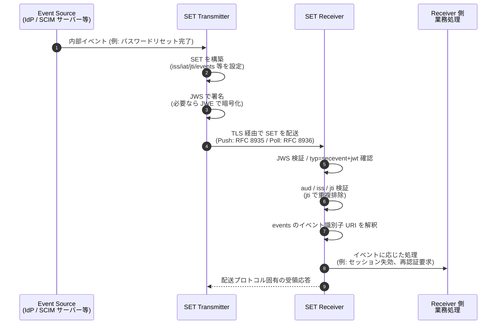

# RFC 8417 - Security Event Token (SET)

## 1. 概要

RFC 8417 は 2018 年 7 月に発行された IETF の標準仕様で、**Security Event Token (SET)** と呼ばれるデータ構造を定義する。SET は、ある発行者 (Issuer) の視点から、ある主体 (Subject) について **過去に発生した事実 (statement of fact)** を表現するための JSON Web Token (JWT) である。

OAuth 2.0 や OpenID Connect、SCIM などの ID 管理プロトコルは、認可・認証・プロビジョニングを同期的なリクエスト/レスポンスで実現してきた。しかし「ユーザーがログアウトした」「アカウントが侵害された」「パスワードがリセットされた」といった **状態変化** を関係する複数のサービス間で非同期に伝搬する仕組みは標準化されていなかった。SET はこの「セキュリティイベントを表現するための共通フォーマット」を提供する基盤仕様であり、後続の OpenID Shared Signals Framework (SSF)、CAEP (Continuous Access Evaluation Profile)、OpenID Back-Channel Logout などで実際の搬送・処理プロファイルが定義されている。

なお、SET は **イベントの表現フォーマット** のみを定義する。配送方法 (Push / Poll) は別仕様である RFC 8935 / RFC 8936 で定義されている。

## 2. 解決する課題

SET 以前は、以下のような課題が存在した。

- ID プロバイダーがアカウントを無効化しても、依存先のリライングパーティーやリソースサーバーに変更を通知する標準的な仕組みがなかった
- SCIM のような Provisioning プロトコルは「変更を CRUD で送る」モデルだが、「すでに起きた事実を後追いで通知する」用途には合わない
- ベンダーごとに独自の Webhook ペイロードが定義され、相互運用性がなかった
- ID Token やアクセストークンと混同されて誤って認証/認可に流用されると、深刻なセキュリティ問題が発生する

SET はこれらの課題に対し、JWT を基盤として **「イベントは命令ではなく事実である」** という設計原則を明示し、認証トークンと明確に区別する構造を与えることで解決する。

## 3. 主要概念・用語

| 用語             | 説明                                                                                                              |
| ---------------- | ----------------------------------------------------------------------------------------------------------------- |
| SET              | Security Event Token。本仕様に準拠した JWT                                                                        |
| Event            | 主体に対して、または主体について発生した、セキュリティに関連する状態変化                                          |
| Subject (主体)   | イベントが発生した対象。ユーザー、デバイス、セッション、グループ等                                                |
| Issuer (発行者)  | SET を生成し配信するサービスプロバイダー                                                                          |
| Profiling Spec   | 特定のイベント種別 / 業務要件に合わせて SET の使い方を具体化する仕様 (例: SCIM Events、CAEP、Back-Channel Logout) |
| Event Identifier | `events` クレーム内で個々のイベントペイロードを識別する URI                                                       |

SET は「事実 (fact) を伝えるもの」であり、「アクションを命令するもの」ではない。受信者がそのイベントに対してどのように振る舞うかは受信者の裁量で決まる。

## 4. SET の構造

### 4.1 トークン全体の形

SET は JWT であり、JWS による署名 (推奨) や JWE による暗号化 (機密情報を含む場合は必須) を施したうえで配送される。ヘッダの `typ` には `secevent+jwt`、メディアタイプには `application/secevent+jwt` を用いることが推奨される。

### 4.2 クレーム

| クレーム | 必須   | 説明                                                                         |
| -------- | ------ | ---------------------------------------------------------------------------- |
| `iss`    | 必須   | SET を発行したサービスプロバイダーの識別子                                   |
| `iat`    | 必須   | SET が発行された日時 (NumericDate)                                           |
| `jti`    | 必須   | SET 個別のユニーク識別子 (受信側での重複排除等に利用)                        |
| `aud`    | 推奨   | SET の想定受信者                                                             |
| `sub`    | 任意   | イベントが発生した主体                                                       |
| `events` | 必須   | イベント識別子 URI とそのペイロードからなる JSON オブジェクト                |
| `toe`    | 任意   | Time of Event。イベントが実際に発生した日時 (`iat` は発行日時で別概念)       |
| `txn`    | 任意   | Transaction Identifier。複数の関連 SET を相関付けるための識別子              |
| `exp`    | 非推奨 | SET は過去事実の表明であり期限は本質的に存在しないため、原則として付与しない |

`events` は次のような形を取る。

```json
"events": {
  "<event-identifier-uri>": {
    "<payload-key>": "<payload-value>"
  }
}
```

一つの SET 内に複数のイベント識別子を含めることもできるが、それらは「同一の根本的事象に関する複数の側面」を表現する場合に限るべきとされている。

### 4.3 具体例: SCIM のパスワードリセット

RFC 8417 の Figure 1 に基づく例。

```json
{
  "iss": "https://scim.example.com",
  "iat": 1458496025,
  "jti": "3d0c3cf797584bd193bd0fb1bd4e7d30",
  "aud": ["https://jhub.example.com/Feeds/98d52461fa5bbc879593b7754"],
  "sub": "https://scim.example.com/Users/44f6142df96bd6ab61e7521d9",
  "events": {
    "urn:ietf:params:scim:event:passwordReset": {
      "id": "44f6142df96bd6ab61e7521d9"
    }
  }
}
```

この SET は「SCIM サーバーが、特定ユーザーのパスワードリセットを行った」という事実を、特定の受信フィードに対して伝える。

## 5. 全体フロー

SET の発行から消費までの典型的な流れは次のとおりである。配送プロトコル自体は RFC 8417 のスコープ外だが、概念的な役割を把握するため示す。



ポイントは以下である。

- SET は「事実」を伝えるのみで、Receiver 側でどう振る舞うかは Receiver の判断
- Receiver は `jti` を用いて重複処理を防ぐ
- 順序保証は本仕様では行わない (必要ならプロファイリング仕様で定義する)

## 6. 詳細解説

### 6.1 SET と他の JWT を明確に区別する

RFC 8417 がもっとも強調する設計事項のひとつが、**SET を ID Token / アクセストークン / その他の JWT と混同させない** ことである (Section 2.2 / Section 4)。混同が起きると、攻撃者が SET を認証成立のために流用するなどの脆弱性につながる。

#### 6.1.1 ID Token との区別

OpenID Connect の ID Token は `exp` クレームを必須とする。一方 SET は過去の事実表明であり「期限切れ」が原則として存在しない。本仕様では、ID Token と混同される可能性のある SET は **`exp` を含めてはならない** と定めている。これにより、ID Token を期待する検証器は SET を ID Token として受理しない。

#### 6.1.2 アクセストークンとの区別

JWT アクセストークン (RFC 9068) との混同を防ぐため、以下を推奨している。

- `exp` を含めない
- 受信用エンドポイントと保護リソースとで `aud` を別の値にする
- 受信側がトークン検証時に `events` クレームの存在を確認する
- `typ` ヘッダパラメータによる明示的型付け (`secevent+jwt`) を採用する

#### 6.1.3 一般的な区別手法

最も直接的な対策は **Explicit Typing**、すなわち `typ` ヘッダで `secevent+jwt` を宣言し、検証器側で受け入れる JWT 型を限定することである。Authorization Server や Resource Server のトークン検証ロジックが `typ` を見ていない場合は対応が必要となる。

### 6.2 イベント識別子の設計

`events` クレームのキーは URI である。URI 空間を分けることで、複数の標準化団体・ベンダーがそれぞれイベントタイプを定義しても衝突しない。実例:

- `urn:ietf:params:scim:event:passwordReset` (SCIM 系)
- `https://schemas.openid.net/secevent/risc/event-type/account-disabled` (OpenID RISC)
- `https://schemas.openid.net/secevent/caep/event-type/session-revoked` (OpenID CAEP)

ペイロード構造の詳細は、それぞれのプロファイリング仕様が定義する。

### 6.3 1 つの SET に含めるイベント数

複数イベントを同一の SET にまとめることは技術的には可能だが、RFC 8417 は「同一の基礎事象に関する複数側面の場合に限定すべき」と述べている。無関係なイベントを束ねると、受信者ごとの宛先 (`aud`)、重複排除単位 (`jti`)、エラーハンドリング (1 件の不整合で全部捨てるか部分処理するか) が複雑になるためである。

### 6.4 配送の文脈で必要となる検証

Receiver は最低限以下の検証を実施する必要がある。

- JWS 署名検証 (鍵は `iss` の JWK Set などから取得)
- `iss` が信頼する発行者であること
- `aud` に自分自身が含まれていること
- `typ` が `secevent+jwt` であること
- `jti` の重複処理 (再送に備えた冪等処理)
- `events` の各イベント識別子に対応するプロファイル仕様に従ったペイロード検証

## 7. セキュリティに関する考慮事項

RFC 8417 Section 5 から重要事項を整理する。

### 7.1 機密性と完全性

- SET は機微情報を含み得るため、配送には **TLS 1.2 以上** を必須とする。クライアントはサーバー証明書を検証しなければならない
- 第三者を経由する配送や、個人を識別する情報を含む場合は **JWE による暗号化が必須 (MUST)**
- 他の手段で完全性が保証されない場合、SET は信頼できる発行者が **JWS で署名しなければならない**

### 7.2 混同攻撃

SET を ID Token やアクセストークンとして悪用される攻撃を防ぐため、上記 6.1 で述べた Explicit Typing と `exp` の不使用、`aud` の分離を組み合わせる必要がある。

### 7.3 順序・タイミング

- 本仕様は SET の順序付け手段を定義しない。順序が重要なユースケース (例: プロビジョニング) では、プロファイル側で順序保証を定義する
- 非同期配送のため、SET が原因となる業務状態変化に対して **先行/遅延して到着** することがある。受信側は競合状態への対応が必要

### 7.4 再送と重複

`jti` による重複排除のため、受信者は一定期間 `jti` の集合を保持する必要がある。保持期間はリプレイ耐性の要件に応じて決定する。

## 8. プライバシーに関する考慮事項

- 発行者は SET の内容を **業務上必要最小限に限定する (data minimization)**。一般化された SET を不特定多数に送ると、過剰な個人情報露出につながる
- 個人情報を含む SET の共有には、適切な法的合意とユーザー同意が必要
- 直接識別子の代わりに **ソルト付きハッシュ** を使うなど、受信者間での名寄せ (correlation) を抑止する設計が推奨される
- 発行タイミングそのものが副次的な情報になり得るため、必要に応じて **タイムスタンプの粒度を粗くする / わずかな遅延を入れる** といった対策を検討する

## 9. IANA への登録

RFC 8417 によって新たに以下が IANA に登録された。

### 9.1 JWT クレーム

- `events` (Security Events)
- `toe` (Time of Event)
- `txn` (Transaction Identifier)

### 9.2 メディアタイプ

- `application/secevent+jwt`

### 9.3 構造化シンタックスサフィックス

- `+jwt` (JWT ベースのコンテンツタイプを示すサフィックス)

なお、Subject Identifier Type の汎用レジストリは本仕様では定義されていない (これは後の RFC 9493 - Subject Identifiers for Security Event Tokens で定義された)。

## 10. 関連仕様

| 仕様                                                                 | 関係                                                       |
| -------------------------------------------------------------------- | ---------------------------------------------------------- |
| [RFC 7519 (JWT)](./rfc7519.md)                                       | SET の基盤となる JWT 仕様                                  |
| [RFC 7515 (JWS)](./rfc7515.md)                                       | SET の署名に利用                                           |
| [RFC 7516 (JWE)](./rfc7516.md)                                       | 機密性が必要な SET の暗号化に利用                          |
| RFC 8935 (Push-Based SET Delivery)                                   | HTTP Push による SET 配送 (本仕様の配送プロファイル)       |
| RFC 8936 (Poll-Based SET Delivery)                                   | HTTP Polling による SET 配送 (本仕様の配送プロファイル)    |
| RFC 9493 (Subject Identifiers for SETs)                              | SET の主体識別子フォーマットを後付けで標準化               |
| OpenID Shared Signals Framework (SSF)                                | SET を用いた継続的セキュリティシグナル交換のフレームワーク |
| OpenID CAEP                                                          | セッション失効等、継続的アクセス評価のためのイベント定義   |
| OpenID RISC                                                          | アカウント侵害等、リスクイベントの定義                     |
| [OpenID Back-Channel Logout](./openid-connect-backchannel-logout.md) | Logout Token として SET を採用                             |
| [SCIM](./rfc7644.md)                                                 | SCIM Events の表現として SET を採用                        |

## 11. 参考文献

- [RFC 8417 - Security Event Token (SET)](https://datatracker.ietf.org/doc/html/rfc8417)
- [RFC 7519 - JSON Web Token (JWT)](https://datatracker.ietf.org/doc/html/rfc7519)
- [RFC 8935 - Push-Based Security Event Token (SET) Delivery Using HTTP](https://datatracker.ietf.org/doc/html/rfc8935)
- [RFC 8936 - Poll-Based Security Event Token (SET) Delivery Using HTTP](https://datatracker.ietf.org/doc/html/rfc8936)
- [RFC 9493 - Subject Identifiers for Security Event Tokens](https://datatracker.ietf.org/doc/html/rfc9493)
- [OpenID Shared Signals Framework](https://openid.net/specs/openid-sharedsignals-framework-1_0.html)
